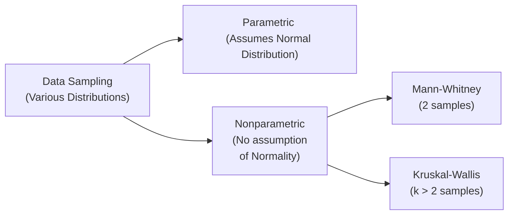

## Introduction and Context

Nonparametric tests offer analysts a robust way to compare sample distributions without strictly assuming normality or other rigid parametric conditions. When you’re dealing with heavily skewed data, small sample sizes, or outliers that might wreak havoc on the usual t-tests (see Section 8.5 for parametric tests of means and variances), you might find nonparametric procedures more reliable. In fact, these techniques focus on ranks rather than raw values, which gives them added resilience against outliers and skewed distributions.

Now, I remember once a colleague asked: “Hey, can we trust these average returns when we see such an uneven spread of daily gains and losses?” We both realized that a typical parametric test (like a two-sample t-test) might not paint an accurate picture if the returns were shaped like a lopsided distribution. So I said, “Well, let’s try the Mann–Whitney test and see if there’s a real difference in median returns.” That moment drove home how helpful—and sometimes essential—nonparametric methods can be.

Below, we’re going to explore two such methods: (1) the Mann–Whitney test (also called Wilcoxon rank-sum) for two samples, and (2) the Kruskal–Wallis test for three or more samples. These are part of the broader family of rank-based procedures and are quite standard in statistical analysis—especially useful in finance for analyzing median differences, returns distributions comparison, or anything else that doesn’t behave nicely under normal assumptions.

## Overview of Parametric vs. Nonparametric Approaches

Before diving into these specific tests, it might help to visualize how parametric and nonparametric approaches fit into your decision-making:



• Parametric tests (like t-tests or ANOVA) assume the data follow some known distribution—most commonly the normal distribution.  
• Nonparametric tests do not assume a specific distribution. They compare medians, ranks, or other order-related properties. This is often a lifesaver when dealing with real-world financial data, which can be subject to skewness, kurtosis (introduced in Section 3.3), and outliers.

## Mann–Whitney (Wilcoxon Rank-Sum) Test

### Basic Idea

If you’ve got two independent samples—say, daily returns from two different portfolios—and suspect that the distribution may be non-normal or riddled with outliers, the Mann–Whitney test is a viable alternative to the two-sample t-test. Rather than comparing means, it tests whether the two samples likely come from populations with the same median (or at least the same location if they have a similar shape).

### Hypothesis Setup

Let’s define our hypotheses in the classic way:

• H₀: The two populations have identical distributions (no shift in median).  
• H₁: The two population distributions differ in their median.  

In practice, some textbooks phrase this as “there is no difference in stochastic dominance” or “there is no location shift.” But basically, it’s a check on median equivalence when the distributions aren’t straying too far in shape.

### Test Statistic

We combine all data points from both groups, rank them from smallest to largest, then compare how these ranks are distributed between the two groups. Here’s one formula for the test statistic U:

$$
U = n_1 n_2 + \frac{n_1(n_1 + 1)}{2} - \sum_{i=1}^{n_1} R(X_i),
$$

where  
• \\( n_1 \\) and \\( n_2 \\) are the sizes of the two samples,  
• \\( R(X_i) \\) is the rank of the \\(i\\)-th observation in the first sample.  

You’ll typically use a table (or software) to get the p-value associated with U, or you might use a normal approximation for larger sample sizes. If the p-value is below your chosen significance level (commonly 5%), you reject H₀ and conclude there might be a difference in medians.

### When to Use

• Data with unknown or clearly non-normal distribution.  
• Ordinal data.  
• Potential outliers or heavy skew that might invalidate the assumption of normality.  

For instance, if you’re looking at realized returns for small-cap stocks from two different sectors, both sets might display highly skewed and leptokurtic (fat-tailed) returns. Mann–Whitney can help determine if the median returns differ, unaffected by outliers.

### Example in Finance

Let’s say you have daily returns from two small-cap stock portfolios, each with 40 days of returns. You suspect the presence of one or two days with extreme losses or gains that could shift the mean drastically. You rank all 80 returns from smallest to largest (1 to 80), sum the ranks separately for each portfolio, and compute the Mann–Whitney statistic. A significantly low or high U might indicate that one portfolio tends to dominate the other in median returns.

## Kruskal–Wallis Test

### Purpose and Scope

What if you have, not two, but three or more samples? The Kruskal–Wallis test extends the Mann–Whitney approach to k groups. It’s sometimes called the “nonparametric ANOVA” because it’s the nonparametric counterpart to the one-way ANOVA test (which is introduced in typical parametric contexts).

### Hypotheses

• H₀: All k population distributions have the same median.  
• H₁: At least one population median differs.  

We’re testing a more general scenario: the possibility that one or more groups might have a different location compared to the others.

### Test Statistic

Following the same rank-based logic, the data from all k groups are pooled, ranked, then the ranks are summed within each group. The Kruskal–Wallis statistic (H) is calculated as:

$$
H = \frac{12}{N(N+1)} \sum_{i=1}^{k} \frac{R_i^2}{n_i} - 3\,(N+1),
$$

where  
• \\( N = \sum_{i=1}^{k} n_i \\) is the total number of observations across all k groups,  
• \\( R_i \\) is the sum of the ranks in the \\( i \\)-th group,  
• \\( n_i \\) is the sample size of the \\( i \\)-th group.  

For larger samples, H approximately follows a chi-square (\\(\chi^2\\)) distribution with \\(k-1\\) degrees of freedom. If H is large enough (or equivalently, the p-value is small enough), you reject H₀ and conclude that at least one group stands out in terms of its median.

### Post-Hoc Analysis

If you do get a significant result—meaning you reject H₀ for the Kruskal–Wallis test—you’ll probably need to follow up with further pairwise comparisons (e.g., Mann–Whitney tests with an appropriate multiple comparison adjustment) to identify exactly which groups differ from which. Finance professionals frequently do this if they see that, say, emerging market bonds significantly differ from developed market bonds or high-yield corporate bonds in terms of median returns, but aren’t sure which pair (or pairs) is driving the difference.

### Example in Finance

Imagine you want to compare returns from four asset classes—large-cap stocks, small-cap stocks, corporate bonds, and government bonds—over a certain period. You suspect some (or all!) of these might have skewed distributions. You pool all returns, rank them, and see how the ranks are distributed among the four categories. If the Kruskal–Wallis statistic suggests a significant difference, you might zero in further on which asset class is pushing that difference.

## Key Assumptions and Robustness

Both Mann–Whitney and Kruskal–Wallis depend on the following assumptions:

• Samples are drawn independently from their respective populations.  
• Data can be meaningfully ordered or ranked. This typically implies ordinal or continuous data.  
• The shape of the distributions is similar. Although the tests mainly focus on the shift in location (i.e., medians), if one distribution is severely more skewed than others, interpretation about the “median difference” could be obscured.

In finance, these assumptions can be tricky. Markets and assets can exhibit all kinds of non-stationary behavior—one day, one asset might show volatility spikes. So always approach these methods with a healthy portion of caution, just like you do with everything else involved in real-world capital markets research.

## Practical Considerations

### Ties and Multiple Comparisons

• Ties in the data are common in finance, especially with discrete price movements or truncated return data. Most software will automatically apply tie-correction factors.  
• For Kruskal–Wallis, if the global test is significant, do multiple comparisons carefully. Adjust for the fact that you’re testing many pairs to reduce the chance of type I error.

### Comparing with Parametric Tests

• If your data turn out to be reasonably normal by the usual checks—like Q-Q plots (Section 3.3) or the Shapiro–Wilk test—standard t-tests or ANOVA might be more straightforward and powerful.  
• Nevertheless, nonparametric tests are your go-to method when normality is questionable, or the sample size is too small.  

### Python Snippet for Mann–Whitney

Here’s a quick demonstration of how you might run a Mann–Whitney test in Python. Suppose you have two NumPy arrays, returns_a and returns_b:

```python
import numpy as np
from scipy.stats import mannwhitneyu

returns_a = np.array([0.02, -0.01, 0.03, 0.01, 0.10])
returns_b = np.array([0.00, 0.01, 0.04, -0.02, 0.06])

stat, p_value = mannwhitneyu(returns_a, returns_b, alternative='two-sided')
print("Mann–Whitney U statistic:", stat)
print("p-value:", p_value)
```

If your p-value is super low, you’d likely reject H₀ and conclude that the median returns from portfolio A and portfolio B differ.

## Real-World Illustration

Let’s say you’re analyzing a hedge fund’s performance across several strategies (long/short equity, global macro, managed futures, and credit arbitrage). You collect monthly returns for each strategy over one year, generating four sets of 12 observations each. A single outlier in the global macro strategy might distort a parametric ANOVA, but a Kruskal–Wallis approach might be more stable for that discrepancy. If the test indicates a difference, you could do pairwise Mann–Whitney tests to see which strategy’s median stands out.

## Common Pitfalls and Best Practices

• Ignoring the shape of distributions: Mann–Whitney and Kruskal–Wallis primarily detect a difference in medians if the distributions are similarly shaped. If shapes differ drastically, the interpretation is less clear.  
• Multiple post-hoc tests without adjustments: If you do many pairwise Mann–Whitney comparisons, watch out for inflated type I error. Use a correction method like Bonferroni or Holm.  
• Small sample sizes: Nonparametric tests can handle small samples better than parametric tests (because normal approximations for parametric tests might be invalid), but very small sample sizes can reduce the power of any test.  
• Overlooking repeated-measures designs: Mann–Whitney and Kruskal–Wallis assume independent samples. If you have repeated measurements (or matched data), you might need a paired nonparametric test such as the Wilcoxon signed-rank or the Friedman test.

## Exam Relevance and Tips

For the CFA Level I exam, you might see:

• Conceptual questions testing if you understand which test to use for non-normal data (Mann–Whitney vs. t-test or Kruskal–Wallis vs. ANOVA).  
• Hypothetical numerical examples, where you’ll interpret rank sums or identify the correct hypothesis.  
• Scenario-based questions focusing on real-world data quirks—like outliers or wide skew.  

On the exam day, keep these points in mind:

• Thoroughly read the data-type details: If distributions look suspicious or the problem statement explicitly mentions “non-normal,” consider nonparametric techniques.  
• Remember the scope: Mann–Whitney covers two independent samples; Kruskal–Wallis covers k samples.  
• Watch for whether the question hints at “median difference” rather than “mean difference.”  

## Final Thoughts

Anyway, we’ve all faced moments where the regular parametric tests just don’t fit. The Mann–Whitney and Kruskal–Wallis tests are two powerful tools in your toolkit for tackling data that’s skewed, outlier-prone, or simply not following the usual normal route. Always weigh their assumptions, particularly the distribution shape and independence of samples. And if the tests finds something interesting, don’t forget your post-hoc analyses. In the real world, these steps might spare you from drawing misleading conclusions about whether a certain asset class or investment strategy truly outperforms another.

## References and Further Reading

• Siegel, S., & Castellan, N.J. (1988). Nonparametric Statistics for the Behavioral Sciences.  
• Hollander, M., Wolfe, D.A., & Chicken, E. (2015). Nonparametric Statistical Methods.  
• Conover, W.J. Practical Nonparametric Statistics.  
• CFA Institute curriculum, Quantitative Methods sections on statistical inference (particularly chapters on hypothesis testing).  

---

## Test Your Knowledge: Nonparametric Analysis with Mann–Whitney and Kruskal–Wallis



### Which of the following best describes the key difference between the Mann–Whitney test and a two-sample t-test?

- [x] The Mann–Whitney test compares rank distributions instead of assuming normally distributed populations.
- [ ] The Mann–Whitney test can only be applied to large samples.
- [ ] The Mann–Whitney test depends on means rather than medians.
- [ ] The Mann–Whitney test requires unequal sample sizes.

> **Explanation:** The main difference is that Mann–Whitney is a rank-based test and does not assume normality, whereas a two-sample t-test typically does.

### In a Mann–Whitney U test, what is primarily compared between the two samples?

- [x] The sum of ranks of their combined data.
- [ ] Their standard deviations.
- [ ] Their mean returns.
- [ ] Their kurtosis.

> **Explanation:** Mann–Whitney combines and ranks all observations, then compares the sums of these ranks for each group.

### Which assumption is shared by both the Mann–Whitney and Kruskal–Wallis tests?

- [x] The samples must be independent.
- [ ] The samples must be normally distributed.
- [ ] The data must be nominal (categorical) only.
- [ ] The data must have at least 30 observations per group.

> **Explanation:** Both tests assume the samples are independent from each other. They do not assume normality.

### In Kruskal–Wallis testing, the distribution of the test statistic for larger samples is approximated by which distribution?

- [x] Chi-square distribution.
- [ ] t-distribution.
- [ ] F-distribution.
- [ ] Binomial distribution.

> **Explanation:** Kruskal–Wallis uses a chi-square approximation with k-1 degrees of freedom for sufficiently large samples.

### If the Kruskal–Wallis test is significant at the 5% level for three groups, what is the recommended next step?

- [x] Perform post-hoc pairwise comparisons with appropriate adjustment for multiple testing.
- [ ] Accept H₀ that all groups have the same median.
- [x] Ignore it; only the global test matters.
- [ ] Convert to parametric tests immediately.

> **Explanation:** Once you find a significant difference among three or more groups, you should investigate which specific pairs are driving that difference.

### In which situation is the Mann–Whitney test likely to be more appropriate than a two-sample t-test?

- [x] The data contain noticeable outliers and appear to be skewed.
- [ ] The data are perfectly normally distributed.
- [ ] The sample sizes are at least 100.
- [ ] The data are nominal categories.

> **Explanation:** When data is non-normal, outlier-prone, and thus unsuited for parametric assumptions, the Mann–Whitney test is typically more appropriate.

### Which statement about Kruskal–Wallis is correct?

- [x] It generalizes the Mann–Whitney test to k independent samples.
- [ ] It only works with nominal data.
- [x] It only works for exactly two samples.
- [ ] It replaces correlation coefficients with an ordinal measure.

> **Explanation:** Kruskal–Wallis is indeed the natural extension of Mann–Whitney to more than two samples.

### Which of the following is a key disadvantage of using nonparametric tests?

- [x] They may have less power than parametric tests if the data are truly normal.
- [ ] They assume the data are nominal only.
- [ ] They can only be used with large samples.
- [ ] They require homogeneity of variance more strictly than parametric tests do.

> **Explanation:** Nonparametric methods can be less powerful when the data are actually well-modeled by normal assumptions.

### If the Kruskal–Wallis test yields a high p-value (e.g., 0.60), what is the most appropriate conclusion?

- [x] There is insufficient evidence to reject H₀ that all k groups share the same median.
- [ ] At least one group has a significantly different median than the others.
- [ ] The test was performed incorrectly.
- [ ] You must retest using parametric methods.

> **Explanation:** A high p-value means the data do not provide strong evidence against the null hypothesis of equal medians.

### The Mann–Whitney test primarily tests for:

- [x] True
- [ ] False

> **Explanation:** The Mann–Whitney test examines if there is a difference in location (often interpreted as median) between two independent samples, assuming similar distribution shapes.




