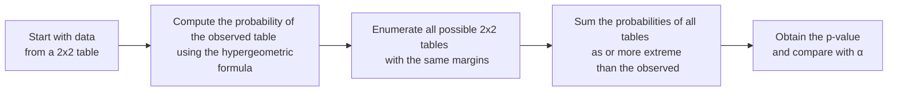

## Overview and Purpose

Fisher’s Exact Test is one of those tools I wish I’d known about earlier in my career—especially during those scrappy times when I had to work with severely limited data. It’s a powerful alternative to the chi-square test designed specifically for analyzing 2×2 contingency tables when your sample sizes are small or when one or more cell counts fall below 5. Think about default events, rare occurrences in risk management, or pilot studies in financial product testing: you often end up with small-sample data, and that’s precisely when Fisher’s Exact Test becomes super handy.

In finance, you might see a scenario such as: you have two investment strategies (Group 1 and Group 2) and want to see how often they result in a “successful” outcome vs. an “unsuccessful” outcome. If your dataset is quite limited—maybe you only have 12 observations per strategy—this test provides a more accurate and reliable inference compared to the typical chi-square test.

## Why Consider Fisher’s Exact Test over Chi-Square?

The standard chi-square test (see earlier discussion in Section 9.2) relies on approximations. In the classical chi-square approach, we suppose our observed distribution of data can be compared with the (approximately) continuous chi-square distribution. But that approximation is accurate primarily when expected cell frequencies are greater than or equal to 5. Whenever you get small expected frequencies—maybe just a handful of events in a category—the chi-square approximation can break down.

Fisher’s Exact Test does not rely on these large-sample approximations. It directly calculates the probability of observing the 2×2 contingency table as it stands (or something more extreme) under the assumption of independence. This direct probability calculation uses the hypergeometric distribution, making it “exact” rather than approximate.

## Basic 2×2 Setup

Consider a 2×2 contingency table with outcomes A and B (often “success” vs. “failure”) and groups labeled as Group 1 and Group 2:

|               | Group 1 | Group 2 | Row Totals |
|---------------|---------|---------|------------|
| Outcome A     | a       | b       | a + b      |
| Outcome B     | c       | d       | c + d      |
| Column Totals | a + c   | b + d   | N          |

• a = Number of observations in Group 1 that yield Outcome A  
• b = Number of observations in Group 2 that yield Outcome A  
• c = Number of observations in Group 1 that yield Outcome B  
• d = Number of observations in Group 2 that yield Outcome B  
• N = Total sample size = a + b + c + d  

The null hypothesis (H₀): “There is no association between group membership and outcome.” Or in simpler terms, “The proportion of A (vs. B) is the same in both groups.”

Under the assumption that H₀ is true, the probability of seeing this specific arrangement of a, b, c, d can be directly computed using a hypergeometric approach.

## Hypergeometric Probability

Fisher’s Exact Test is grounded in the hypergeometric distribution, which describes the probability of k successes in n draws without replacement from a finite population. Here, we can think of “success” as drawing all a successes in the sense that we get a occurrences of Outcome A in Group 1, out of (a + b) total A’s in the entire sample.

Mathematically, the probability of observing the specific table (a, b, c, d) under H₀ is:

$$
P(\text{table} = (a,b,c,d)) \;=\; 
\frac{\displaystyle \binom{a+b}{a} \;\binom{c+d}{c}}{\displaystyle \binom{N}{a+c}}.
$$

• \\( \binom{n}{k} \\) is the binomial coefficient (“n choose k”).  
• The denominator \\( \binom{N}{a+c} \\) is the total number of ways to choose any (a+c) items to go in the first row out of N.  
• The numerator counts the specific ways to get a in Group 1 and b in Group 2 for Outcome A—and c in Group 1 and d in Group 2 for Outcome B.

## Computing the P-Value

To get the p-value, you need to consider not just the observed table, but any other 2×2 table that’s deemed “as extreme or more extreme” than the observed arrangement. “More extreme” typically means farther from the null hypothesis in the direction of interest. For a two-sided test, you gather all tables that exhibit an even greater difference in proportions than your observed table—regardless of sign—and sum their probabilities.

Concretely, the steps to compute the test’s p-value:

1. List all configurations (a’, b’, c’, d’) that keep the row and column totals the same but distribute A and B differently across Group 1 and Group 2.  
2. For each configuration, compute the hypergeometric probability as above.  
3. For a two-sided test, include all configurations whose difference in proportions between Group 1 and Group 2 is equal to or greater than what you observed.  
4. Sum up those probabilities to get the overall p-value.  

If that sum is less than your chosen significance level (e.g., α = 5%), you reject the null hypothesis of independence.

## A Quick Example

Let’s say we have two portfolios (Group 1 and Group 2), and we are checking whether the presence of a specialized “ESG screening” (Outcome A) is more likely in one group than in the other. Suppose we get the following small-sample data:

|               | Group 1  | Group 2  | Row Totals |
|---------------|----------|----------|------------|
| ESG Screening (A)   | 2        | 0        | 2          |
| No Screening (B)    | 1        | 3        | 4          |
| Column Totals       | 3        | 3        | 6          |

We can see that Group 1 has 2 “ESG Screening” observations out of 3, while Group 2 has 0 out of 3. The question: Is this difference in “ESG adoption” rates between the two groups statistically significant?

Using Fisher’s Exact Test:

• a = 2, b = 0, c = 1, d = 3, N = 6.  

The probability of this exact arrangement is:


P = \frac{\binom{2}{2} \binom{4}{1}}{\binom{6}{3}} 
= \frac{(1) \times (4)}{20} 
= 0.20.


We then enumerate any other 2×2 configuration (total row sums = 2 and 4, total column sums = 3 and 3) to see if it’s equally or more extreme. We might find an arrangement (3, 0; 0, 3) or beyond that presumably yields smaller probabilities. Summing up the probabilities of our observed arrangement and other “more extreme” ones gives us the p-value. If that p-value is below α, we’d conclude that the difference is statistically significant.

## Step-by-Step Illustration via Diagram

Below is a simple flowchart of how to carry out Fisher’s Exact Test:



## Implementation in Finance

Though it originated in medical and biological experiments with small sample sizes, Fisher’s Exact Test is quite relevant in finance for niche but critical analyses, such as:

• Rare default events in a portfolio: Maybe you only have 5 or 6 defaults across a small set of loans. You’re curious if default rates differ between two underwriting methods.  
• Pilot studies for new marketing or service channels: Perhaps you only have a handful of wealth management clients testing a new service, and you want to see if the uptake is different than in your control group.  
• Analysis of infrequent corporate actions: If you suspect that certain announcements (e.g., special dividends or share buybacks) might be more common in one industry subset, but you only have a really small sample, Fisher’s can help you test that difference in frequency precisely.  

In all these small-sample scenarios, Fisher’s Exact Test is more reliable than the chi-square test and can help avoid misleading inferences that might occur when using approximate methods.

## Connection to Other Non-Parametric Tests

Fisher’s Exact Test belongs in the family of methods that do not assume large-sample or distribution-based approximations. In Section 9.2, we examined the chi-square test for independence in contingency tables (parametric approach). While the chi-square test is still the “go-to” method for large samples, it starts to lose luster when your data gets sparse. That is exactly where Fisher’s test shines.

We also see parallels with other methods such as:

• Rank correlation tests (Section 9.3): They avoid assumptions about normal distributions and thus are considered non-parametric.  
• Mann–Whitney tests (Section 9.4): Good for comparing two independent samples when the normality assumption is questionable.

## Practical Caveats and Tips

1. Computational Intensity:  
   Although enumerating “all possible” tables might sound daunting, modern statistical software (including Python and R) can do it with ease. However, if your sample grows significantly larger, Fisher’s method can become computationally expensive.

2. One-Sided vs. Two-Sided:  
   Decide in advance whether you’re testing for a difference in a specific direction (one-sided) or any difference at all (two-sided). This choice changes how you define “more extreme” tables.

3. Interpretation:  
   The interpretation is similar to the chi-square test: if p < α, you can reject the null that the two variables are independent. For investment folks, that means you believe there is indeed a systematic relationship—perhaps a difference in default rates, success rates, or adoption rates.

4. Ties to the Hypergeometric Distribution:  
   If you’re testing how many “successes” appear in one group vs. the total population, it’s effectively a hypergeometric sampling scenario with no replacement. That’s why, from a purely combinatorial standpoint, Fisher’s is the exact route.

5. Behavioral Bias and Overfitting:  
   If you are rummaging around small data sets repeatedly, be mindful of data snooping or p-value hacking. Because small samples can produce results that look more meaningful than they really are, consider out-of-sample validation or domain knowledge to check plausibility.

## Example Calculation in Python (Optional Demonstration)

You can run a quick check of Fisher’s Exact Test in Python using SciPy’s built-in function “fisher_exact.” For illustration:

```python
import scipy.stats as stats

table = [[2, 0],
         [1, 3]]

oddsratio, p_value = stats.fisher_exact(table, alternative='two-sided') 
print(f"Odds Ratio: {oddsratio}, p-value: {p_value}")
```

• table is your 2×2 arrangement.  
• alternative can be 'two-sided', 'less', or 'greater'.  
• The function returns the odds ratio and the exact p-value for your table arrangement.

You can also specify a one-sided alternative if you hypothesize that Group 1 will have a strictly higher proportion of A relative to Group 2.

## Exam Tips

• Be mindful of whether expected cell counts are below 5. If so, pivot to Fisher’s Exact Test.  
• Remember the hypergeometric formula, and that the p-value is effectively the sum of probabilities for all tables as extreme or more extreme.  
• Check whether the question is one-sided or two-sided. The method to sum “extreme” tables differs.  
• In a case-based question, look for language referencing “small sample” or “limited occurrences,” which is often an indication they want you to recall Fisher’s approach.

## References for Further Exploration

• Fisher, R.A. (1922). Early foundational work on Exact Test methods.  
• Sokal, R.R. & Rohlf, F.J. (2012). “Biometry” for a deep mathematical treatment of Fisher’s exact approach.  
• Motulsky, H. “Intuitive Biostatistics” for more accessible, real-world examples on small sample tests.  
• CFA Institute Curriculum. Look for additional coverage of non-parametric hypothesis tests in the Level I and Level II materials—particularly in the Quantitative Methods volumes.

## Test Your Knowledge: Fisher’s Exact Test and 2x2 Contingency Tables



### Fisher’s Exact Test vs. Chi-Square
- [x] Fisher’s Exact Test is preferred for small-sample 2×2 tables where expected frequencies are below 5.
- [ ] Chi-square is always more accurate than Fisher’s, regardless of sample size.
- [ ] Fisher’s method is an approximation of the chi-square distribution.
- [ ] Fisher’s Exact Test cannot be used if row totals differ.

> **Explanation:** Fisher’s Exact Test is specifically designed for small and/or sparse data, as it computes probabilities from first principles using the hypergeometric distribution.

### Interpretation of the P-Value
- [x] If the p-value is less than the significance level, we reject the null hypothesis of independence.
- [ ] If the p-value is high, we must conduct additional parametric tests.
- [ ] Fisher’s test uses the F-distribution for critical values.
- [ ] A p-value > 0.05 automatically proves independence.

> **Explanation:** A low p-value (< α) indicates that the observed arrangement (and similarly extreme ones) is unlikely under independence, leading to rejection of H₀.

### One-Sided vs. Two-Sided Testing
- [x] A one-sided test focuses on determining if one group has a strictly higher or lower proportion than the other.
- [ ] A two-sided Fisher’s test always doubles the one-sided p-value.
- [x] A two-sided test assesses whether there is any difference, regardless of direction of effect.
- [ ] A one-sided test is invalid without a normality assumption.

> **Explanation:** Fisher’s can be done one-sided or two-sided; for two-sided, you sum probabilities of tables equally or more extreme in both tails. The normality assumption is irrelevant here because the method is purely combinatorial.

### Hypergeometric Distribution Role
- [x] Fisher’s Test leverages the hypergeometric probability for exact computation.
- [ ] The hypergeometric distribution is used only for large samples.
- [ ] The hypergeometric distribution is irrelevant for 2×2 tables.
- [ ] The hypergeometric distribution approximates the Poisson distribution.

> **Explanation:** Fisher’s relies on exact calculation of the probability of seeing a certain number of “successes” in a finite population, which fits the hypergeometric scenario perfectly.

### Practical Usage in Finance
- [x] Used when analyzing default events across small loan samples.
- [ ] Only relevant to chi-square goodness-of-fit analyses.
- [x] Useful for small pilot studies on investment products.
- [ ] Cannot be used outside medical research contexts.

> **Explanation:** Fisher’s is extremely flexible and helpful for small count data in finance, such as rare defaults or pilot test outcomes.

### Expected Count Criterion
- [x] If any expected frequency is below 5, Fisher’s Exact Test can be more appropriate.
- [ ] Fisher’s test becomes invalid if any row total is above 10.
- [ ] A large sample automatically rules out use of Fisher’s test.
- [ ] The test is only valid if expected counts are at least 20.

> **Explanation:** The common rule of thumb is that chi-square tests can become inaccurate if an expected cell count is < 5, making Fisher’s the safer choice.

### Summation of Extreme Tables
- [x] The total p-value is the sum of probabilities of the observed table and all tables more extreme.
- [ ] Only the observed table’s probability matters for final inference.
- [x] “More extreme” typically depends on the difference in proportions.
- [ ] Fisher’s test only uses the highest-probability configuration.

> **Explanation:** The strength of Fisher’s method is that it includes all equally likely or “more extreme” tables under the null assumption, ensuring it is exact.

### Handling Large N
- [x] Fisher’s test can be computationally expensive with very large sample sizes.
- [ ] Fisher’s test is mathematically impossible for N > 100.
- [ ] Larger samples always require normal approximations.
- [ ] The p-value is always zero if N > 50.

> **Explanation:** As N grows, the enumeration approach can become computationally heavier. However, specialized algorithms can manage mid-sized data, but for huge data sets, the chi-square test is often simpler and acceptable.

### Software Implementation
- [x] Functions like “fisher_exact” in Python’s SciPy can compute the test directly.
- [ ] Only specialized HPC clusters can perform Fisher’s test.
- [ ] Standard statistical tools do not provide built-in Fisher’s computations.
- [ ] Implementation always requires custom coding in C++.

> **Explanation:** R, Python, and many other statistical packages have built-in functions for Fisher’s Exact Test.

### True or False: Independence
- [x] True
- [ ] False

> **Explanation:** Under the null hypothesis for Fisher’s Exact Test, we assume there is no relationship (i.e., independence) between row categories and column categories. The test then checks if the actual data deviate significantly from that assumption.


