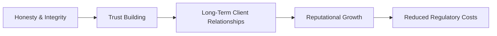

## Introduction
Ethics in the investment world can sometimes feel like a lofty ideal—something we all aspire to uphold but can be tricky when day-to-day pressures start piling up. Whether you're analyzing a new stock opportunity, preparing a valuation report, or simply chatting with a client about their retirement goals, trust is the critical glue that holds everything together. Actually, let me share a small memory: I once worked for a small asset management firm, and you know, it was absolutely striking how quickly the environment changed—clients seemed happy, revenue was growing, and all was well. Then a single rumor about data misreporting spread like wildfire, and guess what? Virtually overnight, clients began to question the entire firm’s integrity. That’s how fragile trust can be.

This section explores the foundations of ethics and zeroes in on why trust is so darn important in financial services. Along the way, we'll break down key concepts, show how ethical (or unethical) decisions have real-world consequences, and highlight best practices to keep trust alive in your professional life.  

## Understanding Ethics in Finance
Ethics is basically about doing the right thing, even when nobody’s watching. In finance, where we handle people’s money and dreams, that “right thing” typically includes upholding honesty, integrity, fairness, and respect for the people and institutions we serve. Let’s be frank: This industry literally thrives on intangible assets like credibility and reputation. If trust evaporates, you can bet your bottom dollar that clients will walk away, regulators will come knocking, and entire market sectors can get rattled.

• Honesty: Telling clients the unvarnished truth about investment risks, fees, or performance.  
• Integrity: Consistent adherence to moral and ethical standards, even under pressure to bend the rules.  
• Fairness: Treating all stakeholders equitably, from large institutional clients to smaller individual investors.  
• Respect: Recognizing the dignity and rights of clients, colleagues, and the broader community.  

## Why Trust Matters
Trust makes transactions smoother, slashes legal disputes, and can even reduce regulatory burdens. Seriously, if a client believes in your ethical standards, they’re far more likely to give you the benefit of the doubt. This can mean fewer formal investigations, lower friction in contract negotiations, and a healthier overall relationship.

If we look at the bigger picture, trust is not merely a “nice-to-have” quality in finance. It’s a systemically important resource. When trust takes a nosedive across financial markets—like during the 2008 global financial crisis—everyone ends up paying the price: institutions collapse, regulators tighten the noose, and everyday folks lose faith in the industry. From a risk management standpoint, trust is part of an organization’s intangible capital that, if eroded, can take ages and a fortune to rebuild.

Below is a quick visual that captures how ethics fosters trust, which in turn drives long-term benefits for both clients and the industry at large:

## The Cost of Ethical Lapses
Let’s say an investment firm promises guaranteed returns—which, in finance, usually signals some level of misrepresentation. Clients who discover the truth may feel betrayed and hesitate to trust any promise made by that firm or, worse, by the industry overall. What happens then?  
• Loss of clients, leading to revenue decline.  
• Damaged reputation (which can be extremely expensive to repair).  
• Heightened scrutiny from regulators, who might impose penalties, fines, or additional compliance requirements.  
• Potential systemic risk if trust issues spread widely among investors.  

Or think about insider trading cases: One high-profile scandal can trigger a cascade of suspicion among investors. The reverberations don’t end with the guilty parties, either. The entire market is left asking, “What else is being hidden from us?”

## Fiduciary Responsibilities and Balancing Organizational Goals
As finance professionals, embracing a fiduciary mindset is crucial. That means acting in the best interests of your clients, sometimes ahead of your own or your employer’s near-term benefits. A fiduciary lens forces you to consider:

• Transparency in fee structures and product selection.  
• Full disclosure of potential conflicts of interest.  
• Clear, honest reporting of performance data, including both successes and shortcomings.  

There can be tension between prioritizing client needs and meeting organizational goals like profitability targets. I recall seeing a manager quietly shift clients into an asset allocation that generated higher in-house management fees. On paper, the managers framed it as offering “bespoke solutions,” but the costs were definitely less beneficial for clients. Guess what? That put the firm’s entire credibility on shaky ground when a more external analytical review exposed these higher expenses. The lesson: a short-term revenue boost can cost you trust, brand image, and even your job in the long run.

## Trust and Reduced Transaction Costs
Now, let's pivot to some economics. When people trust us, they often forgo strenuous due diligence or pricey monitoring. This reduces friction. Think about it: if you trust your broker, you might not constantly compare their commissions or comb through every single trade confirmation. Of course, you still do your checks and balances, but at a normal level. Without trust, you'd be second-guessing every single detail or recruiting an army of third-party advisors to confirm your broker’s honesty.

You might also see fewer lawsuits and disputes. That’s good for both sides—nobody likes spending hours in depositions or racking up legal fees. A climate of trust thus lowers the cost of business and fosters smoother, more efficient collaboration.

## Integrating Ethics into Decision-Making
Let’s face it: compliance with laws and regulations should be the baseline, not the pinnacle of ethical conduct. Real ethics also factor in broader social and community impacts. Before finalizing a decision, ask yourself questions like:  
• Are we inadvertently encouraging speculation or harming market stability?  
• Will our marketing materials confuse or mislead potential investors?  
• Are we ignoring or minimizing negative externalities, like environmental or social impacts?  

It’s easy to slip into purely commercial thinking—we all do it. But a robust ethical framework can serve as a guardrail against short-sighted decisions that might tarnish your reputation or invite legal trouble.

## Examples of Ethical vs. Unethical Behavior
Here’s a simple table showing practical differences:

| Ethical Behavior                                     | Unethical Behavior                                      |
|------------------------------------------------------|---------------------------------------------------------|
| Transparent communication about investment fees       | Hiding additional costs within complex fee structures   |
| Disclosing all potential conflicts of interest       | Concealing insider ownership in recommended securities  |
| Providing balanced research with clear risk analysis | Selectively promoting only the positives in research    |
| Seeking suitable products for client objectives      | Maximizing commissions through high-fee products        |
| Respecting client confidentiality                    | Sharing confidential client info for personal gain      |
| Complying with regulatory requirements in good faith | Short-circuiting laws with questionable loopholes       |

Even a minor slip—like slightly inflating an investment track record—can be viewed as a major breach of trust.

## Ongoing Training and Development
Continual ethical training isn’t just a corporate formality. It’s an investment in safeguarding trust. Ethics, like muscles, need regular exercise. Employee workshops, interactive case studies, scenario analysis sessions—these kinds of training ensure that staff remain equipped to handle ethical dilemmas. Sadly, an annual “check the box” compliance module might not cut it. Companies that take training seriously often cultivate cultures where whistleblowing is encouraged when wrongdoing is spotted, and honest debates about best practices are part of everyday operations.

## Glossary
• **Ethics**: A system of moral principles shaping how individuals and institutions should conduct themselves.  
• **Trust**: The reliance on the character, ability, or truthfulness of an individual or entity—crucial for client relationships in finance.  
• **Fiduciary Responsibility**: The obligation to act in the best interests of another party, such as a client or beneficiary.  
• **Integrity**: Adherence to moral and ethical standards, reflected in truthfulness, honesty, and consistently upright conduct.  
• **Reputation Risk**: Potential harm to an organization’s standing in public perception due to unethical behavior or mismanagement.  

## Conclusion and Exam Tips
So, how do you put all this together for the exam and, just as important, for real life? For starters, keep your ears open for any sign—subtle or blatant—that suggests unethical behavior in a given scenario. Even if the scenario doesn’t mention explicit legal violations, a breach of integrity alone is grounds for concern. Remember that regulators, your clients, and your peers all talk, especially in the era of social media. If something even looks questionable, imagine how it might be perceived publicly before forging ahead.

• **Common Pitfalls**:  
  - Believing that legal compliance alone covers all ethical bases.  
  - Overlooking minor transgressions that can snowball into reputational disasters.  
  - Assuming that “everyone does it” justifies unethical shortcuts.  

• **Time Management**:  
  - On any exam question involving ethics, systematically apply an ethical decision-making framework—e.g., identify the standard at issue, determine responsibilities, consider alternative actions, and decide on the most ethical approach. This approach is also recommended in practice.  

• **Constructed-Response Tips**:  
  - Show your reasoning clearly. Even if you interpret a scenario differently, make sure to walk the examiner through your thought process.  

• **Multiple Choice Tips**:  
  - Don’t be fooled by distractor answers that claim a behavior is okay if it’s “technically legal.” The CFA Institute Code of Ethics demands higher standards.  

Ultimately, ethics isn’t just about passing an exam. It’s about forging a career in finance that’s sustainable, rewarding, and beneficial for everyone you serve.  

## References and Further Reading
- CFA Institute, “Standards of Practice Handbook.”  
- Boatright, John R., “Ethics in Finance,” Wiley.  
- Schoorman, Mayer, and Davis (2007). “An Integrative Model of Organizational Trust,” Academy of Management Review.  

## Test Your Knowledge: Ethics and Trust in the Investment Profession



### In finance, why is trust considered especially crucial to sustaining client relationships?

- [ ] It allows higher fees to be charged without client backlash.
- [x] It reduces the need for excessive monitoring and legal disputes.
- [ ] It ensures that only wealthy clients are targeted.
- [ ] It guarantees market outperformance under any conditions.

> **Explanation:** Trust changes the nature of the client-advisor relationship, reducing transactional frictions and legal scrutiny while fostering long-term client loyalty.

### Which of the following best defines fiduciary responsibility in finance?

- [x] Acting in the best interests of the client, even above one’s own.
- [ ] Maximizing fees earned for the firm.
- [ ] Following every local regulation without exception.
- [ ] Delegating all decisions to a third-party professional.

> **Explanation:** A fiduciary is legally and ethically bound to prioritize the needs of their client, which surpasses both organizational and personal gain.

### An asset manager decides to hide management fees in complex fee structures, hoping clients won’t notice. Which ethical principle is most directly violated?

- [ ] Fiduciary responsibility
- [x] Honesty
- [ ] Conflict of interest
- [ ] Duty of care

> **Explanation:** While several ethical standards may be in question, dishonesty in fee disclosures clearly violates honesty and transparency, eroding client trust.

### How do ongoing ethics trainings within an organization contribute to reducing reputation risk?

- [ ] They ensure that employees are aware of legal loopholes and can exploit them.
- [ ] They automatically eliminate all ethical lapses.
- [x] They reinforce standards of conduct and help staff identify and address ethical dilemmas.
- [ ] They act as a public relations tool, impressing clients with the firm’s marketing.

> **Explanation:** Continual training bolsters a culture of integrity, clarifies ethical expectations, and prepares employees to navigate complex real-world scenarios.

### Which of the following is a common pitfall when thinking about ethics in the investment profession?

- [x] Believing legal compliance alone ensures ethical behavior.
- [ ] Seeking client consent for all major decisions.
- [ ] Keeping detailed records of client interactions and approvals.
- [ ] Being aware of industry-wide best practices.

> **Explanation:** Law and ethics aren’t the same. Ethical standards often go beyond legal requirements, emphasizing fairness and consistent integrity.

### A firm that consistently demonstrates fair dealings, transparent processes, and integrity is likely to enjoy which long-term benefit?

- [x] Reduced regulatory scrutiny and stronger client relationships.
- [ ] Complete immunity from economic downturns.
- [ ] The ability to circumvent industry standards.
- [ ] License to hide minor ethical breaches without consequence.

> **Explanation:** Ethical and trustworthy firms often face fewer investigations and cultivate deeper client loyalty, which can sustain profitability over the long term.

### Which scenario most effectively illustrates a fiduciary mindset?

- [ ] An advisor invests in a product primarily for high commissions.
- [ ] A firm offers incomplete disclosures, assuming no one will notice.
- [x] A manager chooses an investment that suits the client’s risk profile over a more lucrative in-house fund.
- [ ] A brokerage encourages excessive trading to generate fees.

> **Explanation:** A fiduciary mindset balances the best interests of the client above personal or corporate financial benefits.

### What is one key reason unethical behavior can lead to systemic risk in financial markets?

- [ ] Access to unethical behaviors is restricted to small firms only.
- [ ] Regulators generally ignore minor unethical behavior.
- [x] Loss of trust in one institution can shake confidence in the entire sector.
- [ ] Ethical violations usually go unnoticed by media or the public.

> **Explanation:** When a single high-profile institution loses trust, it can cast doubt on broader market stability, causing investors to question fundamental market integrity.

### How can transparent disclosures and fair dealings reduce transaction costs?

- [ ] They require specialized technology systems that are expensive to maintain.
- [ ] They drive clients to seek second opinions routinely.
- [ ] They necessitate hiring more legal counsel.
- [x] They lower the need for excessive oversight and legal disputes.

> **Explanation:** Transparency fosters trust, so parties spend less on due diligence and litigation, lowering indirect costs of doing business.

### True or False: “Ethical considerations in finance are only necessary when the law mandates them.”

- [ ] False
- [x] True

> **Explanation:** Actually, this statement is false. Ethical standards exceed legal obligations in many cases. Merely doing what is legal may not be enough to uphold trust and integrity.


