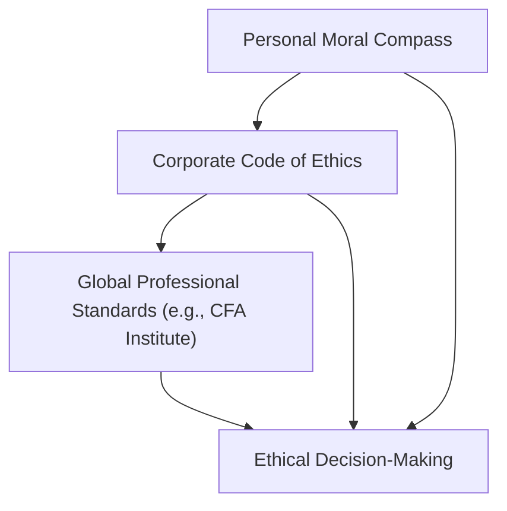

## Introduction

Codes of ethics play a pivotal role in the investment world, anchoring professional conduct and trust across global capital markets. They are not just dusty rulebooks floating around compliance departments—oh no, they’re living documents that define professional identity, shape firm culture, and guide everyday decisions. This section explores how these codes function in the investment profession, focusing on why they exist, what they cover, and how to ensure their provisions genuinely enhance integrity and accountability.

## What Is a Code of Ethics?

A code of ethics is a set of guiding principles that defines acceptable behavior, outlines professional responsibilities, and tethers individual actions to a broader framework of integrity. It’s the heart and soul of any responsible profession. In finance, these codes provide the scaffolding for consistent decision-making under pressure. After all, it’s one thing to talk about doing right by the client, but it’s another to have a structured guide that helps you actually do it—even when the market’s whipsawing and you’re getting a mile-long email chain about questionable new “opportunities.”

In essence, a code of ethics helps each professional answer the question: “What should I do when the path is unclear or when multiple interests collide?” By wrapping your personal moral compass around formal industry standards—like the CFA Institute Code of Ethics—you get a blueprint for navigating real-life ethical dilemmas.

## Why Codes of Ethics Matter in the Investment Profession

It might seem obvious that “being ethical” is important, but let’s be real: finance can be fast-paced, complex, and sometimes downright confusing. People can get pulled in multiple directions—client requests, firm pressures, personal gain, regulatory compliance. A code of ethics simplifies the chaos by setting consistent behavioral expectations.

• Consistency in Decision-Making – By following a defined code, professionals in global investment communities can respond to ethical dilemmas systematically. This uniformity not only mitigates conflicts of interest but also promotes fairness, transparency, and accountability.

• Building Professional Credibility – Strong ethics translate into trust. And trust is the bedrock of capital markets. When a financial analyst abides by a code of ethics, they reinforce their professional credibility, convincing clients and colleagues that their advice is unbiased and reliable.

• Protecting Investor Interests – Let’s say you manage a big institutional portfolio. Day in, day out, you’re dealing with confidential data, analyzing new products, or interacting with company insiders. A code of ethics clarifies your responsibility for client confidentiality and ensures that you handle sensitive information appropriately.

• Promoting Market Integrity – Widespread adherence to shared ethical doctrines fosters a level playing field. If participants abide by fair competition rules, markets function better: there’s less manipulation, more transparency, and greater investor confidence.

## Comparing Different Codes and Aligning with Core Values

Picture walking into three different asset management firms: Firm A might have a flamboyant code of ethics that focuses heavily on diversity and inclusion, Firm B might highlight data privacy and security, while Firm C emphasizes philanthropic endeavors and environmental responsibility. Are they all that different, though? Typically, no. You’ll see a foundation of universally accepted values—like honesty, fairness, loyalty, and respect.

### Common Building Blocks in Various Jurisdictions

1. Professional Integrity:  
   A universal must-have, from local markets in Singapore to large global institutions in the U.S. Integrity underpins every single principle that follows.

2. Client Confidentiality:  
   This concept transcends borders. Whether you’re subject to the EU’s General Data Protection Regulation (GDPR) or the U.S. SEC guidelines, safeguarding client information is central.

3. Fairness in Pricing and Dealing:  
   “Allocation of trades” and “fair treatment of clients” appear in almost every well-respected code. In the investment profession, ensuring your personal or employer’s interest doesn’t overshadow the client’s best interests is a core principle.

4. Avoidance of Conflicts of Interest:  
   Look, conflicts happen—especially in large, diversified financial institutions. But codes of ethics require that you disclose or manage them in a way that preserves objectivity.

5. Commitment to Continuing Education:  
   Another near-universal theme is staying updated. Markets evolve, new regulations pop up, and we keep on learning. That’s why the CFA Institute, for example, strongly emphasizes continuous professional development.

When I first encountered the CFA Institute Code of Ethics, I was a junior analyst juggling client presentations and evening exam prep. I distinctly recall thinking: “Wow, this code lays out my responsibilities both personally and professionally.” It almost felt like a mentor telling me, “In tricky moments, remember these principles.” That experience highlighted how code-based guidelines can sync up with personal beliefs, forming an alignment between what an individual values and what the profession demands.

## Typical Content of a Code of Ethics

You’ll find that most codes of ethics—whether from professional bodies like the CFA Institute or corporate-specific documents—contain a few fundamental elements:

• Clear Statement of Purpose: A concise opening that states who the code is for and why it exists.  
• Professional Integrity: A definition of honesty and ethical conduct in performing duties.  
• Responsibilities to Clients: Guidelines ensuring confidentiality, honest communication, fair dealing, and impartiality.  
• Responsibilities to Employers: Clauses ensuring loyalty, diligent service, and following policies.  
• Responsibilities to Colleagues: Encouraging respectful interaction, fostering collaboration, and preventing unethical behavior.  
• Conflicts of Interest: Strategies for managing or disclosing potential conflicts, establishing transparent processes.  
• Ongoing Learning and Competence: Emphasizing continuing education, professional growth, and staying abreast of changing regulations.  
• Enforcement Mechanisms: Clarification of what happens when the code is breached—how violations are investigated and penalized.

## Case Example: The CFA Institute Code of Ethics

The CFA Institute Code of Ethics is widely recognized as one of the most robust in the global finance arena. It’s built on principles that aim to maintain high standards of excellence and fairness. Specifically:

• Act with integrity, competence, diligence, respect, and in an ethical manner with the public, clients, and employers.  
• Place the integrity of the investment profession and the interests of clients above personal interests.  
• Use reasonable care and exercise independent professional judgment.  
• Practice and encourage others to practice in a professional and ethical manner.  
• Promote the integrity and viability of global capital markets.  
• Maintain and improve your professional competence.

And the neat part? These broad guidelines get amplified in the CFA Institute Standards of Professional Conduct, which provide deeper instructions on new market practices, interactions with regulators, and responsibilities in cross-border dealings.

## Linking Personal Moral Compass to Corporate and Professional Codes

There’s a popular misconception that following a code of ethics somehow replaces individual conscience. Actually, it’s more like a partnership. A well-designed code of ethics resonates with the personal moral compass, reinforcing the best instincts of conscientious professionals. To put it simply, a strong ethical foundation plus a robust code equals a powerful synergy.

Think about it this way: Let’s say your firm has a policy on “client confidentiality" that states, “Under no circumstances may client information be disclosed without explicit client consent.” If you personally value trust and privacy, then abiding by this rule is easy—your moral outlook and your corporate policy match. Things get trickier when personal gains or outside pressures tempt you to deviate. In those situations, the code acts as a guardrail.

## Enforcing and Updating a Code of Ethics

Having a code of ethics sitting on a website or pinned to a break-room bulletin board is just the start. The real test of its effectiveness lies in active enforcement, relevant updates, and strong cultural reinforcement. Firms that truly embed their ethical codes do the following:

1. Training and Communication: Regular workshops, scenario analyses, and refreshers so employees know the code inside out.  
2. Leadership by Example: Senior management has to walk the talk, setting the tone at the top.  
3. Whistleblower Mechanisms: Secured channels so employees can raise concerns without fear of retaliation.  
4. Rigorous Enforcement: Transparent investigation processes, consistent consequences for violations.  
5. Feedback Loops: The code should never stay static. Periodic reviews align the code with emerging trends in technology, regulation, and market behavior.

## Practical Mermaid Diagram: Code of Ethics Hierarchy

Below is a simple Mermaid diagram to illustrate how different layers—personal values, corporate codes, and global professional standards—interact to guide ethical decision-making. Notice how each tier reinforces the others, ultimately linking individual conscience with professional norms.

In this diagram, each node feeds into the next, but decision-making is influenced by all three forces simultaneously.

## Best Practices and Common Pitfalls

While codes of ethics are indispensable, there can be mismatches between policy and practice. Here are some insights:

### Best Practices

• Foster a Culture of Openness: Encourage open dialogue around potential ethical gray areas. Team discussions or roundtables can help new hires learn from experienced staff.  
• Scenario-Based Training: Use real (or realistic) case studies to practice how to spot and handle tricky situations.  
• Keep It Relevant: Update the code as new issues arise—like cryptoassets, robo-advisory platforms, or AI-driven analytics.  

### Common Pitfalls

• Treating It as a Check-the-Box Exercise: If firms say, “We have a code, so we’re covered,” you can bet that actual compliance is weak.  
• Lack of Enforcement: Letting violations slide can corrode trust quickly. Consistency is key.  
• Overly Broad or Vague Language: A code that’s too lofty can fail to provide actionable guidance, leaving employees unsure.  
• Not Linking to Day-to-Day Operations: The best codes address everyday tasks—like handling inside information, marketing materials, or social media communications.

## Integrating Codes of Ethics with Wider Regulatory Landscape

While a corporate or industry code of ethics is essential, it also intersects with government regulation. From the U.S. SEC to the ASIC in Australia, regulators often have broad requirements that align with ethical standards—especially regarding disclosure, conflict of interest, and fiduciary duties. Global institutions have the added complexity of cross-border compliance. This is why codes of ethics often have explicit references to multiple regulatory frameworks, ensuring that professionals navigate each region’s intricacies ethically and legally.

## The Road Ahead

The investment landscape is constantly evolving, especially with the rise of decentralized finance, data-driven analytics, and global integration of markets. Codes of ethics also need to adapt, addressing new forms of potential misconduct. Evolving technology can help (with advanced compliance monitoring), but it can also create brand-new ethical dilemmas (like insider trading from alternative data sets).

Ultimately, codes of ethics will remain a cornerstone of professional behavior—helping analysts, portfolio managers, and other finance experts maintain order, especially when the pressure’s on. But to keep these codes meaningful, you have to do more than memorize them. You must live out their principles in your day-to-day decisions, link them to your own ethical instincts, and stay vigilant for the next wave of ethical challenges.

## Final Exam Tips

• Understand the Core Principles: Expect exam questions that test your knowledge of the fundamental ethical responsibilities—don’t just memorize the words, grasp the underlying logic.  
• Apply the Code to Real Scenarios: The CFA exam loves scenario-based questions where you have to identify violations or best practices. Practice analyzing case studies, not just reading about the rules.  
• Recognize Conflicts of Interest: Many ethical dilemmas revolve around conflict-of-interest issues. Know how to spot them early and how to manage them.  
• Stay Current: Ethical standards evolve. Keep updated on emerging issues—like sustainability, data privacy, and digital asset management—because the exam may weave these into ethics vignettes.  
• Reflect on Personal Values: If you can personally internalize the code, you’ll respond to exam questions (and real-life dilemmas) more authentically and accurately.

## References and Further Reading

- CFA Institute Code of Ethics and Standards of Professional Conduct. Available at:  
  • https://www.cfainstitute.org/en/ethics-standards  
- ASIC (Australian Securities and Investments Commission) and SEC (U.S. Securities & Exchange Commission) Guidelines on Ethical Conduct.  
- Boatright, John R. (ed.). “Handbook on Corporate Governance and Ethics.” Wiley.  
- Various cross-border financial regulatory frameworks, including IOSCO principles and ESMA guidelines, for enhanced investor protection.  

---

## Test Your Knowledge: Codes of Ethics in Finance



### Which statement best describes a code of ethics in the investment profession?

- [x] A set of guiding principles that define acceptable behavior and responsibilities for finance professionals.
- [ ] A regulatory requirement that outlines permissible trading volumes.
- [ ] A client-oriented pricing manual for transaction fees.
- [ ] A self-imposed limitation on market participation by professionals.

> **Explanation:** A code of ethics provides an overarching framework of guiding principles and acceptable standards of conduct in finance. It does not directly define trading volumes or specific pricing; rather, it orients decisions toward ethical responsibility.

### How does adherence to a code of ethics typically impact professional credibility?

- [x] It boosts credibility by signaling consistent ethical behavior and reliability.
- [ ] It has minimal effect on credibility unless mandated by law.
- [ ] It automatically grants legal immunity when ethical lapses occur.
- [ ] It only affects credibility if the code is internally enforced.

> **Explanation:** Adherence to a well-recognized code of ethics enhances the trust that clients and stakeholders place in an investment professional, reflecting consistent and principled actions.

### Which of the following is most likely to be included in the typical content of a financial code of ethics?

- [x] Strategies for managing and disclosing conflicts of interest.
- [ ] Detailed tax legislation updates for global jurisdictions.
- [ ] Proprietary client profitability metrics for internal use only.
- [ ] Exhaustive technical notes on algorithmic trading.

> **Explanation:** Financial codes of ethics generally include guidelines on handling conflicts of interest, among other elements like confidentiality and professional conduct. Specific tax or proprietary metrics are typically outside the scope of these ethical codes.

### Which best practice helps ensure a code of ethics remains relevant over time?

- [x] Regular reviews and updates to align with evolving market practices and regulations.
- [ ] Keeping the code static, given that ethics do not change.
- [ ] Eliminating all enforcement mechanisms to encourage self-regulation.
- [ ] Only updating the code when a serious violation occurs.

> **Explanation:** Codes of ethics must be continuously reviewed and updated in response to shifting regulations, market conditions, and technological innovations to remain effective.

### In what way can senior leadership reinforce a code of ethics within an organization?

- [x] Demonstrating ethical behavior themselves as an example for employees to follow.
- [ ] Delegating all ethical training to external consultants without oversight.
- [x] Supporting open dialogue about potential conflicts.
- [ ] Encouraging employees to do whatever it takes to boost revenue.

> **Explanation:** Senior leadership must model ethical conduct (“tone at the top”) and encourage open discussions of potential conflicts. This helps embed the code into daily decision-making and builds a culture of compliance.

### Which of the following scenarios most clearly demonstrates a breach of client confidentiality?

- [x] An analyst discloses nonpublic client data to a personal acquaintance without authorization.
- [ ] An analyst shares nonmaterial, public data relevant to a client’s holdings in a standard research report.
- [ ] An analyst informs a client of upcoming changes in public economic data.
- [ ] An analyst references publicly available data during a meeting with potential investors.

> **Explanation:** Sharing nonpublic and personal information without client consent directly violates the principle of client confidentiality.

### When personal gain conflicts with a client’s best interest, how does a code of ethics generally guide an investment professional?

- [x] To prioritize the client’s interests above the professional’s own gains.
- [ ] To consult regulatory bodies on every minor conflict before proceeding.
- [x] To fully disclose the conflict and potentially recuse oneself if necessary.
- [ ] To permit personal gain if the conflict is deemed insignificant by internal management.

> **Explanation:** A fundamental principle of most ethical codes is that a finance professional should act in the client’s best interest and must disclose or manage conflicts in a transparent manner.

### A code of ethics is insufficient unless:

- [x] It is actively enforced and promoted within an organization.
- [ ] It offers a one-size-fits-all approach to every ethical situation.
- [ ] It is rarely updated to protect historical guidelines.
- [ ] It mandates absolute loyalty to managers over clients.

> **Explanation:** A code of ethics is only effective when it is consistently enforced, actively promoted, and updated as necessary. Without these elements, it remains a formality with little real influence.

### Which regulatory bodies are commonly referenced when discussing ethical guidelines in global finance?

- [x] ASIC and the U.S. SEC.
- [ ] FDA and EPA.
- [ ] Local municipal zoning boards.
- [ ] The Department of Agriculture.

> **Explanation:** ASIC (Australian Securities and Investments Commission) and the U.S. SEC (Securities and Exchange Commission) are frequently cited regulators for global finance and ethical guidelines, not agencies like the FDA, EPA, or municipal boards.

### True or False: Codes of ethics can replace an individual’s personal moral compass entirely.

- [x] True
- [ ] False

> **Explanation:** Actually, this statement is false in spirit. However, it’s a trick in how you interpret the question. While codes of ethics do provide a structural framework, they don’t eliminate the need for personal moral judgment. The best ethical outcomes occur when personal values and formally stated principles align. If you read carefully, you’ll see that codes of ethics are meant to guide and reinforce, not supplant, individual morality.


