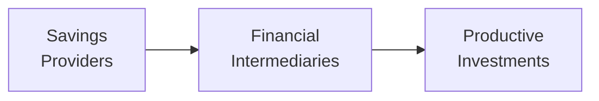

## The Intermediary Role of Finance and Its Ethical Imperative
Finance is a bit like the central nervous system of the global economy: it connects those who have excess capital (savers) with those who need capital to fund growth-oriented ventures (borrowers). Without well-functioning financial intermediaries, many productive investments would go unfunded, potentially hindering economic progress. And in my opinion, high ethical standards are the backdrop that ensures this entire system works properly—safeguarding trust and transparency in each interaction.

Illicit actions—from insider trading to deliberately misleading financial disclosures—can disrupt markets and persuade everyday savers to shy away from investing. As soon as trust dips, capital flows diminish, liquidity dries up, and the economy might face serious turmoil. Hence, having a robust ethical infrastructure isn’t merely a “nice-to-have”; it is the engine that keeps global markets humming along.

## Unethical Practices and Their Impact
We’ve all heard stories—some might come from dramatic newspaper headlines or perhaps from personal industry anecdotes—where unethical behavior snowballed into massive investor losses and bank failures. Unethical activities, such as insider trading or manipulating financial statements, can trigger consequences that affect not only direct participants but also unsuspecting third parties.

• Erosion of Investor Confidence: The moment stakeholders start suspecting that the game is rigged, they might pull their money out. When capital flees, market volatility intensifies, and valuations become unstable.

• Destabilized Markets: Market integrity takes a big hit when dishonest insiders leverage confidential information, or when unscrupulous managers fudge performance data. Over time, such behavior can undermine the very foundation of market efficiency.

• Regulatory Penalties and Reputational Damage: Even if a firm does well financially, unethical practices may lead to penalties, crippling lawsuits, or even criminal charges. Reputational harm can persist for years and jeopardize future business prospects.

### A Quick Numeric Illustration
Imagine a portfolio management firm (PMF) that manages a $1 billion equity fund. If unethical trading creates regulatory scrutiny that results in a settlement or fine—say 2% of AUM—that alone might cost $20 million. Factor in lost investor trust, possible redemptions, and the cost of re-establishing brand credibility, and the total toll can be considerably higher. On top of that, employees might leave, concerned about working for a firm tarnished by scandal.

## Managing Conflicts Among Stakeholders
A big chunk of the financial profession revolves around balancing the interests of different stakeholders: clients, shareholders, regulators, employees, and the broader public. So, how do ethical standards come into play?

1. Fair Treatment of Clients: CFA Institute Standards of Professional Conduct emphasize placing client interests above one’s own. This principle serves as a bulwark against self-dealing, misrepresentation, and other unethical behaviors.

2. Aligning with Shareholders: While shareholders typically aim for profit maximization, pursuing gains through questionable means can reduce shareholder value when scandals surface.

3. Cooperation with Regulators: Regulatory oversight (think the SEC in the U.S., FCA in the U.K., or more globally recognized bodies like IOSCO) is designed to ensure that market participants follow certain rules and operating standards. Firms that consistently demonstrate ethical compliance can build more constructive regulatory relationships.

4. Broader Market Integrity: By adhering to high ethical standards, finance professionals help maintain a level playing field, which is critical for an efficient market where prices reflect underlying values rather than clandestine deals.

## Beyond Compliance: Social Responsibility and Sustainability
Sure, meeting legal requirements is important, but effective ethical programs go beyond ticking boxes on a compliance checklist. When financial institutions embrace social responsibility, they become more sensitive to environmental, social, and governance (ESG) considerations. Let’s say a firm invests in renewable energy programs, or it commits to fair labor practices in its supply chain. These initiatives can promote long-term value creation, strengthen the firm’s reputation, and serve as a guiding principle in daily decision-making.

### Why Broaden the Ethical Lens?
• Long-Term Profitability: Research suggests that organizations focusing on ESG factors may benefit from cost savings, better risk management, and enhanced brand loyalty.  
• Stakeholder Engagement: Clients, employees, and the community at large often prefer dealing with firms that demonstrate a genuine commitment to the public good.  
• Cultural Shift: Strong ethical and social standards can help cultivate a workplace culture where employees feel proud, motivated, and accountable.

To illustrate, consider a global asset manager that integrates sustainability metrics when making portfolio decisions. Not only could it deliver favorable risk-adjusted returns, but it can also attract clients who are eager to “do well by doing good.”

## Evolving Ethical Standards in a Technological Age
Finance doesn’t stay still—it evolves, sometimes in leaps and bounds. New tools like artificial intelligence, blockchain-based solutions, and algorithmic trading offer efficiency and excitement but also open new doors for questionable activities. High-frequency trading algorithms, for instance, might exploit minute price differentials to the detriment of everyday market participants. Even big data analytics tools can lead to privacy issues if not managed ethically.

We’re bound to see fresh regulatory requirements and industry best practices as novel technologies emerge. Ethical vigilance ensures professionals remain on top of these developments and incorporate them responsibly. After all, the last thing you want, as a portfolio manager or an analyst, is an unintentional ethical breach involving algorithmic strategies you don’t fully understand.

## Cultivating an Ethical Culture in Financial Firms
While a robust code of conduct and strong policies are helpful, they won’t do much unless the tone at the top supports them. Senior leadership plays a huge role in nurturing an environment that rewards honesty. Here are key elements:

• Transparent Governance: Clear board structures and open channels for reporting ethical concerns promote accountability.  
• Effective Oversight: Compliance officers and internal auditors need enough resources and autonomy to do their jobs.  
• Continuous Education: Regular training sessions keep everyone alert to ongoing ethical requirements, from new ESG frameworks to updated insider trading guidelines.  
• Accountability: Firms should enforce consequences for violations—regardless of who is involved. If the CEO is found culpable, the rules should be the same as for an intern.

The result is a virtuous cycle: employees see that leadership supports “doing the right thing,” which leads to consistent and genuine ethical behavior, further solidifying market trust.

## Practical Examples and Case Studies
Sometimes it’s beneficial to get specific. Let’s briefly look at two scenarios that show the importance of robust ethical standards:

• Case Study 1: Insider Trading at XY Capital  
  XY Capital’s portfolio manager traded a healthcare stock based on confidential information about an upcoming clinical trial success. The trade netted substantial short-term gains, but eventually, regulators uncovered the scheme. XY Capital paid a massive fine, and the manager faced legal charges. Clients fled, and the firm’s brand was permanently scarred. This example shows how quickly unethical behavior can unravel an otherwise reputable business.

• Case Study 2: Socially Responsible Investing (SRI) at GreenFuture Funds  
  GreenFuture discovered an opportunity to invest in a company known for questionable labor practices. Even though it promised hefty returns, GreenFuture’s investment committee vetoed the move, cited concerns around reputational risk, and stood by its SRI guidelines. Over time, that controversial company faced a big scandal and eventually faced legal action, reaffirming GreenFuture’s decision. By staying committed to their ethical stance, GreenFuture better protected its clients.

## Visualizing the Financial Intermediation Chain
Below is a simple Mermaid diagram illustrating how finance channels savings to productive uses. Adhering to high ethical standards at each node ensures transparency, fairness, and continued market participation:



When unethical behaviors creep into any part of this flow—from mis-selling financial products to falsifying disclosures—confidence drops, and the entire engine stalls.

## A Possible Formulaic Consideration
In certain corners of finance, cost of capital estimates help guide investment decisions. While this might seem unrelated to ethics, consider how manipulated disclosures can systematically distort the cost of capital:


\text{WACC} = \left(\frac{E}{E + D} \times R_e\right) + \left(\frac{D}{E + D} \times R_d \times (1 - T)\right)


• E = Market Value of Equity  
• D = Market Value of Debt  
• R_e = Required Return on Equity  
• R_d = Required Return on Debt  
• T = Tax Rate  

Ethical lapses—like underreporting debt or overstating earnings—will lead to misestimated components (like R_e) and damage the firm’s credibility. Once discovered, the firm’s actual cost of capital often skyrockets, as lenders and investors demand higher returns to compensate for added risk.

## Simple Python-Style Scrutiny Check
Firms sometimes build quick python scripts to verify compliance. Below is a trivial snippet that could, for instance, scan emails for suspicious phrases related to insider information. While simplistic, it highlights the kind of proactive steps firms may take:

```python
keywords = ["confidential", "inside info", "non-public", "leak"]
emails = [
    "Hey, let's keep this confidential.",
    "Next step is a product launch, see the attached info doc.",
    "No inside info to share, let's keep everything by the book."
]

for email in emails:
    if any(word in email.lower() for word in keywords):
        print(f"Potential red flag found in: {email}")
```

Of course, stepping up to real-life monitoring requires nuanced policies and protections to ensure privacy rights and compliance with data protection laws.

## Best Practices and Common Pitfalls
• Document and Disclose: Keep thorough records of communications and investment rationales.  
• Ongoing Training: Ethical guidelines evolve, so your knowledge can’t remain static.  
• Clear Whistleblower Channels: Encourage employees to report concerns without fear of retaliation.  
• Avoid Conflicts of Interest: Separate research from proprietary trading, maintain firewall policies, and place client interests first.  
• Watch Out for Complacency: Even a seemingly “small” ethical slip can cascade into bigger issues before you know it.

## Final Exam Tips
1. Link Theory to Real-World Scenarios: When responding to essay questions, do more than define a concept—illustrate it with a hypothetical or real example.  
2. Apply the Standards: The CFA Institute Code and Standards often dovetail with case-based questions. Know them, embody them, and apply them consistently.  
3. Time Management: If faced with multi-part scenario questions about ethical breaches, allocate enough time to address each section thoroughly.  
4. Focus on Stakeholder Analysis: Show your ability to weigh different perspectives (client vs. employer vs. regulatory).  
5. Demonstrate Long-Term Thinking: Ethical standards aren’t about quick fixes; highlight how they contribute to sustainable performance.  

## Glossary
• Market Integrity: The extent to which a market is seen as fair, efficient, and free from manipulation.  
• Insider Trading: The illegal practice of trading on the stock exchange to one’s own advantage through having access to confidential information.  
• Regulatory Penalties: Fines or sanctions imposed by authorities for violations of laws or regulations.  
• Social Responsibility: Acting in ways that benefit society as a whole, beyond strict profit maximization.

## References and Further Reading
- CFA Institute Future of Finance publications  
- Coffee, J.C., “Gatekeepers: The Professions and Corporate Governance,” Oxford University Press  
- OECD Guidance on “Responsible Business Conduct for Institutional Investors”  

--------------------

## Practice Questions: The Need for High Ethical Standards in Finance



### Which of the following best captures the primary reason why high ethical standards are crucial in finance?

- [ ] They ensure that investors always earn maximum returns.  
- [x] They maintain trust and transparency, facilitating efficient capital allocation.  
- [ ] They reduce the cost of raw materials in production processes.  
- [ ] They allow firms to bypass regulatory oversight.  

> **Explanation:** High ethical standards help preserve market integrity, ensuring trust among participants and facilitating the efficient flow of capital.  

### What is the likely consequence for a financial intermediary that engages in insider trading?

- [x] Reduced investor confidence and potential regulatory sanctions  
- [ ] A certain increase in short-term profit with no long-term drawbacks  
- [ ] The ability to hold monopoly power in the market  
- [ ] Recognition from industry peers for innovative tactics  

> **Explanation:** Insider trading typically undermines confidence in financial markets and can result in significant liabilities and penalties.  

### From a stakeholder perspective, which statement accurately describes managing conflicts of interest?

- [ ] It is purely the responsibility of lower-level analysts.  
- [x] It requires balancing the needs of clients, shareholders, and regulators through clear ethical principles.  
- [ ] It involves seeking competitive advantages regardless of potential ethical ambiguities.  
- [ ] It eliminates the need for oversight once a firm is well-established.  

> **Explanation:** Conflicts must be managed by placing client interests first, aligning with shareholder interests ethically, and adhering to regulatory standards.

### Which characteristic best defines the role of transparent governance in financial firms?

- [ ] It concentrates decision-making in a few executives.  
- [ ] It encourages employees to trade on inside information for corporate benefit.  
- [x] It includes a clear structure and open communication channels that promote accountability.  
- [ ] It removes board oversight to speed up decision-making.  

> **Explanation:** Transparent governance ensures decisions can be scrutinized and questioned, preserving ethical conduct and accountability.

### Why might a financial institution adopt social responsibility and sustainability measures?

- [ ] To obscure unethical practices in other business lines.  
- [ ] To guarantee short-term profit spikes.  
- [ ] To ensure regulators overlook minor reporting discrepancies.  
- [x] To enhance long-term value creation and align with broader societal expectations.  

> **Explanation:** Adopting social responsibility aligns with stakeholder values, fosters trust, and can lead to sustainable performance over the long run.

### Which of the following technologies poses new ethical challenges in finance?

- [ ] Manual spreadsheets  
- [x] Algorithmic or high-frequency trading systems  
- [ ] Paper-based ledger accounting  
- [ ] Basic e-mail communication systems  

> **Explanation:** Advanced electronic trading systems can raise ethical concerns such as unfair market advantages and potential manipulative capabilities.

### What is a common pitfall for finance professionals who don't remain vigilant about ethical standards?

- [x] Becoming complacent with small deviations that evolve into severe violations  
- [ ] Gaining unanimous support from regulators for increased autonomy  
- [ ] Consistent improvement in long-term client retention rates  
- [x] Strong brand reputation in the short run, but at the cost of transparency  

> **Explanation:** “Minor” lapses can snowball into significant breaches, ultimately harming both the firm and market participants.

### How do high ethical standards benefit financial professionals in the long term?

- [x] They build stronger client relationships and trust.  
- [ ] They make rigorous risk assessment processes unnecessary.  
- [ ] They shield management from all external audits.  
- [ ] They allow managers to skip mandatory training.  

> **Explanation:** Over time, ethical conduct helps professionals earn credibility, maintain client loyalty, and mitigate reputational risks.

### What best describes the effect of ethical leadership on employee behavior?

- [x] It sets a strong tone and encourages honest decision-making among employees.  
- [ ] It forces employees to act primarily out of fear of punishment.  
- [ ] It usually has no tangible influence on organizational ethics.  
- [ ] It invites more complex regulatory sanctions.  

> **Explanation:** Ethical leadership fosters an environment where employees voluntarily uphold ethical standards.

### True or False: Ethical decision-making in finance is static and remains constant despite technological innovations.

- [x] True  
- [ ] False  

> **Explanation:** Actually, this statement is false in reality. Ethical frameworks evolve in response to new technologies and changing regulatory landscapes. The correct viewpoint is that it must adapt over time.  


