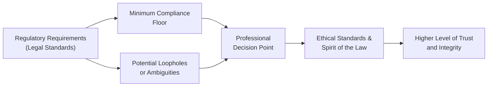

## Comparing Ethical and Legal Standards

The investment profession places enormous emphasis on credibility, public trust, and the protection of client interests. But what does it mean to do “the right thing” when you’re surrounded by laws, regulations, and industry guidelines dictating how you should act?

On one hand, you have legal standards: these flow directly from statutes, regulations, and mandates that originate in legislative bodies or regulatory agencies. They are generally enforced by the courts, government officials, or self-regulatory organizations (SROs). On the other hand, you have ethical standards, which may not always be formally codified in law but instead stem from moral principles and professional values. In finance, ethical standards often push professionals to look beyond mere compliance and prioritize integrity, fairness, and long-term relationships with clients.

I still remember this moment years ago: a mentor of mine—let’s call him Carlos—joined an investment firm boasting an impeccable compliance record. They ticked all the boxes, rarely flinched when a regulator showed up, and bragged that they hadn’t been fined in nearly a decade. Sweet, right? But once inside, Carlos saw something disturbing: the research team relentlessly pushed performance metrics in marketing materials but downplayed risk factors in a way that was technically permissible under existing disclosure requirements, though definitely questionable from a moral standpoint. Nothing they did broke the law; they were strictly “above board” from a legal perspective. And yet, to anyone with a moral compass, it was decidedly off. That double standard between being legal and doing what’s right highlights why understanding ethical obligations is so crucial.

Below, we dig deeper into the complementary—and sometimes conflicting—relationship between law and ethics. Exam candidates and finance professionals alike should recognize that both are indispensable building blocks of a respectable practice. We’ll talk about how to navigate gray areas, the role of self-regulation, and some real-world examples to make these concepts stick.

## Letter of the Law vs. Spirit of the Law

Many investment professionals attempt to comply with regulations by following each requirement to the letter. However, there is also the concept of the “spirit of the law”: the underlying purpose or moral intention behind that rule. 

• The Letter of the Law: This emphasizes strict compliance with legal codes. If a certain disclosure is required in a prospectus, you provide it. If a limit is placed on the ratio of marginable securities, you stay below that ratio—no exceptions.  
• The Spirit of the Law: This goes beyond technical obedience and aims at the broader intention behind the rule—namely, to ensure fairness, transparency, and investor protection.

A purely legalistic approach can sometimes tempt professionals to skirt close to the edges of acceptable behavior to maximize short-term benefits. This is often referred to as exploiting “loopholes,” or technicalities in regulations that were never intended to permit questionable practice but can be interpreted that way if someone is so inclined. But while the letter can keep you from getting arrested, ignoring the spirit can erode trust and tarnish reputations in the long run.

## Why Ethical Standards Often Outpace Legal Requirements

Just because something is permissible under statutory law does not necessarily make it ethical. Ethical standards generally aspire to higher principles rooted in moral duty, fairness, and accountability. These standards help address situations where:

• Regulations don’t yet exist: In rapidly evolving areas—like alternative investments or new digital assets—applicable laws often lag behind emerging practices, leaving professionals to rely on broader moral guidance.  
• Interpretations vary: In finance, many rules rely on broad definitions or are open to interpretation (e.g., who qualifies as a “sophisticated investor”?). Ethical standards guide professionals through these uncertain zones.  
• The minimal legal standard isn’t enough to protect clients: Occasionally, the law’s requirements aren’t quite robust enough to foster the level of transparency or fairness that advanced clients expect.

Take, for example, a scenario where you’re marketing an index fund to a client who is unfamiliar with the finer points of index composition or tracking error. You might only need to present the trailing performance under existing regulation, but ethically, you might feel obliged to explain how the index is constructed or the possibility of tracking error over time. Providing that extra clarity bolsters trust—and that’s the essence of strong ethical conduct.

## When Legal Is Not Enough: Real-World Illustrations

To highlight the possible gap between legality and ethics, consider these hypothetical scenarios:

• Legal but Questionable Fee Arrangement: A portfolio manager charges hidden administrative fees in a manner allowed by local bylaws. Clients see it as a normal line item on their statements, but the manager doesn’t openly discuss these fees unless asked. Legally, this might pass muster because disclosure meets the minimum requirement. But ethically, one might argue that full transparency is needed—clearly labeling and explaining how fees are calculated so clients can make informed decisions.  
• Exploiting Exotic Instruments to Sidestep Regulatory Intention: Sometimes a new financial vehicle is structured in just the right way to avoid certain capital reserve requirements or disclosure obligations. While it might be “legal,” it could undermine the very spirit of the regulation—e.g., ensuring institutions have sufficient capital buffers to survive a downturn. This approach can compromise the broader stability of the financial system and, arguably, flout ethical norms of investor protection.

Over time, these behaviors that live in the “gray zone” can erode public trust. In finance, trust is currency. Break it, and you risk losing both clients and your professional standing. As you progress in your career—or as you prepare for your CFA exams—the line between what’s permitted by law and what’s ethically sound will keep surfacing. Ultimately, the best route is often to heed the higher standard.

## Building Trust and Industry Reputation

Legal systems provide a floor beneath which no professional should slide. Meanwhile, ethical standards operate more like a ceiling, nudging us to continuously reach higher. From a purely pragmatic standpoint, adhering to robust ethics has clear upsides:

• Client Loyalty: Clients who trust their advisers are more likely to remain long-term partners.  
• Positive Public Image: Firms with strong reputations for integrity can attract top-tier talent and cultivate goodwill among regulators, limiting friction during audits or investigations.  
• Reduced Risk of Litigation or Sanctions: By anticipating ethical obligations, you steer clear of questionable practices that might later become legal liabilities as laws evolve or regulators sharpen their oversight.

Professional organizations like CFA Institute require members and candidates to abide by a Code of Ethics and Standards of Professional Conduct precisely because they know that legal compliance alone may not adequately protect client interests.

## Industry Self-Regulation and the Importance of Ethics

Self-regulation forms a meaningful cornerstone in finance. Typically, this means industry associations, professional credentialing bodies, or collectives of firms set “voluntary” codes that go beyond what is legally mandated. The Global Investment Performance Standards (GIPS), for example, create a robust framework for calculating and presenting performance that many firms adopt even if local laws don’t require it. Similarly, many investment firms maintain internal codes of conduct that echo or exceed statutory requirements.

Why is self-regulation so crucial? Precisely because it’s driven from within, rather than by lawmakers who may lack the domain expertise or agility to adapt regulations quickly in a rapidly evolving field. When professionals collectively decide on a set of best practices, they (1) maintain industry integrity, (2) reduce the likelihood of broad regulatory crackdowns, and (3) strengthen overall market confidence.

One might argue that robust self-regulation can prevent short-sighted or unethical practices from creeping in at the edges, which is good not only for protecting investors but also for safeguarding the entire industry from reputational damage down the road.

## Navigating “Gray Areas” with Ethical Judgement

Gray areas in finance abound. For instance, an investment banker might share client data with a colleague who’s working on a related deal. Legally, it might be permissible if certain “Chinese wall” procedures are followed. Yet ethically, there could be boundaries of confidentiality, fairness, and potential conflicts of interest that are easy to forget or dismiss. 

Ethical decision-making frameworks, such as those described in Section 1.6 of this volume, help professionals systematically evaluate potential courses of action. They encourage us to gather all relevant data, consider various stakeholders, and ask ourselves, “Would I be comfortable if the details of my actions were made public?” or “What if my grandmother saw this on the news?” These questions might sound simple, but they strike at the heart of moral action. That sense of accountability to a broader audience—beyond regulators—forms the bedrock of genuine ethical conduct.

## Visualizing the Interplay Between Legal and Ethical Standards

Below is a simple Mermaid flowchart illustrating how legal requirements and ethical considerations overlap and sometimes diverge:

• “Regulatory Requirements” represent the codified laws.  
• “Minimum Compliance Floor” indicates the least that must be done to remain on the right side of the law.  
• “Potential Loopholes” highlight the risk of exploiting the letter rather than the spirit.  
• “Professional Decision Point” symbolizes the pivotal moment where a practitioner must decide how to balance legal compliance and ethical standards.  
• “Higher Level of Trust and Integrity” is the outcome when ethical principles prevail.

## Practical Case Studies

1) The Skirting-the-Disclosure Case  
   A midsize brokerage firm discovered that by describing certain fee arrangements in footnotes, they could fulfill regulatory disclosure requirements with minimal prominence. Some prospective clients breezed past these footnotes. The result was confusion about total costs—technically legal, but ethically dubious. Over time, negative client feedback and regulatory scrutiny forced a change in disclosure practices. After they redesigned their disclosures to be more explicit, clients reported higher satisfaction and trust.  

2) Misaligned Compensation Structures  
   An asset manager realized that by steering clients toward certain complex products carrying performance fees, the firm could legally boost its income. Nothing about these products was “illegal,” and each had been vetted by regulators. However, the manager rarely recommended simpler, lower-fee alternatives that might have met many clients’ goals equally well. The immediate spike in revenue was undeniable, but so was the concern that client interests weren’t top priority. Over time, some investors perceived conflicts of interest, left the firm, and tarnished its reputation in the market.

These examples underscore that while we can applaud legal compliance, we also need to scrutinize our own motives and practices. In complex financial environments, the capacity to act ethically—even when not mandated by law—differentiates merely adequate firms from exemplary ones.

## Common Pitfalls and Best Practices

Below is a brief table of common pitfalls that can arise when focusing on legal standards without ethical insight, alongside best practices for a more principled approach.

| Pitfall                                                      | Best Practice                                                |
|--------------------------------------------------------------|--------------------------------------------------------------|
| Relying solely on minimum statutory disclosures              | Offer clear, concise, and prominent explanations of all fees, risks, and conflicts of interest.         |
| Exploiting unclear regulations to boost short-term profits   | Follow a robust internal code of ethics that addresses gaps in existing law.                           |
| Failing to update ethical policies as new products emerge    | Engage in ongoing professional education and update codes of conduct regularly.                         |
| Treating compliance as an afterthought or “check the box”    | Involve compliance teams early in product design and marketing to ensure alignment with ethical norms.  |
| Using inadvertent loopholes or technicalities                | Seek outside perspective (legal counsel, industry specialists) if an action feels borderline.           |

A crucial lesson is that fostering a strong internal culture—where employees feel empowered to raise concerns and management values more than just short-term compliance metrics—promotes sustainability and trust.

## Fostering a Culture of Higher Standards

Culture is arguably the deciding factor in how consistently a firm upholds ethical principles. A “compliance-only” culture may do the bare minimum to avoid legal troubles. But a culture actively championing ethics will likely encourage employees to voice questions, propose changes, and align business decisions with moral imperatives.

• Leadership Example: Upper management that visibly upholds ethical behavior sends a clear message that doing things “the right way” is non-negotiable.  
• Training and Reinforcement: Ensure that ongoing ethics-focused training is integrated into day-to-day operations, not merely offered once a year as “compliance modules.”  
• Feedback Loops: Regularly assess the effectiveness of a firm’s ethical policies, including collecting anonymous employee feedback to see what’s really happening on the ground.

Ethics committees, internal “ombudspersons,” or mentorship programs can provide safe channels for employees to discuss ethical gray areas. And yes, it can feel awkward the first time you raise your hand to question whether a practice truly aligns with the “spirit of the law.” But this is the type of environment that fosters robust, proactive ethics.

## Exam Tips: Navigating the Legal/Ethical Spectrum

As you tackle your CFA preparation, keep the following in mind:

• Scenario Analysis: Be prepared to dissect case studies that ask you to differentiate between what is legally acceptable and what is ethically sound.  
• Emphasize Stakeholder Implications: The CFA curriculum frequently addresses how each decision affects clients, employers, and the market, not just what regulators say.  
• Think Beyond Written Regulations: When an exam prompt references “industry best practices” or an “in-house code of ethics,” assume these might surpass legal mandates and highlight the moral high ground.  
• Common Pitfalls: Watch out for exam scenarios that describe marketing or disclosure strategies where key data is hidden in the fine print—often a tip-off that the question is testing your ability to see the difference between black-and-white legal compliance and broader ethical obligations.

## References and Further Reading

• Federal Reserve Board and Bank for International Settlements (BIS) – Publications on compliance best practices.  
• Mintz, S. M., & Morris, R. E. (2019). “Ethical Obligations and Decision Making in Accounting.” This work delves into moral reasoning in the context of accounting, but the underlying lessons apply broadly to finance as well.  
• Krugman, Paul. “The Conscience of a Liberal.” Though primarily a political and economic commentary, it introduces insights into ethical governance and the role of moral responsibility in shaping policy frameworks.  

Additional references:  
• CFA Institute Code of Ethics & Standards of Professional Conduct – The bedrock text for all CFA candidates.  
• Firm-Specific Compliance Manuals – Internal documents can sometimes exceed the scope of official regulations and reveal best practices in real time.

Remember, professionals who do the right thing not just because it’s a rule but because it’s a principle are the ones who will build the future of ethical finance.  

---

## Test Your Knowledge: Legality vs. Ethical Conduct in Finance



### Which statement best captures the difference between legal and ethical standards in finance?

- [x] Legal standards are based on written laws and regulations, while ethical standards go further, guided by moral principles.
- [ ] Ethical standards are strictly enforced by the courts, while legal standards are enforced by professional societies.
- [ ] Legal standards always match ethical standards in scope and rigor.
- [ ] Ethical standards are optional suggestions that rarely overlap with legal requirements.

> **Explanation:** Laws typically provide a baseline that professionals must follow, while ethics call for higher moral principles extending beyond mere compliance.  

### A financial adviser discloses fees in a small footnote because it complies with regulations. However, clients often miss important details. What concept does this scenario illustrate?

- [x] A conflict between the letter of the law and the spirit of the law.
- [ ] Violation of capital reserve requirements.
- [ ] Willful breach of fiduciary duty.
- [ ] Full compliance with ethical obligations.

> **Explanation:** Although the adviser meets the minimum standard, hiding details in tiny footnotes may undermine client trust and ethical duties.  

### A firm exploits a loophole in disclosures, effectively minimizing certain risks from its marketing documents. Which of the following best describes this situation?

- [x] Legally permissible yet potentially unethical behavior.
- [ ] A standard best practice to stay competitive.
- [ ] Strict adherence to ethical codes.
- [ ] An example of socially responsible investing.

> **Explanation:** Loopholes can allow a firm to comply with regulations in form, but not necessarily in spirit, leading to questionable ethical practices.  

### Select the option that best characterizes a robust ethical culture within a financial institution.

- [x] Management demonstrates ethical behavior openly, and employees feel safe reporting concerns.
- [ ] Each department creates unofficial policies that keep people from following regulations too strictly.
- [ ] The firm never updates its internal code because they rely fully on existing laws.
- [ ] Employees are told to focus on revenue targets, with no mention of integrity or client welfare.

> **Explanation:** Ethical culture thrives when strong leadership, open dialogue about moral standards, and continuous improvement are present.  

### Which outcome is most likely if a firm consistently values ethics above the minimum required legal threshold?

- [x] Strengthened client trust and long-term loyalty.
- [ ] Immediate regulatory investigation and penalties.
- [x] Long-term financial harm due to high costs.
- [ ] Excessive staff turnover because they disapprove of the stricter standards.

> **Explanation:** By holding itself to a higher ethical bar, a firm often builds greater trust, fosters loyalty, and potentially secures a sustainable reputation.  

### A financial professional is wrestling with a complex scenario in which the law is unclear. Which of the following best outlines the role of ethical decision-making frameworks?

- [x] They guide professionals in gathering facts, considering stakeholder impacts, and choosing the path that aligns with moral values.
- [ ] They replace legal counsel in determining regulatory obligations.
- [ ] They instruct professionals to wait for new laws to be passed before acting.
- [ ] They generally undermine compliance requirements.

> **Explanation:** Ethical frameworks help individuals navigate gray areas by carefully evaluating all angles, especially when legal guidance is ambiguous.  

### Why might it be insufficient for a financial professional to rely solely on compliance with legal minimums?

- [x] Because legal requirements do not always account for evolving market complexities or moral nuances.
- [ ] Because legal requirements are usually too strict, stifling innovation.
- [ ] Because the law encourages purely profit-driven motives in finance.
- [ ] Because laws are optional guidelines unrelated to actual practice.

> **Explanation:** Laws often lag behind industry developments, leaving professionals to rely on ethical principles to ensure they meet higher standards of responsibility.  

### What is the primary argument for self-regulation in the investment profession?

- [x] Industry professionals often possess deeper expertise and can establish best practices faster than lawmakers.
- [ ] Self-regulation is meant to replace all legal requirements in the sector.
- [ ] Regulators have no legitimate authority over financial markets.
- [ ] Self-regulation is unnecessary because legal standards are always sufficient.

> **Explanation:** Self-regulatory frameworks leverage industry expertise to address nuances and promote best practices more efficiently than legislative processes might.  

### A portfolio manager charges hidden administrative fees that are technically disclosed but not broadly highlighted. Which statement applies?

- [x] The portfolio manager is complying with regulatory requirements in form but not in spirit, making the practice ethically questionable.
- [ ] The fees must be illegal since they are hidden.
- [ ] This is an example of best-in-class assurance for clients.
- [ ] Portfolio managers should never charge administrative fees.

> **Explanation:** Tucking fees in obscure places may meet minimum legal demands but raises ethical concerns about transparency and fairness.  

### True or False: A compliance-only approach is always sufficient to maintain a strong reputation in finance.

- [x] False
- [ ] True

> **Explanation:** A firm that meets only the bare minimum legal requirements could still engage in ethically dubious behaviors, eventually undermining trust.  


