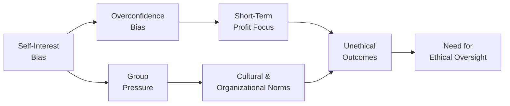

## Overview

Imagine you’re just starting out on a busy trading floor—everyone around you is in a constant rush to secure the next client, close the next deal, and outdo last quarter’s results. In that environment, it can feel like your ethical compass starts spinning, almost like it’s got a mind of its own. You might think, “Surely, I would never compromise my values just to get ahead.” But the reality is that perfectly well-intentioned professionals often face subtle (and sometimes not-so-subtle) pressures that push them toward questionable decisions. The aim of this section is to shed light on those pressures and help us pinpoint real-world ways to maintain integrity in all we do.

Below, we’ll explore the most prevalent challenges to ethical behavior in the investment profession and examine how organizational environments, cognitive biases, and cultural expectations can shape ethics—sometimes without us even noticing. We’ll also highlight practical strategies to identify and combat these challenges.

## Key Factors Impeding Ethical Decision-Making

### Self-Interest Bias
There’s a pretty standard joke in finance that sounds like: “What’s in it for me?” This question sums up self-interest bias. Sometimes, we become so aligned with personal rewards—bonuses, promotions, recognition—that we put them above our duty to clients or the broader market. Some might see it as “doing what you have to, to succeed,” but the real, hidden cost is that our judgment can be clouded by personal gain.

• Example: A portfolio manager might push a product with a higher commission because it boosts their bonus rather than because it suits the client’s actual risk profile and objectives.

• Mitigation: Transparency is key. Firms can introduce controls like mandatory disclosures of compensation structures and training about how to detect and manage personal conflicts of interest.

### Group Pressure
Have you ever heard a colleague say something like, “Everyone on the team is doing it. Don’t worry, it’s just how we get things done here”? Group pressure can seriously dampen an individual’s moral compass. People often assume that if the entire team endorses something, it must be harmless—or at least acceptable. But once a group normalizes certain behaviors (like slight data manipulation), crossing ethical lines gets dangerously easier.

• Example: Consider a research department that collectively decides to “tweak” assumptions so forecasts look more consistent with what top management expects. One analyst might have reservations, but they hesitate to speak out because it seems no one else is bothered.

• Mitigation: Encouraging open dialogue and using structured decision-making processes empower everyone to raise concerns. In particular, leaders can set a tone that dissent is valued.

### Short-Term Profit Incentives and Inadequate Oversight
Financial firms naturally chase profits—but the question is whether they can yield them ethically. When the time horizon shrinks to end-of-quarter results, the desire to meet those goals can overshadow broader fiduciary duties. Without solid oversight, unscrupulous practices might creep in.

• Example: In a small investment boutique, there may be a lack of separation between compliance and investment management. Without a robust compliance infrastructure, some managers might, say, trade on material nonpublic information to juice returns before quarter-end.

• Mitigation: Clear internal controls and consistent compliance checks reduce the temptation to chase short-term performance at the expense of ethical or even legal standards.

## Cultural Norms and the Corporate Environment

Culture, both at a national and organizational level, heavily influences an individual’s choices. If a firm’s unspoken motto is “Win at all costs,” that environment can quickly morph into a breeding ground for unethical decisions. Many professionals—especially new hires—may be eager to fit in, so they adapt to the existing culture, even if it’s morally dubious.

• Example: A manager in a high-pressure work culture might encounter subtle signals that skipping certain disclosures to regulators is “just what we do.” If that manager has never seen an alternative at the firm, they might accept it as normal.

• Mitigation: Leaders should define a clear mission statement that aligns with ethical principles. Formal policies are vital, but so are the everyday actions of senior managers—what they walk, not just what they talk.

## Cognitive Biases and Rationalization

### Overconfidence Bias
We don’t like to see ourselves as susceptible to mistakes. In the finance world, overconfidence can be a huge pitfall. You might think, “I’m a trained analyst; I know what I’m doing,” and that sense of certainty can blind you to potential harm. Overconfidence might also lead you to dismiss alternative opinions or new data that contradict your beliefs.

• Example: An analyst might overlook fundamental risk factors of a new structured product because they’re convinced their background qualifies them to gauge “all possible outcomes.”

### Confirmation Bias
Similar to overconfidence is confirmation bias: once we have an initial theory in mind, we selectively focus on data that support that theory, while ignoring contradictory evidence. If we ignore signs that a strategy violates regulations or client best interests, we’re heading down a slippery slope.

• Example: A risk manager fixated on a single scenario might avoid investigating conflicting signals that the market is not stable, rationalizing away red flags to confirm what they want to see.

### Rationalization
Let’s be honest: rationalization makes it easy to justify actions that we’d otherwise deem unethical. We might say, “I’m only doing what everyone else does,” or “It’s harmless this one time.” The more we rationalize, the simpler it becomes to cross the line for seemingly minor issues—without noticing how big those issues can get.

## Role of Leadership and Oversight

Leadership matters tremendously. A firm with a strong ethical tone from the top cultivates consistent oversight and fosters an environment where employees feel comfortable voicing concerns. On the flip side, weak oversight or leaders who themselves engage in questionable practices can drag the entire organization into ethical gray areas.

• Example: A CFO might ask auditors to loosen certain accounting treatments to meet earnings targets. When leadership directly instructs employees to cut corners, people are more likely to rationalize it—especially if they think “but the CFO said so.”

• Mitigation: Setting up a “speak-up” culture with confidential reporting lines helps employees come forward. Moreover, when top executives demonstrate ethical modeling and accountability, the ripple effect is profound.

## Whistleblower Protections

Another crucial element in mitigating unethical behavior is providing robust whistleblower protections. Employees who see wrongdoing often hesitate to report it due to fear of retaliation or career damage. But strong safeguards—legal or internal—encourage them to speak up, fueling transparency.

• Example: A junior employee notices fraudulent activities in portfolio accounting but fears losing their job if they disclose it. With whistleblower protections in place, that employee can confidentially report the situation, and a thorough investigation can follow.

• Mitigation: Formal whistleblowing channels (like hotlines or third-party reporting systems) ensure anonymity, and strict no-retaliation policies demonstrate the firm’s commitment to integrity.

## Diagram: The Interaction of Ethical Barriers

Below is a simple Mermaid.js diagram illustrating how various forces interconnect to influence ethical decision-making.

From this visualization, you can see that many different elements contribute to a pipeline leading to unethical outcomes—especially when unchallenged.

## Mitigating Ethical Pitfalls

1. Structured Decision-Making: Using frameworks that encourage thorough analysis of ALL possible consequences reduces errors spurred by personal biases.  
2. Awareness Training: Everyone, from interns to executives, benefits from training about self-interest and confirmation biases, so they can catch these pitfalls early.  
3. Mentorship Programs: New hires often look to experienced colleagues for ethical guidance. Mentors who model ethical practices can make a huge difference in shaping workplace culture.  
4. Aligning Performance Evaluation: If success is measured only by short-term gains, some individuals will push the envelope. Evaluations should incorporate ethical conduct metrics.  
5. Transparent Reporting Channels: Anonymous hotlines or regular feedback sessions bolster trust that concerns are taken seriously.

## Personal Reflection and Anecdote

I still remember, early in my career, being in a high-stakes pitch meeting. The lead manager urged us to “dress up” some numbers that boosted a product’s apparent returns. It looked like a harmless tweak—just a rounding difference. But a small red flag went up in my mind. I asked for a second opinion from our compliance officer, and that single question triggered a broader conversation about how these “tweaks” were becoming a slippery slope. It was a bit stressful at first, but in hindsight, the resolution reaffirmed everyone’s trust in each other—and saved the client from a partially misleading performance report. Sometimes, all it takes is one person (like you!) to question the status quo.

## Conclusion

Navigating ethical complexity is a constant challenge. By recognizing common hurdles—such as self-interest bias, group pressure, and cognitive pitfalls—professionals can deliberately adopt strategies and mindsets that foster ethical outcomes. Organizational culture, leadership oversight, transparent processes, and whistleblower protections collectively form a powerful defense. Over time, these measures help build trust with clients and the broader public—an essential currency for the investment profession.

## Glossary

• Self-Interest Bias: Tendency to prioritize personal gain over broader client or professional obligations.  
• Group Pressure: Influence from peers or leaders that nudges one to conform to unethical practices.  
• Overconfidence Bias: Excessive faith in one’s own knowledge, skills, or moral standing.  
• Whistleblower Protections: Safeguards for employees reporting unethical or illegal activities, ensuring they don’t face retaliation.

## References and Further Reading

• Bazerman, M., & Tenbrunsel, A. (2012). “Blind Spots: Why We Fail to Do What’s Right and What to Do about It.” Princeton University Press.  
• McKinsey & Co. reports on organizational culture and risk management (https://www.mckinsey.com).  
• UN Global Compact and principles on reporting unethical behavior (https://www.unglobalcompact.org).  

-------------------------------

## Test Your Knowledge: Ethical Challenges in Investment Decision-Making



### 1. Which factor most often drives professionals to prioritize personal gain over client interests?

- [x] Self-interest bias
- [ ] Reliance on whistleblower protections
- [ ] Focus on quantitative methods
- [ ] Strict compliance training

> **Explanation:** Self-interest bias causes individuals to emphasize personal rewards above broader responsibilities, leading to compromised ethical judgment.

### 2. What is a common manifestation of group pressure in an investment research setting?

- [ ] Enforcing stronger compliance rules
- [x] Conforming to the team’s decision to alter forecasts
- [ ] Insisting on individual autonomy for all tasks
- [ ] Encouraging open public discourse with regulators

> **Explanation:** Group pressure frequently shows up when new or dissenting opinions are discouraged, making staff conform to decisions, even if those decisions are ethically questionable.

### 3. Which of the following statements best describes how overconfidence bias can affect ethical decision-making?

- [x] Believing exclusively in personal judgment and dismissing new data
- [ ] Hesitating to voice concerns for fear of retaliation
- [ ] Promoting transparent disclosures to clients and regulators
- [ ] Using standardized templates for performance reporting

> **Explanation:** Overconfidence bias leads individuals to trust their own assessments too much, ignoring contrary evidence or risks, which can lead to unethical or poorly informed judgments.

### 4. Why might short-term profit incentives lead to ethical breaches?

- [ ] They guarantee objective, long-term returns for clients.
- [ ] They encourage ethical peer review processes.
- [x] They may push employees to exceed ethical boundaries for quick gains.
- [ ] They align perfectly with a client’s best interests.

> **Explanation:** When incentives are tied specifically to short-term results, employees may cut corners or engage in negligent or manipulative behavior to meet immediate performance targets.

### 5. Which is a practical way companies can mitigate the influence of group pressure on ethical decisions?

- [x] Establish an environment where dissent is welcomed and supported
- [ ] Mandate that all decisions be made by top-level executives only
- [x] Encourage consistent ethical modeling by leadership
- [ ] Implement immediate termination for any dissenting opinions

> **Explanation:** A safe environment for open dialogue, supported by leadership role-modeling, helps employees express concerns, reducing the power of group pressure.

### 6. Which best defines how corporate culture may negatively impact employees’ ethical behavior?

- [x] Employees adopt established norms if they believe that is the only way to fit in
- [ ] Emphasizing public accountability for company leaders
- [ ] Formal compliance programs that emphasize transparent reporting
- [ ] Encouraging every employee to blow the whistle for minor mistakes

> **Explanation:** When the existing organizational culture normalizes or tolerates questionable ethics, employees may feel pressured to comply to avoid standing out.

### 7. How does whistleblower protection strengthen a firm’s ethical infrastructure?

- [ ] By removing the need for compliance standards
- [x] By ensuring employees can report issues without fear of retribution
- [ ] By mandating strict media disclosure of all unethical practices
- [x] By providing anonymous portals for disclosures

> **Explanation:** Whistleblower protections and anonymous reporting channels enable employees to share unethical or unlawful activities, bolstering the organization’s overall integrity.

### 8. Which of these is a sign of overconfidence bias in a finance professional?

- [ ] Consistently seeking peer review
- [ ] Using scenario analysis to evaluate multiple outcomes
- [ ] Documenting all assumptions
- [x] Firmly believing in personal judgment while ignoring contradictory evidence

> **Explanation:** Overconfidence often manifests as an unwavering trust in one’s own knowledge even when conflicting information is available, reducing the willingness to critically reassess decisions.

### 9. What is a common way rationalization may appear in everyday investment practice?

- [x] Dismissing questionable behavior by saying, “It’s just a harmless tweak”
- [ ] Refusing to accept short-term gains without thorough risk analysis
- [ ] Developing robust standard operating procedures
- [ ] Reviewing best practices for trade allocation

> **Explanation:** Rationalization can appear when individuals justify unethical behavior—often under the guise that it is minimal or universally accepted—leading them down an ethically hazardous path.

### 10. When considering short-term profit incentives, which statement is true?

- [x] They can create a culture of risk-taking that undermines ethical standards.
- [ ] They always promote a balanced focus on client well-being.
- [ ] They reduce the need for strong compliance oversight.
- [ ] They seldom cause employees to make unethical choices.

> **Explanation:** Overreliance on short-term gains tends to foment risk-taking and can erode an environment that prioritizes honesty, transparency, and long-term client interests.


