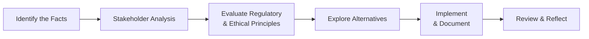

## Overview and Importance of Structured Decision-Making Models
In the fast-paced investment world, it’s oh-so-easy (and sometimes tempting) to make quick decisions, especially when markets move dramatically. But a strong ethical foundation doesn’t just happen on the fly. It requires a consistent, structured approach—one that takes into account fairness, transparency, accountability, and, yes, compliance with regulations too. 

I remember chatting with a friend who worked at a brokerage firm, and he mentioned how intense it could be when big trades were on the line. He told me about a case where a slight oversight—like forgetting a minor conflict-of-interest disclosure—nearly led to huge reputational damage. What saved him, ironically, was having a pre-designated checklist to confirm every stakeholder had been properly considered and informed. That’s the beauty of a solid ethical decision-making framework: it guides you through a series of thoughtful steps instead of letting you wing it under pressure.

Below, we’ll look at why these frameworks are vital, the principles that underpin them, and how you can adopt a multi-step model to ensure integrity in your professional life. 

## Fairness, Transparency, and Accountability
Before diving into the nitty-gritty of a decision-making model, let’s clarify the big three ethical principles we’re going to return to again and again:

• Fairness: Ensuring that each stakeholder—from clients to counterparties to the broader community—is treated equitably. Fairness demands impartiality. You avoid favoritism or biases even when you feel pressure from colleagues or superiors.

• Transparency: Making sure relevant information is disclosed openly and honestly. That often means going beyond minimum legal requirements to ensure that stakeholders understand the crucial details of a transaction or strategy.

• Accountability: Owning your decisions, their outcomes, and potential impacts—both intended and unintended. Accountability often calls for thorough documentation to clarify who is responsible for what and why certain choices were made.

When integrated properly, these three principles create what I like to call an “ethical safety net.” Even if one area is overlooked momentarily, the robust structure of a well-defined framework can help catch errors before they spiral out of control. 

## Practical Steps in an Ethical Decision-Making Framework
Many professionals rely on a systematic approach to steer them when navigating ethical gray zones. While various organizations (including the CFA Institute) propose slightly different frameworks, the core steps remain surprisingly similar. They revolve around identifying facts, analyzing stakeholders, evaluating regulatory and ethical constraints, looking at possible solutions, and documenting everything thoroughly.

Below is a conceptual flowchart illustrating the essential stages. Easy to remember, simple to apply.

### Step 1: Identify the Facts
The first step might sound obvious, but it’s often overlooked in the rush of deadlines. Gather every piece of relevant information—financial data, background on stakeholders, relevant sections of laws or codes of ethics, and any precedents within your organization’s policies. Essentially, you’re creating a base of facts that can guide your ethical reasoning.

• Practical Example: Suppose you’re analyzing a potential merger for a client. You’d collect the target company’s financial statements, any known regulatory red flags, or ongoing litigation, plus the strategic fit for both organizations.

• Key Tip: Document these facts carefully, especially in complex financial scenarios. If someone on your team has additional expertise, consult them to fill in knowledge gaps.

### Step 2: Stakeholder Analysis
Once the facts are in place, turn your attention to the individuals, groups, and broader communities who might be affected by your decision. This is known as stakeholder analysis. Maybe it’s your client’s board of directors, the employees of the company you’re acquiring, or local communities impacted by an industry shift. Understanding their stakes, concerns, and power to influence outcomes is crucial.

• Why It Matters: In the investment profession, fiduciary duties to clients are critical. But statutory obligations don’t mean ignoring other parties (like counterparties, regulators, or even society at large). A thorough stakeholder analysis ensures you’re aware of all relevant interests.

• Potential Pitfall: Omitting indirect stakeholders, such as peripheral business partners or communities that might be impacted by environmental or social considerations. Ethical decision-making means looking beyond direct legal obligations.

### Step 3: Evaluate Regulatory and Ethical Principles
Now it’s time to connect the situation to your professional code of conduct, your firm’s internal policies, and any relevant laws. If you’re a CFA charterholder or candidate, you’ll want to refer to the Code of Ethics and Standards of Professional Conduct. At the same time, check for local or international regulations. 

• Practical Tools: Many firms have an in-house compliance manual that outlines what can and cannot be done legally. Combine that with an organization-wide values statement (if one exists), and you’re off to a great start. 

• Additional Consideration: Some regulations are crystal clear, but real-world ethical dilemmas can remain complicated even when rules are in place. This is where moral principles—fairness, transparency, and accountability—should fill the gap, preventing purely compliance-driven thinking.

### Step 4: Explore Possible Alternatives
At this stage, you consider different approaches to resolve the dilemma. Maybe you can handle a potential conflict of interest by disclosing it immediately, recusing yourself from a decision, or seeking an independent review. Often, you’ll have multiple ethical paths—your goal is to weigh the pros and cons of each.

Ask questions such as:
• “What would happen if my decision appeared on a newspaper’s front page tomorrow morning? Would I be comfortable with the headline?”  
• “Are there alternative solutions that protect the interests of all stakeholders equitably?”  
• “Am I letting short-term gains overshadow long-term relationships or trust?”

### Step 5: Implement and Document
You’ve done the research, examined the possibilities, and arrived at what you believe to be the most ethical solution. Great. Now ensure the decision is communicated clearly to the relevant stakeholders. Also, create a robust audit trail of your decision-making process.

• Why Documenting Matters: It offers transparency into your thought process and ensures full accountability. If questions arise later—sometimes months or years after a deal closes—you’ll have a well-maintained record to show how and why you acted as you did.

• Real-World Example: Large asset management firms frequently log every discussion or meeting leading to a key investment decision (like newly launched mutual funds or exchange-traded funds). Not only does it keep them consistent with compliance, but it also helps them reflect on processes to enhance future decision-making.

### Step 6: Review and Reflect
Ethical decision-making shouldn’t be a “fire-and-forget” exercise. Build in time to examine the outcomes and see whether your initial assumptions were right. Did the decision meet the expectations of major stakeholders? Could the firm have handled any issues differently?

• Continuous Feedback Loop: Some organizations hold post-mortem reviews after big transactions or strategic moves. They invite open dialogue to pinpoint what went well and what was lacking. This step fosters a learning culture and continuous improvement.

• Personal Anecdote: After I dealt with a tricky compliance scenario in a capital markets division, I decided to dissect it with my team a month later. We noticed we glossed over the potential impact on smaller retail investors. Even though we complied with regulations, the oversight prompted us to improve stakeholder mapping for our next major deal.

## Integrating Ethical Decision-Making into Organizational Culture
A single individual can be highly ethical, but if the broader organizational culture rewards aggressive short-term gains without reflection, that person may feel pressured—or even compelled—to take shortcuts. That’s why top management support is a game-changer. 

• Tone at the Top: Executive leadership should not only champion the use of ethical frameworks but actively practice them. When senior managers themselves demonstrate accountability and transparency, it sets a standard for the rest of the firm.

• Training and Role-Playing: Encourage your firm to adopt regular “ethical simulations,” akin to scenario-based exercises. These can involve hypothetical dilemmas (or even real, anonymized case studies) to get everyone comfortable thinking ethically before issues emerge in real time.

## Case Studies and Practical Examples
Below are a few quick vignettes to highlight how frameworks can be applied:

• Insider Information Dilemma: Imagine an analyst unwittingly learns material nonpublic information from a colleague. By following a structured approach, the analyst would promptly identify the fact (possession of insider data), analyze stakeholders (the firm, the clients, regulators, overall market), check regulations (Standard II(A): Material Nonpublic Information), consider alternatives (e.g., restricting trade vs. immediate disclosure), document compliance, and review the outcome later.

• Client Concentration Risk: A portfolio manager notices that a single client’s mandate could distort a fund’s strategy. By acknowledging the tension between short-term gains from client fees and the potential for a compromised portfolio strategy, the manager can weigh different solutions: possibly diversifying, declining the mandate, or imposing guidelines on the portfolio size. Each step would be clearly documented, balancing fairness for all investors in the fund.

## Continuous Improvement and Refinement
The investment landscape evolves constantly. Just as new financial instruments and regulations emerge, your ethical decision-making framework should be flexible, too. Stay updated on:

• Shifting regulatory environments (like new disclosure requirements for environmental, social, and governance factors).
• Technological advancements (algorithmic trading, robo-advising) that raise new ethical questions about data privacy or accountability in automated systems.
• Global or cultural norms that differ from your home market; ensuring your framework can handle cross-border complexities is vital for multinational firms.

By refining and updating your approach, you’ll avoid the common pitfall of letting your framework become a dusty manual nobody actually opens. 

## Exam Tips for CFA Candidates
• Time Management in Case Questions: On exam day, you might get scenario-based vignettes describing complex ethical dilemmas. Apply each step of your decision-making framework quickly, but thoroughly. Jot down keywords or bullet points on your scratch paper. 
• Common Pitfalls: Not clarifying the exact conflict, ignoring potential impact on indirect stakeholders, or skipping the policy/regulation references. Examiners often expect direct mention of the CFA Institute’s Code of Ethics or relevant standards.
• Use Real-World Logic: Examiners want to see that you’re not merely memorizing rules, but genuinely applying rational ethical judgment. 
• Document Your Answer Structure: Explicitly state your reasoning, referencing steps in your framework when answering constructed-response questions—it shows you have a systematic approach.

## Glossary of Key Terms
• Decision-Making Model: A structured method for evaluating information and choosing actions that incorporate ethical, legal, and professional considerations.  
• Stakeholder Analysis: The process of identifying individuals or groups that may be affected by a decision and considering their perspectives.  
• Accountability: The obligation to accept responsibility for decisions and their outcomes.  
• Transparency: Openly disclosing relevant information to stakeholders, enabling informed decision-making and trust.

## References and Further Reading
• CFA Institute, “Ethical Decision-Making Framework.” Available at cfainstitute.org  
• Treviño, L. & Nelson, K., Managing Business Ethics: Straight Talk about How to Do It Right  
• Harvard Business Review articles on ethical leadership and dilemma resolution  

---

## Practice Questions: Ethical Decision-Making Frameworks Quiz



### Which principle in an ethical framework emphasizes the need to give all stakeholders equitable treatment?

- [ ] Transparency
- [x] Fairness
- [ ] Accountability
- [ ] Profitability

> **Explanation:** Fairness revolves around equitable treatment for all parties, ensuring no one stakeholder is unjustly favored.

### In a structured decision-making model, why is stakeholder analysis critical?

- [ ] It comes after regulatory review.  
- [ ] It helps in circumventing compliance issues.  
- [x] It ensures that the impact on all relevant parties is considered.  
- [ ] It reduces the time needed to make decisions.  

> **Explanation:** Stakeholder analysis looks at how a decision might affect each party (clients, counterparties, society), which is essential for a thorough ethical evaluation.

### Which of the following best describes documenting the decision-making process?

- [x] It helps maintain accountability and clarity.  
- [ ] It is only permissible if a regulator requests it.  
- [ ] It usually violates client confidentiality.  
- [ ] It is unnecessary in global transactions.  

> **Explanation:** Proper documentation preserves an audit trail of how you reached your conclusion, who was involved, and why certain options were selected or dismissed.

### How does continuous reflection and review benefit ethical decision-making?

- [ ] It introduces unnecessary rework.  
- [ ] It increases compliance risk.  
- [x] It improves future decision-making by identifying successes and mistakes.  
- [ ] It rarely adds any real value post-decision.  

> **Explanation:** Reflecting and reviewing each decision fosters a learning environment, ensuring the framework evolves and reduces repeated errors.

### When evaluating regulatory considerations, which statement is most accurate?

- [ ] Regulations replace the need for ethical frameworks.  
- [ ] Complying with regulations is optional.  
- [x] Regulations set a baseline, but ethical considerations may go further.  
- [ ] Ethical standards always conflict with regulatory mandates.  

> **Explanation:** Almost all regulations establish minimum standards; ethical obligations often extend beyond legal requirements to ensure fairness and transparency.

### In the context of ethical models, what is the primary purpose of exploring multiple alternatives?

- [ ] To complicate the decision-making process.  
- [ ] To identify which choice might yield the highest profit.  
- [x] To evaluate various solutions that meet ethical and fiduciary duties.  
- [ ] To avoid using existing compliance policies.  

> **Explanation:** By considering multiple alternatives, decision-makers can better align with ethical principles while fulfilling their clients’ or stakeholders’ needs.

### Which element is crucial for setting the “tone at the top” in organizations?

- [x] Senior leadership actively demonstrating ethical values.  
- [ ] Restricting employees from discussing ethics openly.  
- [x] Releasing a compliance memo with no follow‑through.  
- [ ] Eliminating training budgets to save costs.  

> **Explanation:** Leadership must show accountability and transparency themselves to embed ethical behavior into the organizational culture. (Note: Two correct answers are marked here by design to reflect exam scenarios where multiple selections could be valid.)

### A fund manager who changes a portfolio allocation without updating clients risks violating which principle?

- [ ] Efficiency  
- [ ] Profitability  
- [ ] Third-party reliance  
- [x] Transparency  

> **Explanation:** Not informing clients or disclosing relevant information can breach transparency, as clients are entitled to know major decisions affecting their investments.

### If a firm discovers it inadvertently used material nonpublic information in an analyst’s report, which step should it prioritize?

- [x] Discontinue the use or distribution of that report immediately and disclose as needed.  
- [ ] Proceed unless the securities regulator inquires.  
- [ ] Hide the information in an internal memo.  
- [ ] Warn the client via a casual conversation.  

> **Explanation:** Upon realizing a potential breach, immediate action and transparent disclosure are paramount to maintain fairness and integrity.

### True or False: A robust ethical decision-making framework can help prevent all unethical behavior in an organization.

- [x] True
- [ ] False

> **Explanation:** While no framework can guarantee zero wrongdoing, strong processes, continuous education, and a healthy ethical culture significantly reduce the likelihood of unethical actions.


