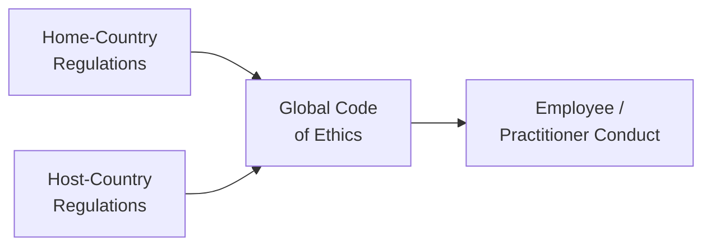

## Introduction

Have you ever sat in a conference room—perhaps an investment firm’s boardroom—where half the people dialed in from New York, a few from London, and one from Singapore? And everyone’s discussing the same project but seems to speak a slightly different “ethical language”? That, in a nutshell, is the tension we often face in today’s globalized investment profession. Globalization has expanded our reach but also multiplied the ethical angles we need to keep track of—angles shaped by local customs, regulations, and cultural values.

Trust me, trying to navigate, for instance, data privacy laws in the EU while also respecting free-market norms in the U.S. can be mind-boggling. In this section, we’ll dive into how globalization intensifies the complexity of ethical behavior in finance, why reconciling cross-border dilemmas can be so challenging, and how professionals can anchor themselves in universal ethical standards without disregarding local cultural norms.

## Complexity of Cultural and Regulatory Overlaps

We all know that trust and transparency are cornerstones of ethical investment practices. But toss in multiple countries’ regulations, or the nuanced beliefs of different cultural contexts, and you’ve got a recipe for potential ethical conflicts. A practice considered respectful in one region may be perceived as borderline unethical somewhere else. 

Global transactions and cross-border investments have soared in recent years, making it more common to see investment activities that stretch across multiple jurisdictions. For instance, when a fund manager in Hong Kong tries to comply with the Monetary Authority’s guidelines while still respecting the SEC’s rules for clients/segments in the U.S., there can be friction about where legal obligations and moral principles intersect. 

One practical example is gift-giving. In some cultures, small “tokens of appreciation” are an integral part of relationship-building, while in other cultures, that same action can be viewed as a bribe. You can imagine the headache this difference creates for multinational firms that want to uphold a consistent internal code of ethics.

## Cultural Relativism vs. Universal Ethical Principles

You might have heard of “cultural relativism,” which basically suggests that what’s “right” or “wrong” depends largely on the specific context of a given society. A gift might just be a sweet, innocuous gesture in Country A, but in Country B, it might cross the line legally or ethically. Meanwhile, universalists argue that certain ethical principles hold true everywhere—like honesty or non-exploitation—regardless of local custom.

From an investment profession standpoint, the question becomes, can a firm impose a single unified global code of conduct on employees scattered across 50 countries? Or should local branches adapt to cultural norms, even if those norms might conflict with the organization’s home-country standards? This dance between local adaptation and global consistency is a core challenge we’ll keep coming back to.

## Reconciling Home-Country vs. Host-Country Regulations

If you’ve ever set up shop in multiple countries, you probably know the legal labyrinth that goes along with it. Home-country laws might demand one set of disclosures, while a host country’s regulations mandate a slightly different approach, delaying reporting or requiring extra precautions. In the investment industry, these differences can manifest in:

• Disclosure requirements: Some jurisdictions require ultra-detailed disclosure about fees, conflicts of interest, and compensation. Others might allow more streamlined reporting.  
• Insider trading rules: The definitions of “insider,” “material nonpublic information,” and “beneficial ownership” can vary.  
• Client data protection: The European Union’s General Data Protection Regulation (GDPR) imposes strict privacy obligations, whereas other regions may have more lenient standards.

When these variations clash, the question arises: whose rules take precedence? And how do you remain ethical if host-country regulations contradict your usual home-country code? The best approach involves building a robust decision-making framework that defers to the highest (most stringent) standard of integrity, effectively setting a “race to the top” for ethical conduct.

Nothing is more frustrating—speaking from personal experience—than setting up a compliance program that meets strict U.S. guidelines only to find out it doesn’t fully satisfy operational regulations in Asia. But that’s precisely why a flexible yet coherent code of ethics matters.

## Global Code of Conduct and the Balancing Act

A solid Global Code of Conduct can act like an internal compass for multinational firms. This code:

• Establishes broad foundational principles (e.g., honesty, transparency, fairness) that are expected to be upheld everywhere.  
• Leaves room for cultural nuances—like special regional traditions—so long as they don’t break the fundamental standards.  
• Clarifies what is acceptable regarding gifts, entertainment, and business transactions.  
• Addresses how to resolve conflicts between local and global norms.

Picture the Global Code of Conduct as a “big tent.” It shelters all employees under overarching ethics while letting them perform local adjustments within the tent’s boundaries. Many large firms have an umbrella code, and then they create region-specific playbooks that detail how to interpret or adapt the code for that particular country. 

Have a look at this simple diagram describing how different regulations fold into one global code:

In this chart, both home-country and host-country regulations funnel into the firm’s overall code, guiding the conduct of each employee to ensure consistency despite cross-border complexities.

## The Role of Global Professional Associations

Professional associations (like the CFA Institute) step in to provide structure and oversight that reach beyond local legal norms. These organizations develop ethical codes and best practices intended to be universal. The Standards of Professional Conduct, for instance, aim to unify expectations so that a CFA® charterholder in Japan upholds the same professional integrity as one in Canada or France.

Thus, global associations can serve as a “tie-breaker” when local ethical perspectives vary. When in doubt, the professional standard from a globally recognized institution often becomes the reference point. This approach might limit the influence of cultural relativism and maintain a relatively stable baseline of professional conduct. 

## Technology, Data Security, and Cross-Border Transactions

Technology has supercharged globalization. We no longer physically cross borders to manage international transactions. It’s as simple as a few clicks—transferring funds, investing, or trading in markets scattered around the world. But that also means you can quickly blur the lines of which jurisdiction’s rules you must follow.

Over the last decade, countless data breaches and privacy incidents have driven home the point that data protection is an ethical (and legal) necessity. Firms that manage international portfolios must remain vigilant regarding rules like GDPR in the EU, the California Consumer Privacy Act (CCPA) in the U.S., or the Personal Data Protection Act (PDPA) in Singapore. Each regulation has unique data processing standards, forced disclosures, and consumer rights, and messing up can cause big reputational damage.

Remember, one compliance slip in the digital space can ruin your credibility with global clients. It’s not just about avoiding legal penalties (though that can be harsh), but also demonstrating to investors that your firm is conscientious and trustworthy in safeguarding sensitive client data.

## Real-World Challenges: Cross-Border Mergers, Supply Chains, and More

Let’s consider a hypothetical scenario: a cross-border merger between “ABC Asset Management,” headquartered in New York, and “XYZ Global Holdings,” based in Dubai. Now, ABC must learn to navigate Middle Eastern norms around gift exchanges and relationship-building, which might come across differently than typical U.S. business practices. Meanwhile, the combined entity must ensure its marketing materials comply with U.S. securities law, while local authorities in Dubai might have slightly different advertising guidelines.

Or think about multinational supply chains. You might invest in a company that sources raw materials from multiple emerging markets. If local regulations in one of those emerging markets don’t fully protect labor rights or the environment, do you as the investor need to impose your own set of stricter standards? Many stakeholders say yes—it’s part of a broader commitment to corporate social responsibility and ethical investing. Others might say no, as long as you’re not violating local law. That tension underscores why it’s important for global investment professionals to adopt high-level ethical frameworks beyond the minimum of local regulations.

## Strategies for Navigating Ethical Dilemmas in a Global Context

So how do we put all these moving parts together? Here are some tried-and-true strategies:

• Adopt the Highest Standard – When in doubt, evaluate the relevant regulations and your internal code and adhere to the most demanding ethical standard.  
• Use a Decision-Making Framework – If you recall from Section 1.6 “Ethical Decision‑Making Frameworks,” create a step-by-step model to weigh principles, stakeholders, legal elements, and so forth.  
• Engage in Local Learning – Offer cultural awareness training to employees. Sometimes, simply understanding why local customs differ can help you avoid misinterpretations.  
• Encourage Open Communication – Foster an environment where local offices feel comfortable flagging concerns about ethical gray areas.  
• Leverage Professional Organizations – Seek guidance from resources like the CFA Institute or other reputable global bodies that publish guidelines or white papers addressing cross-border ethical dilemmas.

## Informal Anecdote: My Short Adventure in Southeast Asia

A few years ago, I was temporarily leading a small advisory team in Southeast Asia. We were wooing a local conglomerate to manage their pension fund. During negotiations, the CEO invited us to a lavish dinner at a fancy hotel. In Western offices, this might trigger talk of “excessive entertainment” or conflict-of-interest concerns. Yet, in that local culture, it was a standard business courtesy—no strings attached. To ensure compliance, I double-checked our global code, talked with local colleagues, and concluded that openly accepting the invitation (within reason) was acceptable as long as we documented it properly. That balanced approach kept us aligned with the essential principles while respecting local norms. And, hey, the local delicacies weren’t half bad either!

## Pitfalls and Best Practices

Pitfalls arise when managers ignore red flags or skip cross-cultural training. If there’s no uniform approach to gift or entertainment limits, your overseas office might inadvertently cross an ethical line. Another major pitfall is failing to coordinate compliance efforts across different offices, which can easily lead to inconsistent disclosures or, worse, legal violations in some markets.

A good practice is to design scenario-based training—for instance, specific exercises that revolve around potential bribery in one market or less-common data confidentiality scenarios in another. By systematically walking employees through realistic examples, you solidify the company’s stance on ethical issues around the globe.

## Conclusion

Globalization has undeniably blurred the lines between what were once neatly separated local markets. And that’s great when it comes to expanding investment opportunities and diversifying client bases—but it also multiplies the complexity of ethical decision-making. The reality is, if you’re operating in multiple countries, you’re going to run into conflicting cultural and regulatory expectations at some point. 

The best defense is a well-constructed global code of conduct that balances respect for local traditions with universal ethical principles, supplemented by strong compliance frameworks. Don’t forget to lean on international standards from reputable organizations like the CFA Institute, and never underestimate how quickly technology can complicate cross-border compliance. If your team stays flexible, informed, and anchored in core ethical values, you’ll have a roadmap to navigate the trickiest global terrain.

## Glossary

• Cultural Relativism: The idea that ethical practices vary among cultures and no universal standard of ethics can be imposed.  
• Global Code of Conduct: A unified set of ethical guidelines ensuring consistent standards of behavior across international operations.  
• Cross-Border Transactions: Financial dealings or investments that involve entities located in different countries.  
• Professional Associations: Organizations that establish ethical and professional standards within a given profession, offering certifications and guidelines (e.g., CFA Institute).

## References and Further Reading

• Hofstede, G., “Culture’s Consequences: International Differences in Work-Related Values.”  
• CFA Institute’s Global Passport Program for members across various regions.  
• World Economic Forum reports on cross-border finance and responsible business conduct.  

---

## The Influence of Globalization on Ethical Perspectives: Practice Questions



### 1. Which of the following best describes a challenge faced by firms operating in multiple jurisdictions?

- [ ] Insolvency laws are uniform across jurisdictions, simplifying bankruptcy procedures.  
- [x] Different host-country rules can conflict with home-country regulations or diverge from universal ethical standards.  
- [ ] Technology eliminates the need for separate local compliance offices.  
- [ ] Global professional associations offer no guidance on cross-border ethical dilemmas.  

> **Explanation:** Firms face different regulatory and cultural landscapes in each jurisdiction. These variations often necessitate carefully designed global codes of conduct to consistently manage ethical standards.

---

### 2. Which concept suggests that the morality of an action depends largely on the social norms of a particular culture?

- [ ] Universal Ethical Principle  
- [x] Cultural Relativism  
- [ ] Regulatory Harmonization  
- [ ] Non-Disclosure Agreement  

> **Explanation:** Cultural relativism holds that local cultural norms determine whether something is considered ethical or unethical.

---

### 3. A Global Code of Conduct within a multinational investment firm should do which of the following?

- [x] Establish core principles like honesty and transparency, while allowing for local interpretations.  
- [ ] Serve only as a marketing tool, with no bearing on actual behaviors.  
- [ ] Strictly mandate identical rules in every location without regard to cultural context.  
- [ ] Replace all local regulations.  

> **Explanation:** A well-crafted Global Code of Conduct offers broad standards of integrity but leaves room for responsible adaptation across different jurisdictions.

---

### 4. In reconciling conflicts between home-country rules and host-country norms, a recommended strategy is:

- [x] Adopt the higher standard of ethical conduct when in doubt.  
- [ ] Always prioritize host-country regulations to avoid legal complications.  
- [ ] Eliminate all local nuances in favor of a single worldwide approach.  
- [ ] Defer to the least stringent requirement to reduce compliance costs.  

> **Explanation:** When local and global norms clash, adopting the stricter ethical or regulatory standard helps ensure integrity and consistency in professional conduct.

---

### 5. Which phenomenon most significantly contributes to increasing cross-border transactions?

- [ ] Reluctance of firms to expand abroad  
- [ ] Decreased access to technology  
- [x] Advances in digital trading platforms and communication technologies  
- [ ] Strict local policies discouraging foreign investment  

> **Explanation:** Technology, especially digital platforms and rapid communications, accelerates cross-border transactions by simplifying global reach.

---

### 6. Professional associations like the CFA Institute can help global investment firms by:

- [x] Providing universal ethical guidelines that unify standards in diverse locales.  
- [ ] Neglecting to address cultural differences in global markets.  
- [ ] Only focusing on home-country regulations.  
- [ ] Punishing professionals for following local standards.  

> **Explanation:** Organizations like the CFA Institute create broadly accepted ethical frameworks that guide practitioners worldwide, bridging local variations in ethics and regulations.

---

### 7. What is the best way to handle gift-giving in cultures where it is customary to provide significant gifts?

- [x] Consult the firm’s Global Code of Conduct, set clear value thresholds, and document instances of gift-giving.  
- [ ] Accept or give gifts without any disclosure, since it’s culturally expected.  
- [x] Provide local employees with zero autonomy to interpret cultural norms regarding gifts.  
- [ ] Automatically refuse all gifts regardless of context.  

> **Explanation:** Navigating cultural differences around gift-giving requires awareness, clearly defined policy guidelines, and proper documentation to ensure transparency and consistency.

*(Note: Two options are correct in this question, reflecting nuance around setting thresholds and acknowledging local employees’ ability to interpret cultural norms within guidelines.)*

---

### 8. Which of the following is a pitfall if local offices are not trained on cross-border ethical expectations?

- [x] Inconsistent disclosures across different markets.  
- [ ] Better alignment of goals among various branches.  
- [ ] Improved compliance with global regulations.  
- [ ] Automatic immunity from local legal requirements.  

> **Explanation:** Failing to train local offices opens the door to inconsistent or incorrect compliance practices, jeopardizing global ethical standards.

---

### 9. In the context of data privacy and technology, which statement is most accurate?

- [x] A data breach in a single location can have reputational consequences for the entire global firm.  
- [ ] Different jurisdictions rarely have different privacy standards.  
- [ ] Technology automatically prevents exposure of customer data.  
- [ ] Compliance with home-country data regulations is sufficient everywhere else.  

> **Explanation:** With the interconnected nature of data systems, a breach in one office can damage trust at a global scale, necessitating robust and unified data protection efforts.

---

### 10. True or False: Cultural Relativism means that a global firm should ignore universal ethical principles in favor of local norms.

- [x] True  
- [ ] False  

> **Explanation:** Cultural relativism states that ethical judgments must be understood within local cultural contexts. However, multinational firms usually balance local norms with foundational universal ethics set out by their own global code or professional associations.


