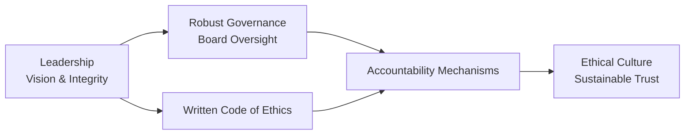

## Introduction
Ethical leadership matters—especially in finance, where decisions can ripple out to millions of stakeholders. You’ve probably seen how a single unethical move by a high-level executive can devastate market sentiment, ruin trust, and damage reputations. But ethical leadership is about more than just avoiding scandals. By modeling integrity, leaders in finance inspire teams to deliver consistent value, build lasting client relationships, and set up the entire organization for sustainable success.

In this section, we’ll explore three foundational leadership theories—Transformational, Servant, and Authentic—tailored to the finance world. Um, think of these styles like different approaches a fund manager might take when guiding analysts, traders, or entire departments. Each leadership style influences how teams think about ethics, risk, and long-term client well-being. We’ll also delve into how strong governance structures and accountability mechanisms can reinforce these leadership models, preventing a culture of short-termism. We’ll share some personal anecdotes, real-world scenarios, and a few tips for integrating ethical leadership into everyday financial practice.

## The Need for Ethical Leadership in Finance
Finance professionals handle sensitive information and are entrusted with safeguarding capital on behalf of clients, institutions, and broader society. Well, that’s a huge responsibility. The complexity of global markets and the potential for moral hazards—like hidden conflicts of interest—create a strong need for leaders who can consistently navigate ethical gray areas. Ethical leadership fosters trust, which is like the oxygen in capital markets. Without trust, markets stall, transactions become more expensive, and everyone loses.

### Key Benefits of Ethical Leadership
• Retention of high-caliber staff who want to be part of an organization they respect.  
• Reduced reputational risk and regulatory scrutiny.  
• Enhanced client retention and improved inflows, as clients value transparent and responsible partners.  
• Improved decision-making through open communication and accountability.

## Transformational Leadership
Transformational Leadership centers on inspiring team members through a shared vision, motivation, and role-modeling of ethical behavior. This leadership theory, popularized by scholars like James MacGregor Burns and Bernard Bass, is about going beyond transactional give-and-take. Instead, the leader sets a standard of integrity and vision that encourages followers to transcend self-interest for a bigger purpose.

### Core Attributes
• Inspirational Motivation: Leaders articulate a compelling vision that appeals to the values and hopes of team members.  
• Intellectual Stimulation: Leaders push for creative problem-solving, questioning assumptions, and exploring new structures or product lines responsibly.  
• Individualized Consideration: Leaders tailor support to each employee’s needs, encouraging development and growth.  
• Idealized Influence: Leaders set high ethical standards, acting consistently even when no one’s watching.

### Why It Works in Finance
In finance, markets change quickly. Transformational leaders inspire employees to adapt, innovate, and remain ethical even under intense pressure (like meeting short-term trading quotas or delivering alpha in a challenging market). For instance, a portfolio manager might challenge her team to develop a socially responsible investment strategy that aligns with a firm’s core ethics—inviting fresh ideas and championing compliance with relevant regulations. By promoting a collective sense of responsibility, the team is more likely to maintain ethical guardrails, benefitting both investors and the broader community.

## Servant Leadership
Servant Leadership, a term popularized by Robert K. Greenleaf, flips the traditional hierarchy on its head by prioritizing the needs of followers, clients, and other stakeholders. It might seem counterintuitive at first. Aren’t leaders supposed to command from above? But in a finance setting, being a servant leader can actually bolster client loyalty, empower teams, and create a balanced focus on people over profit.

### Core Principles
• Empathy: Recognizing and addressing the concerns of team members and clients.  
• Stewardship: Viewing organizational resources and relationships as trusts to be cultivated, not exploited.  
• Community Building: Encouraging collaboration and establishing an environment where everyone’s voice is valued.  
• Foresight: Anticipating future consequences of today’s decisions to protect stakeholders and maintain ethical standing.

### Case in Point
Imagine you’re at a wealth management firm where senior leaders take the time to understand client concerns directly—like educational costs or philanthropic goals—rather than strictly focusing on commission-based products. By listening first and creating investment roadmaps aligned with client values, servant leadership ensures that fiduciary responsibilities come before personal or firm gain. It’s not just about avoiding regulatory issues; it’s about forging genuine partnerships that can withstand market turbulence and economic shifts.

## Authentic Leadership
Authentic Leadership emphasizes self-awareness, transparent communication, and a consistent moral compass. Leaders who are authentic speak truthfully about both triumphs and setbacks, articulate their values openly, and walk the talk in ethical matters. This openness fosters an environment where employees feel safe raising concerns and discussing ethical dilemmas.

### Pillars of Authentic Leadership
• Self-Awareness: Understanding one’s strengths, weaknesses, and ethical boundaries.  
• Relational Transparency: Communicating honestly, even when the news is uncomfortable.  
• Balanced Processing: Objectively analyzing information and considering multiple viewpoints.  
• Internalized Moral Perspective: Relying on personal ethical standards rather than external pressures.

### Building Trust
Picture a forensic accountant at an asset management firm who consistently reports potential irregularities, even if it might lead to uncomfortable internal audits. By being upfront about possible compliance risks, this leader sets an example and encourages staff to follow suit whenever they spot unethical behavior. Over time, the team recognizes that honest communication is rewarded, not punished, making the group more cohesive, resilient, and trusted by clients.

## Organizational Structure and Governance
Regardless of leadership style, the broader organizational structure can either reinforce or undermine ethical behavior. If checks and balances are weak or if siloed departments discourage collaboration, even the most ethical leaders may struggle to set and maintain a standard. Conversely, robust governance frameworks support ethical leadership by embedding accountability in everyday practices.

### Components of Rigorous Governance
• Board Oversight: An independent board willing to question management decisions and ensure alignment with client well-being.  
• Written Code of Ethics: Clear guidelines that reflect core values and compliance standards, covering conflicts of interest, insider trading, and client confidentiality.  
• Transparent Auditing Procedures: External and internal audits that verify adherence to policies and regulations.  
• Escalation Mechanisms: Clear paths for reporting unethical behavior without fear of retaliation.

Below is a simple mermaid diagram illustrating how checks and balances can align with leadership to create ethical resilience:

In this diagram, ethical leaders set the tone for integrity, robust governance adds structural support, and accountability systems ensure consistent follow-through. The result is an ethical culture that fosters trust and durability in volatile financial markets.

## Tools for Assessing Ethical Leadership
Leaders in finance can harness a variety of tools and metrics to measure how effectively they’re driving ethical conduct.

• 360-Degree Feedback: Gather input from subordinates, peers, and superiors to identify behavioral patterns—both good and bad.  
• Client Satisfaction Metrics: Evaluate whether clients perceive leadership decisions as transparent, beneficial, and fair.  
• Management Self-Assessments: Encourage personal reflection on ethical lapses and ways to improve.  
• External Audits & Third-Party Assessments: Independent reviews from legal or consulting firms can highlight areas for growth—particularly around compliance and risk management.

Well, these assessments aren’t about punishing mistakes but rather identifying opportunities to recalibrate leadership practices to maintain trust.

## Real-World Scenarios and Anecdotes
I once worked with a team led by a portfolio manager who always insisted on taking the top-paying deals—no matter the risk—and pushing them onto clients. You know how this ends: eventually, the short-term gains dried up, reputations got battered, and morale sank. That’s when a new leader (with a more servant-minded approach) stepped in. He began each client review meeting by asking, “What do we think our clients would want from us right now?” Instead of “How can we maximize fees?” This small shift reshaped the entire team’s mindset, rebuilding trust from the ground up.

In another firm, a chief investment officer (CIO) championed the idea of Transformational Leadership by launching an “Innovation Sprint.” Each division was encouraged to design solutions for more transparent and socially responsible investing. Suddenly, even junior analysts were brainstorming new ways to reduce the carbon footprint of client portfolios. The CIO’s approach ignited a sense of ownership and ethical accountability that persisted long after the sprint ended.

## Best Practices for Ethical Leadership
• Practice “Open-Door Ethics”: Encourage employees to raise concerns. No question is too small or taboo if it maintains a client-first approach.  
• Communicate Values Consistently: Regularly reiterate the firm’s ethical standards through memos, team huddles, and performance reviews.  
• Reward Integrity: Recognize individuals who demonstrate ethical courage—like self-reporting errors or refusing to participate in questionable trades.  
• Align Incentives with Long-Term Results: Shift compensation structures to reward sustainable performance, thereby reducing the obsession with short-term gains.  
• Foster External Collaboration: Join industry groups or regulatory forums to share best practices around ethical finance, whether on ESG standards or GIPS compliance.

## Conclusion
Ethical leadership isn’t a one-size-fits-all concept. Transformational leaders inspire teams with a future-oriented, collective vision; servant leaders empower stakeholders by putting their needs first; and authentic leaders build trust through transparency and moral consistency. In finance, these theories take on an even greater importance, as daily decisions can affect entire economies, families, and communities. When combined with structured governance protocols, accountability mechanisms, and an unwavering commitment to client well-being, these leadership styles can form a powerful bulwark against ethical lapses.

Ultimately, it’s not about choosing one style or the other, but rather blending elements of each to shape a leadership approach that aligns with your organization’s core values. By consistently modeling ethical behavior—even during crises—you lay the groundwork for a culture that not only supports compliance but also genuinely invests in the long-term well-being of clients, employees, and society at large. That’s real leadership in finance.

## Glossary
• Transformational Leadership: A leadership style that inspires followers to exceed expectations through motivation, shared vision, and ethical role-modeling.  
• Servant Leadership: An approach focusing on meeting the needs of team members and stakeholders first, emphasizing empathy, stewardship, and community building.  
• Authentic Leadership: A leadership model built on self-awareness, transparency, and ethical correctness, encouraging trust and engagement among followers.  
• Ethical Resilience: The capacity of an individual or organization to consistently act with integrity despite pressures or ethical challenges.  
• Governance Procedures: Policies and mechanisms that direct and control an organization’s operations and ethical responsibilities.  
• Accountability Mechanisms: Tools or processes that hold individuals or groups responsible for their actions and outcomes.

## References and Suggested Readings
• Northouse, P. G. (2019). Leadership: Theory and Practice (8th ed.). SAGE Publications.  
• Yukl, G. (2013). Leadership in Organizations (8th ed.). Pearson Education.  
• CFA Institute’s Ethics and Standards Resources:  
  https://www.cfainstitute.org/ethics-standards  
• Goleman, D. (2004). “What Makes a Leader?” Harvard Business Review.

## Test Your Knowledge: Ethical Leadership in Finance



### Which leadership style primarily focuses on a compelling vision and motivating team members to think beyond their own self-interest?

- [ ] Servant Leadership
- [x] Transformational Leadership
- [ ] Authentic Leadership
- [ ] Transactional Leadership

> **Explanation:** Transformational Leadership relies on a shared vision, motivation, and role modeling of high ethical standards to encourage team members to reach beyond personal goals.

### In Servant Leadership, which principle emphasizes understanding and addressing concerns of team members and stakeholders?

- [ ] Idealized Influence
- [ ] Relational Transparency
- [x] Empathy
- [ ] Balanced Processing

> **Explanation:** Servant Leadership is all about placing the needs of others first, and empathy is central to that process.

### Which aspect of Authentic Leadership involves analyzing information objectively and considering multiple viewpoints?

- [ ] Inspirational Motivation
- [ ] Internalized Moral Perspective
- [x] Balanced Processing
- [ ] Stewardship

> **Explanation:** Balanced Processing is the Authentic Leadership principle where leaders evaluate information objectively, including dissenting opinions, before making decisions.

### How does robust governance help an organization maintain ethical leadership?

- [ ] By centralizing all decision-making with one C-level executive
- [x] By establishing checks and balances that promote accountability
- [ ] By focusing solely on maximizing financial returns
- [ ] By discouraging open communication and reporting structures

> **Explanation:** A strong governance framework provides structures like board oversight and written codes of ethics to reinforce ethical behavior and prevent misuse of power.

### Which feedback mechanism best enables finance professionals to receive input from subordinates, peers, and superiors?

- [ ] Standard Performance Appraisal
- [x] 360-Degree Feedback
- [ ] Client Satisfaction Metrics
- [ ] External Compliance Audits

> **Explanation:** 360-Degree Feedback gathers perspectives from multiple sources, providing a more holistic view of a finance professional’s leadership and ethical performance.

### In a Transformational Leadership context, how can “Intellectual Stimulation” manifest in a finance team?

- [x] Encouraging the team to question existing investment assumptions
- [ ] Issuing top-down orders for immediate compliance
- [ ] Focusing solely on short-term profit generation
- [ ] Prioritizing secrecy and minimal collaboration

> **Explanation:** Intellectual Stimulation involves challenging the status quo constructively, prompting team members to find innovative solutions and drive ethical best practices.

### Which leadership style best aligns with prioritizing client well-being and community impact over personal or firm profits?

- [ ] Transactional Leadership
- [x] Servant Leadership
- [ ] Laissez-Faire Leadership
- [ ] Autocratic Leadership

> **Explanation:** Servant Leadership is oriented around meeting the needs of others, such as clients and communities, before personal or organizational gain.

### Which of the following is NOT a core pillar of Authentic Leadership?

- [ ] Self-Awareness
- [ ] Relational Transparency
- [ ] Balanced Processing
- [x] Inspirational Motivation

> **Explanation:** Inspirational Motivation is more characteristic of Transformational Leadership, whereas Authentic Leadership focuses on transparency, self-awareness, balanced processing, and internalized moral standards.

### A financial leader who fosters trust by consistently aligning personal values with professional actions is exemplifying:

- [x] Authentic Leadership
- [ ] Transactional Leadership
- [ ] Transactional Analysis
- [ ] Idealized Influence

> **Explanation:** Authentic Leadership emphasizes an individual’s consistency between internal moral perspectives and outward behaviors, building trust via transparency and ethical fortitude.

### True or False: A culture focused on short-term profit maximization aligns seamlessly with Servant Leadership principles.

- [ ] True
- [x] False

> **Explanation:** Servant Leadership prioritizes the needs of stakeholders, sustainability, and ethical considerations, which often conflict with short-term profit-oriented decision-making.


