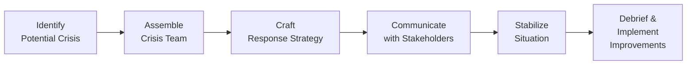

## Introduction

Crisis management, particularly in financial settings, is one of those things we hope never to use but absolutely need to have in place. Whether it’s a reputational issue—like public allegations of misconduct—or a more quantifiable trouble (a liquidity crunch, for instance), crises inevitably evoke a sense of urgency and potential risk to stakeholder trust. 

All right, so what complicates things in finance? We typically deal with intangible products and complex relationships, so if a financial institution or investment professional stumbles, the damage can be swift, expensive, and widespread. In this section, we’ll explore some fundamentals of crisis management—why it matters, how to prepare, and what it takes to rebuild trust if that trust is ever lost. I recall earlier in my career, a small asset management firm faced a regulatory investigation for questionable trading practices. The immediate chaos was real, but a clear emergency plan and transparent communication saved the day (well, mostly). 

Let’s dive into core principles like contingency planning, stress testing, and leadership coordination. We’ll also discuss how to handle a crisis in real time, the importance of accountability, and how to come out the other side stronger.

## Types of Crises in Finance

Crises in the financial world usually fall under a few big categories. It’s helpful to consider them now so you can prepare a proper response:

• Reputational Damage. This can happen if an executive or the firm is accused of unethical behavior—maybe insider trading, falsifying records, or simply creating hostile client relationships. Once your reputation faces a blow, it tends to stick.  
• Regulatory Investigation. For instance, you might have the SEC (in the U.S.), or another regulator in a different jurisdiction, investigating alleged misconduct. Related fines and legal costs can easily mount.  
• Liquidity Crises. This includes scenarios where market dislocations or runs on funds compromise the organization’s ability to meet short-term obligations.  
• Operational Disruption. Could be a serious technology failure, data breach, or even a physical disaster impacting day-to-day operations.  
• Market or Credit Crises. Prolonged economic downturns, credit rating downgrades, or general market collapses can ripple through an investment firm’s balance sheets and investor sentiment.  

The common thread in all these scenarios is that trust—between the firm, its stakeholders, its regulators, and the broader public—hinges on how swiftly and ethically the situation is managed.

## A Step-by-Step Framework for Crisis Management

Crisis management is rarely a one-size-fits-all activity, but certain steps are broadly applicable. Let’s walk through a practical flow:

### 1. Identify Potential Crisis  
Early detection is everything. Market disruptions, legal threats, or rumors circulating on social media can brew into full-blown catastrophes. Put monitoring systems in place—both formal (risk dashboards, compliance checks) and informal (internal “risk whispers”)—so that any red flags pop up quickly on management’s radar.  

### 2. Assemble the Crisis Team  
Once you spot trouble brewing, gather a dedicated crisis team. Typically, you want:  
• Senior leadership sponsor (CEO or CFO),  
• Compliance and legal counsel,  
• Risk management officers,  
• Public relations or communications experts,  
• Operational leads from relevant departments (e.g., trading, IT).  

These people collectively coordinate and execute the crisis response. Clear roles and responsibilities avoid confusion.  

### 3. Craft a Response Strategy  
Crisis strategies might involve public statements, investor updates, staff realignments, or immediate capital injections. The specifics depend on what type of crisis it is, but the underlying principle is to develop a consistent, fact-based approach. Decide quickly how to address short-term demands (e.g., paying out claims to disgruntled clients) without jeopardizing long-term health.  

### 4. Communicate with Stakeholders  
Communication can make or break your crisis response. Item one: honesty. Nothing erodes trust faster than sugarcoating or hiding the negative. In some jurisdictions, IFRS or US GAAP guidelines also determine how certain financial issues must be disclosed—a good reason to have your CFO and external auditors weigh in on the messaging. Proactively update regulators, clients, and employees on the situation’s scope and your plan to address it.  

### 5. Stabilize the Situation  
This may involve halting a problematic investment product, negotiating settlement deals, or swiftly raising liquidity. You might find that many measures—like seeking short-term lines of credit—are already in your contingency plan. The goal is to steady the ship so you have time for deeper structural corrections.  

### 6. Debrief and Implement Improvements  
The final step is a thorough debriefing. This is where you document what went wrong and figure out how to improve your processes. A thorough post-crisis analysis might lead to new or updated policies, staff training sessions, or changes in organizational structure. The objective is to prevent—or at least mitigate the effects of—similar crises in the future.

## The Role of Transparency and Accountability

Let’s be frank: finance is all about trust. If investors and clients don’t believe you’ll do the right thing, they’ll bail out—financially and emotionally. Transparency and accountability aren’t just lofty values but real strategic advantages:

• Transparency. Keep your stakeholders informed about the nature of the crisis. Don’t let them hear contradictory rumors through the grapevine—particularly in an era of lightning-fast social media.  
• Accountability. Accept responsibility where it’s due, even if it’s uncomfortable. If an error in compliance or internal oversight caused the problem, acknowledge it. Leadership sets the tone here—when top executives show accountability, the whole organization gets the message that it’s not about finger-pointing, but about solving the problem together.

## Contingency Planning and Scenario Analysis

Now, let’s talk about planning so that you’re not blindsided when trouble strikes.  

### Contingency Planning  
Contingency planning involves drafting potential “what-if” scenarios and building step-by-step responses. I remember working at a mid-tier bank where we had a “Pandemic Response Manual” (yes, well before 2020). Everyone thought it was almost silly—until it wasn’t. That manual ended up saving a lot of confusion when remote working arrangements became mandatory.  

### Stress Testing

Stress testing might feel technical (and it is). But it’s essentially about “shocking” your models with extreme scenarios: interest rate spikes, massive outflows, or a fundamental breakdown in your supply chain that stops the bread-and-butter operations. By running these tests, you expose weaknesses and plan for them:

| Scenario Type                      | Potential Impact                                              |
|-----------------------------------|---------------------------------------------------------------|
| Sharp Rate Increase               | Rising borrowing costs, liquidity strain, bond portfolio loss|
| Client Run on Deposits            | Liquidity crunch, forced asset sales                         |
| Credit Rating Downgrade           | Increased funding costs, reputational setback                |
| Regulatory Fine or Settlement     | Short-term outflow of capital, reputational damage           |
| Major IT System Failure           | Service disruption, compliance & data breach risk            |

Stress testing gives clarity about how adverse situations could unfold and helps you structure your risk buffers (capital reserves, diversified funding, etc.) in a disciplined way.

## Coordination Among Compliance, Legal, and Public Relations

If you’ve ever watched a crisis unfold in real time, you’ll know how hectic it can get. People from across the firm scurry around looking for immediate fixes, which could cause contradictory messages. That’s why:

• Compliance Officers ensure that actions taken during the crisis—like restricting certain trades or bridging capital positions—are fully in line with regulations.  
• Legal Counsel handles negotiations with regulators and other legal entities, providing guidance on disclosure requirements and potential legal ramifications.  
• Public Relations Teams shape your external narrative. They craft press releases, handle media inquiries, and help leaders prepare for interviews.  

It’s critical they all coordinate. Inconsistent messages will confuse stakeholders and can escalate the crisis further. Some large institutions even designate a single “spokesperson” to unify the voice.

## Post-Crisis Debriefing and Reintegration of Lessons

When the dust settles, the real work begins. Post-crisis debriefing is your chance to gather everyone involved—plus some participants not in the heat of the moment for objective perspective—and walk through questions like:

• “What triggered the crisis?”  
• “Which existing policies worked, and which failed?”  
• “Were there gaps in communication channels?”  
• “What can we do to prevent a repeat?”  

This informed reflection is crucial. You incorporate these insights into new policies, staff training, or organizational structures, effectively refining your risk culture. For instance, you might decide to implement an improved whistleblower hotline or adopt more rigorous compliance checks when launching new products.

## Conclusion

A financial crisis—be it reputational, operational, or regulatory—can feel like a whirlwind. However, it doesn’t have to be the end of the organization if you approach it ethically, strategically, and transparently. Leadership sets the tone with integrity and clear communication, while contingency plans and stress tests provide the structure to withstand or mitigate the worst of it.

Trust me, crises happen more often than we care to admit in finance. But as painful as they may be, they’re also opportunities to demonstrate strong leadership and build a better, more ethically grounded organization. 

## Glossary

• Crisis Management: The process of preparing for and responding to events that threaten an organization’s ongoing viability and stakeholder trust.  
• Contingency Planning: Developing predefined strategies and action plans to address potential crises effectively.  
• Stress Testing: A risk-management technique used to evaluate the impact of extreme financial or operational conditions on an organization.  
• Reputational Damage: Harm to an organization’s goodwill, trustworthiness, or credibility resulting from real or perceived wrongdoing.  
• Debriefing: A reflective process post-crisis to review what occurred, why it happened, and how to improve processes going forward.

## References, Suggested Readings, and Links

• Mitroff, I. I., & Anagnos, G. (2001). Managing Crises Before They Happen. AMACOM.  
• Augustine, N. R. (2000). “Managing the Crisis You Tried to Prevent.” Harvard Business Review.  
• CFA Institute Insight on Trust and Financial Services:  
  https://www.cfainstitute.org/research/financial-trust  
• Fink, S. (2013). Crisis Management: Planning for the Inevitable. iUniverse.  

-----

## Test Your Knowledge: Crisis Management and Rebuilding Trust



### Which of the following best describes why transparency is critical during a financial crisis?

- [x] It helps maintain stakeholder confidence and prevents rumors from spiraling out of control.
- [ ] It delays compliance requirements and eases liability concerns.
- [ ] It completely eliminates regulatory scrutiny.
- [ ] It offers a legal loophole for firms to avoid accountability.

> **Explanation:** Transparency allows stakeholders, including regulators and clients, to trust that the firm is handling the crisis honestly and effectively.

### Which of the following scenarios is most effectively addressed by contingency planning?

- [ ] A small, recurring IT system patch.
- [x] A sudden liquidity crisis triggered by mass withdrawals.
- [ ] A routine audit by financial regulators.
- [ ] A staff holiday scheduling conflict.

> **Explanation:** Contingency planning is specifically designed to handle unexpected, high-impact events like liquidity crises and major operational disruptions.

### In a crisis management team, which key role is chiefly responsible for shaping the external narrative and responding to media inquiries?

- [ ] Compliance Officer
- [ ] Legal Counsel
- [x] Public Relations Team
- [ ] Chief Technology Officer

> **Explanation:** Public Relations professionals are trained to communicate effectively with external audiences, ensuring consistency and clarity of the firm’s message.

### What is the primary purpose of conducting stress tests in investment or corporate contexts?

- [ ] To limit growth opportunities during stable market conditions.
- [ ] To identify new product lines that increase profitability.
- [ ] To reduce the organization’s marketing budget.
- [x] To evaluate how the firm performs under extreme adverse conditions and identify vulnerabilities.

> **Explanation:** Stress testing is a risk management tool that helps companies evaluate resilience under severe but plausible market and operational scenarios.

### Which attribute is commonly considered a cornerstone of ethical crisis resolution?

- [x] Accountability from leadership
- [ ] Reluctance to disclose relevant information
- [ ] Over-reliance on guesswork
- [x] Transparency regarding mistakes and remedial actions

> **Explanation:** Ethical crisis resolution demands both accountability and transparency. Leadership must own up to mistakes and clearly communicate steps to resolve the issue.

### During a crisis, inconsistent communication most likely leads to:

- [ ] Higher trust in leadership
- [x] Confused stakeholders and potential escalation of the crisis
- [ ] Additional resources for risk mitigation
- [ ] No substantial effects on client relationships

> **Explanation:** Mixed messages or contradictory statements can create uncertainty and panic among stakeholders, making the crisis even worse.

### Which of the following is the most advisable first step when a potential crisis is discovered?

- [ ] Directly informing only the CEO
- [ ] Concealing it until more information is known
- [x] Assembling the crisis management team promptly
- [ ] Freezing all trading activity without explanation

> **Explanation:** The immediate formation of a crisis team ensures swift, coordinated action and prevents the chaos of multiple, uncoordinated responses.

### In the post-crisis debrief, one major benefit is:

- [ ] It absolves top management of responsibility for the crisis.
- [x] It offers a structured way to learn from failures and implement better policies.
- [ ] It improves short-term revenue generation without addressing root issues.
- [ ] It allows staff to discard compliance guidelines.

> **Explanation:** Debriefing helps organizations learn and adapt, improving processes and minimizing risk of similar events in the future.

### Why might a finance firm integrate scenario analysis in its risk management framework?

- [ ] To project only optimistic outcomes and attract investors
- [ ] To reduce the cost of compliance software
- [x] To consider multiple potential market and operational shocks in advance
- [ ] To decrease staff training requirements

> **Explanation:** Scenario analysis prepares the firm for diverse potential outcomes, ensuring more robust resilience measures are in place.

### If senior executives publicly accept responsibility for a failure, this approach is generally considered:

- [x] True
- [ ] False

> **Explanation:** Accepting responsibility demonstrates accountability and often restores some measure of trust among stakeholders, showing that leadership is committed to ethical resolution.


