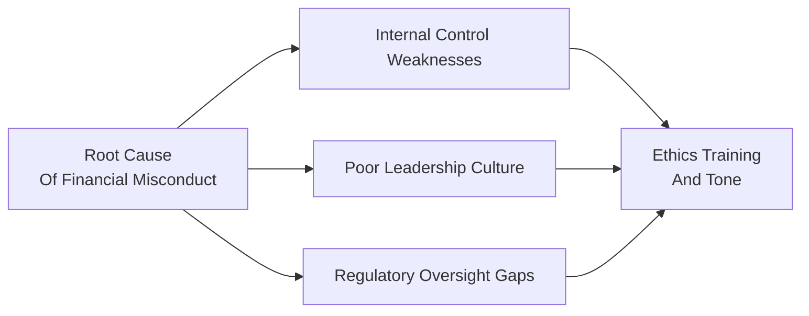

## Overview of Financial Misconduct Cases

Financial misconduct can strike at the heart of corporate trust—something we’ve seen throughout history with notable scandals sending shockwaves through the investment profession. Whether it's a high‑profile **Insider Trading** sting or the unearthing of an elaborate accounting fraud, these incidents spotlight what happens when professional standards, **Internal Controls**, and regulatory oversight fail. And, honestly, it’s unnerving. You think: “How did these massive firms with armies of brilliant people get it so wrong?” But as we’ll see, even the best and brightest can be led astray by flawed processes, toxic cultures, and inadequate checks and balances.

Below, we’ll break down landmark cases, examine the root causes of unethical behavior, and explore how these cautionary tales influence today’s **Compliance Framework**. By learning from these past events—and adopting the right controls and ethical leadership approaches—we can hopefully dodge similar landmines in the future. Because, let’s face it, retrieving your reputation is a tricky business once it’s in tatters.

## Classic Examples of Financial Misconduct

### Corporate Accounting Scandals

One of the biggest shocks of the early 2000s involved firms like Enron and WorldCom. These companies were once industry darlings—until their deceptive bookkeeping practices surfaced. For Enron, the core scandal involved creating special-purpose entities to hide enormous liabilities, artificially inflating profits, and misleading investors. WorldCom, on the other hand, capitalized routine expenses to overstate its assets and profits, further duping the marketplace.

The result? Executives faced criminal charges, thousands of employees lost jobs, shareholders saw their investments evaporate, and the entire audit profession endured a crisis of confidence. This has since reshaped corporate governance rules, stricter oversight, and a renewed emphasis on **Internal Controls**—all crucial elements we see enforced today under frameworks like the Sarbanes-Oxley Act (SOX) in the United States and parallel requirements globally.

### Insider Trading Convictions

Insider trading is basically the act of buying or selling a security by an individual who has **material nonpublic information**. A famous example is the Galleon Group scandal, where Raj Rajaratnam was convicted of insider trading by using privileged corporate information to score outsized returns. The scandal not only resulted in hefty fines and prison terms but also signaled more muscular enforcement by regulatory bodies.

Insider trading can be sneaky—it’s often carried out by small groups of individuals passing around tips in hushed tones over phone calls or texts. Once discovered, though, the **Reputational Risk** is massive. Jail time, banned from the securities industry for life, and massive fines? Not exactly the best way to protect your career or your firm’s brand. Today, compliance teams focus intensely on restricting the flow of privileged information and monitoring suspicious trades, a direct legacy of insider trading fiascos like Galleon.

### Ponzi Schemes and Fraudulent Investments

Ponzi schemes promise big returns with little or no risk to investors—sound too good to be true? It is. Bernie Madoff’s story stands out as a prime example of fraudulent investment management, where older investors were paid with the capital from newer investors. Eventually, the scheme collapsed under its own weight, leading to billions of dollars in losses. High-profile individuals, charities, and pension funds all fell victim, reminding us that not even seemingly prestigious sponsors are immune to unethical conduct.

The Madoff scandal was a wake-up call about the critical importance of independent audits, separation of asset management duties, and third-party verifications. Today’s requirement for custodians and depositaries to independently verify asset holdings in many jurisdictions was, in part, motivated by these events.

## Root Causes of Misconduct

### Flawed Internal Controls and Organizational Structure

When your organizational architecture prioritizes rapid growth without robust checks, it can create an environment where employees feel justified cutting corners or burying mistakes. Weak **Internal Controls**—like failure to segregate duties or having inadequate oversight committees—foster a culture where unethical behavior can hide in plain sight.

**Mermaid Diagram: Root Causes and Prevention**

In this simple flowchart, you can see that these factors—weak controls, poor leadership, and oversight gaps—all feed into the need for stronger ethics training and a top-down emphasis on compliance.

### Leadership Complacency and Toxic Culture

No matter how sophisticated your compliance manual is, if the top brass stops caring about integrity, you know trouble is ahead. Leadership sets the **tone at the top**, and if that tone says, “revenue at all costs” or “ignore the rules if you can get away with it,” employees might perceive unethical shortcuts as acceptable. Remember how Enron’s “rank and yank” performance system inadvertently encouraged risky deals and unethical behavior? That was a perfect example of a toxic culture incubating financial wrongdoing.

### Greed and Personal Gain

Let’s be honest: some individuals break rules because they’re hoping for hefty payouts or an elevated status. Greed has always been around and always will be. Bonuses tied to short-term financial reports can push employees into unethical territory—like inflating results or hiding losses. When **Reputational Risk** doesn’t seem as real as that new vacation house, people sometimes choose the short-term personal win, ignoring the long-term organizational damage.

### Lax or Slow Regulatory Oversight

Regulators have finite resources and can’t sniff out every misdeed before it happens. In some historical cases, it took years for signals of wrongdoing to be acted upon due to fragmented oversight and bureaucratic hurdles. Whether it’s insider trading or fraudulent accounting, rogue players can exploit these blind spots if the watchful eyes of regulators aren’t consistently checking the data.

## The Fallout: Reputational Damage and Beyond

### Reputational Risk Materializes

Ignoring the possibility of **Reputational Risk** is like ignoring the smoke alarm—it can be catastrophic. Once misconduct becomes public, investors, business partners, and regulators scramble to adjust their perception of your firm. Stock price tanks, credit lines dry up, and the best employees start heading for the exits. Even a strong brand can unravel quickly when unethical actions surface.

### Addressing Client Confidence and Regulatory Penalties

When wrongdoing is revealed, the firm faces direct financial repercussions (fines, settlement payments) and indirect costs—like losing trust in the marketplace. Consider the meltdown at Wells Fargo a few years back: They faced fines over unauthorized accounts, but the real kicker was the blow to their reputation. Rebuilding trust meant leadership shake-ups, compensation changes, and large-scale re-education of staff on ethical practices.

### Overcoming Versus Failing to Overcome

Some companies bounce back. Oftentimes, that requires a total culture shift, new leaders, a heavy dose of humility, and open communication with stakeholders. Others never recover, especially if their brand was built on an illusion of success, or the misconduct was so pervasive that it becomes a cautionary tale taught in business schools. The moral of the story? How you handle the aftermath can be just as important as the wrongdoing itself.

## Influence on Today’s Compliance Frameworks

### Stricter Governance and Internal Auditing

High-profile scandals like Enron spurred tighter rules around auditing firms’ independence and Board of Directors’ oversight of financial statements. For instance, Chapter 2 and Chapter 3 in this volume highlighted the **Standards of Professional Conduct** and the necessity for thorough due diligence and transparency. Many of these compliance steps—the structured reporting, the whistleblower hotlines, the mandatory rotating of audit partners—were direct responses to corporate meltdowns of the past.

### Evolution of Depositary Roles and Third-Party Custodians

Madoff’s Ponzi scheme underscored the absolute importance of having independent custodians or depositaries that can verify a manager’s claims about asset holdings. Regulators in multiple jurisdictions adopted new rules mandating that investor assets be safeguarded and verified externally—limiting the potential for unscrupulous managers to fabricate performance data. Chapters 4 and 9 in this volume, discussing Global Investment Performance Standards (GIPS), also emphasize verification as a critical component of ethical performance reporting.

### Strengthening Whistleblowing Channels

Many jurisdictions began enhancing protections and incentives for **Whistleblowing** after repeated revelations that employees had tried to blow the whistle but feared retaliation. People who suspect wrongdoing need safe, anonymous, and well-publicized channels to report it. The logic behind it is simple: if an early warning from an insider can prevent months (or years) of damage, it’s in everyone’s best interest to protect those who step forward.

## Technological and Global Dimensions

### New Forms of Breaches via Globalization

With markets this interconnected, unethical behavior in one corner of the globe can affect everyone else in a flash. Cross-border transactions mean different legal systems, varying accounting rules, and potentially conflicting cultural norms around compliance. That interplay can be exploited by those looking to sidestep oversight. Chapter 6 of this volume covered the **Global Regulatory Frameworks**, where we introduced the complexities of aligning local customs with global codes of ethics. Continuing on that, a multinational firm has to comply with an intricate patchwork of rules, which can be both challenging and risky if not managed properly.

### Tech-Driven Challenges

In an era of algorithmic trading and robo-advisories, new angles of misconduct pop up. For instance, front-running can be done at lightning speed if someone has privileged data flows or gains unauthorized access to AI-driven analytics. This requires up-to-date **Internal Controls** that encompass cyber risk, AI ethics, and data privacy. Emerging technologies such as blockchain may bring more transparency, but we have also seen unregulated digital assets breeding new types of fraud and pump-and-dump schemes. Hence, compliance now leans heavily on data analytics and systemwide monitoring to catch red flags early.

## Strategies for Preventing Future Incidents

### Tone at the Top and Ethical Leadership

Building an ethical culture starts with leadership demonstrating integrity in everyday decisions. If a CFO is known to fudge small things, employees may think it’s okay to cross bigger lines. A great strategy is straightforward: ensure open communication channels, tie compensation to ethical performance, and measure not only what was achieved, but also how employees achieved it. Chapter 10.1 of this volume dives deeper into the concept of ethical leadership and crisis management, providing examples of leaders who effectively established trust so employees felt safe raising compliance issues.

### Robust Internal Controls

You can’t emphasize **Internal Controls** enough. These should cover segregation of duties, approval thresholds, and a well-documented chain of responsibility. Periodic internal audits—preferably by an independent staff or an external body—are critical. Ensuring processes cannot be overridden by a single powerful individual is an essential step in preventing fraud. For instance, imposing multi-level approvals for large transactions and rotating staff in sensitive roles helps reduce insider cliques or collusion.

### Regular Training and Staff Awareness

Ethical decision-making frameworks (discussed in Chapter 1.6) are only helpful if employees know how and when to apply them. Firms should incorporate real-world case studies—like those from the **CFA Institute’s Case Studies on Ethics**—into training sessions. Beyond that, conducting scenario analyses on hypothetical misconduct events can help identify vulnerabilities and help employees practice speaking up. We want to create a culture where employees say, “That’s against our values,” even if it means pushing back on a senior figure.

### Encourage Whistleblowing and Provide Protections

In many misconduct cases, early detection could have drastically limited the damage if only employees felt empowered to come forward. Firms have found success with internal hotlines, reputable ombudsperson offices, and anonymous digital reporting platforms. Clear anti-retaliation policies are essential. Everyone should know that if they see a red flag, they can raise it without risking their job or facing harassment.

## When Culture and Compliance Fail: A Cautionary Table

Here’s a simplified table highlighting a few classic cases:

| Case            | Key Ethical Breach                 | Outcome                                              | Lesson Learned                                        |
|-----------------|-------------------------------------|------------------------------------------------------|-------------------------------------------------------|
| Enron           | Accounting fraud, off-balance-sheet | Bankruptcy, executive prison sentences               | Need for transparency & robust board oversight        |
| WorldCom        | False asset capitalization          | Bankruptcy, fines, dissolution of Arthur Andersen    | Strict auditing standards & separation of duties      |
| Galleon Group   | Insider trading                     | Prison sentences, huge fines, firm closure           | Strong insider trading surveillance & compliance      |
| Bernie Madoff   | Ponzi scheme                        | Life sentence, billions lost, investor devastation   | Independent custodians & 3rd-party asset verification |
| Wells Fargo     | Unauthorized account openings       | Regulatory fines, reputational harm, management fired| Customer-first culture & accountability at all levels |

## Cultivating an Ethical Culture with Zero Tolerance

The best defense is a strong, supportive culture. Think of it like an immune system: if you nourish it with healthy behaviors, it can better fight off the viruses of misconduct. Zero tolerance doesn’t mean minor infractions get the same punishment as major fraud. Instead, it means: “No matter how big or small the breach, we take it seriously.” Employees who trust that any unethical act—regardless of rank or profit implications—will face a fair, consistent response are more likely to adhere to guidelines, or blow the whistle on wrongdoing.

## Career Lessons in Accountability

As an industry professional, you carry personal responsibilities outlined in the CFA Institute Code and Standards. Remember, no job is worth compromising your integrity for. If you find yourself in a position where your organization is ignoring or even encouraging unethical practices, it’s time to re-evaluate. Each of us is responsible for upholding standards, not merely because it’s right but because it aligns with the safe, sustainable business practices that clients, employers, and regulators demand. 

You might recall from Chapter 7’s discussion of **Behavioral Finance**, we can be influenced by groupthink and authority bias. Reminding yourself to speak up—even if it’s uncomfortable—can literally save a business’s future. A quick personal note: I once chatted with a colleague who had witnessed questionable trades. Initially, they thought, “I’m new; I shouldn’t rock the boat.” But eventually, they found the courage to speak up. Turns out, they saved the firm a massive fine and protected many clients from potential losses. Sometimes, moral courage is truly good business strategy.

## Future Outlook and the Need for Ongoing Vigilance

As technology evolves, so do misconduct scenarios. Artificial intelligence might automate certain trades, but it can also produce new forms of manipulations if oversight is lax. Cryptocurrencies, decentralized finance (DeFi), and non-fungible tokens (NFTs) are also creating fresh frontiers for unethical behavior. Globalization means more complex cross-border transactions that can muddy accountability. In essence, we can’t be complacent. Ethical vigilance, updated **Compliance Framework** policies, and well-trained staff are non-negotiable to avoid the mistakes of the past.

## Key Takeaways and Exam Tips

• Past scandals, such as Enron and WorldCom, underscore the importance of **Internal Controls** and transparent leadership.  
• **Insider Trading** cases highlight the need for strict surveillance, secure information management, and immediate action on suspicious trades.  
• **Ponzi schemes** like Madoff’s illustrate why third-party custody and verification are critical.  
• **Reputational Risk** is more potent than ever, especially in the age of social media and 24/7 news.  
• Prioritize a strong ethical culture with zero tolerance for misconduct, facilitated by leadership commitment and consistent training.  
• Don’t skip on **Whistleblowing** channels. They can prevent small fires from turning into raging infernos.  
• For the exam, keep referencing the CFA Institute Code and Standards—historical cases often show up as scenario-based questions where you apply the ethical framework to choose the correct course of action.  
• Be prepared to discuss how changes in technology might create new blind spots in compliance.

When facing a hypothetical or real-world scenario, practice walking through each step of your ethical decision-making process (see Chapter 1.6). Evaluate issues from multiple perspectives—clients, regulators, and society at large—to avoid falling into the same traps as those infamous examples we studied.

## References, Suggested Readings, and Links

- Coffee, J. C. (2020). Corporate Crime and Punishment: The Crisis of Underenforcement. Berrett-Koehler Publishers.  
- Eichenwald, K. (2005). Conspiracy of Fools: A True Story. Broadway Books.  
- CFA Institute’s Case Studies on Ethics:  
  https://www.cfainstitute.org/en/ethics-standards/codes  
- Bazerman, M. H., & Tenbrunsel, A. E. (2011). Blind Spots: Why We Fail to Do What’s Right and What to Do About It. Princeton University Press.  

For a deeper global regulatory overview, review Chapter 6 in this volume and investigate the local compliance expectations relevant to your region.

--------------------------------------------------------------------------------

## Test Your Knowledge: Financial Misconduct Case Studies and Ethical Lessons



### Which factor contributed most directly to the collapses at companies like Enron and WorldCom?  
- [ ] Excessively conservative accounting methods  
- [x] Inaccurate or fraudulent financial reporting facilitated by weak oversight  
- [ ] Perfect segregation of duties with no audit concerns  
- [ ] Overly cautious culture that limited business expansion  

> **Explanation:** Enron and WorldCom fell apart primarily due to fraudulent financial statements and weak internal oversight.

### Regarding insider trading, which of the following best describes a key lesson learned from the Galleon Group scandal?  
- [x] Regulators aggressively pursued the misuse of nonpublic information  
- [ ] Insider trading is rarely prosecuted across global markets  
- [ ] Personal relationships in the financial industry do not foster insider dealings  
- [ ] Whistleblower protections have little to no role in preventing insider activity  

> **Explanation:** The Galleon case demonstrated that regulators will proactively enforce insider-trading rules, given the significant fines and prison sentences handed down.

### What key measure can firms implement to prevent Ponzi schemes similar to Bernie Madoff’s?  
- [ ] Eliminate third-party audit requirements  
- [x] Require independent custodians and external verification of assets  
- [ ] Strictly limit new investors  
- [ ] Keep all investment strategies confidential and undisclosed  

> **Explanation:** Independent custodians and verification procedures ensure that actual assets exist and are managed properly rather than being fabricated.

### Which of the following best underscores the role of leadership in preventing misconduct?  
- [x] Demonstrating ethical behavior at the top and not tolerating shortcuts  
- [ ] Outsourcing day-to-day ethics training to third parties  
- [ ] Focusing primarily on short-term financial performance  
- [ ] Hiding new compliance frameworks from employees  

> **Explanation:** Leaders must set the ethical tone and ensure employees see integrity as a guiding principle.

### What is a primary benefit of regular internal audits and independent reviews?  
- [x] Detecting early signs of fraud or control failures before they escalate  
- [ ] Substituting for regulatory oversight entirely  
- [x] Promoting employee complacency around compliance responsibilities  
- [ ] Avoiding all whistleblowing reports  

> **Explanation:** Internal audits can catch issues early on, preventing small irregularities from snowballing into major scandals. While fostering employee accountability is also key, the main point is discovering fraud or misstatements as soon as possible.

### Which statement accurately reflects the impact of reputational risk following a misconduct case?  
- [x] It can reduce client trust, affect creditworthiness, and lead to employee attrition  
- [ ] It always leads to immediate recovery if the firm issues a public apology  
- [ ] It rarely impacts stock price or brand perception  
- [ ] It is unrelated to financial scandals  

> **Explanation:** A negative reputation can ripple across all facets of the company, harming customer loyalty, investor confidence, and talent retention.

### Why is it critical to protect whistleblowers within an organization?  
- [x] They often provide early detection for potential misconduct  
- [ ] They guarantee financial outperformance for the firm  
- [x] They promote secrecy around questionable transactions  
- [ ] They generally have no impact on legal compliance or ethical standards  

> **Explanation:** Whistleblowers who feel safe can alert management or regulators to misconduct before it becomes systemic, making such protections vital.

### Which of the following is a direct result of major accounting scandals on today’s compliance frameworks?  
- [ ] Reduced compliance costs and elimination of oversight committees  
- [x] Enhanced auditing standards and stricter oversight by boards of directors  
- [ ] Complete trust in an organization’s leadership by default  
- [ ] Automatic exoneration of external auditors if wrongdoing is found  

> **Explanation:** High-profile scandals led to tighter regulations, stricter Board involvement, and more robust internal controls.

### How do globalization and technology together influence potential misconduct risks?  
- [x] They create more complex cross-border transactions and new digital avenues for unethical behavior  
- [ ] They eliminate financial misconduct by standardizing global laws  
- [ ] They always reduce the need for compliance  
- [ ] They have no significant bearing on internal controls  

> **Explanation:** Rapid, globalized financial transactions and emerging tech solutions can introduce new forms of misconduct, making vigilant oversight essential.

### True or False: A zero-tolerance approach to unethical behavior within a firm means that all ethical breaches are treated identically, regardless of severity.  
- [x] True  
- [ ] False  

> **Explanation:** Zero tolerance can be interpreted differently, but the typical meaning is that all unethical activity is taken seriously at every level; it doesn’t necessarily mean identical punishment for every infraction. However, many firms interpret it to mean they will hold anyone accountable—big or small—for misconduct.


