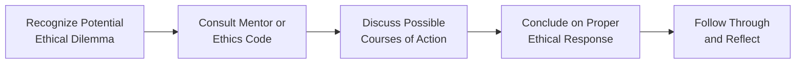

## Introduction

We’ve all heard that old saying: “Character is doing the right thing when nobody's watching.” In finance, though, it sure feels like someone’s always watching—regulators, clients, internal compliance teams, or a vigilant public. Even so, the real test of integrity often comes down to how investment professionals react in micro-moments: when they spot a discrepancy in a trade log, encounter insider information, or face short-term incentives that conflict with client priorities. One powerful way to ensure that people do the right thing—even when the choice isn’t easy—is by cultivating a strong mentorship culture. Mentorship isn’t just about passing along formulas or explaining complex investment strategies; it’s also a way to model ethical behavior and instill professional pride and responsibility from the get-go.

In this section, we explore how structured mentorship programs can be the bedrock of an ethical, trustworthy environment. We’ll go through why these relationships matter, how to set them up effectively, and the subtle differences between transferring technical knowledge and fostering moral courage. We’ll also offer strategies to measure mentorship outcomes, so you can truly see if junior analysts are internalizing ethical principles. And, by the way, establishing that bond of trust between senior and junior professionals? That might just be the best investment firms can make toward a sustainable, integrity-first culture.

## The Role of Mentorship in Building Ethical Culture

So, if you think about it, the term “culture of integrity” might sound a bit lofty. Yet in practice, it boils down to everyday behaviors—like reporting a dubious trade, refusing to manipulate performance results, or respectfully challenging a colleague’s questionable decision. Junior analysts, especially those stepping into the frenzy of research projects, client demands, or late-night data modeling, rely heavily on cues from senior mentors. If a mentor consistently shows that ethical considerations are non-negotiable, it sticks with mentees. Over time, that sense of “doing the right thing regardless of convenience” becomes almost automatic.

Often, a young finance professional sees the complexities of the real world—ambitious revenue targets, potential conflicts of interest, tight deadlines—and wonders how on earth to juggle them all ethically. That’s precisely where a mentor comes in. Mentors can reveal the unspoken norms, share personal war stories, say “I messed up once—here’s what I learned,” and demonstrate how to navigate ethical gray areas with confidence. This real-life perspective can’t be gleaned from textbooks alone.

### Knowledge Transfer vs. Ethical Skill-Building

Mentorship programs are frequently framed around “knowledge transfer.” Indeed, they are a great way for new hires to ramp up on portfolio management techniques, risk models, or even the ins and outs of GIPS (Global Investment Performance Standards). But that’s just half the story. The real hidden gem is ethical skill-building—forming the ability to recognize conflicts of interest, manage personal biases, and incorporate codes of conduct into daily tasks. Without explicit conversation, new analysts might think earning short-term gains justifies questionable behavior. Mentors can step in to demonstrate how ethical lapses not only erode client trust but, in the long run, can harm profitability and professional reputations.

## Essentials of a Structured Mentorship Program

Having a coffee chat once a quarter is not the same as a well-designed mentorship program that fosters integrity. Relying on ad-hoc exchanges might leave mentees directionless. Instead, a structured approach ensures consistent support and accountability.

### Regularly Scheduled Meetings and Clear Objectives

It helps to plan mentorship sessions regularly—say, once a month. Think of these as “checkpoints” where mentees can bring up real-life scenarios, compliance concerns, or personal doubts. Setting clear objectives clarifies expectations. For instance:
• Aligning examples of ethical dilemmas covered during these sessions with the CFA Institute Code of Ethics and Standards of Professional Conduct.  
• Tracking progression in problem-solving approaches.  
• Documenting both technical and ethical lessons learned.

Senior mentors can guide mentees to dissect ambiguous situations—like a client who pushes for selective performance reporting. Doing so in a safe, constructive environment can spark valuable conversations. By regularly rescheduling these discussions, mentor-mentee pairs maintain momentum and don’t let vital lessons slip away in the day-to-day shuffle.

### Documentation and Feedback Loops

Feedback is huge in any relationship, but even more so in mentorship. Mentors should keep track of:
• Key topics discussed.  
• Ethical dilemmas encountered and how they were addressed.  
• Evaluation of mentee’s decision-making over time.

Mentees, meanwhile, can keep a journal or running log of experiences. For instance, a junior analyst might note how they approached a potential conflict of interest, then discuss with their mentor any blind spots or overlooked consequences. This kind of consistent documentation helps both parties see how ethical thinking evolves. Plus, it demonstrates to senior management that mentorship programs are not just “chats” but robust learning relationships.

## Mentor-Mentee Responsibilities in Upholding Integrity

There’s a subtle dance to mentorship. If it’s too hierarchical or one-sided, you might lose that layer of trust that encourages open dialogue.

### The Mentor’s Perspective

Mentors provide guidance, but they also have to:
• Model Integrity: If the mentor shrugs off minor policy violations, the mentee gets the message that “not all rules matter.”  
• Encourage Transparency: Mentees may be reluctant to speak of mistakes or gray areas if mentors don’t openly share personal anecdotes about failures and lessons learned.  
• Reinforce Organizational Values: Connect real-life scenarios to the organization’s ethics code, ensuring mentees see how statements on a page translate into real behavior in client interactions or trading decisions.  
• Maintain Confidentiality: Mentees must feel safe to ask sensitive questions; mentors, in turn, must ensure that the mentee’s vulnerabilities are protected.

### The Mentee’s Perspective

It’s tempting to see a mentor as a “boss” who provides all the right answers. But a good mentee meets the mentor halfway by:
• Asking Tough Questions: Actively seeking clarity on potential conflicts of interests, new regulations, or advanced compliance procedures.  
• Demonstrating Initiative: Reading up on the organization’s code of conduct, leveraging training materials, and preparing thoughtful questions for mentor sessions.  
• Owning the Relationship: Scheduling meetings, setting agendas, and ensuring follow-through on assigned tasks.  
• Challenger Mindset: Sometimes a mentee might see a potential ethical blind spot in the mentor’s approach. Speaking up can deepen the trust even further, as long as it’s done respectfully and with genuine intent.

## Guiding Mentees Through Real-World Ethical Dilemmas

One big challenge for new analysts is interpreting certain ambiguous circumstances. Like, how do you draw a firm line between corporate “entertainment” and bribery? Or how do you uphold client confidentiality in a tight-knit community where everyone knows each other’s business?

Below is a simple flowchart (in Mermaid) that illustrates a mentorship-driven framework for analyzing ethical concerns:

This structure might seem obvious, but junior analysts can sometimes freeze up in the heat of the moment. Having a plan visually mapped out can be super helpful. They learn to consult the mentor early, gather facts, consider the relevant code or standard (like Standard III – Duties to Clients), and then decide on an action that aligns with both compliance and broader ethical principles.

## Structures for Effective Mentorship

When setting up a mentoring ecosystem, consider approaches that align with your firm size and culture:

• Formal Pairing: Each new hire is matched with a senior staffer based on skill sets, department, or even personality. The organization keeps track of progress and offers resources (like guidelines or meeting templates).  
• Mentorship Rotations: Over two years, a single mentee can rotate among a few mentors to get varied perspectives—one specializing in portfolio analytics, another in compliance, and so on.  
• Peer-Review Mentorship: Pair two professionals at a similar level but from different teams. Both might have a senior “coach” but also serve as sounding boards for each other. This method fosters cross-department insight and breaks down silos.  

Regardless of the structure, clarity on roles and expectations sets the foundation for success. Also, it’s key for mentors to be recognized for their efforts—some firms incorporate mentorship contributions into performance reviews, acknowledging that it’s a real-time investment in the organization.

## Encouraging Moral Courage and Sound Decision-Making

We talk a lot about moral courage—doing the right thing even when it’s painful. In finance, that might look like declining an enticing but ethically questionable client request. Mentors have a giant influence here, because they can:
• Illustrate High-Stake Scenarios: For example, the meltdown of a major fund due to fraudulent reporting or front-running trades can serve as an eye-opener.  
• Reflect on Personal Lessons: Mentors who experienced intense professional scrutiny (e.g., during the 2008 financial crisis) can share what it felt like to uphold ethical standards when the environment was screaming for shortcuts.  
• Role-play Conversations: Sometimes, standing up for what’s right means delivering tough news to a senior manager or a high-net-worth client. Mentors can help mentees practice these “difficult conversations,” teaching them how to remain firm yet respectful.

## Measuring Mentorship Effectiveness

It’s easy to celebrate mentorship success with a few feel-good stories, but a truly effective program needs a bit more rigor. Consider the following metrics:

1. Reduced Ethical Incidents: If the organization tracks compliance breaches or near-miss situations, see whether these decline among newer hires benefitting from mentorship.  
2. Feedback Surveys: Ask junior analysts to rate how comfortable they feel raising ethical concerns and whether they can identify real-life examples of moral courage in themselves or peers.  
3. Career Progression: Are mentees promoted into leadership roles more quickly, suggesting that they’ve mastered not only the technical side but also the ethical dimension of the job?  
4. Peer Recognition: Qualitative feedback from colleagues who notice a mentee’s consistent demonstration of values like honesty and accountability.  

## Overcoming Common Challenges

A few pitfalls can undercut mentorship programs:

• Time Constraints: Mentors might be senior managers juggling hectic schedules. Without organizational support (like planned times or a reduced billable target), the mentor-mentee relationship can fizzle out.  
• Mentor Burnout: A single mentor might be juggling multiple mentees. Confirm that responsibilities are distributed fairly, and consider training multiple mentors to reduce the load.  
• Cultural Mismatch: If the organization celebrates cutthroat behavior or only measures success through short-term metrics, mentorship might feel fake. The entire leadership team must also “walk the talk.”  

In the end, building a culture of integrity requires unwavering commitment from the top. Mentorship is one of the best vehicles to bring that commitment to life, but it cannot operate in a vacuum.

## Practical Case Study: New Horizons Asset Management

Consider a mid-sized firm, New Horizons Asset Management, which realized it was losing younger analysts—many reported feeling uneasy with reporting practices that sometimes pushed the boundaries of fair representation. So, the firm launched a mentorship program:

• Each junior analyst was paired with a senior portfolio manager for 12 months.  
• Monthly one-on-one sessions were scheduled. The mentor provided real client scenarios—like whether to disclose certain fees in a pitch deck—and asked the mentee how they’d handle them.  
• Mentees kept an “Ethical Log.” At each session, they reviewed real or hypothetical dilemmas they encountered.  
• Mentors documented progress, including how mentees’ approaches evolved.  
• After the first year, compliance complaints dropped by 20%. Interviews revealed that mentees felt “far more at ease voicing concerns” and believed “ethical debates were welcomed, not frowned upon.”

This anecdote showcases how a deliberate, well-supported program can create tangible changes in everyday behavior.  

## Practical Tips and Final Thoughts

• Start Early: Introduce ethics mentorship from day one—often, the first few months shape a new analyst’s habits profoundly.  
• Align to Core Values: Ensure that mentors continuously reference the organization’s mission, codes, and stated commitments to clients.  
• Recognize Mentors: If the firm invests time in training mentors or offers professional development credits, it signals the importance of this role.  
• Lead by Example: The entire corporate leadership needs to champion the mentorship initiative, or it’s at risk of being perceived as a “boxed-check” exercise.

Anyway, I’ve seen that young professionals often feel a surge in confidence when they’re armed with not just technical knowledge, but a sense of moral conviction. With strong mentorship, they’re much less likely to freeze in stressful situations and far more likely to stay true to the best ideals of this industry.

## Glossary

• Mentorship Program: A structured relationship where an experienced professional guides the development of a less-experienced professional.  
• Moral Courage: Willingness to uphold ethical principles despite risks or pressures.  
• Learning Relationship: A dynamic interaction that builds a mentee’s knowledge, skills, and confidence, guided by the mentor.  
• Junior Analyst: An entry-level or early-career finance professional seeking guidance, supervision, and support.  
• Ethical Skill-Building: A practice-based approach for recognizing and acting appropriately in complex or ambiguous ethical situations.

## References, Suggested Readings, and Links

• Ragins, B. R., & Kram, K. E. (2007). The Handbook of Mentoring at Work. SAGE Publications.  
• Allen, T. D., & Eby, L. T. (2010). The Blackwell Handbook of Mentoring. Wiley-Blackwell.  
• CFA Institute’s “Mentoring Matters” Guides:  
  https://www.cfainstitute.org/en/research/foundation  
• Clutterbuck, D. (2014). Everyone Needs a Mentor: Fostering Talent in Your Organisation. Kogan Page.

------------------------

## Test Your Knowledge: Mentorship and Ethical Culture in Finance



### Which of the following best describes the value of mentorship for junior analysts in fostering ethical behavior?

- [ ] It provides a quick way to learn advanced technical skills without needing official training.
- [x] It facilitates knowledge transfer and embeds ethical principles and professionalism early in their careers.
- [ ] It serves as a peer-based performance management system that measures compliance.
- [ ] It replaces the need for an official code of ethics or professional conduct.

> **Explanation:** Mentorship offers a forum for junior analysts to learn not only about technical aspects but also about maintaining integrity within complex real-world scenarios.

### Which of these factors is considered essential for an effective mentorship program?

- [x] Regularly scheduled meetings and clear objectives for the mentee’s development.
- [ ] A corporate mandate that only the mentor is responsible for ethical outcomes.
- [ ] Informal chats without structured agendas.
- [ ] A focus exclusively on technical content, ignoring the firm’s code of conduct.

> **Explanation:** Structured, consistent meetings with clear goals let mentors track ethical and professional development meaningfully.

### In a mentorship model, how can senior mentors most effectively encourage moral courage?

- [x] By sharing personal stories of times they faced ethical dilemmas and illustrating the positive outcomes of upholding integrity.
- [ ] By delegating routine tasks, leaving ethical issues to compliance officers.
- [ ] By only focusing on success stories that highlight financial achievements.
- [ ] By enforcing strict punishment over minor infractions to instill fear.

> **Explanation:** Sharing actual, sometimes difficult, experiences can motivate mentees to stand firm on ethical grounds when challenging situations arise.

### What key responsibility does a mentee hold in a successful mentorship relationship?

- [ ] Strictly following every suggestion by the mentor without question.
- [ ] Reporting all private mentor-mentee discussions to senior management.
- [x] Demonstrating initiative, asking thoughtful questions, and driving the relationship forward.
- [ ] Maintaining a casual attitude about the mentor-mentee meetings.

> **Explanation:** Effective mentorship is a two-way process, and mentees play a critical role by showing eagerness, preparing for sessions, and driving discussions.

### Which is a prime benefit of documenting discussions and progress during mentorship sessions?

- [x] It helps track ethical development and identifies areas where further guidance is needed.
- [ ] It replaces the firm’s official compliance documentation.
- [x] It can serve as a record for personal and professional growth over time.
- [ ] It is illegal under most financial regulations.

> **Explanation:** Documenting ethical discussions over time can reveal how a mentee’s decision-making matures and highlight the practical impact of mentorship.

### How can mentorship programs align with broader organizational ethics initiatives?

- [x] By consistently referencing the organization’s code of conduct during discussions and modeling these values.
- [ ] Through sporadic communication with the company’s marketing teams.
- [ ] By removing codes of conduct from the mentorship program to encourage creative freedom.
- [ ] By keeping mentorship activities entirely separate from compliance and HR.

> **Explanation:** Embedding the organization’s ethics code in real mentorship discussions and decision-making ensures consistency with broader corporate values.

### Why is it crucial for both mentors and mentees to maintain confidentiality within their relationship?

- [ ] To comply with anti-laundering legislation in all jurisdictions.
- [x] To build trust, encouraging mentees to share concerns or mistakes openly without fear of wider disclosure.
- [x] To ensure the mentor can discuss the mentee’s progress with senior leadership in private.
- [ ] It is not important; transparency should override confidentiality in all matters.

> **Explanation:** Confidentiality fosters a safe space for learning and growth; if mentees fear retaliation or exposure, the mentorship won’t succeed.

### What is a viable metric for gauging the success of a mentorship program focused on ethics?

- [x] A noticeable reduction in ethical violations or compliance incidents among mentees over time.
- [ ] Higher net sales revenues attributed to mentorship sessions.
- [ ] Reduced frequency of staff attendance at ethics training sessions.
- [ ] Increased rotation of mentors every two months.

> **Explanation:** One tangible way to see the effect of mentorship is by checking if compliance issues or unethical incidents fall over time, indicating improved judgment and behavior among mentees.

### Which of the following approaches is a best practice for mentors dealing with mentees facing ethical dilemmas?

- [ ] Direct the mentee to read the entire CFA Standards of Professional Conduct without further discussion.
- [ ] Summarily discipline the mentee if they express moral doubts.
- [ ] Provide strictly personal opinions based on social norms, ignoring organizational codes.
- [x] Encourage a structured decision process, referencing professional standards and weighing possible outcomes.

> **Explanation:** Combining a systematic analysis with established codes and real-world insights is the best way to guide mentees in complex ethical issues.

### True or False: Peer-review mentorship can strengthen ethical alignment across different teams in an organization.

- [x] True
- [ ] False

> **Explanation:** Encouraging collaboration and discussion among professionals of similar rank but different departments can break down silos, promote shared values, and give mentees broader perspectives on ethical decision-making.


