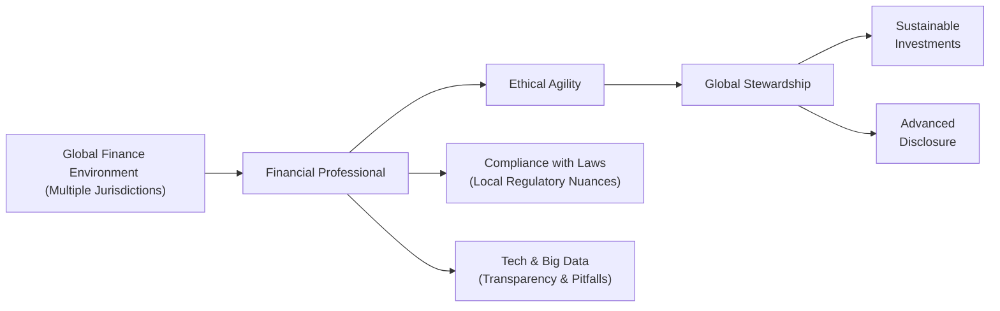

## Introduction and Overview

The investment world is no longer limited by national borders. Um, we’ve been watching this expansion for years—money flies instantly across the globe, new trade partnerships pop up, and technology shrinks distances in a heartbeat. But with this wider reach come ethical challenges of a new kind. The customs, regulations, and cultural norms that shape ethical conduct in one jurisdiction might not always line up perfectly with those of another. In short, a cross-border mindset demands what some folks are calling “ethical agility”—the ability to adapt to local laws and customs while keeping a tight grip on core ethical principles.

Anyway, let’s explore how these evolving ethical standards look in practice. We’ll talk about regulatory differences, cultural nuances, and some real-life scenarios that can test even the most seasoned professionals. We’ll also take a peek at technology, stewardship, and how global events—from political shifts to trade disputes—shape our responsibilities as finance pros. Ready?

## The Concept of Ethical Agility

One of the biggest shifts in modern finance is the recognition that ethical standards can’t be one-size-fits-all. Sure, there are foundational values (things like honesty, fairness, integrity) that underlie most ethical frameworks, but the operational details can vary drastically across regions. Ethical agility is basically the competence and willingness to flexibly apply high ethical standards in different local contexts—without ever watering down those core values.

In practice, ethical agility might look like an investment manager tailoring the approach to client disclosures in countries with less developed reporting norms or being hyper-aware of local business customs that could conflict with the CFA Institute Code of Ethics. It’s about staying grounded, but not rigid. I remember once being in a meeting in a foreign market where a local official casually offered me, well, “preferential access” in return for some not-too-transparent processing fees. That’s exactly the kind of moment ethical agility is meant to address: you’re navigating local realities, but you’re still upholding the global ideals laid down by your professional obligations.

## Navigating Cross-Border Investments

Cross-border investments put those ethical muscles to the test. Different jurisdictions mean different regulatory requirements, tax codes, and perhaps the trickiest aspect: cultural expectations. In some parts of the world, gift-giving is deeply ingrained in business relationships. Elsewhere, gifts are considered potential bribes. The same action could be an innocuous relationship-builder in one country but raise eyebrows (or enforcement threats) in another.

On the professional side, portfolio managers, analysts, and compliance officers must be equipped to adapt investment decisions and disclosures to these varied realities. That includes being mindful of:

• Disclosure requirements: Some markets require extensive risk disclosure. Others might have looser standards.  
• Trading regulations: The timing and method of executing trades can differ across exchanges and can potentially conflict with best-execution obligations.  
• Protecting client data: Different jurisdictions have different privacy laws (think General Data Protection Regulation, or GDPR, in the EU).  

When an asset manager invests in, say, emerging markets, the interplay of local laws and the manager’s fiduciary duty can be more complicated than in a strictly domestic environment. You don’t want to ignore local norms, but you also don’t want to compromise on the essential ethics set out by the CFA Institute or other global frameworks.

## Balancing Local Laws and Global Norms

Here’s a dilemma: what happens if local regulations lag behind international standards in areas like environmental sustainability or fair disclosure? Let’s say you’re operating in a jurisdiction that doesn’t require the same level of transparency as your home market does. Do you scale down your reporting to meet local norms? Or do you sustain your higher standard of disclosure, perhaps putting you at a competitive disadvantage?

In an ideal world, finance professionals retain their global standard of conduct even when local requirements are less stringent. This might mean voluntarily exceeding local disclosure expectations or implementing robust compliance processes that go beyond what’s legally required in that country. The tough part is reconciling it with cost, client expectations, and sometimes, the local authorities that might not see the value in these “extra” measures. But truly ethical professionals are prepared to pay that price for integrity.

### A Quick Mermaid Diagram

Below is a simple flowchart to illustrate how local regulations intersect with global ethical norms. When cross-border professionals face conflicting standards, the process often looks like this:

## Shifting Geopolitical Landscapes and Moral Dilemmas

Especially in the last few years, geopolitical upheavals, alliances, and trade disputes have introduced new moral wrinkles into investment decisions. Think about sanctions: if you’re investing on behalf of a global pool of clients, you might be prohibited from investing in certain countries, industries, or even specific companies. Or perhaps your country’s regulations don’t sanction a particular region, but your company’s ethical guidelines do, due to potential human-rights concerns. So you’re stuck between doing what is legally allowed and doing what your firm sees as ethically necessary.

This extends beyond sanctions. Sometimes, institutions want to avoid investments that might fuel conflict or environmental damage. Aligning portfolios with these broader social values can be a moral imperative for some clients, or it can be a marketing advantage for investment products that brand themselves as socially responsible. However, it also introduces a layer of complexity: you need accurate, up-to-date data for risk analysis, plus you must figure out how to weigh your clients’ best financial interests alongside intangible ethical considerations.

## The Role of Global Stewardship

Okay, so you might be wondering: why would a finance professional voluntarily embark on these tricky ethical challenges? Because it’s good for business in the long run, but also—well—because it’s just the right thing to do.

Global stewardship means taking responsibility for the ripple effects of our financial decisions around the world. This might include:

• Shareholder activism: Using equity ownership to influence corporate behavior in a sustainable manner.  
• Heightened corporate governance: Demanding strong board oversight, transparency, and accountability in every region where a firm operates.  
• Advanced disclosure requirements: Adopting best-practice reporting protocols (e.g., GIPS® or sustainability frameworks).  

In some ways, global stewardship is an extension of the fiduciary duty finance professionals have to clients. Except instead of limiting ourselves to pure financial returns, we’re also considering environmental, social, and governance (ESG) factors in a globally consistent way.

## Technology, Transparency, and the Ethics Gap

It’s easy to assume technology automatically boosts transparency—blockchains for verification, big data for enhanced analysis, and so forth. And, sure, these are powerful tools. But they come with ethical landmines. Let’s take algorithmic bias for instance. If an algorithm relies on biased historical data, it can systematically favor or exclude entire groups of people. The result? Unintentional discrimination in lending, hiring, or access to financial products.

We also have a big question about data privacy. If you’re collecting customer data across multiple jurisdictions, you’ve got to comply with a patchwork of privacy laws (GDPR in Europe, CCPA in California, etc.). And even if something is legal in a certain market, is it truly ethical to harvest and analyze that data without informed consent?

At the end of the day, the principle is straightforward: Just because you can do something technologically, doesn’t mean you should. Ethical agility helps you figure out the correct “should” in each context.

## Personal Anecdote: The Tech Challenge

Early in my career, I spent some time in a financial tech startup that offered robo-advisory services for clients in different countries. The marketing team was super excited about using AI to boost returns and discovering new patterns in user data. But I noticed that the data we were pooling came from customers who might not have realized the full scope of our analytics, especially in jurisdictions with borderline data protection laws. I remember having that unsettling feeling, like, “Wait—am I comfortable with how easily we’re slicing and dicing this info?” And it reminded me how crucial it is to have robust internal ethical guidelines that often exceed whatever local laws might dictate.

## Best Practices for Maintaining Ethical Integrity

• Perform thorough due diligence before entering any new market. Understand the local regulations, cultural norms, and potential ethical pitfalls.  
• Seek input from local experts—cultural consultants, legal advisers, or compliance teams—to align global standards and local practices.  
• Maintain transparent communication with clients. If your ethical standards go beyond local regulations, explain why.  
• Develop a code of conduct that addresses cross-border issues specifically, ensuring that all employees understand how to handle them.  
• Use technology responsibly. Verify that algorithms are tested for biases, and ensure data collection respects privacy.  

## Final Exam Tips and Practical Applications

From a CFA Level III perspective, these themes can show up in your constructed-response questions or item sets relating to broader portfolio management contexts. You might be asked how to handle conflicting regulations or to demonstrate your understanding of ESG integration on an international scale. Be prepared for scenario-based questions where you must decide between maintaining a global best practice or conforming to local standards that don’t quite measure up.

• Pitfalls: Overlooking local customs can cause reputational harm or regulatory violations. Neglecting global norms can do even worse damage, especially if your professional obligations are compromised.  
• Don’t ignore nuance: In essay-format questions about ethics, the best answers acknowledge the complexity of local regulation versus global ethical principles.  
• Timely references: Cite relevant standards from the CFA Institute Code of Ethics or mention best-practice frameworks like the Global Investment Performance Standards (GIPS®) when describing an approach to performance reporting across borders.

## Glossary

• Ethical Agility: The skill of upholding core ethical values while adapting to varied cultural, regulatory, or organizational contexts.  
• Cross-Border Investments: Investment activities that span multiple countries, bringing about differences in laws, tax regimes, and cultural expectations.  
• Global Stewardship: The commitment to consider the worldwide socio-environmental impacts of financial decisions and to act in ways that benefit global stakeholders.  
• Algorithmic Bias: Unintended preferential or discriminatory patterns produced by computer algorithms, often based on flawed or non-representative data.

## References, Suggested Readings, and Links

- Paine, L. S. (1996). “Tradeoffs in Ethical Decision-Making: The True Costs of Doing Business Globally.” Harvard Business School Working Paper.  
- Moon, H. C., & Parc, J. (2020). “Shifting from Corporate Social Responsibility to Corporate Social Opportunity?” Sustainability, 12(5).  
- CFA Institute Global Handbook:  
  https://www.cfainstitute.org/en/ethics-standards/codes/global  
- Argandoña, A. (2003). “Ethical Management Systems for Not-for-Profit Organizations.” IESE Business School  

## Test Your Knowledge: Global Ethical Standards Quiz



### A financial institution encounters local regulations that are less stringent than its home country standards. Which action best demonstrates “ethical agility”?

- [ ] Adopting only the minimum local requirements to reduce compliance costs.
- [x] Voluntarily adhering to higher international standards for transparent disclosure.
- [ ] Halting operations in the local market to avoid legal conflicts.
- [ ] Seeking a temporary waiver from local regulators.

> **Explanation:** Ethical agility means maintaining robust ethical standards even when local rules are lenient, demonstrating leadership rather than following minimal requirements.

### Which of the following best describes a potential risk of algorithmic bias in cross-border finance?

- [ ] Algorithms that accurately capture all regional differences.
- [ ] Algorithms that produce consistent returns across various markets.
- [x] Algorithms that systematically exclude certain demographics from credit access.
- [ ] Algorithms that reduce compliance burdens for multinational firms.

> **Explanation:** Algorithmic bias can lead to unfair treatment of certain groups, particularly if the underlying data reflect historical inequalities or prejudices.

### When local laws conflict with international regulations on sustainable investing, the most ethical approach for a finance firm is typically to:

- [ ] Follow local laws strictly, ignoring all international regulations.
- [ ] Adopt international regulations only if they generate higher short-term returns.
- [x] Comply with local laws while upholding the highest relevant international standards.
- [ ] Withhold investment from any region that does not meet international standards.

> **Explanation:** Firms should respect local laws but also strive to exceed them where possible, maintaining a commitment to global best practices.

### Which is a key characteristic of global stewardship in finance?

- [x] Influencing corporate behavior toward transparency and accountability.
- [ ] Maximizing short-term profits in emerging markets.
- [ ] Minimizing philanthropic efforts unless mandated by law.
- [ ] Concentrating solely on domestic regulatory compliance.

> **Explanation:** Global stewardship involves going beyond profit-focused objectives to ensure sustainable, transparent practices that benefit a broad range of stakeholders.

### In the context of sanctions and other geopolitical constraints, a portfolio manager’s moral challenge often involves:

- [x] Balancing financial objectives with compliance and ethical principles.
- [ ] Investing in newly sanctioned regions for speculative gains.
- [x] Respecting sanctions while meeting clients’ financial interests.
- [ ] Avoiding all analysis of geopolitical trends to maintain neutrality.

> **Explanation:** Professionals must navigate between client mandates, regulations, and ethical considerations—respecting sanctions while still managing client capital effectively.

### A sign of “ethical agility” in cross-border operations might involve:

- [x] Adjusting disclosure practices above legal requirements to maintain transparency.
- [ ] Reducing due diligence to shorten market entry time.
- [ ] Paying attention only to cultural norms that boost sales.
- [ ] Shifting ethical guidelines to minimize compliance expenses.

> **Explanation:** Ethical agility means going beyond local norms if needed, maintaining globally recognized ethical standards even when not explicitly required by law.

### Which scenario best illustrates the challenge of adhering to both local laws and higher global norms?

- [ ] Adopting a new marketing campaign.
- [x] Operating in a jurisdiction with minimal data privacy controls while applying stricter global privacy standards.
- [ ] Expanding product lines in an established domestic market.  
- [x] Offering standard disclaimers in a country with low financial literacy.

> **Explanation:** Conflicts often arise when local regulations are weaker than the firm’s home-base standards, especially around data privacy and disclosure.

### What is a practical first step for an investment firm entering a new market with different cultural expectations?

- [ ] Immediately adopt local customs of gift-giving to ensure smooth business relationships.
- [ ] Forego research and rely on in-house global compliance frameworks.
- [x] Conduct an in-depth cultural and regulatory analysis to guide ethical operations.
- [ ] Expect local stakeholders to conform to the firm’s home-market norms.

> **Explanation:** Thorough due diligence, including a cultural and regulatory assessment, helps the firm navigate ethical pitfalls without compromising core values.

### A global stewardship approach to corporate governance typically prioritizes:

- [x] Transparency, accountability, and rights of minority shareholders.
- [ ] Speeding up market entry through minimal compliance efforts.
- [ ] Confidential deals and limited public oversight.
- [ ] Restricting environmental reporting to reduce costs.

> **Explanation:** Global stewardship is about elevating governance standards, ensuring clarity in operations, and safeguarding the interests of a wide range of stakeholders.

### True or False: “Ethical agility” permits ignoring a country’s strict anti-corruption laws if your home country’s laws are less rigid.

- [ ] True
- [x] False

> **Explanation:** Ethical agility never endorses lowering ethical standards; it focuses on either meeting or exceeding both local and global ethical requirements.


