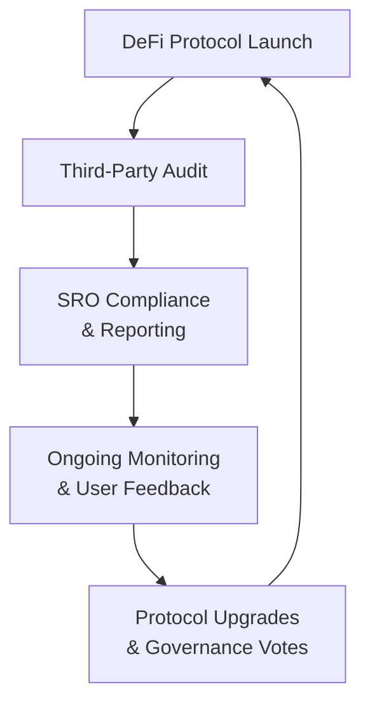

## Introduction

Decentralized finance (DeFi) can feel like the wild frontier of the financial world—new, full of promise, but maybe a bit uncharted. Drawing upon blockchain technology, smart contracts, and peer-to-peer transactions, DeFi aims to provide financial services without traditional intermediaries like banks or brokers. From lending to asset trading, it’s all about cutting out the middleman, right? But removing intermediaries doesn’t eliminate the need for ethical oversight. Actually, the responsibility to uphold ethical principles may become even greater when so much power is placed directly in the hands of developers, investors, and automated protocols.

In this section, we’ll discuss the various ethical considerations that arise when capital markets move onto decentralized platforms. We’ll define important terms, walk through common pitfalls—like security breaches or hidden contract vulnerabilities—and consider how these issues might appear in a highly automated ecosystem. We’ll also explore recommended best practices, borrowing from existing regulatory frameworks to suggest how DeFi can mature into a trustworthy, transparent corner of the global financial landscape.

## Understanding DeFi Fundamentals

### Core Concepts and Glossary

• Decentralized Finance (DeFi): A blockchain-based form of finance that operates without traditional intermediaries. Think peer-to-peer lending, automated market maker (AMM) exchanges, and yield generation protocols.  
• Smart Contracts: Self-executing agreements coded on a blockchain. They enforce rules automatically once specified conditions are met.  
• Peer-to-Peer Transactions: Direct trades or transactions between two parties, often anonymized by blockchain technology.  
• Blockchain: A distributed digital ledger of transactions that multiple participants verify.  
• Market Manipulation: Activities intended to distort market supply, demand, or pricing for personal gain.

### A Twofold Promise

1. Democratization of Finance  
   DeFi’s biggest tagline is democratization—anyone with an internet connection can potentially access sophisticated financial products. The technology can lower barriers to entry, reduce transaction fees, and offer transparency in code. Proponents argue DeFi builds a more inclusive financial ecosystem.

2. Reduced Reliance on Intermediaries  
   Traditional finance often requires trust in centralized entities—like banks—to safeguard assets and verify transactions. DeFi harnesses cryptographic proofs and distributed consensus to replace that reliance with code and community governance. However, this transition doesn’t eliminate ethical obligations; it just shifts them to new actors, such as protocol developers and token holders.

## Trust and Accountability in a Decentralized Setting

If there’s no bank manager or compliance officer at the helm in a DeFi ecosystem, who’s held accountable when something goes wrong? This might be one of the biggest ethical questions swirling around decentralized markets. “Trustless” systems, ironically, still require trust—only now it’s placed in transparent code (smart contracts) rather than human decision-makers. 

But it would be naive to assume code alone can solve all ethical considerations. Bugs, poor design, or malicious exploiters can undermine even the most well-intentioned DeFi project. In my opinion, we need robust governance mechanisms (like decentralized autonomous organizations, or DAOs) that establish accountability, dispute resolution, and user safeguards.

### Layers of Accountability

• Developer Accountability: DeFi protocol developers must ensure that smart contracts are thoroughly tested. Failing to secure a contract can open doors to large-scale hacks—like the infamous “DAO hack”—that drain investor funds.  
• User Accountability: Individual participants should be aware of the inherent risks: Yo, you’re essentially becoming your own bank. Losing private keys can mean losing assets forever.  
• Community Accountability: DeFi governance often involves voting power that’s proportional to token holdings. Whales (large stakeholders) might thus dominate proposals, raising ethical concerns around fairness and governance.

## Market Manipulation, Fraud, and Security Breaches

DeFi innovation shouldn’t cloud the fact that market manipulation, fraud, and security threats remain serious. We’ve all heard stories about “rug pulls,” where project founders vanish after collecting investor funds. Then there’s front-running, where bots intercept and reorder transactions to skim profits. 

On the flip side, many DeFi protocols are truly creative and transformative. But we must weigh these benefits against potential ethical pitfalls:

• Price Manipulation: Flash loan exploits or artificially pumped token prices can distort markets and lead to huge losses for unsuspecting participants.  
• Fraudulent Projects: Some unscrupulous teams create tokens or protocols solely to scam investors.  
• Technical Vulnerabilities: Smart contract exploits can lead to immediate and irreversible loss of funds.  
• Privacy Risks: Although blockchains can bring transparency, DeFi participants may have limited anonymity. Sophisticated analytics can sometimes track addresses back to real-world identities.

### Example: Potential Flash Loan Attack

Below is a simplified flow diagram illustrating how a malicious actor might exploit a smart contract with a flash loan attack:

```mermaid
flowchart LR
    A["DeFi Exploiter"] --> B["Borrow Large Amount<br/> using Flash Loan"]
    B --> C["Manipulate Oracles<br/> or Market Prices"]
    C --> D["Trigger Smart Contract<br/> to Liquidate/Arbitrage Value"]
    D --> E["Repay Flash Loan"]. 
    E --> F["Profit from the<br/> Price Discrepancy"]
```

In this scenario, the exploiter temporarily borrows a large sum, manipulates on-chain prices, then repays the loan—pocketing the manipulated gains along the way. The speed and complexity of such transactions often leave other market participants reeling.

## Ethical Responsibilities of Key Players

### Developers

Developers arguably have the greatest control over how DeFi platforms function. If I’m a smart contract coder, my lines of code could manage millions (or billions!) of dollars in capital. That’s a huge responsibility. Failing to test adequately or refusing to fix known vulnerabilities can be construed as unethical, even if it doesn’t break specific laws. It’s not just about not doing harm, but actively ensuring user protection.

### Platform Operators and Investors

Platform operators—those who host front-end user interfaces or maintain liquidity pools—share a chunk of the ethical burden. They should communicate risk factors, confirm regulatory compliance, and monitor malicious activity. Investors have a responsibility too: they should conduct thorough due diligence and consider ethical implications before deploying capital.

### Regulators

Regulators continue to grapple with how to oversee decentralized markets. Some might think, “Well, if it’s decentralized, does regulation even matter?” The short answer is yes. Regulators can help protect consumers from deceptive practices and encourage fair standards—although achieving consensus on global DeFi guidelines is no small feat.

## The Importance of Robust Smart Contracts

Smart contracts are the beating heart of any DeFi protocol. Because these self-executing contracts enforce conditions automatically, an ethical slip in their design can lead to severe consequences. Perhaps the contract is coded to intentionally disadvantage smaller participants, or a developer inserts a backdoor to siphon funds. That’s not just unethical—it’s a potential legal landmine.

### Code Audits and Transparency

Reputable DeFi projects undergo security audits by third parties. Disclosing an audit—and addressing the findings—demonstrates a commitment to best practices. It might cost money and time, but so does a major hack or meltdown in public trust. In a sense, thorough code audits are about protecting both user funds and the reputation of DeFi itself.

Below is a hypothetical Python snippet that outlines a high-level logic check for a smart contract’s function. While simplified, it shows how developers think about verifying certain preconditions:

```python
def execute_trade(user_balance, trade_amount):
    # Check basic security conditions
    if trade_amount <= 0:
        raise ValueError("Trade amount must be positive.")
    if user_balance < trade_amount:
        raise ValueError("Insufficient balance.")
    
    # Imagine additional checks or complex logic here:
    # ...
    
    # If conditions pass, execute trade
    user_balance -= trade_amount
    return user_balance
```

Ethically, you want to ensure all possible outcomes of the contract (including edge cases with zero or negative balances) are properly handled before finalizing the code. Skipping these checks can be catastrophic for unsuspecting users.

## Regulatory Perspectives and Supportive Frameworks

### Balancing Innovation with Consumer Protection

Regulators worldwide are trying to find the sweet spot between letting DeFi flourish and preventing it from becoming a domain for illicit activity. If we clamp down too hard, we might stifle beneficial innovation (like lending services in underbanked regions). But if no guidelines exist, that vacuum can foster unscrupulous schemes that prey on less sophisticated investors.

### Proposed Ethical Principles

• Transparency: Project teams should openly disclose protocol risks and fees.  
• Accountability: Developers and governance token holders need community oversight to reduce conflicts of interest.  
• Privacy Protection: Balancing the public nature of blockchains with user privacy needs, especially around personal data.  
• Education: Providing accessible resources for users to understand what they’re getting into.

## Counseling Clients on DeFi Risks and Opportunities

Financial advisors and investment managers have a duty of care to their clients. Telling a client, “Hey, DeFi returns look great, so go for it,” without explaining the complexities and potential pitfalls is reckless. Full disclosure is a must—especially if the client is new to blockchain technology.

### Guidelines for Advisors

• Perform Thorough Due Diligence: Evaluate protocol audits, developer reputations, and tokenomics.  
• Emphasize Risk Tolerance: High yields come with higher risk. Ensure clients can handle volatility and potential for total loss.  
• Communicate Complexity: Even straightforward DeFi products can involve multiple layers of risk (technical and economic).  
• Ongoing Monitoring: DeFi evolves quickly. Advisors should keep clients informed of shifting regulations, security concerns, or new features.

## Best Practices and Future Outlook

Decentralized finance isn’t going away. In fact, many argue it’s the future, with institutional adoption steadily growing. However, building an ethical framework from the ground up can help reduce the chaos that new technologies sometimes bring.

### Potential Evolution

• Standardization of Audits: Over time, we might see an industry standard for code audits, analogous to how GAAP or IFRS sets accounting norms.  
• Self-Regulatory Organizations (SROs): DeFi communities might form industry bodies that define codes of conduct, investigate breaches, and establish best practices.  
• Real-Time Compliance Monitoring: Smart contracts could one day automate regulatory reporting, reducing the potential for noncompliance or hidden transactions.


In this diagram, continuous feedback loops and upgrades help keep protocols ethically and technically secure.

## Final Exam Tips

Even if you’re not aiming to become the world’s next DeFi mogul, ethical considerations in decentralized finance are a hot topic for exam scenarios:

• Scenario Analysis: You might be given a hypothetical DeFi protocol that experiences a security breach. Be prepared to discuss potential ethical and regulatory responses, as well as the duties of developers and advisors.  
• Conflicts of Interest: Look for subtle ways in which whales controlling governance tokens can manipulate voting outcomes.  
• Practical Disclosures: Pay attention to how you’d counsel a client. You may need to weigh high-yield prospects against the risk of total capital loss.  
• Regulation and Oversight: Expect question prompts about how or whether regulators can effectively supervise DeFi. Be ready to cite key principles such as fairness, transparency, and investor protection.

Focus on standard ethical frameworks—like the CFA Institute Code of Ethics and Standards of Professional Conduct—and how to apply them to novel contexts like DeFi. Consider standard references to the duty of loyalty, prudence in managing client assets, full disclosure of conflicts, and compliance with applicable laws.

## References, Suggested Readings, and Links

• Schär, F. (2021). “Decentralized Finance: On Blockchain- and Smart Contract-Based Financial Markets.” Federal Reserve Bank of St. Louis Review.  
• Harvey, C. R., Ramachandran, A., & Santoro, J. (2021). “DeFi and the Future of Finance.” SSRN Electronic Journal.  
• Deloitte’s Insights on Blockchain Risks and Controls: https://www2.deloitte.com  
• CFA Institute’s Research on Blockchain Ethics: https://www.cfainstitute.org/ethics-standards  

Remember, DeFi is still in its adolescence. Ethical guardrails are not merely optional—they’re essential for its long-term viability. By balancing innovation with accountability, we can create a decentralized future that upholds the highest standards of trust, integrity, and fairness.

## Knowledge Check: Ethics in DeFi



### A question about accountability in DeFi
- [ ] Only developers are ethically responsible in decentralized finance platforms.  
- [x] Developers, platform operators, and users share responsibility.  
- [ ] Regulators are solely accountable for overseeing all DeFi activities.  
- [ ] Token holders have no ethical obligations.  

> **Explanation:** Developers control the smart contracts, platform operators enable access, and users make final decisions. All must act responsibly to maintain ethical integrity in DeFi.

### A question about market manipulation
- [ ] Market manipulation cannot happen in decentralized finance due to transparency.  
- [x] DeFi systems can be subject to potential market manipulation techniques like flash loan exploits.  
- [ ] Smart contracts are foolproof and prevent all manipulation.  
- [ ] Centralized exchanges are more prone to manipulation than any DeFi protocol.  

> **Explanation:** Although blockchain offers transparency, bad actors can exploit vulnerabilities—like flash loan attacks—to manipulate prices and profit from the resulting arbitrage.

### A question about regulatory approach
- [ ] Regulators should entirely prohibit DeFi because of inherent risks.  
- [x] Regulators should strike a balance between fostering innovation and protecting users.  
- [ ] Regulation is irrelevant in a trustless, decentralized system.  
- [ ] Regulations should apply only when banks adopt DeFi platforms.  

> **Explanation:** Regulators aim to protect consumers while encouraging beneficial innovation. A balanced approach often yields the best outcomes for stakeholders and the broader public.

### A question on smart contract audits
- [x] Third-party audits can highlight vulnerabilities in smart contracts.  
- [ ] Smart contracts never require an audit because they execute automatically.  
- [ ] A single comprehensive audit ensures complete safety forever.  
- [ ] Audits are optional and have no impact on user trust.  

> **Explanation:** Independent security audits help discover coding vulnerabilities. Continuous auditing and transparent disclosure of results build trust in a DeFi protocol.

### A question on client counseling
- [x] Advisors must fully disclose DeFi risks and complexities before recommending investment.  
- [ ] Advisors can rely on public hype to guide clients into DeFi opportunities.  
- [ ] Clients are fully aware of DeFi concepts, so disclaimers are unnecessary.  
- [ ] Professional advisors have no duty to warn clients about potential DeFi scams.  

> **Explanation:** Ethically and professionally, advisors are responsible for transparent communication of risks, mechanics, and potential vulnerabilities associated with DeFi investments.

### A question about developer ethics
- [ ] Developers only need to worry about creating profitable code.  
- [x] Developers should prioritize secure coding and user protection to uphold ethical standards.  
- [ ] Developer ethics are irrelevant in a decentralized protocol.  
- [ ] Investors bear full responsibility for contract flaws.  

> **Explanation:** Developers assume a critical role in designing and testing the protocols. Ethically sound development prevents exploits and protects stakeholders.

### A question on governance token concentration
- [x] Concentrated token holdings can create power imbalances in DeFi governance.  
- [ ] Governance tokens are always distributed equally among participants.  
- [x] Whales can skew votes in favor of their own interests.  
- [ ] Governance tokens have no impact on protocol decisions.  

> **Explanation:** Large token holders (whales) can dominate decision-making, leading to potential conflicts of interest. Governance structures must address equitable representation.

### A question on privacy in DeFi
- [x] Blockchain data is public, but linking addresses to identities can still compromise privacy.  
- [ ] DeFi transactions are fully anonymous and impossible to trace.  
- [ ] Users have guaranteed anonymity in all DeFi protocols.  
- [ ] DeFi transactions are more private than bank transactions under all circumstances.  

> **Explanation:** Though metadata is typically stored publicly on blockchain, sophisticated tools can help identify individuals. Balancing transparency and privacy remains an ethical challenge.

### A question on potential negative externalities
- [x] An exploited DeFi protocol can harm not only direct investors but also broader market sentiment.  
- [ ] Smart contract hacks affect only the immediate users of that contract.  
- [ ] Failed DeFi protocols never impact other crypto or traditional markets.  
- [ ] Externalities do not exist in a decentralized environment.  

> **Explanation:** When a high-profile DeFi exploit occurs, it can shake confidence in the entire ecosystem, raise red flags among regulators, and discourage mainstream adoption.

### A question on the role of codes of ethics in DeFi
- [x] True  
- [ ] False  

> **Explanation:** Even in decentralized systems, codes of ethics—like the CFA Institute Code and Standards—remain important for guiding professional conduct, ensuring transparency, and protecting investors.


