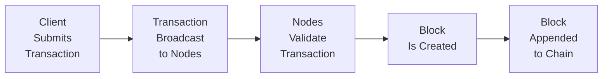

## Introduction and Context

It’s interesting: not too long ago, the idea of a decentralized system that could track and verify transactions without a single, central authority sounded almost like science fiction. Yet here we are. Blockchain has moved from obscure tech circles to become a major focal point in finance. In earlier chapters, we explored issues of trust (Chapter 1), the importance of ethical standards (Chapters 2 and 3), and how new technologies challenge these standards in the global context (Chapters 6 and 7). Now, we’ll take a deep dive into how blockchain can bolster transparency, accountability, and, potentially, ethical innovation within the financial world.

## Foundations of Blockchain Technology

### Core Concepts
Blockchain is essentially a distributed ledger: instead of storing transactional records in one centralized database, numerous nodes (computers) maintain copies of the ledger. Whenever a transaction occurs, the network reaches agreement (or consensus) on whether to add this record to the chain. And once a transaction is locked in, changing it or removing it becomes nearly impossible. This approach can revolutionize how we handle data integrity and verification.

### Structure of a Typical Blockchain

Below is a simplified flow illustrating how transactions are typically managed on a blockchain network:

• A user initiates a transaction, such as transferring digital tokens or lodging data statements.  
• The transaction is broadcast to the network, where nodes see it.  
• Nodes run consensus checks (e.g., Proof of Work, Proof of Stake) to confirm the transaction’s validity.  
• Transactions are grouped into a “block,” which then gets appended to the existing chain.  
• The ledger is updated, and the new block is effectively immutable once confirmed.

## Boosting Transparency and Ethical Conduct

### Enhancing Trust and Accountability
Blockchain’s tamper-resistant nature makes it trickier for individuals to manipulate or falsify records. You can’t just go in and “edit” a transaction. This immutability creates a strong foundation of trust. Auditors, compliance officers, and regulators can review an entire chain of transactions to see where money or assets originated, how they traveled through the system, and who authorized which steps.

• Reduced Fraud: Timestamped, immutable records can substantially cut down on potential double-spending or hidden trades.  
• Streamlined Auditing: Audits become more efficient when your ledger is always verified by consensus, and no single party can erase a data trail.  
• Strengthened Client Data Ownership: Clients—and not just large financial institutions—gain more control over their information, verifying that specific data remains accurate and unaltered over time.

### Ethical Benefits and Tensions
From an ethics standpoint, the transparency gleaned through blockchain technology aligns well with many of the standards we covered in Chapter 2 and Chapter 3. However, the question of how much transparency is “just right” soon arises. After all, if every transaction is visible to everyone, do we risk sacrificing privacy? Herein lies the balance between accountability and the right to confidentiality.

Pseudonymity—where you see addresses but not real-world identities—helps preserve privacy, but regulators worry that it might also facilitate illicit activities. Some solutions are bridging this gap via “private blockchains” or “permissioned blockchains,” where only approved participants can operate nodes and view information. Even so, designers of these systems must tread carefully to meet Know Your Customer (KYC) and Anti-Money Laundering (AML) regulations.

## Real-World Applications in Finance

### Smart Contracts
Smart contracts execute automatically once preset conditions (coded into a blockchain protocol) are met. Let’s say a firm has an agreement to distribute dividends if certain quarterly profit thresholds are reached. A smart contract can be coded to automatically release payments to shareholders once the ledger verifies that the profit criterion is satisfied. Ethically, this can reduce disputes and ensure timely compliance. On the other hand, poorly coded terms or insufficient oversight can lead to an entirely different ethical tangle—like if a contract inadvertently triggers repeated payouts.

### Clearing and Settlement
Traditionally, clearing and settling transactions in capital markets can be complex and slow. Sometimes it takes days (the so-called T+2 or T+3 settlement). With a blockchain-based system, verifying ownership and transferring assets could happen much closer to real-time. That might reduce costs, cut out middlemen, and lower the risk of settlement failure. Ethically, improved speed and trust can benefit all stakeholders, though existing intermediaries (like clearinghouses) face a shift in their roles and must reimagine business models that remain aligned with regulatory guidelines.

### Identity Verification
Remember the last time you had to sign 18 forms, provide proof of address, and maybe a half-dozen other documents just to open a trading account? Blockchain-based identity solutions can store verified identities on a secure ledger. Once your identity is validated by a trusted authority, all subsequent business partners can rely on this verified status, significantly reducing repetitive checks. Ethically, this means fewer chances for identity fraud and more streamlined compliance. But, of course, we also must guard private data meticulously, ensuring personal information isn’t compromised if any node is hacked.

### ESG Performance Verification
Let’s say a portfolio manager invests in “green bonds” that fund renewable energy. Using blockchain to record key performance indicators—like the amount of carbon emissions saved, or the volume of renewable electricity produced—could help lenders, investors, and regulators confirm that the money truly goes to sustainable projects. Any tampering or “greenwashing” becomes evident in a cryptographically verified environment, which fosters trust. As discussed in Chapter 8 (Sustainability and Corporate Responsibility), verifying ESG data can be daunting. Adding blockchain into the mix can help, but it also raises new governance questions about who sets data standards and how updates are recorded.

## Balancing Privacy, Security, and Regulation

### Pseudonymity vs. Full Anonymity
One of the biggest draws of early blockchain applications—like Bitcoin—was this notion of pseudonymity. Transactions are public, but user identities can remain hidden behind alphanumeric addresses. This is a double-edged sword:
- It protects personal information.  
- It can be exploited for illegal transactions if regulators have no visibility.  

Alternative blockchain designs offer varying degrees of confidentiality. Zcash and Monero, for instance, focus on deeper privacy features. Meanwhile, major financial institutions might prefer permissioned ledgers, which let regulators, auditors, or designated nodes view the full chain of transactions.

### Meeting Regulatory Requirements
Around the world, regulators are still navigating how to handle blockchains. Key concerns include AML, KYC, data protection, and investor protection. Ethical finance professionals must always ensure compliance with relevant guidelines in whichever jurisdiction(s) they operate. We saw in Chapter 6 that global regulatory frameworks can differ significantly among countries. With distributed systems, transactions can cross multiple borders in a matter of seconds, complicating compliance.

## Decentralization’s Impact on Central Authorities

Decentralization is about distributing the power (and often the decision-making) away from a single entity. In finance, banks traditionally play the central role—holding custody of assets, verifying transactions, and guaranteeing trust. With blockchain, many of these functions could be replaced by network protocols. For instance:

- **Banks** might shift from being custody providers to advisors or node operators.  
- **Government entities** must define rules on how (and whether) decentralized finance platforms can operate within their counties.  
- **Clients** might face a learning curve as they interact with technologies that do not necessarily require them to pass everything through a single centralized gatekeeper.

From an ethics and professionalism view, as described in Standard I (Professionalism) and Standard III (Duties to Clients), this shift demands a deep commitment to educating clients about risks. If there’s no mediator, the end-user might bear more responsibility for securely managing their own assets. And, well, not everyone is prepared for that responsibility.

## Practical Example: Cross-Border Payments

Consider cross-border remittances—a sector historically plagued with high fees and slow transaction times. With blockchain-based solutions, a worker in Country A can send funds to Country B quickly, requiring minimal transaction costs. It might sound magical, but there are pitfalls:

1. **Local Regulations**: Some countries might not allow direct cryptocurrency conversions, leading to legal or operational challenges.  
2. **Know-Your-Customer**: If a part of the chain is too anonymous, regulators may question the legitimacy of funds.  
3. **Volatility**: If funds are held briefly in a fluctuating cryptocurrency, recipients might see unpredictable changes in amount due to price swings.  

Ethically, it’s essential to ensure the user is well informed about these risks and that the systems set up to facilitate these transfers comply with relevant legal frameworks. While the lowered barriers can genuinely benefit underbanked or unbanked populations, finance professionals must apply strong ethical and regulatory oversight to mitigate misuse.

## Common Pitfalls and Tips for Adoption

- **Underestimating Complexity**: Blockchain isn’t just a “plug-and-play” solution. The complexity of cryptography and consensus algorithms can introduce new vulnerabilities, especially if the engineering is rushed.  
- **Ignoring Governance**: Who decides when to upgrade system protocols? How are disputes resolved among nodes? An ethical approach ensures clear governance policies are in place.  
- **Falling for Hype**: We do see a lot of hype in the market, especially with new tokens or blockchains claiming to solve everything. Finance professionals should remain skeptical, do thorough due diligence, and remember the best interests of clients.  
- **Forgetting Data Protection**: Once data is on an immutable ledger, it can’t be easily erased. That might violate “right to be forgotten” laws in certain jurisdictions.  

## Exam Tips and Key Takeaways

• **Focus on Ethical Implications**: Blockchain can be a powerful tool for transparency but can also challenge personal privacy. Candidates should balance these considerations in scenario-based exam questions.  
• **Understand Real-World Use Cases**: Be ready for item sets that involve clearing, settlement, identity verification, or ESG tracking on a blockchain. Articulate the pros and cons from both an efficiency and ethics standpoint.  
• **Global Regulatory Context**: Familiarize yourself with how different jurisdictions regulate or approach blockchain technology. Exam questions often require analyzing how to remain compliant across borders.  
• **Link to the Code and Standards**: In an exam or real-life scenario, always align blockchain applications with the CFA Institute Code of Ethics and Standards of Professional Conduct. Emphasize investor protection, full disclosure, and integrity of capital markets.  

## Glossary

• **Blockchain**: A decentralized, distributed ledger that records transactions in a way that is cryptographically secure and tamper-evident.  
• **Smart Contract**: Self-executing contracts with the terms of the agreement directly written into lines of code on a blockchain.  
• **Immutable Ledger**: A record-keeping system that cannot be altered once data is validated and added to the chain.  
• **Decentralization**: A structure where operations and data storage are distributed across multiple nodes instead of a single central authority.  
• **Consensus Mechanism**: A protocol (e.g., Proof of Work, Proof of Stake) that nodes on a blockchain use to validate transactions and maintain the ledger.  
• **Tokenization**: Converting assets or rights into a digital token that can be traded on a blockchain platform.  
• **Cryptographic Hash**: A mathematical function that transforms input data into a fixed-size output, used to secure blockchain records.  
• **Pseudonymity**: Use of blockchain addresses without direct personal identifiers, offering a layer of privacy.

## References and Further Reading

• Nakamoto, S. (2008). “Bitcoin: A Peer-to-Peer Electronic Cash System.”  
• World Economic Forum. (2021). “Blockchain for Financial Services Toolkit.”  
• The CFA Institute Research Foundation. (n.d.). “Blockchain and Investment Management.”  

## Blockchain Applications and Transparency in Finance: Practice Questions



### In which way does blockchain technology primarily enhance transparency?

- [ ] By centralizing the authority to make changes in the financial ledger
- [x] By using a distributed ledger that is tamper-resistant
- [ ] By fully anonymizing transactions without oversight
- [ ] By requiring a single regulatory node to approve all transactions

> **Explanation:** Blockchain is designed as a distributed ledger, making it extremely difficult for any single participant to alter records once verified, thus boosting transparency and trust.

### Which of the following is a key ethical advantage of using blockchain for auditing?

- [ ] It provides total anonymity to auditors, removing accountability.
- [ ] It allows bypassing regulatory oversight through private ledgers.
- [x] It creates a tamper-resistant database of transaction history.
- [ ] It eliminates the need for standardized auditing procedures.

> **Explanation:** Blockchain’s immutable nature ensures that transaction records cannot be retroactively altered, aiding auditors in verifying data integrity.

### What is the primary aim of pseudonymity in blockchain transactions?

- [ ] It ensures that no one can see transaction details, not even regulators.
- [ ] It guarantees zero compliance with KYC regulations.
- [x] It offers privacy by masking real identities behind blockchain addresses.
- [ ] It immediately flags illegal activities for regulatory bodies.

> **Explanation:** Pseudonymity means that public addresses are used instead of direct personal identifiers, offering a layer of privacy while still maintaining traceable transaction data.

### Why is governance critical in blockchain applications?

- [x] It provides clear rules for upgrades, dispute resolution, and participation.
- [ ] It eliminates the need for regulatory frameworks or standards.
- [ ] It focuses primarily on marketing strategies to promote a new token.
- [ ] It locks out new participants by using proprietary protocols.

> **Explanation:** Establishing proper governance rules helps maintain system integrity, resolving potential disputes and guiding upgrades or protocol changes—essential in decentralized environments.

### Which of the following best describes a smart contract?

- [ ] A contract drafted by attorneys and then notarized on paper
- [x] A self-executing code that executes terms automatically when conditions are met
- [ ] A bond agreement that adjusts coupon payments daily
- [ ] A verbal agreement enforced by a single regulatory body

> **Explanation:** A smart contract is code on the blockchain that self-executes once predefined conditions are satisfied, reducing the need for intermediaries.

### How can blockchain help in ESG reporting?

- [ ] By removing all evidence of environmental data
- [x] By securely storing and verifying ESG metrics that cannot be easily manipulated
- [ ] By preventing any regulatory access to sustainability reports
- [ ] By limiting data points to a single stakeholder group

> **Explanation:** Blockchain’s immutable nature lets relevant stakeholders verify ESG performance data without worrying about fraudulent or incomplete disclosures.

### Which challenge describes a tension between privacy and regulatory compliance in blockchain?

- [ ] The necessity to publicly reveal all personally identifying information
- [x] The pseudonymity of users conflicts with AML and KYC regulations
- [ ] The ability of blockchains to be changed by any single party
- [ ] The proven impossibility of verifying any user’s identity

> **Explanation:** Regulators often require transparency to combat illegal activities, but fully pseudonymous systems can hinder effective enforcement of AML and KYC laws.

### What major impact does decentralization have on traditional banks?

- [x] It reduces their central control, possibly shifting them to advisory or node-operator roles.
- [ ] It categorically removes all forms of regulation from their activities.
- [ ] It grants complete control to banks over individual transactions.
- [ ] It mandates banks to eliminate user privacy altogether.

> **Explanation:** Decentralization distributes control among network nodes, meaning banks may need to adapt their business models to new roles, such as serving as node validators or offering specialized services.

### Which of the following is an example of a consensus mechanism used in blockchain?

- [ ] Central Management Protocol (CMP)
- [ ] AML-based Overlay
- [x] Proof of Stake
- [ ] Traditional Bank Certification (TBC)

> **Explanation:** Consensus mechanisms like Proof of Work and Proof of Stake define how network participants validate transactions. Proof of Stake is one popular model used by various blockchain platforms.

### True or False: A blockchain that is entirely transparent at all times poses no privacy concerns to users.

- [ ] False
- [x] True (This is a trick question—please see explanation.)

> **Explanation:** Actually, an entirely transparent ledger might compromise user privacy since it exposes all transaction details on a public chain. Thus, it can pose significant privacy concerns, contrasting with the notion in the label (this is intentionally reversed). In reality, an always-transparent blockchain can present serious issues for sensitive data.


