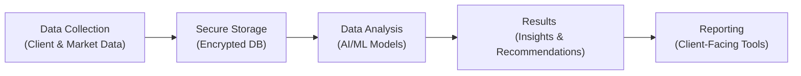

## The Expanding Role of AI in Financial Analytics
Artificial Intelligence (AI) and machine learning (ML) have rapidly become invaluable in streamlining financial decision-making. From anomaly detection in high-frequency trading to sophisticated portfolio optimization, AI-driven analytics can spot trends and patterns that we might miss on our own. I remember, back when I was an intern at an asset management firm, we used to do everything manually—poring over spreadsheets for hours. Nowadays, advanced algorithms can chew through terabytes of trade data in minutes, giving us nearly real-time insights we once only dreamed about. 

Yet, with great computational power comes greater responsibility. And oh boy, do we have a lot to think about. AI systems fuel their predictions using vast amounts of data, often involving sensitive client information. If that information is not properly handled, we risk backlash from clients, reputational damage, and possible penalties under regulations like the General Data Protection Regulation (GDPR) or the California Consumer Privacy Act (CCPA).

## Data Collection and Privacy Risks
Let’s talk data. AI thrives on massive datasets—transactions, client demographic details, social media feeds, market signals, you name it. This appetite for data can tiptoe into ethically gray areas if not managed responsibly. Organizations must be sure that clients know what data is collected and how it is used, not just burying it in the fine print of user agreements. Otherwise, we risk collecting data in ways that violate privacy or trust.

Typically, financial companies might adopt a consent management system that records client permissions. But sometimes, you see data used in ways that might make you squirm—for instance, analyzing a client’s social media posts to glean “sentiment data” about their risk tolerance. This is one of those borderline practices that can breach client expectations. In many cases, a more direct conversation with the client is the only sure path to continued trust.

### Understanding the Privacy Challenges
• Over-collection of Data: Gathering more data than necessary for the stated purpose.  
• Unclear Consent: Clients might not know how their data is used or whether they can opt out.  
• Unauthorized Sharing: Data can be shared with third parties or partners without explicit consent.  
• Profiling Implications: Automated profiling could impact credit evaluations and other essential decisions, potentially harming or excluding individuals unfairly.

## Regulatory Framework and Global Implications
Financial professionals don’t just face a moral decision here—we also have to follow the law. Let’s explore two critical regulations:

• GDPR (General Data Protection Regulation): This EU regulation requires firms to give individuals control over their personal data and to request explicit consent for data collection or analysis. It also mandates the right to be forgotten and imposes significant fines for noncompliance.  

• CCPA (California Consumer Privacy Act): In the United States—specifically in California—CCPA offers consumers the right to know what personal data is collected, delete it, or opt out of sales. It also requires financial institutions to cater to requests for data access and deletion in a timely manner.  

These regulatory frameworks can affect global firms even if they don’t have a physical presence in Europe or California. Handling cross-border data flows gets complicated too. If you’re a large financial institution with offices in multiple countries, you’ll need to coordinate with compliance teams and legal counsel in each jurisdiction.  

And to make matters trickier, local data privacy laws differ across the globe. Another big one is the Personal Data Protection Act in Singapore or the Lei Geral de Proteção de Dados (LGPD) in Brazil. Aligning to them all is no small feat but is essential for any multinational institution.

## Encryption, Anonymization, and Secure Storage
Okay, so maybe you’ve got the data. How do you protect it? Below are three bedrock strategies:

### Encryption
Encryption is the process of encoding information so that only those with the proper digital “key” can read it. In simpler words: if someone intercepts the data, it’s all gobbledygook to them. Whether data is “in transit” (like emails or messages) or “at rest” (stored in databases or servers), encryption is critical.

### Anonymization
Data anonymization strips out personally identifiable information (PII). It’s like blurring a photo: you can still analyze the photo’s color patterns, but you can’t identify the person across the street. In some advanced analytics workflows, anonymized data can still provide valuable insights (like credit risk modeling using aggregated borrower data). But be cautious—complete anonymization can sometimes be reversed if unscrupulous folks cross-reference multiple data sets.

### Secure Storage
Some investment firms maintain on-premises servers with advanced firewalls, while others embrace cloud-based solutions with robust security certifications. Regardless of the approach, you’ll want to ensure proper access controls, routine vulnerability testing, and real-time monitoring. Let’s be honest: the best encryption in the world is meaningless if your database passwords are taped under your keyboard.  

Below is a simple Mermaid diagram demonstrating a hypothetical flow of data in an AI-driven financial analytics process, highlighting key security checkpoints:



As seen above, data flows from initial collection to secure storage, where encryption is applied. The analysis is done by AI/ML modules, culminating in user-friendly reports.

## Ethical Dimensions of Data Usage
Most of us in finance pride ourselves on trust and transparency. But sometimes, the daily pressures to deliver alpha overshadow a firm’s privacy obligations. Here are some major ethical considerations:

• Unauthorized Data Mining: What if an asset manager uses social media signals to glean health information about prospective clients? That’s crossing a line.  
• Profiling Without Consent: AI can produce buyer, investor, or borrower profiles that might be used unfairly if the subject never agreed to have their data processed in that manner.  
• Exploiting Vulnerabilities: Manipulating stock sentiment by feeding inaccurate data into AI-driven systems or capitalizing on personal data about an investor’s financial distress.  

To remain above reproach, many firms create internal policies restricting the use of certain data types—especially health or location data—unless absolutely necessary for the product or service. Strong compliance oversight helps keep everyone on track.

## Fairness and Bias in AI-Driven Analytics
Let’s talk about the possibility of bias in algorithmic decision-making. It can happen more easily than you might think. Consider a machine learning model that evaluates credit risk. If the training data includes historical biases—perhaps certain demographic groups were historically underserved or systematically given lower credits—then the model might learn these patterns. The result? Unfair treatment of specific groups.

In a professional environment, we want fairness. After all, the CFA Institute’s Code and Standards emphasize putting client interests first, being fair, and maintaining integrity. So integrating “fairness audits” or bias checks into your AI pipeline is crucial. Many organizations do this by regularly testing their models’ predictions across demographic slices. If they see disproportionate rejections or risk flags, that’s a red flag requiring deeper analysis.

## Auditing and Oversight for Automated Data Processing
With so many moving parts—data intake, model training, outcome generation—it’s easy for privacy and fairness issues to slip through. Enter the auditors. Third-party reviews and compliance committees offer a second set of eyes to spot potential pitfalls.

• Independent Audits: External investigators assess how you’re collecting, storing, and analyzing data. They can also stress-test your encryption measures and ensure compliance with regulations like GDPR.  
• Internal Compliance Teams: These folks keep day-to-day watch over data governance, verifying that employees uphold ethical and professional standards.  
• Documentation and Version Control: Maintaining thorough, step-by-step records of data usage is essential. Whenever a dataset is updated or an AI model is retrained, compliance teams should be promptly informed.  

Yes, I know it can sound bureaucratic, but thorough auditing helps keep the entire organization honest. If we fail to set up proper oversight, we risk letting unethical or illegal practices slip by.  

## Sample Implementation: Secure and Audited ML Workflow
Below is a short Python snippet illustrating how a financial firm might integrate anonymization and encryption in an AI workflow. This is, of course, an oversimplified example, but it shows how to incorporate these security measures in code:

```python
import hashlib
from cryptography.fernet import Fernet

key = Fernet.generate_key()
cipher_suite = Fernet(key)

def anonymize_record(record):
    # Hashing a unique ID to anonymize
    anonymized_id = hashlib.sha256(record['client_id'].encode()).hexdigest()
    return {
        'client_id': anonymized_id,
        'balance': record['balance'],
        'transaction_history': record['transaction_history']
    }

def encrypt_data(data_str):
    return cipher_suite.encrypt(data_str.encode())

client_data = {
    'client_id': '12345XYZ',
    'balance': 100000.00,
    'transaction_history': '...'
}

anonymized_client = anonymize_record(client_data)
encrypted_data = encrypt_data(str(anonymized_client))

print("Encrypted data:", encrypted_data)
```

Notice how we first anonymize the unique client identifier, then encrypt the entire record before storing or transmitting it elsewhere. Even if a system breach occurs, the attackers can’t associate the resulting data with a real client ID.  

## Exam Tips and Key Takeaways
• Remember to consider both legal and ethical constraints. On the exam, you might be asked how to handle conflicting data privacy requests or evaluate a scenario in which a firm collected more data than necessary.  
• Watch for potential biases in the analytics. If a question involves lending decisions, check if the ML model inadvertently discriminates against certain groups.  
• Keep the CFA Institute Code of Ethics and Standards of Professional Conduct in mind. Specifically, Standards III(A) (Loyalty, Prudence, and Care) and III(E) (Preservation of Confidentiality) often come into play.  
• In an item set or essay question, illustrate how you’d implement encryption, anonymization, and oversight. Regulators and exam graders want to see your ability to articulate the steps to protect client data and maintain trust.  
• Expect to see cross-border data flow discussions. The exam might present a scenario on EU clients with data stored in the U.S. or Asia and ask you to spot the compliance pitfalls.  

Ultimately, data privacy and security for AI-driven analytics go well beyond checking a legal box. They’re about safeguarding the trust we’ve worked so hard to earn with our clients and stakeholders. Balancing advanced analytics with robust privacy practices ensures we don’t lose sight of the fundamental ethical principles we hold dear as financial professionals.

## Glossary
• Artificial Intelligence (AI): The simulation of human intelligence processes by machines, typically involving learning, reasoning, and self-correction.  
• Machine Learning (ML): A subset of AI focusing on algorithms that improve automatically through experience and data analysis.  
• GDPR (General Data Protection Regulation): EU regulation enhancing individuals’ control and rights over personal data.  
• Data Anonymization: Removing personally identifiable information from datasets to protect individuals’ identities.  
• Data Encryption: Encoding information so that only authorized parties can access and read it.  
• Data Breach: An incident where sensitive or protected data is accessed, disclosed, or otherwise compromised.  
• Profiling: Automated processing of personal data to evaluate certain aspects of an individual, such as job performance or creditworthiness.  
• Consent Management: A system to obtain, store, and track client permission for data collection and use.  

## References and Further Reading
• European Commission. (n.d.). “General Data Protection Regulation (GDPR).”  
• U.S. Federal Trade Commission. (n.d.). “Data Security and Consumer Protection.”  
• Schatz, D. & Bashroush, R. (2017). “Cybersecurity Framework in Financial Services.”  

## 10 Must-Know Questions on Data Privacy and Security for AI in Finance



### Which of the following describes a primary risk when mass data collection feeds AI models in finance?

- [x] Collecting personal information without explicit client consent
- [ ] Generating alpha through faster analysis
- [ ] Reducing overhead costs for the firm
- [ ] Improving operational efficiency through automation

> **Explanation:** AI in finance often requires significant personal data, and using it without explicit consent or proper disclosure poses privacy risks and potential regulatory violations.

### Under GDPR, which key right protects individuals by allowing them to have their personal data removed upon request?

- [ ] The right to automated profiling
- [ ] The right to machine learning
- [x] The right to be forgotten
- [ ] The right to universal encryption

> **Explanation:** GDPR’s “right to be forgotten” empowers individuals to request the deletion of their personal data under specific conditions.

### A financial firm’s compliance officer wants to ensure data stored in an AI analytics system cannot be easily linked back to a specific client. Which method should they prioritize?

- [ ] Storing data in plaintext
- [ ] Using the same username for all client data
- [x] Anonymizing all client records
- [ ] Sharing data logs with vendors overseas

> **Explanation:** Data anonymization removes personally identifiable markers, reducing the risk of linking the data back to the individual and mitigating privacy breaches.

### One of the ways to safeguard data in transit is:

- [x] Encrypting data transmissions end-to-end
- [ ] Sending private data through compressed text files without a password
- [ ] Relying on unverified, open-wireless networks
- [ ] Sharing in plain text with internal staff

> **Explanation:** End-to-end encryption ensures that only the sender and intended recipient can read the transmitted data.

### Which of the following best characterizes AI “fairness audits”?

- [ ] Audits that measure how quickly an AI model processes data
- [x] Periodic evaluations checking if data-driven decisions are biased
- [ ] Investigations that ensure models run on the latest software version
- [ ] Reviews solely targeting encryption keys

> **Explanation:** Fairness audits specifically seek to identify and mitigate systematic discrimination in ML-driven decisions.

### A breach occurs when:

- [x] Sensitive or protected client information is accessed or disclosed without authorization
- [ ] You successfully encrypt and backup financial records
- [ ] A client forgets their account password
- [ ] The S&P 500 experiences abnormal volatility

> **Explanation:** A data breach involves the unauthorized access, disclosure, or theft of protected or sensitive information.

### When combining data from multiple sources for AI analysis, a crucial safeguard to prevent re-identification is:

- [x] Cross-referencing anonymized records with advanced hashing and partial data masking
- [ ] Using only publicly available data
- [x] Ensuring client data is properly anonymized or pseudonymized
- [ ] Avoiding any linking of data attributes

> **Explanation:** Without strong anonymization methods and partial data masking, cross-referencing multiple data sets could inadvertently lead to re-identification of individuals.

### What is a critical step in complying with GDPR for an AI-driven application that uses personal data?

- [ ] Only retaining the data for as long as you desire
- [x] Providing clear and concise consent forms
- [ ] Mandating that clients must share biometric data
- [ ] Restricting audits to once every five years

> **Explanation:** Under GDPR, organizations must obtain explicit consent and inform individuals how their data is used, stored, and potentially shared.

### In a financial context, encrypting “data at rest” refers to:

- [x] Securing stored data using cryptographic methods so it cannot be read if accessed without authorization
- [ ] Locking the office doors after hours
- [ ] Conducting daily backups of client data to an offsite server
- [ ] Hiding passwords under the keyboard

> **Explanation:** Encrypting data at rest helps protect stored data in databases or data warehouses from unauthorized access or theft.

### True or False: Firms must integrate oversight and periodic audits to ensure automated data processing adheres to ethical and regulatory standards.

- [x] True
- [ ] False

> **Explanation:** Integrating oversight and regular audits is essential to verify compliance with both ethical guidelines and regulations, catching potential issues early on.


