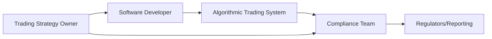

## High-Speed Execution and the Need for Ethical Oversight

Algorithmic trading (often nicknamed “algo trading” or automated trading) involves high-speed computer systems that execute orders according to pre-programmed strategies. Folks sometimes ask me, “Doesn’t that make the trading process more efficient and robust?” Well, often it does—these algorithms can scan thousands of securities in milliseconds, searching for patterns or exploitable price differences. Indeed, at its best, algo trading lowers transaction costs, tightens bid-ask spreads, and enhances market liquidity. But there's a catch: it also creates ethical, operational, and accountability challenges that are different from those in traditional manual trading.

The speed at which algo trades occur introduces unique risks; imagine hundreds of thousands of trades placed in fractions of a second. If the parameters are wrong or if the code has a glitch, we risk a cascade effect that might disrupt entire markets. This is why the issue of truthfulness and accountability in algorithmic trading has become a hot topic globally and, quite frankly, a key area for any CFA candidate or practitioner to master. Market participants must ensure their algorithms respect the integrity of the market and do not inadvertently (or intentionally) cause harm—be it through manipulation or poor risk oversight.

## Ethical Concerns and Potential Market Manipulation

One of the most pressing ethical concerns with algo trading is the potential for manipulative tactics such as spoofing and layering. Both activities are designed to mislead the market about supply and demand, but they can be quick to implement and tough to identify if no one is looking.

- Spoofing: Placing a large order with no genuine intent to execute, with the aim to push market prices. Picture a scenario where someone (or some machine) places a big order to sell shares of a stock just to scare other traders into lowering their bids. Then, right before execution, that large order is canceled, leaving the unsuspecting participants at a disadvantage.
- Layering: Rather like spoofing, layering involves placing multiple layers of fake orders to create an illusion of strong supply or demand at different price levels. This can trick momentum-based or volume-based algos into reacting, which then benefits the manipulator.

Both of these practices undermine market integrity. They distort the market’s natural dynamics, which rely on honest expressions of supply and demand to set fair prices. The challenge is that advanced algorithms can commit these acts in fleeting moments, making detection by manual compliance teams harder. While regulators worldwide are stepping up oversight, it’s crucial that industry participants establish robust detection and deterrence practices.

## Accountability in Automated Environments

When trades are executed automatically, one question inevitably arises: “Who is to blame when something goes wrong?” Is it the portfolio manager who designed the strategy? The software developer who coded it? The compliance officer responsible for oversight? The answer is often that accountability is shared. 

In an ethical, well-governed organization, each stakeholder has a clearly defined role:

- System Owners: Generally responsible for the business logic and outcomes of the trading strategy. They must verify and document the strategy’s objective, risk parameters, and compliance with applicable regulations.
- Compliance Officers: Oversee the operational risks and ensure that the firm isn’t facilitating manipulative or abusive trade behaviors. They usually handle ongoing monitoring, investigating alerts, and escalation of issues.
- Software Developers and Engineers: While not typically final decision-makers in trading, they hold responsibility for writing accurate, well-tested code. They must maintain thorough documentation, including version controls and explicit disclaimers about assumptions in the algorithms.

The chart below shows a simplified view of how accountability can be structured among the main stakeholders in an automated trading environment:



In practice, strong communication among these parties reduces confusion and fosters a culture of ownership and responsibility. Legal ramifications may vary by jurisdiction, but regulators often examine whether each party acted with due care, followed best practices, and maintained accurate records.

## Risk Controls and Continuous Monitoring

To keep the train on the rails, algo trading systems rely on robust risk controls, including both pre-trade checks (like maximum order sizes or price collars) and post-trade reviews (like surveillance reports and profitability analyses). Pre-trade risk controls can stop an erroneous or overly large order from even hitting the market, while real-time signals can detect suspicious patterns and allow the compliance team to investigate or halt the strategy immediately.

For instance, your firm might set daily notional limits so that any single strategy can’t exceed a certain threshold. Another common best practice is requiring that all new or significantly modified strategies undergo a strict approval process involving risk management and compliance. This approval process typically includes code reviews, scenario testing, and viability assessments for worst-case market conditions.

## Enhancing Truthfulness through Real-Time Surveillance

One way to ensure markets remain truthful (i.e., reflect genuine supply and demand) is through data analytics and real-time surveillance tools. Imagine an advanced software system that monitors trading patterns across all strategies in real time, looking for red flags: repeated orders placed and canceled within microseconds, unusually large orders near major price thresholds, or even correlated patterns among multiple accounts.

If the system suspects spoofing or layering, it triggers an alert that is sent to compliance. Firms can then freeze ongoing trading, investigate, and potentially shut down or modify the strategy. Automated surveillance is crucial because manual reviews are simply too slow to detect manipulative patterns in these high-speed environments.

## Scenario Testing and Backtesting

Before a new algorithmic strategy goes live, most firms conduct extensive backtesting. They use historical data to see how the strategy would have performed in different market conditions. However, “past performance is not indicative of future returns,” as the disclaimers often say, so scenario testing takes it a step further by subjecting the strategy to hypothetical flash crashes, periods of extremely low liquidity, or cyclical bear markets. 

In my own early days in algorithmic trading, I was once baffled at how drastically a strategy could collapse in a hypothetical scenario—only to realize that the code had never accounted for data feed lags in volatile markets. This example underscores the importance of thorough backtesting and scenario testing to avoid big blowups and, you know, losing investor confidence.

Below is a simplified illustration of a backtesting workflow using Python-like pseudocode:

```python
import pandas as pd
import numpy as np

# This is just a demonstration snippet and not a full production code.

data = pd.read_csv("historical_prices.csv")

data['SMA_50'] = data['Close'].rolling(window=50).mean()
data['SMA_200'] = data['Close'].rolling(window=200).mean()

data['Signal'] = 0
data.loc[data['SMA_50'] > data['SMA_200'], 'Signal'] = 1  # Buy signal
data.loc[data['SMA_50'] < data['SMA_200'], 'Signal'] = -1 # Sell signal

data['Daily_Return'] = data['Close'].pct_change()

data['Strategy_Return'] = data['Daily_Return'] * data['Signal'].shift(1)

cumulative_returns = (1 + data['Strategy_Return']).cumprod() - 1
print("Cumulative returns: ", cumulative_returns.iloc[-1])
```

Such testing is indispensable, but it’s not foolproof. We must consider new market conditions or sudden shocks that historical data cannot fully predict. Ongoing refinements and repeated testing help maintain robust approaches.

## Case Example: Flash Crash Risk

A notorious real-world example is the so-called “Flash Crash” of May 6, 2010. On that afternoon, the Dow Jones Industrial Average dropped nearly 1,000 points within minutes, only to bounce back just as quickly. Investigators identified a complex interplay of algorithmic strategies reacting to one another’s actions, causing liquidity to dry up in a matter of seconds.

Flash crashes highlight how quickly algo-driven markets can go haywire. If a single flawed strategy triggers a chain reaction of panic selling among other algos, the downturn could intensify. Robust real-time controls and circuit breakers (trading halts triggered by sudden price moves) can help prevent large-scale damage. For exam-day scenarios, be ready to identify the underlying triggers of such events and propose risk controls that mitigate them.

## Practical Implementation: Tools and Techniques

To preserve truthfulness in algorithmic trading, practitioners should embrace a suite of practical tools and techniques:

- Thorough Documentation: Keep a written summary of each strategy’s purpose, assumptions, risk factors, and compliance approvals.
- Behavior Monitoring: Implement real-time monitoring tools that flag rapid-fire cancellations, outlier trades, and suspicious price movements.
- Periodic Model Review: No model is static; regular updates must be made based on changing market conditions, new regulatory guidance, or updated risk tolerance.

In addition, alignment with major regulatory frameworks is essential. For instance, in the United States, the Commodity Futures Trading Commission (CFTC) and the Securities and Exchange Commission (SEC) require certain disclosures about automated strategies and place responsibility on registrants to prevent manipulative behavior. Globally, many regulators have begun to adopt comparable standards, sometimes influenced by the International Organization of Securities Commissions (IOSCO).

## Disclosure and Transparency

Solid disclosure practices help ensure that trading counterparties, clients, and regulators understand the nature and scope of a firm’s automated trading. Firms with a significant presence in algo trading often provide disclaimers and documentation about:

- The degree of automation (Are trades executed entirely automatically, or is there a trader approving each order?)
- Potential conflicts of interest (For instance, if the firm is both market maker and proprietary trader on the same exchange)
- How risk is monitored and escalated

Communication is key. A well-publicized code of conduct, accompanied by training sessions and routine compliance checks, reinforces the importance of ethical behavior and accountability.

## Best Practices for Exam Readiness

In exam-related questions, you might see a scenario describing an algorithm that inadvertently manipulates the market or fails to prevent a flash crash. Your response needs to outline both the immediate steps (e.g., halting the strategy, correcting the code) and the broader preventative measures (e.g., rigorous pre-launch testing, real-time monitoring, accountability across teams). 

Candidates should also anticipate “ethics meets technology” or “professional conduct meets algorithmic trading” item sets emphasizing enforcement of Standard II (Integrity of Capital Markets). Prepare to address:

- How a firm must disclose potential conflicts or sources of non-public data used by the algo.
- Specific steps to ensure the strategy doesn’t engage in manipulative behaviors like spoofing or layering.
- The role of ongoing training, oversight, and scenario testing in preventing unethical conduct.

By weaving together knowledge from Standards I–VII within the algorithmic context, you’ll strengthen your ability to solve complex, technology-infused ethical questions on the CFA exam.

## References and Further Reading

- U.S. Commodity Futures Trading Commission (CFTC). (n.d.). “Regulations on Algorithmic Trading.”  
- Securities and Exchange Commission (SEC). (2013). “Technology and Trading: The Impact on Markets.”  
- Kissell, R. (2013). The Science of Algorithmic Trading and Portfolio Management.  

## Glossary

• Algorithmic Trading (Algo Trading): Computer-driven trading activity utilizing pre-defined rules, data feeds, and real-time market conditions.  
• Spoofing: Intentional placing and canceling of large orders to move prices artificially, without the intent to execute the trade.  
• Layering: A form of spoofing where multiple price layers are placed to create a deceptive impression of market depth or demand.  
• Flash Crash: A rapid, deep, and volatile fall in security prices occurring within an extremely short time, typically followed by quick recovery.  
• Market Integrity: The fairness and reliability of the trading environment, free from manipulative behavior or other violations.  
• Pre-Trade Risk Controls: Checks made on an order before it is sent to an exchange to prevent excess risk or erroneous trades.  
• Backtesting: Testing a strategy or model using historical data to assess past performance and potential reliability.  
• Real-Time Surveillance: Ongoing monitoring tools that track trading activities as they happen to identify anomalies or breach of rules.  

---

## Test Your Knowledge: Algorithmic Trading Ethics and Accountability



### Which of the following practices is an example of market manipulation in algorithmic trading?

- [ ] Placing multiple limit orders at prices close to the current market price to capture liquidity.
- [x] Entering large orders with the intention to cancel them before execution to affect prices.
- [ ] Maintaining a balanced portfolio that rebalances automatically.
- [ ] Using a simple moving average to determine trade signals.

> **Explanation:** Deliberately placing and canceling large orders without the intention to execute is known as spoofing, a manipulative tactic that distorts market signals.

### In an automated trading environment, who generally holds ultimate responsibility for the strategy’s outcomes?

- [x] The trading strategy owner, although other stakeholders also share accountability.
- [ ] The software engineers alone.
- [ ] Only the compliance department.
- [ ] The regulators monitoring the market.

> **Explanation:** While multiple parties share responsibility, the trading strategy owner typically holds ultimate accountability for the strategy’s goals, performance, and compliance with regulations.

### What is the primary purpose of real-time surveillance in the context of algo trading?

- [x] To detect and prevent manipulative trading activities as they occur.
- [ ] To optimize trading costs and minimize slippage.
- [ ] To gather historical data for after-market analysis.
- [ ] To design new trading models in real time.

> **Explanation:** Real-time surveillance systems are designed to identify anomalous or manipulative activities (e.g., spoofing, layering) as they happen, preventing escalating market distortions.

### Which of the following best describes a flash crash?

- [ ] A gradual decline in stock prices over multiple days.
- [x] A rapid, deep, and volatile drop in prices that typically rebounds quickly.
- [ ] A consistent upward trend in the equity market.
- [ ] A permanent one-time market correction.

> **Explanation:** Flash crashes are abrupt, extremely fast price declines often triggered by automated, high-frequency trading and exacerbated by system interactions.

### Which measure is commonly used as a pre-trade risk control?

- [x] Maximum order size limits.
- [ ] Fundamental analysis of company financials.
- [x] Price collars preventing orders from deviating too far from the current quote.
- [ ] Relationship mapping between different exchanges.

> **Explanation:** Pre-trade risk controls like order size limits and price collars help prevent erroneous or overly large orders and maintain market integrity.

### What is a key advantage of incorporating scenario testing into algo development?

- [x] It exposes potential vulnerabilities in the algorithm by simulating extreme market events.
- [ ] It ensures the strategy will always be profitable.
- [ ] It eliminates the need for compliance oversight entirely.
- [ ] It replaces backtesting and historical analysis.

> **Explanation:** Scenario testing complements backtesting by applying hypothetical stressful or unusual market conditions to reveal how robust the strategy is under various scenarios.

### Why do regulators often require disclosures regarding automated operations?

- [x] To ensure transparency and allow market participants to understand the potential impact of high-speed trades.
- [ ] To limit the exponential growth of trading volumes.
- [x] To promote accountability and prevent the concealment of manipulative algos.
- [ ] To discourage firms from using advanced technology.

> **Explanation:** Regulators mandate disclosures so that both investors and other market participants can grasp the scope and potential risks of algorithmic trading strategies, improving overall transparency and accountability.

### How can data analytics promote truthfulness in algorithmic trading?

- [x] By monitoring order flow and identifying suspicious patterns in real time.
- [ ] By automatically executing every order from all market participants.
- [ ] By restricting firms to a single algorithm only.
- [ ] By removing the need for compliance checks.

> **Explanation:** Advanced data analytics can help spot irregularities, such as frequent cancelations or spoofing attempts, enabling swift intervention before manipulative trading affects the market.

### Which of the following is a vital benefit of properly documented algorithmic trading strategies?

- [x] It enables clear accountability among all stakeholders involved.
- [ ] It guarantees profitable returns.
- [ ] It removes the need for external audits.
- [ ] It reduces system maintenance costs to zero.

> **Explanation:** Proper documentation delineates each party’s responsibilities and underpins transparent oversight, crucial for ethical and compliant automated trading operations.

### True or False: Backtesting alone is sufficient to ensure an algorithmic trading strategy will not fail under future market conditions.

- [x] True
- [ ] False

> **Explanation:** This is actually a trick question—it's False that backtesting is sufficient. Simply relying on historical data does not guarantee future market conditions will mirror the past. Scenario testing and ongoing refinements are essential.


