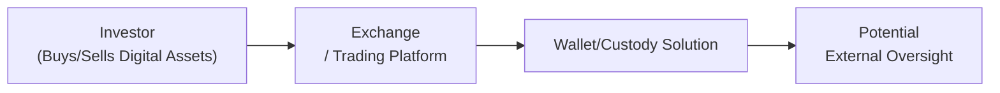

## Introduction and Overview

If you’ve ever sat down with a friend—like my buddy who once spent three hours trying to explain to me why meme-tokens were the next big thing—you might have felt that swirl of excitement around digital assets. You probably heard wild stories about surging prices, unstoppable technologies, or maybe unstoppable hype. At the same time, you might have wondered, “Where exactly are the guardrails?” This question lies at the heart of underregulated digital assets. These are the frontier markets of finance, where technology evolves so fast that laws, ethical frameworks, and regulatory bodies struggle to keep pace.

Digital assets encompass a wide array of instruments, from cryptocurrencies like Bitcoin to stablecoins pegged to fiat currencies, from non-fungible tokens (NFTs) to decentralized finance (DeFi) protocols. While many see these innovations as transformative, the regulatory vacuum surrounding them invites headaches related to fraud, extreme volatility, and investor protection challenges. Is it even possible to ensure ethical behavior in markets that morph faster than the rules themselves? Let’s explore.

## Evolving Landscape of Digital Assets

Digital assets refer to digitized units of value or representations of ownership secured by cryptographic methods. They often operate on decentralized networks (commonly blockchains), allowing peer-to-peer transactions and bypassing the need for traditional intermediaries such as large banks. Let’s break down some core digital asset types:

Cryptocurrencies: These typically serve as mediums of exchange or stores of value. Bitcoin (BTC) and Ethereum (ETH) are the most famous cryptocurrencies, albeit with drastically different use cases.  
Stablecoins: Designed to maintain a stable value by pegging to fiat currencies (e.g., USD), commodities, or via algorithmic mechanisms. Examples include USDT (Tether) or USDC (USD Coin).  
NFTs (Non-Fungible Tokens): Unique digital assets representing ownership of a particular item, often digital art or in-game collectibles.  
DeFi Tokens: Tokens powering decentralized financial platforms, facilitating lending, borrowing, or derivatives trading without conventional banks.  

### Key Terminology

• Cryptocurrency: A digital or virtual currency using cryptography for security, often functioning on decentralized networks like blockchain.  
• Stablecoin: A cryptocurrency designed to maintain a stable value, usually by pegging to a fiat currency, commodity, or algorithmic reserve mechanism.  
• DeFi (Decentralized Finance): Financial services operating without central intermediaries, relying on smart contracts on a blockchain network.  
• Non-Fungible Token (NFT): A unique digital asset representing ownership of a specific item or piece of content, verified on a blockchain.  
• Regulatory Arbitrage: Exploiting gaps between different regulatory environments to gain advantage or bypass certain requirements.  
• Central Bank Digital Currency (CBDC): A virtual form of a fiat currency issued and regulated by a country’s central bank.  
• Market Volatility: Frequent or rapid changes in asset prices, often linked to higher investment risk.  
• Custody Solutions: Mechanisms for safely storing digital assets, including hardware wallets, software wallets, and institutional frameworks.

## Current Regulatory Gap and Ethical Challenges

One hallmark of digital assets is the patchwork of rules that govern them—or more accurately, sometimes fail to govern them. Traditional financial regulations evolved around centralized entities like banks and broker-dealers. However, with the rise of decentralized networks, regulators often face two big problems:

1. Jurisdiction. Transactions can happen anywhere, spanning continents at the speed of the internet. When a transaction crosses borders, it may slip between the cracks of existing financial laws.  
2. Novel Structures. DeFi platforms and certain blockchain applications are disintermediated and open-source. Who exactly is responsible if something goes wrong? Who do regulators even call for accountability?

### Ethical Dilemmas from Investor Protection Gaps

From an ethical standpoint, the principal question is how to ensure that participants in these markets aren’t exploited. Issues include:

• Lack of Disclosure: Unlike public companies bound by comprehensive disclosure rules, many token projects or decentralized platforms operate with minimal transparency.  
• Fraud Potential: Ponzi schemes, pump-and-dump campaigns, and outright exit scams flourish in an environment with limited oversight.  
• Market Volatility: Price sways of 10%, 20%, or more in a single day remain common, risking the financial well-being of less sophisticated investors.

To illustrate, consider a scenario: A new token project appears on a decentralized exchange promising “guaranteed yields of 200%.” The project has no audited financial statements and no real track record. Eager investors rush in, only to find out the token’s liquidity disappears within weeks, wiping out savings. This phenomenon has happened time and again, raising serious ethical concerns about transparency, governance, and investor education.

## Spotlight on Stablecoins

Stablecoins were designed to address some of this volatility. By pegging their value to more stable assets—like the US dollar—they aim to provide a refuge within the digital asset space. Tether (USDT), for instance, claims each token is backed 1:1 by US-dollar reserves. Others such as USDC (Circle) maintain robust compliance with US regulators and publish regular attestation reports. Meanwhile, algorithmic stablecoins, which rely on automated supply adjustments, have proven susceptible to major collapses (we only have to recall the meltdown of certain high-profile algorithmic stablecoins in 2022).

### Ethical Concerns Around Stablecoin Reserves

• Transparency: Are stablecoins truly backed by the reserves they claim? Who verifies these reserves, and how often?  
• Liquidity: In a crisis, can all stablecoin holders redeem their tokens at the promised fixed value? If not, that calls the entire peg into question.  
• Systemic Risk: Large stablecoins (by market capitalization) might threaten broader financial stability if they fail, especially if they hold risky or illiquid underlying assets.

Stablecoin issuers must adopt transparent policies, possibly including third-party audits, real-time reserve reporting, and strict compliance with anti-money laundering (AML) and know-your-customer (KYC) rules. Ethically, this is about more than just limiting fraud; it’s also about ensuring financial stability in a growing digital ecosystem.

## Rise of Decentralized Finance (DeFi)

DeFi is like finance’s rebellious child, telling banks, “We don’t need you.” Instead, participants interact with liquidity pools, automated market makers, and decentralized lending protocols. Users can deposit some crypto into a pool, earn interest, or borrow against it in seconds, all via self-executing smart contracts running on a blockchain. As someone who once spent three days waiting for a wire transfer to clear, I can sense the transformative potential. But the lack of a central authority also raises ethical and legal accountability questions:

• Who is responsible if a smart contract has a coding flaw and $50 million gets stolen?  
• How do you handle disputes between parties if there’s no single entity to mediate?  
• If fees are manipulated, who do you complain to?

### Accountability Without a Central Body

Many DeFi platforms rely on governance tokens where holders make decisions collectively—think of it as a mini-democracy of sorts. Yet, decentralized governance is tricky: voter turnout can be low, and big token holders might exert outsized influence, effectively forming an unregulated oligarchy. Ethically, we must ask if this truly democratizes finance or if it inadvertently concentrates power in the hands of a few savvy players.

## Central Bank Digital Currencies (CBDCs) and Ethical Shifts

In parallel, governments worldwide are exploring central bank digital currencies (CBDCs). CBDCs represent a digitized version of national fiat currencies (like a “digital dollar” or “digital euro”). Unlike cryptocurrencies, they’re fully centralized and regulated by the issuing central bank. Potential benefits of CBDCs include faster settlement times, reduced transaction costs, and broader financial inclusion if implemented properly. But their introduction may also:

• Provide central authorities with real-time data on individual transactions, raising concerns about privacy and surveillance.  
• Shift the competitive landscape by offering a digital asset that is, presumably, risk-free compared to “private” stablecoins.  
• Alter cross-border remittances, spurring changes in foreign exchange controls.

From an ethical and regulatory standpoint, the arrival of a widely adopted CBDC could dampen speculation in some private digital assets. However, government access to personal transaction data can stoke fresh debates on privacy rights and oversight. How much transactional transparency is “too much”? Maybe you’re comfortable with the Federal Reserve seeing your daily coffee purchases, but maybe not. These are no longer hypothetical scenarios; pilot projects are already in flight in places like China, the Bahamas, and Nigeria.

## Investor Education in a Rapidly Evolving Market

It’s astonishing how many people jump into digital asset markets simply because of fear of missing out (FOMO). The old golden rule—“Don’t invest in something you don’t understand”—often gets tossed aside. Whenever my phone pings me with a novice investor asking, “Should I put all my money into “HotNewCoin” that my coworker recommended?”, I sense the urgency of broad-based education. Formal guidelines from regulators still lag, which intensifies the gap in knowledge. Investors must be made aware of:

• Private key management and custody solutions: Lose your key, lose your funds.  
• Smart contract risks: Exploits often result in instant financial losses with little recourse.  
• Regulatory differences by region: Some countries have banned crypto. Others are wide open.  

### Practical Example

Imagine an investor who just discovered DeFi. They see a yield farming opportunity offering 150% APY. Intrigued, they deposit a large portion of their net worth into a vaguely described smart contract. Suddenly, a hacking incident drains the liquidity pool. Because there’s no deposit insurance or regulatory recourse, the investor’s funds vanish. Educating investors about these potential pitfalls could prevent disastrous financial outcomes and underscores a critical ethical obligation for financial professionals guiding clients in these nascent markets.

## Potential Frameworks for Self-Regulation and Standards

Until formal regulatory frameworks catch up, industry participants are exploring self-regulation and best-practice guidelines:

• Third-Party Audits: Having reputable firms confirm the integrity of smart contracts, stablecoin reserves, or security protocols.  
• Code of Conduct for Exchanges and Wallet Providers: Outlining transparent listing processes, consumer protection policies, and disclosure requirements for new tokens.  
• Rating Agencies for Digital Assets: Similar to credit rating agencies, these entities could assess the trustworthiness of different crypto projects or stablecoins.  
• Insurance Pools: DeFi platforms are exploring mutualized insurance pools where participants buy coverage for potential smart contract failures.

### Example of an Emerging Self-Regulatory Model

Some DeFi projects voluntarily subject their smart contracts to rigorous external security reviews—sometimes multiple times—before launching services. Others propose system-wide “circuit breakers,” letting governance token holders temporarily freeze funds if a suspicious spike in activity is detected. These frameworks mimic certain regulatory controls from traditional finance but adapt them to the realities of a decentralized environment.

## Visualizing the Ecosystem

Below is a basic Mermaid diagram that depicts interactions among key players—an investor, an exchange/trading platform, a custodial solution, and potential oversight bodies that remain mostly outside or incomplete in some jurisdictions.

• A → B: The investor typically interacts through a platform or exchange to buy or sell digital assets.  
• B → C: The exchange might provide or integrate with custody solutions, or the investor might use personal hardware/software wallets.  
• C → D: Government agencies or self-regulatory bodies may try to implement rules, but the oversight is often inconsistent or lacking compared to traditional finance.

## Ethical Considerations for the Future

As digital assets evolve, so too will the nature of ethical considerations. For instance:

• Should stablecoin issuers provide live dashboards of reserve holdings, updated hourly or daily, to ensure transparency?  
• Will major DeFi protocols adopt “ethical or social responsibility” guidelines, prioritizing user safety over certain high-risk yield offerings?  
• Could CBDCs inadvertently lead to authoritarian control over financial flows, or might they expand financial access to unbanked populations?

One possibility is that we see a hybrid model: governments issuing guidelines that clarify basic protections—like which disclosures stablecoin issuers must make—combined with robust self-regulatory structures. If done well, it could encourage innovation while curbing the most egregious behaviors.

## Exam Relevance and Practical Tips

CFA candidates keen on portfolio management, compliance, and risk oversight need to stay informed about these emerging markets. While digital assets might not appear as heavily in the Level I curriculum as in advanced discussions, ethical responsibilities apply universally. Below are some practical ways these topics might show up in exam scenarios and real professional life:

• Scenario-Based Ethics Question: For instance, analyzing a charterholder’s duty of loyalty, prudence, and care when recommending an underregulated token to a client.  
• Performance Measurement: Understanding how large price swings or insufficient liquidity data complicate performance metrics.  
• Risk Management: Assessing how to hedge or mitigate digital asset volatility, or even if your firm should set boundaries on digital asset allocations.  
• Client Education: Demonstrating a professional’s responsibility to inform clients about the unique risks of digital assets, akin to enlightening them on alternative investments but with even more disclaimers.  

### Common Pitfalls

• Overconfidence in Unverified Projects: Even if a colleague recommends it, always do your own due diligence.  
• Ignoring Custody Risk: Institutions need robust solutions, insurance coverage, and business continuity planning.  
• Regulatory Arbitrage: Operating in multiple jurisdictions without fully understanding local laws can easily lead to compliance breaches.  

## References and Further Reading

• International Monetary Fund (IMF). (2021). “The Regulation of Cryptocurrencies.”  
• Financial Stability Board (FSB). (2022). “Global Regulatory Approaches to Digital Assets.”  
• BIS (Bank for International Settlements). (2022). “Central Bank Digital Currencies in Emerging Markets.”

------------------

## Test Your Knowledge: Ethical and Regulatory Challenges in Digital Assets



### Which of the following statements best describes why digital assets are considered “underregulated”?

- [ ] They already comply with all existing regulatory standards worldwide.  
- [ ] They are simple instruments that do not require any regulations.  
- [x] Their rapid innovation and decentralized nature outpace traditional regulatory frameworks.  
- [ ] Their pricing is determined by central banks in real time.  

> **Explanation:** Digital assets, especially decentralized ones, operate beyond the scope of most regulatory frameworks. Their rapid innovation and cross-border capabilities make them difficult to regulate under preexisting rules.

### What is the primary ethical concern associated with stablecoins?

- [ ] Their ability to appreciate in value at high rates.  
- [ ] Their widespread adoption by central banks worldwide.  
- [ ] Their potential to replace traditional banks entirely.  
- [x] The integrity and transparency of the reserves backing them.  

> **Explanation:** While stablecoins are designed to reduce volatility, questions about the nature and transparency of the reserves (who audits them, how frequently, etc.) constitute a primary ethical concern.

### Decentralized Finance (DeFi) platforms remove intermediaries such as banks. Which of the following is a key ethical challenge in DeFi?

- [ ] Guaranteed returns for all stakeholders.  
- [x] Lack of a central authority to hold accountable in the event of smart contract flaws or fraud.  
- [ ] Absolute integration with government systems.  
- [ ] Uniform regulation across all countries.  

> **Explanation:** DeFi’s core premise is bypassing banks and other intermediaries, which complicates accountability. If a smart contract exploits user funds, it’s often unclear who can be held responsible.

### A digital asset firm exercises regulatory arbitrage when it:

- [ ] Implements a transparent audit of its reserves.  
- [x] Shifts operations to jurisdictions with lax regulations to evade stricter compliance.  
- [ ] Seeks verification by major regulatory bodies.  
- [ ] Allocates some profits to investor education programs.  

> **Explanation:** Regulatory arbitrage happens when a firm chooses to operate in jurisdictions with lenient or ambiguous regulations, thereby reducing oversight and potentially gaining unjust advantages over more regulated markets.

### Which of the following describes a potential benefit of Central Bank Digital Currencies (CBDCs)?

- [x] Faster settlement times and potentially broader financial inclusion.  
- [ ] Absolute anonymity for all transactions.  
- [x] Reduced transaction costs compared to traditional methods.  
- [ ] No oversight or regulatory involvement.  

> **Explanation:** CBDCs, being state-backed digital currencies, can streamline payments, lower costs, and possibly increase access to financial services. They are the opposite of anonymous; privacy and oversight remain key issues.

### What role do third-party audits play in ensuring the ethical operation of digital asset projects?

- [x] They provide independent verification of reserves and smart contract security.  
- [ ] They replace any need for self-regulation or legal frameworks.  
- [ ] They serve mainly as marketing tools with minimal substance.  
- [ ] They only focus on consumer outreach.  

> **Explanation:** Third-party audits provide credibility and maintain trust in digital asset projects. They can confirm that reserves exist where claimed and that the code is relatively secure, though they are not a silver bullet.

### In what way can investor education help mitigate the risks of underregulated digital assets?

- [ ] It encourages speculation and more frequent trading.  
- [x] It helps individuals understand potential pitfalls, custody risks, and project transparency.  
- [ ] It guarantees a stable return on investment.  
- [ ] It eliminates the possibility of project failure.  

> **Explanation:** Investor education addresses the widespread knowledge gap. By understanding how digital assets and DeFi protocols work, traders and investors are better equipped to spot red flags before committing funds.

### How might decentralized governance in DeFi pose ethical concerns?

- [x] Large token holders can dominate decisions, potentially sidelining smaller participants.  
- [ ] It always guarantees fair and balanced voting power.  
- [ ] It only allows central banks to vote on protocol changes.  
- [ ] It is primarily regulated by the United Nations.  

> **Explanation:** Although in theory decentralized governance democratizes decision-making, in practice, “whales” with large token holdings may exert excessive influence, creating another layer of power imbalance.

### From an ethical standpoint, why should digital asset exchanges adhere to robust KYC (Know Your Customer) practices?

- [x] To prevent illegal activities such as money laundering and terrorist financing.  
- [ ] To limit the number of people who can join the exchange.  
- [ ] To ensure traders can exploit market volatility easier.  
- [ ] To reduce transaction fees for institutional investors.  

> **Explanation:** KYC processes help ensure that digital asset trading isn’t used as a channel for illicit finance. By verifying identities, exchanges align better with global AML (Anti-Money Laundering) regulations.

### True or False: Central Bank Digital Currencies (CBDCs) are always decentralized and run on permissionless blockchains.

- [x] True  
- [ ] False  

> **Explanation:** This is actually a trick statement. The answer is “False” because CBDCs are typically issued and managed by a central bank, operating under a permissioned system rather than a fully decentralized blockchain.  


