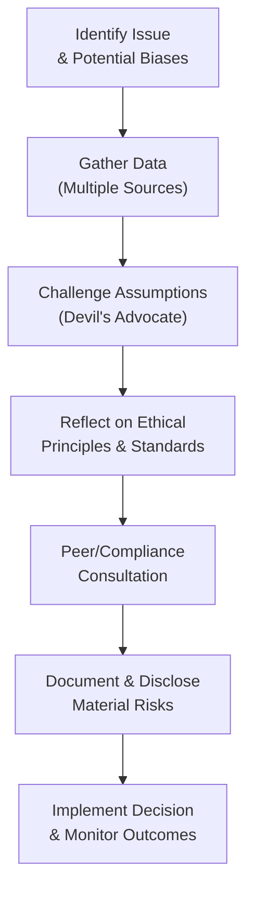

## Introduction and Overview

Behavioral economics has been reshaping the finance industry for quite some time, but it’s also been quietly introducing new ethical gray areas. I remember, early in my career, feeling pretty comfortable with traditional financial theory: rational agents, efficient markets, and all that jazz. Then I stumbled upon my first big lesson in behavioral finance—overconfidence bias—by overselling a stock’s upside to a close friend, only to feel that twinge of guilt when the investment didn’t quite work out. That “twinge” was my conscience telling me I needed a much stronger ethical framework for all these exciting new psychological insights.

In this section, we’ll look at how behavioral economics can influence decision-making in investment management and why these influences raise unique ethical concerns. We’ll cover several classic biases—like overconfidence, loss aversion, anchoring, and others—and discuss how each one can morph into an ethical dilemma if left unchecked. Finally, we’ll talk about ways to mitigate and monitor these biases, especially through structured decision-making frameworks and ongoing ethical oversight.

## Cognitive and Emotional Biases in Investment Decisions

Behavioral economics challenges the assumption that people always act rationally. Instead, it argues that decision-making is often shaped by psychological, emotional, and social influences. Let’s explore some key biases:

### Overconfidence Bias
It’s quite normal for professionals—and especially for investment managers—to feel confident in their analyses. But overconfidence is like thinking you’re Tiger Woods after a single good shot at mini-golf: it’s just not grounded in reality. Overconfident managers might ignore downside risks, disregard contradictory evidence, or over-promise results to investors. Ethically, this can lead to misrepresenting risk or failing to disclose uncertainties adequately.

### Loss Aversion
In prospect theory, championed by Kahneman and Tversky, loss aversion describes how people experience the pain of a loss more intensely than the pleasure of a similar gain. In practice, a manager might hold on to a losing position too long, hoping to “break even,” instead of acting in the client’s best interest by cutting losses. Temporarily, it might soothe anxieties, but it can violate the ethical principle of loyalty to clients.

### Anchoring
Anchoring occurs when people fixate on an initial piece of information—like the price at which they first bought a security—and use that as a reference point. If the initial price is flawed, or if market conditions have changed substantially, clinging to that anchor can steer decisions off course. Ethically, ignoring new data or relying too heavily on an outdated anchor can lead to suboptimal advice.

### Confirmation Bias
Many of us have experienced how easily we sniff out supporting data for what we already believe, while ignoring everything that doesn’t fit. With confirmation bias, analysts might selectively gather or emphasize information that confirms their preconceived notions. If this leads to ignoring material risk factors, it compromises ethical obligations, particularly in the area of due diligence and loyalty to clients.

### Herding Behavior
Sometimes referred to as “groupthink on steroids,” herding behavior is when the fear of missing out (FOMO) or the desire to conform pushes us to replicate others’ actions. From an ethical standpoint, herding can result in a lack of independent, critical thinking. It may also cause managers to hide behind the “everyone else is doing it” mentality, diverting attention from their professional responsibilities.

### Ethical Blind Spots
Our biases can create “blind spots” where unethical actions or conflicts of interest remain invisible or are rationalized away. These blind spots can cause well-intentioned individuals to unknowingly breach client trust or contravene ethical standards. They can range from subtle failures to fully disclose fees to more egregious oversights like incomplete or misleading reporting.

## Ethical Guardrails for Behavioral Insights

Behavioral insights can be a double-edged sword. Sure, they can help tailor better client communications or fine-tune product designs (like designing a default contribution rate for retirement savings), but they can also be misused through manipulative “nudges.” Ethically, the question becomes: are we using these insights in the client’s best interest, or are we exploiting them?

• Transparent Nudges: If you’re using behavioral insights to guide investor behavior, make sure the approach is open and honest. For instance, automatically enrolling participants in a pension plan can nudge them toward long-term savings. However, imposing high penalty fees for early withdrawal without proper disclosure would be unethical.  
• Respecting Autonomy: Even if we’re certain a strategy is beneficial, clients deserve the autonomy to opt out. Ethical practice involves presenting options accurately, not forcing a single solution.  
• Ongoing Disclosure: Regularly communicate how behavioral tools are being used and provide objective evidence of their effectiveness. If clients know you’re applying certain “nudges” to help them save more, they’re less likely to feel tricked.

## Case Studies in Behavioral Bias and Ethical Dilemmas

Below are some illustrative scenarios that highlight how unaddressed biases can lead to questionable practices:

• Selective Disclosure – An analyst forecasts negative growth for a favored stock but withholds this tidbit from key stakeholders, rationalizing that “the market is already expecting poor results.” By ignoring new adverse information, the analyst protects their own prior optimistic projection at the expense of accurate client advisory.  
• Confirmation Bias in Research – A portfolio manager fixates on positive indicators for a new technology firm while discarding negative signals. The manager’s monthly performance report omits any potential downside risk, which results in incomplete information for clients.  
• Herding Among Peers – In a highly competitive environment, a group of investment managers invests heavily in untested crypto assets. No one wants to miss the “opportunity,” and they collectively downplay the considerable risk. This is a herding bias that can easily spiral into a reputational crisis or even regulatory infractions.

## Developing a Structured Decision-Making Framework

Integrating ethical considerations with an awareness of behavioral biases can create a robust safeguard against unethical actions. A structured framework typically goes like this:

1. Identify Relevant Biases: Ask, “What biases might be at play here?” Are we anchored to last quarter’s performance numbers? Are we ignoring contradictory information?  
2. Gather Comprehensive Data: Before forming conclusions or making recommendations, systematically collect data from multiple independent sources.  
3. Analyze and Check Reasoning: Encourage a devil’s advocate approach. Formally assign a team member to challenge assumptions and question conclusions.  
4. Reflect on Ethical Principles: Evaluate how the proposed action aligns with the CFA Institute Code of Ethics and Standards of Professional Conduct.  
5. Seek Peer or Mentor Input: Where feasible, consult with colleagues or compliance to spot issues you might have overlooked.  
6. Document and Disclose: Record the process, rationale, and any material risks, and disclose major uncertainties to clients to ensure transparency.  

This might seem cumbersome, but once you build it into your routine, it becomes second nature. In my experience, taking that extra moment to cross-check the ethical angle often sparks critical insights that I might have otherwise missed.

### Visualizing a Bias-Aware Ethical Framework

Below is a simple Mermaid diagram summarizing an ethical decision process that integrates behavioral considerations:

In practice, each step ensures that we keep an eye on our biases while also preserving ethical principles. It’s a roadmap to double-check that our own subjective lenses don’t distort the best interests of the client.

## Periodic Organizational “Bias Check” Reviews

Biases aren’t just an individual-level problem. They can infest entire organizations. A periodic review or “bias check” can take the following forms:

• Training and Workshops: Conduct sessions that focus on recognizing biases and potential ethical conflicts in everyday decision-making.  
• Self-Assessments: Encourage periodic self-reflection or team-based reflection. This might take the shape of questionnaires asking how decisions were influenced by overconfidence or herding.  
• Accountability Culture: Foster an environment where calling out questionable assumptions is not only accepted but applauded.  
• Tailor to New Technologies: Don’t forget that AI-driven or algorithmic approaches can perpetuate or mask biases if the data feeding them is skewed.  

## Ethical Ramifications of AI/ML-Driven Advice

Artificial intelligence can be a powerful ally. But let’s face it, data-driven insights can sometimes exploit a client’s most vulnerable biases. For instance, an automated program that notices a client’s tendency to chase “hot” stocks might keep feeding them riskier and riskier suggestions. While this might temporarily lead to higher commissions, it clashes with the ethical duty to put the client’s interests first.

• Oversight Requirements: Even if your AI engine is third-party, you own the moral responsibility for the recommendations it churns out.  
• Transparent Algorithms: If you’re deploying an AI-based “nudge,” be upfront about it. Clients should know the rationale behind the suggestions.  
• Monitor for Unintended Consequences: Keep an eye on whether your AI is inadvertently steering clients into a small subset of products or ignoring important risk metrics.  

## Achieving Ethical and Behavioral Synergy

Behavioral economics is not the enemy of ethical investing—it’s actually a powerful ally. If harnessed responsibly, these insights can improve client outcomes by customizing investment plans that amplify beneficial behaviors (like consistent savings) and tamp down unhelpful ones (like panic selling). The synergy lies in using behavioral insights to empower, not manipulate.

Here are some best-practice recommendations:

• Nudges for Good: Use auto-enrollment or auto-escalation of contributions in retirement plans for a broader and more stable savings outlook.  
• Balanced Communication: When you discover biases that might cause clients to deviate from their best interests (e.g., a desire to day-trade on meme stocks), provide balanced, evidence-based education.  
• Clear Incentive Structures: Align employee incentives with client outcomes, discouraging manipulative or conflicted advice.

## Final Exam Tips for CFA Candidates

• Relevance to Item Set Questions: You might see a scenario describing a portfolio manager’s behavior that suggests a particular bias. Be prepared to identify that bias and discuss its potential ethical implications.  
• Constructed-Response Format: You could be asked to propose solutions or frameworks for mitigating those biases within an ethical context. Focus on linking the bias identification to specific Code of Ethics and Standards of Professional Conduct guidelines.  
• Time Management: Many candidates get bogged down in describing biases. Instead, be concise—but thorough—in explaining how to address them ensures points in the constructed-response portion.  
• Direct Application: Expect to apply the concept of “best interest of clients” from the Code of Ethics. Demonstrate how to incorporate checks and balances that address behavioral distortions while meeting professional duties.  

Keep in mind that your exam answers should reflect not just the knowledge of the bias but how it affects the real-world investment strategy and how it might be remedied, in alignment with CFA standards.

## References and Further Exploration

• Kahneman, D. (2011). Thinking, Fast and Slow. New York: Farrar, Straus and Giroux.  
• Thaler, R. H., & Sunstein, C. R. (2009). Nudge: Improving Decisions About Health, Wealth, and Happiness. New York: Penguin Books.  
• CFA Institute: Behavioral Finance Resources (https://www.cfainstitute.org/research/behavioral-finance)  

## Test Your Knowledge: Behavioral Insights and Ethical Decision Making



### Which of the following best describes overconfidence bias in an investment context?

- [ ] Continuously updating asset valuations based on new information.
- [x] Overestimating one’s skill or quality of information when making investment decisions.
- [ ] Targeting safe assets to avoid incurring losses.
- [ ] Selling winning positions prematurely to lock in gains.

> **Explanation:** Overconfidence bias typically leads investors to believe they have superior skills or information, potentially ignoring critical risk factors in the process.

### An analyst who only looks for data that confirms a bullish stance on a stock is primarily exhibiting:

- [ ] Herding bias.
- [x] Confirmation bias.
- [ ] Anchoring.
- [ ] Loss aversion.

> **Explanation:** Confirmation bias is a tendency to favor information that aligns with one’s existing beliefs and ignore or minimize contradictory evidence.

### How can “nudges” be used ethically in investment strategy?

- [x] By transparently automating certain beneficial behaviors (e.g., auto-enrollment) while allowing clients to opt out.
- [ ] By forcing clients to follow an investment product recommended by AI.
- [ ] By withholding important disclosures about fees to reduce investor anxiety.
- [ ] By providing only positive performance data to encourage risk-taking.

> **Explanation:** Using nudges ethically means guiding beneficial choices—but maintaining transparency and client autonomy.

### Which of the following is a potential result of herding behavior among investment managers?

- [x] Less independent analysis and possible market bubbles.
- [ ] Enhanced client customization.
- [ ] Greater disclosure of conflicts of interest.
- [ ] Reduced volatility in global markets.

> **Explanation:** Herding often leads to groupthink and can inflate asset prices beyond fundamental values, raising both ethical and financial concerns.

### In a periodic “bias check” review, which action is LEAST useful?

- [x] Discouraging employees from questioning senior decision-makers.
- [ ] Conducting training and workshops on common behavioral biases.
- [x] Encouraging honest self-assessments by investment teams.
- [ ] Creating an accountability culture where bias reports are valued.

> **Explanation:** Discouraging open discussion undermines the entire purpose of a bias check, which is to identify and mitigate flawed decision-making patterns.

### What is one way overconfidence might manifest unethically?

- [x] Over-promising investment returns to clients without acknowledging inherent uncertainties.
- [ ] Updating models based on conflicting market data.
- [ ] Understating one’s qualifications to be more conservative.
- [ ] Accepting negative feedback from peer reviewers.

> **Explanation:** Overconfidence can cause professionals to overstate potential returns and minimize risks, violating ethical obligations to provide fair and balanced communication.

### According to prospect theory, which statement best captures loss aversion?

- [x] Individuals feel losses more acutely than equivalent gains.
- [ ] People are risk-takers when faced with guaranteed losses.
- [x] People always process gains and losses with equal weight.
- [ ] People tend to ignore sunk costs when making decisions.

> **Explanation:** Loss aversion is a cornerstone of prospect theory, positing that losses hurt more than gains of the same size feel good.

### Why should financial firms maintain oversight of third-party AI-driven tools?

- [x] To ensure recommendations align with the firm’s fiduciary responsibilities and ethical standards.
- [ ] Because AI never introduces mistakes or biases in modeling.
- [ ] So that employees can blame external vendors if something goes wrong.
- [ ] AI algorithms cannot make decisions without human input.

> **Explanation:** Even if AI solutions are externally developed, the firm remains responsible for ensuring recommendations meet ethical and professional standards.

### Anchoring can lead to ethical problems if:

- [x] Investment professionals ignore new information and cling to an initial price or forecast.
- [ ] Advisers explore multiple sources of data before making a recommendation.
- [ ] Clients adjust their portfolios in response to changes in risk tolerance.
- [ ] Managers negotiate fees fairly to reflect observed performance.

> **Explanation:** Anchoring can cause professionals to disregard changing market conditions or new information, potentially harming clients’ interests.

### True or False: Behavioral biases can encourage unethical actions when left unchecked by systematic review and oversight.

- [x] True
- [ ] False

> **Explanation:** Without explicit efforts to monitor and counteract biases, there is a greater risk of unethical outcomes, from misrepresentations to conflicts of interest.


