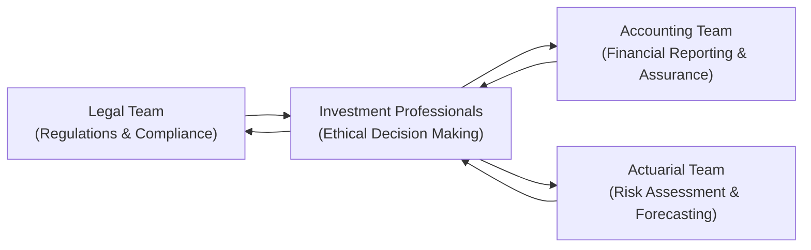

## Introduction

Imagine you’re sitting in a conference room with a legal counsel, a seasoned accountant, and an actuary, each peering at the same set of financial documents from different angles. You might hear something like: “Um, are we missing something about how these liabilities are reported?” Or maybe, “Wait, do we have the right disclosures for this cross-border deal?” From personal experience, those meetings can get pretty lively. But they’re also crucial for weaving together a robust ethical framework in finance. 

When legal, accounting, and actuarial professionals collaborate, they help ensure that an organization’s ethical standards don’t just tick a box—they become a genuine part of day-to-day decision-making. In this section, we’ll explore the major benefits, challenges, and best practices of interdisciplinary cooperation. We’ll highlight how each profession brings unique expertise, why you need them all at the table, and how to build processes that promote continuous ethical alignment.

## Why Interdisciplinary Collaboration Matters

Financial ethics isn’t just about avoiding fraud or misrepresentation—though that’s big, of course. It’s about creating a culture of transparency, trust, and responsibility. Different professional disciplines offer complementary perspectives. Here’s how the puzzle fits together:

• Legal experts provide guidance on regulations, contracts, dispute resolution, cross-border compliance, and potential legal liabilities.  
• Accountants establish and maintain transparent financial reporting, applying standards such as IFRS (International Financial Reporting Standards) or GAAP (Generally Accepted Accounting Principles).  
• Actuaries bring analytical models to assess long-term risks and obligations, ensuring accurate representation of uncertainties in areas like pension liabilities or insurance portfolios.  

Without regular synergy among these teams, an organization risks ethical blind spots. For instance, an accountant might inadvertently misclassify long-term obligations if they aren’t aware of updates in actuarial assumptions. Or a legal team might overlook certain financial disclosures if they don’t understand how IFRS differs from local GAAP. By bridging these gaps, you create a more holistic view of your organization’s financial health and ethical posture.

## Building a Comprehensive Ethical Framework

### Ensuring Consistent Policies and Procedures

A big step toward a solid ethical foundation is creating uniform policies that extend across departments. Lawyers, accountants, and actuaries often follow their own professional codes—each with slightly different nuances on confidentiality, disclosure requirements, and professional conduct. Encouraging them to meet regularly and align on policies reduces confusion. It also helps to have a centralized “policy library” that clarifies the intersections among legal guidelines, accounting norms, and actuarial assumptions.

• Example: Internal Control Policies  
  - The accounting team might establish controls that ensure proper revenue recognition.  
  - The legal team can develop guidelines to comply with various national regulations in cross-border transactions.  
  - The actuarial team will integrate risk assessments, ensuring future liabilities are projected accurately.  

Then, a management-level or board-level ethics committee reviews all these aspects together, bridging any gaps before they cascade into major ethical or legal problems.

### Communication and Cross-Functional Education

It’s easy to assume that each discipline fully appreciates the other’s work. Well… not always. Accountants might focus on balance sheets and P&L statements without fully considering how certain risks (like mortality assumptions in a pension plan) feed into future cash flows. Lawyers might focus on contract compliance without understanding IFRS nuances in financial disclosures. And actuaries sometimes focus on the math so intently they forget the bigger strategic or legal context.

Promoting cross-functional education—like short workshops where each department shares essential basics—can work wonders. I once attended a session where our legal department explained anti-corruption laws to the accountants and actuaries. Turns out, that was invaluable for identifying subtle red flags in vendor contracts. No matter how experienced you are, a little refresher in another field can spark important “aha!” moments.

## The Role of Legal Professionals

### Regulatory Compliance and Cross-Border Transactions

Legal experts are the front line for understanding regulatory environments. This is especially critical in cross-border deals, where you have an added layer of complexity: foreign laws, duties to multiple jurisdictions, remittance rules, etc. Failure to adhere to these regulations can undermine ethical standards in a flash—exposing your organization to hefty fines or even criminal charges.

Let’s say your firm invests in emerging markets. The legal counsel should clarify local regulations that might affect how you structure deals, disclose fees, or address fund repatriation. Collaborating with accountants ensures that your financial statements conform to requirements in both regions. Meanwhile, actuaries might weigh the added country-specific risks—like political instability or currency fluctuations—into the risk models.

### Clarifying the Legal Consequences of Ethical Missteps

Legal specialists are often tasked with explaining the real-world fallout of unethical behavior. Sure, an accountant might sense that some creative revenue recognition technique is risky. But when a lawyer details potential corporate and personal liability, plus the threat of criminal prosecution, it becomes more tangible. Hearing direct legal consequences resonates—suddenly everyone cares that the footnotes in the financials are transparent.

If you want people to fully appreciate the gravity of certain choices, legal professionals must be at the table, consistently communicating how apparently small shortcuts can spiral into big legal and ethical dilemmas.

## Accounting Collaboration and Ethical Reporting

### The Importance of IFRS and GAAP

Accountants are the stewards of financial information—responsible for making sure stakeholders see a true, fair, and faithful representation of a company’s financial position. Depending on the jurisdiction, they rely on IFRS or GAAP to govern how transactions are recorded. 

• IFRS: Seeks to unify global financial reporting, aiming for comparability across borders.  
• GAAP: A U.S.-centric set of standards with some nuanced differences compared to IFRS.  

In reality, many global firms have to juggle both. That’s where a robust interdisciplinary approach comes in. If your organization is publicly listed in the U.S., you’re typically bound by GAAP, but you might also have international subsidiaries that use IFRS. Collaboration with the legal team ensures you’re aligning with regulators in various countries, while actuaries help model liabilities (like pensions or long-duration insurance contracts) to match the required disclosures.

### Transparent Communication and Auditing

Accounting professionals must communicate frequently with legal and actuarial teams to stay current on risk disclosures. It’s not enough to bury disclaimers in a 50-page footnote. Ethical reporting demands clarity and completeness. Whenever there’s a significant event—say, a pending lawsuit or a revision in actuarial assumptions—the accounting team should ensure the impact is clearly reflected in the financial statements.

From an auditing perspective, the collaboration extends externally. External auditors often request actuarial reports, legal opinions on pending litigation, and so forth. If internal teams have already aligned, the auditing process goes smoother, and potential misunderstandings (like an undisclosed risk or an incorrectly classified liability) are minimized.

## Actuarial Insights in Ethical Risk Assessment

### Pension Liabilities and Insurance Products

Actuaries—those detail-savvy professionals who thrive on complex math—play a pivotal role in modeling long-term financial obligations. But do they always see how their work translates into corporate strategy or day-to-day operations? That’s where interdisciplinary dialogue pays off. 

Consider pension liability estimation. Actuaries use demographic assumptions (like mortality tables) and economic assumptions (like discount rates) to estimate future liabilities. If the assumptions are conservative, a pension fund may appear underfunded, prompting the organization to contribute more. If they’re overly optimistic, the company might underfund the plan. One might assume actuaries always aim for accuracy, but in reality, senior management might prefer assumptions that make the balance sheet look better. Tension can arise. 

An ethical environment is one in which actuaries feel comfortable presenting the “true” best estimate—even if it’s unfavorable. That environment is easier to foster when lawyers, accountants, and investment professionals back up the actuary’s objective approach.

### Communicating Assumptions and Uncertainties

Another area where actuaries shine is in how they communicate uncertainty—like “We assume a 4% interest rate over 15 years, but there’s a 20% chance it could be below 2% for prolonged periods.” If that conversation takes place only among actuaries, it can stay in high-level statistical terms. But if you bring in a legal counsel, the conversation shifts toward ensuring the disclaimers meet regulatory standards. And if the accountants are on board, they’ll decide how to integrate that range of possible outcomes into the financial statements or footnotes.

This synergy is critical for ethical behavior. Stakeholders deserve to know the scope of risk. It’s not just about disclaimers; it’s about ensuring people truly understand the ramifications of a range of outcomes.

## Visualizing the Collaborative Flow

Below is a Mermaid diagram illustrating how these teams interconnect, reinforcing ethical decision-making from multiple angles:

All participants feed vital information to investment professionals (or organizational leadership), who use these inputs to guide decisions. In turn, investment professionals must circle back, clarifying nuances, seeking additional data, and ensuring everyone remains aligned.

## Cross-Functional Ethics Committees

### Structuring the Committee

A practical, proven way to break down silos is to form a cross-functional ethics committee. Typically, this committee might include:

• Chief Legal Officer (or representative)  
• Chief Financial Officer or Controller (for the accounting view)  
• Chief Actuary or Senior Actuarial Analyst (for the risk model perspective)  
• Senior Investment or Portfolio Managers  
• Compliance and Internal Audit representatives  

Each member contributes specialized knowledge, and together they set or refine ethical guidelines. They also can promptly address any emergent ethical red flags or policy discrepancies—like contradictory corporate policies on risk disclosures in different geographic markets.

### Benefits of a Multidisciplinary Approach

When done right, these committees:

• Provide broader oversight, reducing the chance of unethical practices slipping through.  
• Enhance the consistency of ethical standards across departments.  
• Allow for real-time problem solving, so issues don’t fester quietly until they become crises.  

I recall a scenario where the committee discovered that our marketing team (not typically known for deep accounting expertise) was inadvertently publishing promotional materials that overstated product performance. Because the committee included legal counsel and accountants, we quickly resolved the misstatement before it turned into a liability nightmare.

## Case Studies: When Collaboration Fails—and How to Fix It

### Misreporting Liabilities

In one famous corporate scandal (think Enron, if you like a real cautionary tale), siloed decision-making allowed executives to hide liabilities in off-balance-sheet entities. If accountants had coordinated more closely with legal teams on structuring these entities, and if actuaries or risk managers had properly flagged the underlying obligations, the fiasco might have been averted. The lesson is clear: ignoring cross-departmental scrutiny opens the door to unethical behavior.

### Underestimating Emerging Risks

In the run-up to the subprime crisis of 2007–2008, some firms underestimated the probability of widespread mortgage defaults. Actuaries, under pressure, might have relied on historical data biased toward stable housing markets. Accountants might have reported these assets at inflated valuations. Legal teams might not have flagged the disclaimers and disclosures needed for new complex derivatives. Without a cohesive view, the system cracked.

• Step-by-step fix:  
  1) Encourage each department to scrutinize the underlying assumptions (e.g., mortgage default rates).  
  2) Ensure appropriate risk disclosures through financial reporting.  
  3) Regularly update legal disclaimers to reflect the true complexity and inherent risks.  

In short, always question data—especially if it points to “can’t lose” scenarios.

## Best Practices to Overcome Ethical Blind Spots

• Continuous Training: Run routine workshops that refresh each team on the other’s professional guidelines.  
• Required Peer Review: Encourage accountants, actuaries, and legal professionals to review each other’s major reports.  
• Transparent Communication Channels: Facilitate open discussions, possibly using collaborative project management tools.  
• Escalation Protocols: Clearly define how to escalate concerns. If an actuary sees a mismatch, they should know exactly whom to contact—whether that’s a compliance officer or the CFO.  
• Independent Reviewers: In some large organizations, a rotating “internal audit consultant” can join cross-functional meetings, offering fresh eyes.

## A Note on Regulatory Harmonization

Given that many firms operate internationally, a single set of ethics guidelines might conflict with region-specific rules. For example, IFRS is used broadly, but the U.S. typically mandates GAAP. Legal systems also vary dramatically. This complexity underlines the importance of seeking alignment across borders—so-called regulatory harmonization. The more aligned your organization can be, the easier it is to enforce a high level of ethical conduct globally.

## Incorporating a Simple Actuarial Formula

Actuaries often rely on present value calculations to estimate future obligations. A simplified expression for an actuarial present value (APV) might look like:


\text{APV} = \sum_{t=1}^{T} \frac{B_t}{(1 + r)^t}


Where:  
• Bᵗ represents the expected benefit or payment at time t  
• r is the discount rate  
• T is the time horizon  

For ethical reporting, it’s crucial to debate how r is determined and how Bᵗ is estimated. Accountants need that data for financial statements, and legal must ensure that any disclaimers about discount rates or benefit assumptions are accurate and meet regulatory requirements.

## Final Exam Tips

• Connect the Dots: In scenario-based questions, think about how legal, accounting, and actuarial inputs interact. It’s not enough to know each discipline in isolation; demonstrate how they collectively drive ethical decisions.  
• Emphasize Disclosure: CFA Level III often tests your understanding of proper risk disclosure. Consider how IFRS or GAAP require you to present uncertain future obligations, and how actuarial inputs or legal disclaimers inform those disclosures.  
• Outline Potential Consequences: If you see a question on cross-border transactions, talk about legal ramifications and the interplay with accounting standards.  
• Practice Time Management: In constructed-response (essay) questions, be concise but thorough. Show you can prioritize the salient points—like “actuarial risk assumptions” or “critical compliance requirements.”  
• Highlight Interdisciplinary Committees: If a question asks for solutions to ethical conflicts, mention the formation of cross-functional ethics committees as a best practice.  

## Glossary

• IFRS (International Financial Reporting Standards): Global accounting standards designed to improve the comparability, transparency, and uniformity of financial statements.  
• GAAP (Generally Accepted Accounting Principles): A set of accounting standards mainly used in the United States for financial reporting.  
• Cross-Border Transactions: Deals or investments that span different national jurisdictions, often requiring multiple sets of regulatory and tax considerations.  
• Actuarial Valuation: An assessment of the present value of future obligations, commonly used in pension planning, insurance, and other long-term financial projections.  
• Compliance Audits: Reviews that ensure an organization follows external regulations and internal policies.  
• Risk Disclosures: Explanations and data highlighting potential or significant risks that could affect an entity’s financial situation or performance.  
• Regulatory Harmonization: Efforts to align varying international laws and standards, facilitating consistent and ethical global financial practices.  
• Multidisciplinary Ethics Committee: A cross-functional panel (including legal, accounting, actuarial, and investment professionals) that oversees and enforces ethical standards.  

## References & Further Reading

• International Federation of Accountants (IFAC): Ethical and Auditing Standards – https://www.ifac.org  
• CFA Institute Global Policy & Standards on Collaboration and Ethics – https://www.cfainstitute.org  
• American Academy of Actuaries – https://www.actuary.org  

## Test Your Knowledge: Cross-Disciplinary Ethics and Collaboration



### Which benefit best describes interdisciplinary collaboration among legal, accounting, and actuarial teams?

- [ ] Reduced time spent on compliance training
- [x] Enhanced organization-wide integrity and reduced communication gaps
- [ ] Lower cost of financial reporting technology
- [ ] Elimination of regulatory risk

> **Explanation:** Collaboration ensures that each discipline’s perspective is integrated, reducing ethical blind spots and improving organizational integrity.

### A key reason for the legal team’s involvement in cross-border transactions is to:

- [ ] Prepare the organization’s financial statements
- [x] Clarify the legal ramifications and regulatory requirements for different jurisdictions
- [ ] Define the total discount rate for actuarial valuations
- [ ] Set IFRS or GAAP disclosure standards

> **Explanation:** Legal professionals analyze the complex regulations in different countries, ensuring compliance and clarifying legal exposures or potential liabilities.

### When IFRS and GAAP both apply to a global firm, accountants typically:

- [ ] Choose the most favorable set of standards to reduce reported liabilities
- [ ] Apply IFRS for domestic operations and GAAP for overseas subsidiaries
- [x] Coordinate with legal and actuarial teams to reconcile differences and ensure cohesive financial reporting
- [ ] Rely solely on IFRS to avoid duplication

> **Explanation:** Organizations work with legal and actuarial experts to navigate each standard’s requirements, presenting consistent and accurate financial information.

### Which of the following best captures the role of actuaries in an ethical framework?

- [ ] Drafting legal contracts
- [ ] Performing all internal and external financial audits
- [x] Modeling long-term risks and liabilities, ensuring these projections are communicated clearly
- [ ] Setting global accounting standards

> **Explanation:** Actuaries bring specialized risk and forecasting models, crucial for depicting the firm’s long-term obligations and ensuring ethical representation of uncertain outcomes.

### Which best practice helps prevent ethical blind spots in financial statements?

- [ ] Restricting the discussion of risk factors to actuaries only
- [x] Holding cross-functional reviews where accountants, actuaries, and legal counsel share assumptions and perspectives
- [ ] Adopting only local GAAP for reporting, regardless of operational regions
- [ ] Avoiding mention of uncertain future liabilities

> **Explanation:** Regular collaboration and assumption-sharing among the various disciplines ensures a consistently transparent and ethical financial picture.

### In a strong cross-functional ethics committee, which of the following is most likely to occur?

- [x] Potential issues are identified early due to the variety of professional viewpoints
- [ ] Mathematical models are never used for liabilities
- [ ] Cross-border regulatory issues are delegated only to the accounting team
- [ ] Marketers handle all disclosures independently

> **Explanation:** A cross-functional committee ensures diverse teams spot issues early, helping maintain consistent ethical standards and preempting serious violations.

### Underestimating risks in mortgage-backed securities prior to 2007 is an example of:

- [ ] Effective collaboration leading to conservative assumptions
- [ ] Legal counsel over-communicating disclaimers
- [x] Lack of interdisciplinary scrutiny, as actuarial and accounting assumptions were not continuously challenged
- [ ] Perfect compliance with IFRS standards

> **Explanation:** Multiple disciplines failed to question assumptions thoroughly, illustrating what can happen when professionals stay in silos.

### One effective step to align actuarial valuations with accounting requirements is to:

- [x] Formulate consistent assumptions in collaboration with accountants, ensuring the resulting information is accurately represented
- [ ] Exclude the actuarial team from board-level decisions
- [ ] Only apply historical averages to discount rates
- [ ] Conduct all valuations post-financial statement approval

> **Explanation:** Synergy between actuaries and accountants ensures that the assumptions used in valuations feed appropriately into financial statements.

### Regulatory harmonization is crucial because:

- [ ] It allows different regions to ignore each other’s rules
- [ ] It ensures each country can have its unique standard with no overlap
- [x] Cross-border transactions become more transparent and consistent
- [ ] It eliminates the need for robust risk disclosures

> **Explanation:** Harmonizing different regulatory regimes makes global finance more transparent, reduces confusion, and supports a unified ethical standard.

### A multidisciplinary ethics committee typically includes representation from legal, accounting, actuarial, and investment professionals. True or False?

- [x] True
- [ ] False

> **Explanation:** Such committees bring together expertise from all relevant domains, increasing the organization’s ability to identify and mitigate ethical risks effectively.


