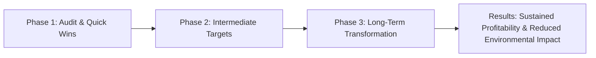

## Introduction
I remember a time—actually, not too long ago—when I was sitting in a boardroom and watching a Chief Financial Officer juggle budgets for short-term profits versus spending on an energy-efficiency upgrade. She paused, drumming her fingers on the table, and said, “Are we sure we can afford this right now?” It was a classic example of the tension between immediate returns and long-term sustainability goals. Eventually, the CFO recognized that cutting carbon emissions would actually reduce operating costs over the long haul and elevate the company’s environmental image. In other words, yes, it would be more expensive in the short run, but the intangible benefits, from brand reputation to regulatory goodwill, outweighed those costs many times over.

So, let’s talk about how organizations can align corporate objectives with the urgent need for environmental stewardship—and do so ethically. Because, let’s be honest, it’s no longer enough to chase quarterly earnings targets while turning a blind eye to the environment. Regulators, investors, and the wider public are demanding more transparency, more accountability, and definitely more responsible behavior. In this section, we’ll explore how Environmental, Social, and Governance (ESG) factors are shaping corporate strategy; why boards, fiduciaries, and senior management must integrate sustainability into their plans; and how investment professionals can push for better reporting and real action, rather than hype or “greenwashing.”

## Incorporating ESG into Corporate Strategy
Some might wonder, “How exactly do ESG criteria fit into the corporate decision-making process?” In short, ESG (Environmental, Social, Governance) has become an essential lens through which companies assess risks and opportunities. By weaving ESG factors into day-to-day operations and strategy, organizations can reduce long-term costs, minimize reputational threats, and innovate more effectively.

### Environmental Factors
“E” stands for environmental, which includes the resources companies use—water, energy, raw materials—and the pollution or emissions they produce. It’s all about resource efficiency, waste management, carbon footprints, and climate change mitigation.

### Social Factors
“S” focuses on how the company manages its relationships with employees, suppliers, customers, and the communities in which it operates. Examples might include workplace safety initiatives, diversity and inclusion policies, or philanthropic efforts in local communities.

### Governance Factors
Finally, “G” deals with a company’s internal system of practices, controls, and procedures that govern itself. These include board independence, executive compensation, shareholder rights, and transparency in disclosures.

In corporate boardrooms, leaders increasingly see ESG integration not purely as a compliance exercise but as a key driver of sustainable competitive advantage. Just as we learned in Chapter 8 (“Sustainability and Corporate Responsibility”), attention to ESG can open new product lines (like eco-friendly packaging) and reduce hidden costs (like fines for environmental violations).

## The Fiduciary Role: Boards and Senior Management
For the typical publicly traded firm, fiduciaries include directors, executives, and sometimes senior managers charged with acting in the best interest of shareholders. Expanding that to environmental stewardship means:

• Setting tangible, science-based environmental targets (e.g., a 20% reduction in carbon emissions over five years).  
• Reviewing the firm’s sustainability performance regularly and comparing it against industry benchmarks.  
• Ensuring that management accurately quantifies and reports progress—or lack thereof—to investors and other stakeholders.  

Increasingly, the definition of “stakeholder” extends beyond just shareholders. Communities, regulators, employees, and even future generations have voices too, especially as environmental concerns intensify. Board members, therefore, must balance near-term profits with the company’s long-term viability, which depends heavily on maintaining an acceptable environmental footprint.

### Diagram: Governance and ESG Integration


In this simple loop diagram, the Board of Directors both initiates and receives feedback on ESG initiatives, creating an ongoing process of setting goals, monitoring progress, and reporting outcomes.

## Sustainability Reporting and Integrated Frameworks
Organizations rely on formal reporting standards such as the Global Reporting Initiative (GRI) or the Sustainability Accounting Standards Board (SASB) to disclose their environmental and social impacts. The push toward “Integrated Reporting” combines both financial and non-financial information into a single, coherent annual report, giving stakeholders a broad view of an organization’s overall health and long-term viability.

• Integrated Reporting: Connects financial results with social and environmental performance, illustrating how each factor influences the other.  
• Triple Bottom Line: Evaluates a firm based on social, environmental, and financial dimensions, encouraging a holistic assessment of value and impact.  

These reports help investors gauge whether a company is truly committed to sustainability or simply paying it lip service. If you’re evaluating a potential investment, a thorough review of a company’s sustainability disclosures can reveal hidden risks—like looming regulatory penalties—or untapped opportunities like green product lines or advanced recycling processes.

## Investment Professionals Driving Change
So, how do we finance folks fit into this? Well, investment professionals can urge (and sometimes require) companies to disclose environmental metrics and reduce resource consumption. Asset managers, for example, may choose to invest only in firms meeting certain emission thresholds—or they might engage with company management to demand better environmental oversight.

### Engagement Practices
• Voting proxies in favor of more comprehensive environmental reporting.  
• Communicating directly with management about climate targets and disclosures.  
• Supporting shareholder resolutions that push for stronger pollution controls or resource management.  

Higher demand for these initiatives encourages companies to be more transparent and to set ambitious goals. If your institutional clients want greener portfolios, you’re likely to push management to produce more detailed metrics about their supply chain or carbon footprint—which can, in turn, spark real changes in corporate behavior.

### Avoiding Greenwashing
A big challenge is “greenwashing,” where a company boasts about its eco-friendly packaging or carbon-neutral offices but quietly sources materials in a way that pollutes waterways or ignores labor standards. Investment professionals should:

• Examine third-party verifications or certifications (e.g., from environmental NGOs or recognized certifying bodies).  
• Watch for inconsistencies between the company’s narrative and actual performance data.  
• Conduct deeper analyses, such as life-cycle assessments, to validate companies’ claims.  

It’s a bit like a personal trainer verifying whether a client is truly following their diet plan. Look for the data, not just the talk.

## Measuring and Verifying Environmental Impact
Quantifying environmental impact can be tricky, especially in complex supply chains. Tools like carbon footprint calculations highlight where in the supply chain the highest emissions occur. Here’s a quick Python snippet that might be used (in a very simplified way) to sum up greenhouse gas emissions from multiple suppliers:

```python
import pandas as pd

data = {
    'supplier': ['Supplier A', 'Supplier B', 'Supplier C'],
    'emissions_tons': [120.5, 98.2, 150.7],
}

df = pd.DataFrame(data)
total_emissions = df['emissions_tons'].sum()

print("Total Emissions:", total_emissions)
```

You can expand this data to include dozens (or hundreds) of suppliers, product lines, or facilities. Yes, it’s a simplified illustration, but it shows how you might gather and analyze raw numbers to identify emission hotspots.

## Balancing Short-Term & Long-Term Objectives
A recurring question is, “Should we reduce next quarter’s earnings for the sake of a more sustainable future?” Many boards have wrestled with this trade-off, especially in energy-intensive industries like manufacturing or transportation. The tension arises because environmental projects often require upfront costs with payoffs years down the road.

In a discounted cash flow (DCF) model, the net present value (NPV) of a sustainable project might sometimes look less appealing if we only factor in tangible cash flows. But once you incorporate intangible benefits (like avoiding costly litigation or fines, preserving brand reputation, or attracting socially conscious investors), the math often looks a lot better. Essentially, we must think not just about direct inflows and outflows but also about the “value” that environmental stewardship creates in terms of stakeholder trust and long-term market positioning.

### Phased Approaches
A phased approach is one way to balance these interests. For instance, a company might commit to a set of near-term changes that modestly reduce profits but yield measurable efficiency gains, followed by more ambitious long-term investments once the initial improvements are realized. Sometimes forming alliances with research institutes or environmental NGOs can defray costs and share expertise.

### Diagram: Phased Alignment of Corporate Strategy with Environmental Goals



In this diagram, each phase of environmental strategy builds on the previous phase’s results, ensuring consistent progress without overwhelming finances in the short term.

## Managing Reputational & Regulatory Risks
Environmental stewardship isn’t just idealistic—it’s practical risk management. Regulators worldwide are imposing stricter rules, and fines for non-compliance can be hefty. Moreover, negative publicity surrounding environmental controversies can damage brand loyalty. Consumers increasingly prefer to buy from companies they perceive as responsible. Stakeholder engagement—engaging employees, local communities, and environmental groups—helps identify potential pitfalls early and fosters goodwill.

## Exam Relevance and Tips
• On the CFA exam, you might see constructed-response questions requiring you to analyze a company’s sustainability metrics and identify risks or benefits. Be prepared to discuss how ESG factors influence company valuations, portfolio construction, or risk management.  
• Item sets could focus on identifying greenwashing indicators or recommending strategies to align corporate governance with environmental goals.  
• Demonstrate an understanding of frameworks like GRI and SASB in your responses—these are widely recognized and likely to appear in scenario-based exam questions.  
• For essay segments, remember to balance technical analysis with ethical considerations. The exam often wants you to demonstrate that you can weigh intangible factors (like reputational impact) along with traditional financial metrics.  

## Key Terms and Definitions
• **ESG (Environmental, Social, and Governance)**: Criteria used to evaluate a company’s ethical impact and sustainability practices.  
• **Integrated Reporting**: A holistic approach that combines financial and non-financial data to present a broader view of a company’s performance, value creation, and responsibility.  
• **Greenwashing**: The practice of overstating a company’s environmental credentials, often to distract from less eco-friendly activities.  
• **Fiduciary Responsibility**: The ethical and legal obligation to act in the best interest of clients or stakeholders.  
• **Sustainability Reporting**: Disclosing information on a company’s environmental, social, and governance performance, often in accordance with GRI, SASB, or other frameworks.  
• **Triple Bottom Line**: Evaluating performance based on three dimensions—social, environmental, and financial.  
• **Stakeholder Engagement**: The process of involving and communicating with all parties (employees, communities, etc.) affected by a company’s operations and decisions.  
• **Carbon Footprint**: The total greenhouse gas emissions caused directly or indirectly by an individual, organization, event, or product.  

## Conclusion and Next Steps
All in all, bridging corporate goals with environmental stewardship is not a one-and-done event, but a continuous process that demands thoughtful strategies, reliable metrics, transparent reporting, and authentic commitment. Companies that develop this mindset often find new pockets of growth, better brand loyalty, and a more robust risk profile. As finance professionals, we have a huge role to play because our analyses, our recommendations, and our influence can steer corporate culture toward a healthier planet—while also delivering financial returns. And maybe next time you’re in that boardroom, you won’t just talk about this quarter’s earnings but about how your firm can reduce its footprint, gain investor trust, and drive real change without sacrificing profitability.

## References & Further Reading
- Global Reporting Initiative (GRI) Standards:  
  https://www.globalreporting.org  
- Sustainability Accounting Standards Board (SASB):  
  https://www.sasb.org  
- Eccles, R. G., & Krzus, M. P. (2010). One Report: Integrated Reporting for a Sustainable Strategy. Wiley.  
- International Integrated Reporting Council (IIRC). (2013). The International <IR> Framework.  
- CFA Institute (Multiple authors). CFA® Program Curriculum on ESG Integration.

---

## Test Your Knowledge: Aligning Corporate and Environmental Stewardship Goals



### Which of the following best describes the purpose of integrated reporting?

- [ ] To provide a traditional financial statement without sustainability disclosure
- [x] To combine financial and non-financial data, offering a holistic view of corporate performance
- [ ] To only disclose environmental impact data
- [ ] To focus solely on social responsibility initiatives

> **Explanation:** Integrated reporting merges financial data (profit, liabilities, etc.) with non-financial information (sustainability metrics, governance practices) to offer a complete assessment of a company’s overall health.

### When a company presents limited but flashy environmental initiatives while ignoring its more significant pollution sources, it is most likely engaging in:

- [ ] Fiduciary optimization
- [x] Greenwashing
- [ ] Carbon offsetting
- [ ] Sustainability auditing

> **Explanation:** Greenwashing refers to exaggerating or misrepresenting the environmental benefits of a product, service, or strategy to appear more eco-friendly than reality.

### What is a primary reason that investment professionals focus on ESG factors?

- [ ] ESG factors have no impact on investment risk or return
- [ ] They are required by all global agencies
- [x] ESG factors can influence both long-term risks and opportunities
- [ ] They are irrelevant to fiduciary duties

> **Explanation:** ESG analysis sheds light on long-term risks (e.g., regulatory fines, reputational damage) and opportunities (e.g., new green markets, cost savings), which directly affect investment outcomes.

### Which statement best reflects the triple bottom line approach?

- [ ] It concentrates on short-term profit only
- [ ] It measures performance only by stock price appreciation
- [ ] It excludes environmental costs from financial reporting
- [x] It examines social, environmental, and financial performance

> **Explanation:** The triple bottom line concept evaluates corporate success by looking at social, environmental, and financial results, not just profit alone.

### A phased approach to environmental targets typically:

- [x] Introduces incremental changes while building momentum for larger transformations
- [ ] Launches all sustainability measures at once to avoid cost escalation
- [x] Spreads out major investments into manageable segments
- [ ] Focuses exclusively on cost savings instead of strategic objectives

> **Explanation:** Phased approaches break large, costly initiatives into smaller steps and ensure each phase’s lessons inform the next, balancing financial feasibility and environmental impact.

### Which of the following best captures how fiduciary responsibility relates to environmental stewardship?

- [ ] Fiduciaries can ignore environmental outcomes if they meet financial obligations
- [x] Fiduciaries must consider longer-term risks, including environmental impact, to act in shareholders’ best interests
- [ ] Fiduciaries must divert all profits toward environmental projects
- [ ] Fiduciaries are responsible only to employees

> **Explanation:** By acting in the best interests of clients or shareholders, fiduciaries must consider longer-term factors such as environmental risks that could harm the firm’s sustainability and value.

### An important measure to avoid greenwashing is:

- [ ] Accepting all corporate claims at face value
- [x] Demanding independent third-party verification of environmental data
- [x] Conducting thorough life-cycle assessments
- [ ] Hiding emissions data from stakeholders

> **Explanation:** Independent verification (e.g., audits or certifications) and comprehensive assessments help ensure that stated green initiatives are substantiated by real-world data and practices.

### Why might a company adopt a sustainability reporting framework such as GRI?

- [x] To standardize environmental and social disclosures for comparability
- [ ] To focus solely on maximizing share price
- [ ] To hide sensitive financial data from investors
- [ ] To prevent stakeholder engagement

> **Explanation:** Frameworks like the GRI create standardized, transparent reporting that allows external parties to compare and evaluate a company’s performance on ESG issues.

### What potential trade-off must companies often consider when integrating environmental stewardship?

- [x] Balancing near-term profit reductions with long-term gains
- [ ] Ignoring stakeholder interests to achieve short-term results
- [ ] Eliminating capital expenditures entirely
- [ ] Abandoning strategic alliances

> **Explanation:** Companies typically face the need to allocate funds to sustainability measures, which can reduce short-term earnings but may result in cost savings, enhanced brand value, and regulatory compliance over time.

### A board of directors that requires management to reduce the firm’s carbon footprint is demonstrating:

- [x] True
- [ ] False

> **Explanation:** By setting and monitoring carbon-reduction targets, the board is actively fulfilling its fiduciary duty to manage both financial and environmental risks, reflecting good governance.


