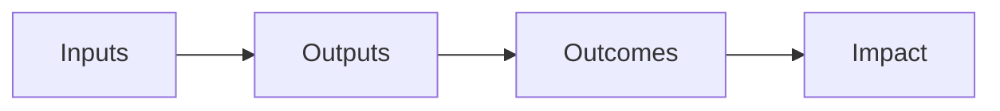

## Introduction and Overview

Financial Innovation can be super exciting, right? I remember feeling a bit awestruck several years ago when I first encountered peer-to-peer lending. The idea of lending and borrowing among individuals—completely bypassing traditional banks—seemed so...revolutionary. And, as it turns out, that’s just one of many examples of how creative new approaches can shake up the entire financial system. But with all the glitz comes a deeper question: How do we ensure these innovations actually help society and not leave large segments of the population behind? That’s what we’ll explore here: how to measure (and hopefully enhance) the socioeconomic impacts of innovations in finance.

In this section, we’ll see how novel products, services, and technologies can alter traditional risk and return landscapes. We’ll also discuss critical ethical responsibilities—such as providing Financial Inclusion for underserved communities—while avoiding any Negative Externalities like predatory lending. Along the way, we’ll look at methodologies like Social Return on Investment (SROI), share a few personal anecdotes, and consider the role of regulators in safeguarding public interest.

## Evolving Financial Landscape and New Risks

Financial Innovation has a knack for expanding opportunities. Peer-to-Peer Lending, robo-advisory services, and microfinance institutions are just a few examples of how technology-driven ideas can transform the ways people borrow, invest, and build wealth. Yet these transformations also create new types of risk that may, at times, be overlooked.

• Shifts in Risk Profiles: Traditional bank loans tend to follow a fairly standardized risk assessment process. But in peer-to-peer lending, for example, the credit analysis relies heavily on alternative scoring methods—some might say it’s a bit unknown territory. These new approaches can lead to more inclusive lending for Underserved Communities but also create potential pockets of systemic fragility if underwriting standards are not robust.  
• Changing Return Potential: Often, new instruments promise returns that differ from (and can be higher than) what people get from traditional methods. The question is: Are those returns sustainable and transparent?  
• Ethical Tensions: There’s a real concern that if these innovations aren’t managed ethically, they can generate windfall profits for a few while leaving unsuspecting participants—often lower-income borrowers—exposed to disproportionate risks.  

In my experience working on a microfinance pilot project in Southeast Asia, we found that providing smaller loans to local entrepreneurs helped increase job creation in the region. However, it also introduced new challenges for individuals not used to formal repayment schedules. Proper training and robust communication were needed, or else you risk fueling a vicious debt cycle. 

## The Call for Ethical Responsibility

Ethical considerations barely stop at the design stage. Once launched, these new products and services can have reverberating impacts on society at large:

• Financial Inclusion is a major driver of these innovations. By opening doors to borrowing, saving, and investing, individuals with limited or no prior access to banks gain a chance to improve their livelihoods.  
• However, Negative Externalities can arise—for instance, exploitative interest rates or subpar data privacy measures. If you’re heading a fintech startup, well, you might be excited about the next big digital-lending algorithm, but it’s crucial to assess potential harm.  
• Consumer Protection is key, especially when innovations target populations with limited financial literacy. Organizations must ensure clarity, fairness, and regulatory compliance to truly benefit society.  

It sounds like a lot to handle, yeah? In truth, it is. Responsibility is a tall order for finance professionals and organizations, but it’s non-negotiable if we’re serious about aligning with the CFA Institute’s code of ethics and upholding global standards of professionalism.

## Methodologies for Assessing Social and Economic Impact

Measuring socioeconomic impact is definitely not a “one-size-fits-all” game. If you’re new to this topic, it can feel like stepping into a labyrinth of frameworks and metrics. Among these frameworks, Social Return on Investment (SROI) stands out as a comprehensive way to quantify, in monetary terms, the social, environmental, and economic value of an initiative. 

### Social Return on Investment (SROI): An Overview

SROI offers a structured approach by looking at:

1. Inputs: Resources invested (e.g., capital, labor, technology).
2. Outputs: Tangible results from these inputs (e.g., number of loans issued).
3. Outcomes: Changes that occur as a result of the outputs (e.g., newly created microbusinesses).
4. Impact: The net effects after controlling for external factors (including what might have happened anyway or due to other influences).

Here’s a simplified diagram:

Organizations adapt SROI by assigning tangible values to intangible effects—think improved community well-being or environmental benefits. It’s not just about numbers, though. SROI often includes stakeholder interviews and qualitative assessments to capture intangible benefits that might be missed by purely financial analysis.

### Using Other Metrics and Models

While SROI is popular, many practitioners also rely on supplemental models and indicator sets. Some organizations use the Impact Reporting and Investment Standards (IRIS) developed by the Global Impact Investing Network (GIIN). These metrics track a variety of indicators—like job creation, access to education, and gender diversity in leadership. Others incorporate cost-benefit analyses, triple-bottom-line frameworks, or Balanced Scorecard–type approaches to round out the picture of overall socioeconomic benefit.

Regardless of the tool chosen, a big best practice is consistent reporting that is comparable across projects. Having standard benchmarks for microloans or peer-to-peer default rates, for instance, helps detect trouble spots early and fosters more informed decision-making.

## Balancing Opportunity and Risk in Underserved Communities

It’s no secret that the finance sector is often charged with ignoring those who need it most—and that’s precisely why things like microfinance and peer-to-peer platforms carry so much potential. But it’s absolutely essential to test new innovations responsibly, perhaps through pilot programs:

• Pilot Testing: Rolling out a pilot in a small region—especially an underserved one—can help identify product flaws or hidden social effects before scaling up. Perhaps the interest rate structure is too high, or the user interface assumes customers have a literacy level they simply don’t.  
• Consumer Protection: During the pilot phase, you can test marketing approaches and contractual language to minimize confusion. It’s crucial to sort out risk disclosures, data privacy, and fair-lending terms.  
• Continuous Feedback Loops: Gathering feedback from local participants is a powerful way to refine the service. I’ve seen cases where feedback from borrowers actually led to the incorporation of flexible repayment schedules, making microloans more sustainable in practice.  

Getting it right can be life-changing for these communities—enabling them to grow small businesses or stabilize household finances. But poor execution or unscrupulous lending practices can aggravate inequality, fueling discontent and undermining trust in the entire financial sector.

## Case Studies: Successes and Lessons Learned

### Success Story: Microfinance in Bangladesh

An iconic example is the microfinance revolution that took root in Bangladesh. Founded by Dr. Muhammad Yunus, Grameen Bank famously provided small loans—often to women entrepreneurs—to spark business creation in rural areas. The results? Increased household income, better nutrition, and growing political autonomy for women.  

From an SROI perspective, Grameen Bank’s success can be partly attributed to direct stakeholder engagement in program design, plus robust on-the-ground support for borrowers. Essentially, they looked beyond the raw numbers to see the holistic transformations in people’s lives.

### A Cautionary Tale: Subprime Crowdfunding

In some regions, unregulated crowdfunding campaigns and lending platforms popped up to serve people with extremely low credit ratings. While some were championed as progressive, the reality often showed high default rates, sky-high interest, and poor risk information for lenders. This scenario exemplifies how Negative Externalities and Systemic Risk can arise: once defaults soared, platform operators scrambled to manage the fallout, and some lenders lost large chunks of capital. A big commotion, to say the least.

## Stakeholder Communication and Transparency

If you’re launching new products for Underserved Communities, you’ve gotta communicate effectively with all stakeholders—regulators, local NGOs, and of course, the communities themselves. Good stakeholder communication fosters trust and helps highlight red flags early.  

Transparency is not just about disclosing fees and interest rates, either. It’s about clear, accessible information around mission, methodology, product limitations, and potential pitfalls. This fosters an environment of mutual respect—helping lenders and borrowers alike feel that they’re engaged in a fair transaction.

## Regulatory Oversight and Consumer Protection

Regulatory bodies are increasingly stepping up their game to ensure financial innovations align with broader public interest objectives. Although the pace of innovation can be lightning-fast (and regulations may lag behind a bit), there are clear signs that oversight is tightening:

• Licensing and Registration: In many countries, peer-to-peer lending platforms must register with the central bank or capital markets regulator. This typically involves meeting data security standards, capital requirements, and applying transparent underwriting procedures.  
• Consumer Protection Laws: Government agencies might limit interest rates or ban certain fee structures to deter predatory schemes.  
• Monitoring Systemic Risk: Regulators also keep an eye on aggregated lending data to watch for credit bubbles or signs of market herding. If multiple platforms start chasing the same borrowers with easy credit, it might generate risk reminiscent of a subprime mortgage bubble.  

From a global perspective, bodies like the World Bank and the OECD encourage collaboration among countries to share best practices—especially to bring the benefits of Digitalization and Finance to emerging markets.  

## Best Practices for Ethical Financial Innovation

• Engage Stakeholders Early: Align your mission with local needs and gather stakeholder input throughout the project lifecycle.  
• Employ Rigorous Impact Assessments: Start tracking socioeconomic indicators early to provide credible data for ongoing improvements.  
• Enforce Transparent Governance: Ensure that boards and executive teams have oversight especially designed to prioritize social impact and responsible innovation.  
• Maintain Data Privacy Standards: Use encryption and secure systems to protect borrower and lender data.  
• Develop Clear Consumer Guidelines: Provide straightforward information about product features, fees, and risks.  

## Linking Socioeconomic Impact with Long-Term Competitive Advantage

While it might seem like championing social impact could reduce profit margins, many organizations now find that strong, positive impact data helps attract socially conscious investors, who are increasingly influential. Moreover, building trust with local communities can give an organization a significant competitive edge—helping to sustain business models over the long haul.

From a portfolio management perspective, robust impact metrics can also help asset managers identify stable, socially responsible investments. Lenders with proven social performance may be perceived as less risky. Meanwhile, poor impact metrics often coincide with higher default rates and regulatory scrutiny—both red flags from a portfolio’s vantage point.

## Practical Tips for the CFA Exam

• Concepts like SROI and financial inclusion are tested in scenario-based ethics questions—learn the frameworks.  
• Expect to apply these ideas in problem-solving contexts where you must weigh benefits (e.g., job creation) against potential harm (e.g., predatory lending).  
• Demonstrate knowledge of how new technologies can spur or mitigate Systemic Risk.  
• Carefully reference the CFA Institute Code of Ethics and cross-check your responses with those standards.  

References for Further Exploration:  
• Global Impact Investing Network (GIIN): https://thegiin.org  
• World Bank Financial Inclusion Resources: https://www.worldbank.org/en/topic/financialinclusion  
• OECD (2018). Financial Markets, Insurance, and Private Pensions: Digitalisation and Finance. Paris: OECD.

--

## Test Your Knowledge: Socioeconomic Impact of Financial Innovation



### In assessing the impacts of microfinance initiatives, which of the following outcomes best illustrates the concept of "Outcomes" in an SROI framework?

- [ ] The total amount of microloans disbursed.  
- [x] The measurable changes in borrower income and community employment.  
- [ ] The funds donated by philanthropic organizations to microfinance banks.  
- [ ] The regulatory guidelines applied to microfinance operations by the central bank.  

> **Explanation:** In an SROI framework, “Outcomes” refer to the concrete changes that occur for participants (like an increase in incomes or new community jobs). Loan amounts or regulatory guidelines are inputs or outputs, not outcomes.

### Which practice can help identify potential pitfalls early when launching financial innovations in underserved communities?

- [ ] Immediately scaling the product nationwide without testing.  
- [x] Running pilot programs and gathering local feedback.  
- [ ] Waiting for regulators to mandate guidelines before acting.  
- [ ] Using only internal data and ignoring stakeholder perspectives.  

> **Explanation:** Pilot testing allows innovators to discover product-related challenges in a real-world setting but on a small scale, mitigating risk and improving design.

### What is a key risk of ignoring consumer protection principles in peer-to-peer (P2P) lending?

- [ ] Improving overall credit scores of borrowers.  
- [ ] Lowering rates of default across the platform.  
- [x] Exposing borrowers to predatory terms and high rates.  
- [ ] Reducing public perception of banks’ competitiveness.  

> **Explanation:** If consumer protection is overlooked, borrowers may face exploitative interest rates or unfair terms, undermining trust and harming vulnerable populations.

### Why is stakeholder engagement vital when introducing new financial products in underserved markets?

- [ ] It reduces the need for compliance with external regulators.  
- [ ] It boosts internal sales performance metrics.  
- [ ] It ensures that only wealthy investors have access.  
- [x] It provides feedback that helps tailor products ethically and effectively.  

> **Explanation:** Engaging with local communities, NGOs, and relevant parties ensures the products meet real client needs and maintains ethical standards.

### Which of the following best describes a Negative Externality of financial innovations?

- [ ] Widespread financial inclusion that raises living standards.  
- [ ] Enhanced competition among banks.  
- [ ] Stable credit growth providing opportunities for small businesses.  
- [x] A spike in community debt due to high-interest lending practices.  

> **Explanation:** Negative Externalities are unintended adverse impacts, such as over-indebtedness caused by irresponsible lending.

### If multiple P2P lending platforms compete aggressively for the same pool of borrowers, which systemic risk factor increases?

- [ ] Risk diversification, because there are more participants.  
- [x] Excessive credit extension with inadequate underwriting.  
- [ ] A decreased likelihood of borrower default.  
- [ ] Full protection against interest rate shifts.  

> **Explanation:** Fierce competition might lead to lax underwriting standards and excessive credit extension, ultimately heightening the chance of cascading defaults.

### SROI differs from traditional financial metrics primarily because:

- [ ] It is only utilized by government agencies.  
- [x] It accounts for social and environmental value in addition to financial returns.  
- [ ] It ignores any qualitative data.  
- [ ] It replaces all standard ROI metrics in corporate reporting.  

> **Explanation:** SROI expands the concept of return by measuring social and environmental outcomes, not just financial gains.

### A lender that implements robust privacy and security measures for borrower data is most directly addressing which ethical concern?

- [x] Data protection and privacy.  
- [ ] Freedom of speech for all borrowers.  
- [ ] Corporate governance structure.  
- [ ] Fair-trade certification of products.  

> **Explanation:** The main ethical issue tackled here is data privacy, ensuring borrowers are not exposed to breaches or misuse of personal information.

### In a case study of a subprime crowdfunding platform with high default rates, which factor best explains negative social outcomes?

- [ ] Stringent underwriting policies.  
- [ ] Strict regulatory control.  
- [ ] Reasonable interest rates for borrowers.  
- [x] Poor disclosure of lending risks and unsustainable interest rates.  

> **Explanation:** Negative outcomes grew because investors and borrowers lacked transparent risk information, leading to unsustainable lending terms and eventual defaults.

### Pilot programs in microfinance typically help with:

- [x] Identifying appropriate loan terms and repayment structures in a small setting.  
- [ ] Boosting default rates to assess worst-case scenarios.  
- [ ] Replacing regulatory oversight with self-monitoring.  
- [ ] Eliminating the need for borrower education.  

> **Explanation:** Pilot programs offer a controlled environment for adjusting product features and ensuring they realistically align with borrower needs before large-scale adoption.


