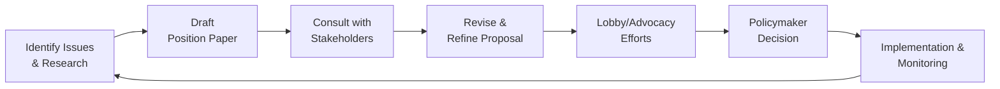

## Introduction and Rationale

Public policy advocacy, at its heart, is about shaping rules and regulations for the greater good—protecting investors, fostering transparency, and ensuring markets remain resilient. Now, if you’re like me, you might recall a time when you felt intimidated by the very idea of talking to policymakers. I remember my first attempt at drafting a formal letter to a small regulatory agency: My palms were sweaty, and I was worried I might say something that defied industry norms. But the truth is, finance professionals are often the people with the clearest view of market behavior, risks, and the ways policies can play out in practice. That’s why it’s so important for us to engage ethically—helping ensure regulation benefits society as a whole instead of a handful of insiders.

This section dives into the multi-faceted topic of integrating public policy advocacy into ethically driven finance. We’ll explore how professionals can collaborate with policymakers, NGOs, and industry associations, while also guarding against conflicts of interest. We’ll share a few personal stories (like that sweaty-palms moment) and highlight real-world policy success stories in areas ranging from climate finance to consumer credit regulations. Ready to unpack how you can responsibly shape this space for the better, one conversation at a time?

## Importance of Constructive Engagement

Ethical finance doesn’t just happen in a vacuum. It emerges where smart regulations, enlightened institutions, and active stakeholders come together to build a stable market environment. Constructive engagement involves:

- Participating in regulatory hearings and consultations.  
- Speaking up for the public interest rather than short-term private gains.  
- Providing expertise that policymakers may lack, especially around complicated financial tools (e.g., complex derivatives, decentralized finance platforms).  

In other words, you don’t just want to stand on the sidelines complaining when regulations don’t make sense. Instead, you step forward, share your insight, and influence a more balanced approach. This is key to upholding the CFA Institute Code of Ethics and ensuring we, as finance pros, maintain public trust.

## Ethical Guidelines for Lobbying Activities

“Lobbying” can sound like a bad word sometimes. But at its core, lobbying is about educating and persuading policymakers. Let’s walk through a quick overview of how to keep your advocacy ethical:

1. Transparency  
   Disclose who you represent, the nature of your request, and your potential benefit. Confusion arises when lobbying is done in the shadows. Openness keeps you credible.

2. Accountability  
   Ensure those impacted by your proposals are aware of what you are advocating. This means disclosing your research methods and sources—especially if your position paper can substantially influence regulation.

3. Alignment with the Public Interest  
   Strive to advocate positions that support market fairness, investor protection, and systemic stability. Ask yourself: Does this policy only help me or my firm? Or does it benefit the broader society?

4. Compliance and Documentation  
   If you’re subject to local, national, or international rules on lobbying disclosures, follow them meticulously. Log details of your interactions with officials, and keep thorough records that demonstrate adherence to best practices.

## Partnering with NGOs and Regulators

One effective approach to ensuring your policy advocacy supports broad social goals is to engage with varied stakeholders:

- NGOs often bring deep expertise in social or environmental areas, like consumer protection or climate change adaptation. Partnering with them enriches your perspective.  
- Government regulators might offer insights on the political feasibility of your ideas. Working with them from the beginning can reduce misunderstandings down the road.  
- Industry associations help coordinate voices within the financial sector and can form stakeholder coalitions to push for meaningful legislative or regulatory reforms.

Being part of these collaborative networks broadens your understanding of policy issues and demonstrates your commitment to ethical, community-centered finance.

## Long-Term vs. Short-Term Outcomes

Let’s be real for a moment: short-term results often tempt us. Maybe your institution could profit from a regulatory loophole—why not jump on it while you can? The trouble is, short-term gains can sometimes lead to long-term damage, particularly when ethical lines are blurred. We’ve seen enough market scandals and collapses to know that ignoring systemic risks invites disaster. So any policy advocacy plan worth its salt must aim for durable outcomes like:

- Stable, well-functioning capital markets.  
- Equitable economic development across societal groups, not just elite investors.  
- Sustainable practices that mitigate environmental and social risks, such as climate threats or inadequate retirement security.

Better to look back on your career proudly, knowing you planted seeds for a stable and ethical financial landscape.

## Avoiding Conflicts of Interest and the “Revolving Door”

Let’s face it: some folks jump between government and private sector roles so often it’s dizzying. This practice is commonly called the “revolving door.” It’s not inherently unethical to move from a regulator to a regulated firm or vice versa—people bring expertise wherever they go. But potential pitfalls loom:

- Biased Regulatory Capture  
  If a regulator shows undue favoritism toward their former colleagues or future employers, that could undermine the entire system.

- Compromised Investor Confidence  
  Public trust erodes when it appears that influential players are gaming the system.

To address these risks, organizations maintain cooling-off periods, robust compliance guidelines, and transparent reporting of staff transitions. Finance professionals should always be vigilant—if a friend or colleague is entering from the public sector, ensure official roles and duties are clearly separated to avoid collusion or undue influence.

## Examples of Successful Policy Interventions

• Climate Finance  
  When financial institutions joined NGOs worldwide to push for emissions disclosure requirements, it led to more transparency and stronger investor decision-making on environmental risks. The Green Bond market blossomed—mobilizing billions of dollars to fund climate-friendly projects.

• Consumer Credit Regulations  
  Policymakers in some regions curbed predatory lending practices by tightening interest rate caps, with vocal support from industry players who felt these exploitative loans tarnished the sector’s image. Over time, trust in consumer lending rebounded.

• Pension Reforms  
  Certain nations partnered with finance professionals to redesign pension infrastructures, aiming for sustainable funding and improved beneficiary protections. This broadened access to secure retirement savings vehicles and reduced the burden on future taxpayers.

Working on meaningful initiatives like these reminds us that finance, guided by ethical advocacy, can be an incredible force for good.  

## Guidelines for Ethical Public Consultations

Engaging in open consultations and drafting position papers might sound daunting, but here are some best practices:

• Research Thoroughly: Use robust data, peer-reviewed studies, and credible analysis to back your points.  
• Draft Position Papers: Present clear arguments with supporting evidence, addressing potential counterarguments. Keep the tone respectful—aggressiveness rarely leads to constructive outcomes.  
• Communicate Concisely: Policy officials typically have limited bandwidth. Boil your message down to key points and straightforward visuals, such as a chart comparing current vs. proposed outcomes.  
• Engage Media Channels Wisely: If you share your viewpoint publicly, stick to verifiable facts and disclaim any conflicts of interest.

Below is a simple Mermaid diagram illustrating a streamlined model of ethical policy advocacy, from research to final engagement:

This cycle emphasizes continuous improvement—monitoring the impact of new rules and feeding lessons learned back into ongoing policy work.  

## Practicing Ethical Media Engagement

I remember chatting with a reporter about an emerging consumer finance bill. As soon as I mentioned the potential pitfalls, the reporter’s eyes lit up. While it’s tempting to present dramatic or one-sided stories for a bigger headline, your professional credibility hinges on accuracy and honesty. In short, sensationalist coverage may get you a quick mention in the press, but it can erode trust and hamper long-term influence.  

Keep these pointers in mind:  
- Clearly state your credentials (or lack thereof) and confirm the line between personal opinions vs. official stances.  
- Don’t sensationalize data or exaggerate predictions.  
- Acknowledge uncertainties, complexities, and varying viewpoints.

## Final Remarks and Exam Tips

From drafting thorough position papers to collaborating with NGOs, ethical public policy advocacy is your chance to shape responsible finance. Yes, it requires patience and thoughtfulness, but it also ensures markets serve not just a privileged few but everyone—including those who might not even realize how heavily they rely on a stable financial ecosystem.  

• Emphasize the long view, considering systemic stability and social good rather than short-term returns.  
• Always document interactions and keep them transparent.  
• Build coalitions offering comprehensive perspectives.  
• Maintain strict personal and professional boundaries to avoid any conflict of interest.  

When it comes to exam questions at the CFA Level III (yes, we realize you might be prepping for that big day), you could be asked to evaluate different lobbying strategies, propose positions on hypothetical regulatory changes, or analyze the interplay between ethics and public policy. Make sure you know how to discuss these topics, reference relevant ethical standards, and outline how a finance professional should ethically respond.

### Key Takeaways for the Exam
• Be prepared to explain why transparency and accountability are crucial in advocacy.  
• Show that you grasp the potential conflicts of interest in lobbying and how to mitigate them.  
• Expect to apply these concepts to scenario-based questions (like a policy debate on climate finance).  
• Practice writing clear, concise arguments—like drafting a position paper or a recommendation memo—since the exam often tests your ability to articulate your stance under time pressure.

## References and Further Reading

- United Nations Environment Programme Finance Initiative (UNEP FI): https://www.unepfi.org  
- IMF Research on Finance and Policy: https://www.imf.org/en/Publications  
- OECD (2019). Public Integrity Handbook. Paris: OECD  

-----

## Test Your Knowledge: Ethical Public Policy Advocacy in Finance



### Which of the following best describes a key principle of ethical lobbying?

- [ ] Negotiate private agreements without disclosing them.  
- [x] Maintain transparency regarding who you represent and the ultimate purpose of your request.  
- [ ] Maximize short-term profit for your organization.  
- [ ] Use sensational data to get media coverage.  

> **Explanation:** Ethical lobbying requires honesty and openness, so stakeholders know how a policy proposal might benefit various parties.

### A stakeholder coalition typically refers to:

- [ ] A group of insiders who set secret agendas.  
- [x] A collective formed by various interested parties to address a shared policy concern.  
- [ ] An independent regulatory body.  
- [ ] A temporary alliance for short-term financial gain.  

> **Explanation:** Stakeholder coalitions unite diverse perspectives, such as NGOs, businesses, and community groups, to tackle issues more effectively.

### What is the primary conflict associated with the revolving door phenomenon?

- [ ] It makes well-informed individuals transition between different job roles.  
- [ ] It facilitates better communication between sectors.  
- [x] It may lead to regulatory capture and favoritism.  
- [ ] It decreases the influence of private firms on policy.  

> **Explanation:** The revolving door can create biases where former regulators give preferential treatment to past or future employers, potentially undermining investor confidence.

### Which of the following is a recommended strategy for ensuring that lobbying activities serve the public interest?

- [ ] Center the discussion on extracting maximum organizational profit.  
- [ ] Limit all lobbying to private channels and undisclosed memos.  
- [x] Align proposals with investor protection, stable markets, and broader societal benefits.  
- [ ] Focus primarily on short-term gains to impress upper management.  

> **Explanation:** Ethical lobbying aligns with long-term public welfare, including robust investor protection and stable capital markets.

### Why might drafting a position paper be advantageous when engaging with policymakers?

- [x] It clarifies your stance, supports it with data, and allows for transparent scrutiny.  
- [ ] It ensures the lobbying process remains hidden.  
- [x] It offers a structured approach to present views.  
- [ ] It replaces the need for in-person discussions or stakeholder consultations.  

> **Explanation:** Position papers serve as clear, documented advocacy tools, allowing others to understand the rationale behind specific policy recommendations.

### Which of the following is a recommended best practice when engaging with media channels?

- [x] Disclose your conflicts of interest and acknowledge uncertainties.  
- [ ] Present only sensational or alarming data to draw attention.  
- [ ] Argue forcefully against all alternative viewpoints.  
- [ ] Criticize regulators publicly to speed up policy decisions.  

> **Explanation:** Ethical media engagement is transparent, balanced, and sincere, helping you maintain credibility and trust.

### How can professionals ensure that policy advocacy initiatives address systemic concerns rather than short-term profits?

- [x] Incorporate long-term market stability and equity into the advocacy strategy.  
- [ ] Focus exclusively on short-term revenue gains.  
- [x] Seek allies who share the same future-oriented vision.  
- [ ] Avoid referencing any social or environmental factors in discussions.  

> **Explanation:** Targeting long-term stability and fostering broad-based benefits ensures that advocacy goes beyond narrow organizational self-interest.

### In the context of public policy, what does “ethical partnership” with NGOs typically entail?

- [x] Fair collaboration with shared goals and transparent roles.  
- [ ] Strategic alliances solely for publicity.  
- [ ] Avoiding them to maintain corporate independence.  
- [ ] Engaging them only to bypass regulations.  

> **Explanation:** When finance professionals partner ethically with NGOs, they combine diverse strengths while keeping motives transparent, boosting the quality of policy recommendations.

### When building a stakeholder coalition, it is most important to:

- [x] Identify relevant parties and foster open communication channels.  
- [ ] Exclude consumer advocacy groups.  
- [ ] Keep the process confidential.  
- [ ] Ensure only large firms have a voice.  

> **Explanation:** Effective coalitions involve a variety of perspectives, creating well-rounded and inclusive policy proposals.

### True or False: A cooling-off period for individuals shifting from a regulatory role to a private sector job can help mitigate conflicts of interest.

- [x] True  
- [ ] False  

> **Explanation:** Cooling-off periods are widely recognized as a measure to prevent undue influence and ensure that former regulators do not immediately exploit internal knowledge for private gain.


