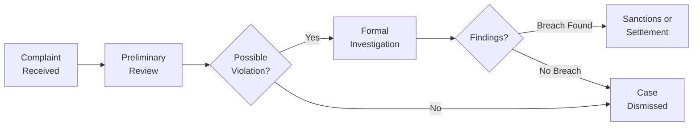

## Introduction
Picture this: you’ve worked incredibly hard to earn your CFA designation, spending evenings and weekends knee-deep in financial models and ethics practice questions. Suddenly, you see a headline about someone with the same credential making questionable trades or allegedly misleading clients. Well, that’s exactly the kind of scenario the CFA Institute Professional Conduct Program (PCP) aims to address—and, hopefully, prevent.

The PCP stands right at the forefront of maintaining the integrity and fairness of the CFA Institute Code of Ethics and Standards of Professional Conduct. Its role is huge: it investigates ethical concerns, enforces the rules, and ultimately ensures that the “CFA” initials on your business card remain a trusted hallmark of professionalism. Let’s explore how it all works in practice.

## The Role and Purpose of the Professional Conduct Program
The CFA Institute’s Professional Conduct Program (PCP) is essentially the ethical watchdog for all CFA Institute members and candidates. Whenever there’s a hint or suspicion that the Code of Ethics or Standards of Professional Conduct might have been violated, the PCP jumps into action. 

It’s not just about slapping wrists or revoking memberships, though. The PCP also focuses on education. Often, minor infractions are teachable moments that help members and candidates better understand what it means to serve clients and the public interest with integrity. Consequently, the PCP’s combination of enforcement and education has a twofold benefit:
• Maintaining a consistently high ethical standard among active investment professionals.  
• Providing clarity to members and candidates about what it really means to behave ethically in a fast-evolving financial landscape.  

Whenever someone asks me: “Why does the PCP exist?” I think about trust. Without trust, capital markets struggle and clients lose faith in their advisors. The PCP’s ultimate goal is to protect the trust associated with the CFA designation—trust earned by decades of ethical conduct from professionals who came before us.

## How the PCP Receives and Evaluates Complaints
Let’s face it: no ethical oversight system could function without a steady flow of information. Complaints and tips—whether from colleagues, regulatory bodies, clients, or even random folks who spot suspicious behavior—are vital signals prompting the PCP to take a closer look. 

The PCP typically learns of potential violations in three main ways:
• Direct Complaints or Leads from the Public: Disgruntled clients or coworkers can alert the PCP to suspicious actions.  
• Proactive Monitoring and Media Reports: Sometimes the PCP hears about ethical infractions through media coverage or other external sources.  
• Self-Reporting or Voluntary Disclosures: In some instances, members come forward themselves if they realize an honest mistake potentially violates the Code and Standards.  

Once a complaint is received, the PCP performs a pretty standard evaluation:
1. Preliminary Review: They collect basic facts (e.g., timing, parties, and nature of the alleged misconduct).  
2. Determination of Merit: If there’s a possibility of a violation, the case progresses to a deeper investigation; if not, the case is dismissed.  

It’s important to mention that this gatekeeping function is crucial for eliminating frivolous or groundless complaints. After all, you wouldn’t want your charter threatened every time someone simply tosses out an accusation to discredit your firm.

## The Disciplinary Process Lifecycle
Whether the complaint is about chronic insider trading or a tiny disclosure mishap, the PCP follows a structured, step-by-step disciplinary process that emphasizes both thoroughness and fairness. Let’s walk through it in more detail:

### 1. Initiation and Fact‑Gathering
• After the PCP decides it has reason to believe a violation may have occurred, it sends an inquiry to the candidate or member in question.  
• Documents, relevant communications, and witness statements are gathered.  
• The PCP can communicate with regulatory agencies like the SEC or the FCA, especially if the alleged wrongdoing also has legal implications.  

### 2. Formal Investigation
• The PCP staff assembles the facts of the case.  
• They consult relevant provisions of the Code and Standards.  
• They evaluate how serious the alleged breach is—some violations merely require an educational action plan while other severe offenses might call for suspension or revocation.  

### 3. Evaluation of Findings
• If the PCP believes there’s insufficient evidence, they close the investigation.  
• If enough substance remains to indicate a breach, the PCP proposes a sanction, which might range from a private censure to permanent revocation of one’s right to use the CFA designation.  

### 4. Response and Due Process
• The member or candidate has the right to respond, provide more testimony or evidence, and even dispute the suggested sanction.  
• If necessary, a hearing panel weighs additional arguments and decides whether to uphold or adjust the sanctions.  

### 5. Final Sanction or Resolution
• The PCP’s final ruling is issued once all evidence is weighed.  
• In serious cases, the results can be shared publicly to maintain transparency.  

Due process is the key here. The PCP ensures individuals have enough time and support to explain their side. The process isn’t about condemnation; it’s about upholding ethical standards through fair and transparent reviews.

Below is a simplified view of how this lifecycle might look:

The diagram highlights the main milestones in the PCP’s disciplinary process. Once a violation is confirmed, the focus shifts to deciding upon appropriate sanctions.

## Impartial Enforcement and Operating Guidelines
One of the most impressive things about the PCP is how seriously it takes impartiality. Imagine if the PCP were motivated by personal biases, favoritism toward certain members, or external pressures. That would erode confidence in the CFA designation almost instantly. 

Instead, the PCP follows established, consistently applied guidelines:
- All members and candidates are judged against the same Code and Standards.  
- Conflicts of interest must be minimized; investigators recuse themselves if they have personal ties to the case.  
- Transparency: The PCP’s procedures and potential sanctions are published, so no one can claim they had “no idea” about the potential consequences of unethical behavior.  

This framework ensures that every individual is treated equally, from a seasoned portfolio manager with 20 years’ experience to a new candidate who hasn’t even passed Level I.

## Educational Component: More Than Just Punishment
People sometimes assume that the PCP’s entire purpose is to catch bad actors. In reality, the PCP also wants to help professionals adhere to best practices. It’s a bit like your elementary school teacher who corrects your grammar not only to fill your permanent record with red ink but also to improve your skills.

### Reinforcing Best Practices
When an infraction (like inadequate disclosures in marketing materials) triggers the PCP’s attention, the result might be an educational initiative rather than immediate punishment. For instance, a candidate who failed to disclose outside business interests could be required to take additional courses or workshops on conflict of interest resolution. 

### Enhancing Clarity
The PCP publishes anonymized information on common violations. These examples broaden everyone’s understanding of how real-world ethical issues can arise—and just how subtle some might be. For instance, a “minor” oversight in a financial report can still constitute a major meltdown in terms of ethics.

By focusing on learning and clarity, the PCP ensures that members and candidates interpret the Code and Standards in ways that stay relevant as financial markets evolve.

## Hypothetical Case Example: Conflict of Interest
Let’s say there’s a member named Alex, a portfolio manager at a moderately sized hedge fund. Alex is approached by a relative who owns a successful, private manufacturing company. The relative needs capital and offers Alex a chance to invest personally. Eager to help—and to make some money—Alex invests.

Here’s the bad part: later, the relative asks Alex to direct the hedge fund’s clients into the same investment. Alex goes along with it without fully disclosing the personal stake (which is a potential conflict). A client, noticing unusual private investments in their statements, complains to the PCP, accompanied by documentation that Alex had not revealed the personal connection.  

The PCP opens a case. They request internal emails, marketing materials, and communications from both Alex and the hedge fund. During the formal investigation, the PCP finds there was a clear conflict of interest that Alex failed to disclose. Alex’s “I didn’t realize it was required” defense isn’t enough to let him off the hook.  

In this scenario, the PCP then recommends:
- Temporary suspension of membership or a public reprimand.  
- An educational requirement focusing on disclosure best practices.  
- Possibly a fine (if local regulations permit).  

The result? Alex (and every other member watching this unfold) now understands the importance of transparency when investing on behalf of clients. This is a classic example illustrating how the PCP’s process ensures members are mindful, consistent, and thorough with ethics compliance.

## The Vital Importance of Due Process
When people hear the phrase “due process,” they might think of legal courts, robed judges, or balancing scales. But the principle is fundamental for professional bodies too—especially a global organization as large as the CFA Institute. If members and candidates felt the PCP could impose sanctions arbitrarily, that trust we discussed earlier would be gone in a hurry.

### Key Elements of Due Process
1. Notice: The member or candidate must receive clear notification of the complaint.  
2. Right to Respond: The subject of the complaint has the chance to share their side, providing additional detail, context, or witnesses.  
3. Appeals or Review: If a sanctioned individual believes the PCP’s decision was flawed, they can often request a hearing or second look.  
4. Consistent Sanctions: The PCP generally follows established frameworks so that the penalty “fits the offense” and remains consistent over time.  

By respecting these elements, the PCP guarantees fairness—not just to the accused but also to the broader membership and public who rely on the organization’s integrity.

## Emphasizing Transparency
Transparency isn’t merely a buzzword for the PCP. In practice, certain types of disciplinary outcomes become public, especially when they involve severe violations like misrepresentation of credentials or deliberate fraud that undermines the profession’s reputation. You might see these outcomes listed on the CFA Institute website (though typically only after the entire due process has concluded).

Sure, being publicly sanctioned is serious—some folks might even say humiliating. But that public accountability encourages correct behavior from everyone else who wants to avoid that negative spotlight. Meanwhile, minor infractions or unproven allegations are not typically published; the PCP knows how to strike a balance that protects members from gossip while ensuring accountability for major breaches.

## Potential Sanctions
When the PCP finds that a violation took place, it can impose a range of sanctions. Here are a few worth noting:

• Private Censure or Cautionary Letter: Usually for first-time or less serious infringements.  
• Public Censure: More severe. The individual’s name and misdeed may be published, sending a strong warning to others.  
• Suspension of Membership and/or Candidate Enrollment: The PCP can suspend for a set period, effectively halting a member’s right to use the CFA designation or continue in the program.  
• Revocation of Membership and/or CFA Charter: The nuclear option, reserved for the most serious or repeated violations.  

Imagine spending years studying for the exams, obtaining your charter, and then losing it because you neglected a key ethical principle. That is precisely why the PCP’s existence is such a powerful motivator for good conduct.

## Best Practices and Common Pitfalls
There’s definitely something to be said for learning from other people’s mistakes. Over the years, I’ve seen certain issues pop up again and again:

### Common Pitfalls
• FAILURE TO DISCLOSE: Whether it’s an outside business or a material conflict of interest, insufficient disclosure is one of the top triggers for PCP investigations.  
• MISREPRESENTATION: Exaggerating performance results or qualifications is guaranteed to catch the PCP’s attention if discovered.  
• PLAGIARISM OR RESEARCH MISCONDUCT: Using others’ reports or data without proper attribution.  
• FRONT-RUNNING AND INSIDER TRADING: These can be both legal violations and ethical breaches.

### Best Practices to Avoid Trouble
• PROACTIVE DISCLOSURES: When in doubt, disclose. Your clients and the PCP appreciate candor.  
• STAY UP TO DATE: The Code and Standards evolve. Periodically review the official guidelines and relevant references.  
• EDUCATION AND TRAINING: Whether it’s offered by your firm or the CFA Institute, updating your ethics knowledge is always wise.  
• DOCUMENT EVERYTHING: Keep thorough records of your decisions, especially if they revolve around conflicts or unusual transactions.

## Personal Anecdote: A Mentor’s Advice
When I first became a CFA charterholder, a mentor of mine taught me something that stuck: “If you’d be ashamed to tell your grandmother about it, it’s probably not ethical.” It’s a folksy rule, but it underscores the strong moral foundation the PCP enforces. The PCP is looking for actual wrongdoing, of course, but also for lapses in judgment that could undermine client trust.

## Quick Comparison with External Regulatory Bodies
Occasionally, the PCP works in tandem with government regulators like the SEC in the United States or the FCA in the UK. If a member’s unethical behavior also violates securities laws, the PCP may collaborate with these authorities or rely on their findings. However, the PCP’s standards can be broader than legal requirements. Something might be legal but still unethical. In those cases, the PCP can act independently to safeguard the reputation of the CFA designation.

## Practical Impact on Your Career
It might sound cliché, but your professional reputation is everything. A PCP investigation can consume time, cause stress, and jeopardize your standing even if the final result is just a cautionary letter. On the flip side, the PCP’s vigilant oversight ultimately protects you. When everyone else in the industry plays by the same rules, your honest practices stand out. You’ll attract clients and colleagues who value transparency and trust.

## Strategies for Navigating Ethical Dilemmas
Let’s be honest: modern finance moves quickly, and not every ethical dilemma has a black-and-white, clear-cut solution. If you’re ever unsure, the CFA Institute provides a host of resources—case studies, webinars, practice examples—plus a recommended approach:
1. Identify the relevant Standard (e.g., Standard III on Duties to Clients).  
2. Consider the broader context, including any local regulations.  
3. Seek guidance from compliance departments, mentors, or ethics hotlines.  
4. Document your reasoning and final decision.  

At the end of the day, the PCP exists to keep you on track and hold you accountable if you wander astray.

## Closing Thoughts and Exam Relevance
For your CFA exam preparations, it’s tempting to focus on formulas and finance theories—like discounted cash flows and modern portfolio theory. But don’t neglect ethics. The Code and Standards (and by extension, the PCP) hold a key place in your journey toward the charter. Exam questions often delve into scenario-based dilemmas, testing how you’d apply ethical principles and professional conduct in practice.

In the real world, the PCP’s investigations and actions also remind us that the CFA designation is more than a line on your résumé—it’s a commitment to integrity, professionalism, and client-centered behavior. By understanding the PCP’s role in receiving complaints, investigating them thoroughly, and imposing sanctions fairly, you’ll recognize how vital ethics enforcement is to the entire investment profession.

---

## References and Further Reading
• CFA Institute website: “Professional Conduct” section at  
  https://www.cfainstitute.org/  
• “CFA Institute Bylaws” – for comprehensive legal and procedural details  
• “CFA Program Curriculum, Level I” – official CFA curriculum for deeper dives into ethics enforcement  
• Regulatory agency guidelines (e.g., SEC or FCA enforcement procedures) for comparative understanding  

---

## Test Your Knowledge: CFA Professional Conduct Program Essentials



### Which of the following statements best describes the primary goal of the Professional Conduct Program (PCP)?
- [ ] To promote higher exam pass rates among CFA candidates.  
- [x] To protect the integrity of the CFA designation by monitoring and enforcing ethical standards.  
- [ ] To negotiate with regulatory authorities on behalf of members accused of fraud.  
- [ ] To manage financial research publications on behalf of CFA Institute.

> **Explanation:** The PCP ensures that CFA members and candidates comply with the Code of Ethics and Standards of Professional Conduct, preserving the designation’s reputation.

### Which of the following is the first step the PCP takes when it receives a complaint about alleged misconduct?
- [ ] Proceed directly with a formal sanctions announcement.  
- [ ] Arrange a public forum to discuss the claim.  
- [x] Conduct a preliminary review to determine if a potential violation exists.  
- [ ] Immediately coordinate with government regulators to issue criminal charges.

> **Explanation:** The PCP must first do a preliminary review to assess the substance of the complaint before deciding whether to investigate further.

### During a PCP investigation, which principle ensures that accused members have the opportunity to explain their side of the story?
- [ ] Selective Enforcement  
- [x] Due Process  
- [ ] Automatic Deferral  
- [ ] Jury Nullification

> **Explanation:** Due process guarantees a fair procedure, including the right to respond and present evidence before any sanctions are imposed.

### If the PCP finds insufficient evidence of wrongdoing, which of the following actions is most likely?
- [ ] Immediate revocation of the CFA charter.  
- [x] Dismissal of the case.  
- [ ] Imposition of a permanent ban on reapplying for membership.  
- [ ] Referral of the case to a local financial regulator.

> **Explanation:** If the PCP’s investigation doesn’t find enough evidence of a violation, the case is dismissed.

### Which of the following best illustrates a potential conflict of interest requiring disclosure?
- [x] A portfolio manager investing client funds into a company in which he holds a personal stake.  
- [ ] A new candidate discussing job interviews with colleagues.  
- [x] A research analyst recommending a stock while holding a significant financial interest in that stock.  
- [ ] A retiree deciding to transfer her pension to an advisor’s firm.

> **Explanation:** Owning personal financial interests in a security recommended for client portfolios can create conflicts that must be disclosed.

### When minor ethical violations occur, how does the PCP often respond?
- [ ] By publicly disclosing the violation on the CFA Institute website.  
- [x] By potentially issuing an educational or cautionary letter.  
- [ ] By imposing lifetime bans automatically.  
- [ ] By revoking the CFA charter without appeal.

> **Explanation:** For relatively minor infractions, the PCP may provide educational guidance or a confidential warning, rather than immediate harsher sanctions.

### In severe cases, what is the PCP’s “nuclear option” sanction against a member or candidate?
- [ ] Temporary suspension from a single CFA ethics workshop.  
- [x] Revocation of membership or the CFA charter.  
- [ ] A private censure that only the member and PCP know about.  
- [ ] Public coverage of the hearing process on live broadcast.

> **Explanation:** The PCP may revoke the individual’s membership and right to use the CFA designation in extreme cases.

### Which of the following factors primarily helps the PCP maintain impartiality during investigations?
- [ ] Minimal documentation.  
- [ ] Hidden internal guidelines.  
- [x] Consistently applied procedures and recusal in cases of conflict.  
- [ ] Strict reliance on external investigations only.

> **Explanation:** The PCP follows standardized guidelines, ensuring that any investigator with a conflict of interest steps away from the case to maintain objectivity.

### Which benefit arises from the PCP publishing anonymized information on common violations?
- [x] It educates members and candidates on real-world ethical pitfalls.  
- [ ] It permanently labels members as violators, hurting their future careers.  
- [ ] It reveals personal details about every rule-breaker for public scrutiny.  
- [ ] It reduces transparency because no names are disclosed.

> **Explanation:** Sharing lessons from real scenarios helps everyone learn to avoid ethical missteps, without unfairly exposing a specific individual’s name for minor offenses.

### True or False: The PCP’s engagement with external regulatory bodies can occur when misconduct also aligns with possible legal violations.
- [x] True  
- [ ] False  

> **Explanation:** If the alleged misconduct falls under securities laws or financial regulations, the PCP may coordinate with government authorities to gather or share facts.


