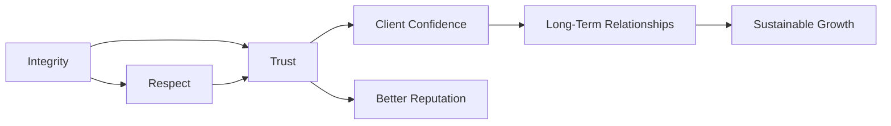

## Introduction

You know that moment when you realize a single lapse in judgment could wreck years of hard-earned reputation? Well, in the investment profession, where client trust is paramount, such a moment can literally lead to a career-defining fiasco. The CFA Institute Code of Ethics is designed to help you avoid these minefields by spelling out a set of guiding principles that—when faithfully applied—serve as your moral and professional compass. 

In this section, we explore how the Code’s guiding values of integrity, competence, diligence, respect, and putting client interests first collectively bolster the credibility and stability of the investment industry. We’ll talk through practical examples, highlight common challenges, and show you just how vital it is to hold yourself to a higher moral standard than even the most stringent law might demand. Ultimately, adhering to the Code isn’t about ticking boxes; it’s about building a lifelong commitment to honest, effective, and transparent service for your clients and the broader market.

## Why Ethics Matter in Finance

Perhaps you’ve heard the old cliché: “Money makes the world go around.” In finance, that “world” depends heavily on trust. Investors rely on the expertise of financial professionals to guide them through unfamiliar assets, complex analyses, and unpredictable markets. A single unethical act—like manipulating performance reports or concealing fees—can dissolve client confidence in a flash.

The CFA Institute Code of Ethics underscores the high stakes of professional conduct. While local and regional regulations set baseline requirements, the Code stretches far beyond legality to embrace higher principles: not just obeying the law but doing what’s right. This ethic of going above and beyond offers robust protection for both clients and professionals. 

When your practice is rooted in ethics, your relationships with clients, colleagues, and the public stand on a solid foundation. Over time, you build a sterling reputation, foster deeper client loyalty, and enhance the credibility of the entire investment profession.

## Foundational Principles of the CFA Institute Code of Ethics

### Integrity

Integrity is at the heart of everything we do in finance. Think of it as the unwavering commitment to telling the truth, honoring commitments, and resisting temptations to lie or cheat. A professional with integrity won’t stretch performance results for a bigger bonus or leak confidential details to secure a personal advantage.

Imagine you’re a portfolio manager. One day, you discover a colleague using client data in a questionable side investment. It’s all hush-hush, and nobody else seems to be sounding the alarm. Do you speak up? Acting with integrity means sticking to your moral compass—even if it puts you at odds with an influential manager or a profitable practice. Over time, this consistent honesty builds trust with clients and fosters a lasting respect from industry peers.

### Competence

Competence implies continuing education and the consistent application of up-to-date expertise. As finance professionals, we’re expected to maintain an ever-evolving skillset: from quantitative analysis to advanced derivative strategies, from ethical frameworks to the nuances of cross-border compliance.

Competence doesn’t mean you’re required to know everything about every subfield in finance; that’s obviously impossible. But it does mean you should remain mindful of your limitations. For instance, if you specialize in equities but your client wants to dive into complex crypto derivatives, intellectual honesty (and competence) might mean referring them to someone with deeper expertise or taking the time to get additional training.

### Diligence

Diligence is all about thoroughness and care in your work. An analyst preparing a research report should exhaust credible data sources, question assumptions, and not breeze through evaluating risks. Diligence also entails consistently revisiting your investment strategies to ensure they remain relevant given market shifts or changing client circumstances.

While it’s tempting to cut corners when deadlines loom, especially in today’s high-pressure environment, ethical diligence demands that we don’t. True diligence aligns with the best interest of the client and reduces the risk of sloppy mistakes that can erode trust or cause major financial harm.

### Respect

Respect in the CFA Code context extends to clients, colleagues, and even the broader public. Usually, we talk about “treating people right,” but in the investment world, it also means being sensitive to cultural norms, proprietary information, and intellectual property. It’s a reminder that no matter how pressed we feel to outperform benchmarks or exceed sales targets, we cannot discount the dignity and rights of individuals involved.

A respectful environment fosters open communication. If team members feel respected, they’re more likely to voice concerns or admit mistakes before they snowball into bigger problems. Additionally, respect for clients means listening closely to their goals and risk tolerance, rather than pushing them into products they may not need or want.

### Placing Client Interests First

From a strictly profit-driven viewpoint, this principle can be a tough pill to swallow. Let’s face it: the potential to cut corners or prioritize our own benefits is real—especially when compensation structures reward short-term gains. But the Code of Ethics takes a firm stance: your choices, recommendations, and strategies must always revolve around serving the client’s best interests.

So, if your client is a retiree with a conservative risk tolerance, you should not (under any circumstances) chase high-flying speculative bets just because they promise higher fees for you. By diligently aligning client objectives with your professional advice, you preserve trust, loyalty, and a sustainable client-advisor relationship.

### Professional Judgment

Professional judgment involves looking beyond the letter of the law to consider the spirit behind it. For instance, certain trading practices might be technically legal yet still raise red flags from an ethical perspective. Maybe it’s a borderline practice that exploits a regulatory loophole to gain an advantage. The Code reminds us to ask, “Is this in the best long-term interest of my client and the broader market, or am I just capitalizing on a gray area for personal gain?” 

In practice, professional judgment is not limited to legal boundaries. It’s informed by experience, a deep understanding of the client’s objectives, and a personal moral compass that says, “Yes, this is the right thing to do.” 

### Duty of Care

Duty of care might sound a bit formal, but it’s essentially a heightened responsibility to ensure your professional actions safeguard client interests. This principle obliges you to produce the most accurate, research-based recommendations and remain transparent about potential risks and fees. 

It also ties into broader stakeholder concerns—like being mindful that a particular pension fund invests livelihood assets of many retirees, not just abstract “units.” Acting with a sense of duty means placing emphasis on thorough due diligence, full disclosure, and unwavering loyalty to those you serve.

## How These Principles Build Trust and Confidence

When you weave these principles together, you create a strong ethical fabric that underpins trust and confidence. Clients sense that you’re not just out to make a quick buck; you’re determined to guide their financial progress responsibly.

Below is a simple conceptual diagram illustrating how these principles interlink:

- Integrity feeds into trust, which builds client confidence.  
- Respect also fuels confidence and trust, further enhancing your reputation.  
- Over time, these relationships become long-lasting and contribute to a stable, sustainable practice.

## Real-Life Scenarios and Practical Outcomes

Picture this: You’re a junior analyst at a mid-sized asset management firm. A senior colleague suggests adjusting a performance presentation to smooth out some hedge fund returns—a tweak that isn’t outright illegal, but it does feel misleading. The code’s principle of integrity says you shouldn’t manipulate data or cherry-pick timeframes to hide volatility risk. If you refuse, you might lose that senior colleague’s favor in the short run. But you’ll retain your self-respect, your clients’ trust, and probably sleep better at night. Plus, you are less likely to face reputational damage down the road if the “tweak” is uncovered.

Or imagine you receive a tempting offer to join a competitor, along with a subtle hint to bring your current firm’s proprietary investment process or client list. This might push you toward that competitor’s sign-on bonus. However, respecting confidentiality and the intellectual property of your current employer is crucial. It’s both a legal and ethical obligation. Compromising that trust would violate multiple principles, such as respect, diligence, and integrity.

In both examples, the Code is not some abstract rulebook; it’s the compass you turn to when a crossroad demand arises. Time and again, professionals report that consistently upholding these duties pays off in the long run—both financially and emotionally.

## Practical Implications for Your Career

Adhering to the Code of Ethics has multiple tangible benefits, including:

• A Stronger Professional Brand: Recruiters, clients, and press outlets gravitate toward individuals and firms viewed as trustworthy.  
• Better Risk Management: By avoiding shady practices, you reduce legal, regulatory, and reputational risks.  
• Enhanced Analytical Rigor: Sticking to principles of competence and diligence means consistently testing assumptions, which often leads to better portfolio outcomes.  
• Transparent Client Communication: Clarity around fees, performance, and risks builds client satisfaction and fosters loyalty.

You could say that the Code forms the “nice guy finishes first” strategy in the investment world—where strong ethics actually become a competitive advantage.

## Lifelong Commitment, Not a One-Time Checklist

One misconception is that the Code of Ethics is only relevant when you’re taking the CFA exam or applying for membership. That couldn’t be further from the truth. The Code remains at the core of your professional identity throughout your entire career. Ethical dilemmas don’t conveniently disappear once you’ve received that CFA charter or passed your regulatory exam. They keep cropping up, often in new forms, especially as technology and markets evolve.

Staying updated on ethical guidelines and periodically revisiting how you apply them can help you spot evolving gray areas. Whether it’s new regulations around blockchain-based assets or issues arising from AI-driven trading algorithms, the fundamental values remain the same.

## Fostering a Culture of Ethical Decision Making

One of the coolest aspects of working in an ethical environment is the strength it brings to your day-to-day operations. If everyone, from interns to senior partners, embraces these principles, you notice more open dialogue, fewer cover-ups, and a shared understanding that the client—and the greater good of the profession—comes first.

In fact, some firms implement internal programs that simulate ethical dilemmas, like role-playing a scenario where a client wants you to front-run market orders. Other organizations periodically host “ethics roundtables,” encouraging employees to voice concerns or lessons from real professional experiences. By keeping ethics in the spotlight, you reduce the risk of questionable behavior becoming normalized.

## Best Practices and Common Pitfalls

While carrying out your duty, be vigilant about these best practices and pitfalls:

• Seek Guidance Early: If you find yourself wrestling with an ethical gray area, consult peers, compliance officers, or mentors.  
• Maintain Clear Documentation: Whether it’s client communications or investment rationale, keep detailed records to avoid misunderstandings.  
• Be Wary of Conflicts: Placing client interests first means disclosing actual or potential conflicts of interest, such as referral fees or personal holdings.  
• Avoid Complacency: In bull markets, it’s tempting to cut corners. But that can create bigger havoc when markets turn.  
• Resist Peer Pressure: A friend or senior colleague insisting, “This is how it’s done,” does not excuse unethical choices.

## Broader Duty to the Profession and Society

The Code of Ethics doesn’t end at client service. There’s a greater responsibility here: setting and upholding standards that benefit the entire financial ecosystem. By acting ethically, you help attract more investors, improve market quality, and foster sustainable economic growth. That, in turn, enhances the public perception of finance professionals, which should be a collective goal.

As a real-world example, companies and investment managers who consistently abide by ethical standards and transparent reporting often see improved relationships with credit agencies, regulators, and institutional investors. This ripple effect promotes broader stability and confidence in the financial markets—a crucial outcome in a world often fraught with uncertainty.

## Final Thoughts

It’s easy to view ethics as a series of “thou shalt nots.” But if you look deeper, you’ll find that the CFA Institute Code of Ethics is more about empowerment: giving you core principles and guidelines to make robust, reasoned decisions that serve your clients, your firm, and the broader investment community. And quite frankly, the more you apply these principles in practical, everyday ways, the more you start seeing them as the backbone of your professional identity—a blueprint that will guide you at every stage of your career.

A quick personal reflection: like many of you, I used to think that ethics was a thick, dusty code that only compliance folks cared about. But after seeing how fast reputations can topple in our industry from even one unethical misstep, I realized ethics is the protective shell around all the good work we do. It’s the best reason clients trust us with their assets, and it’s a catalyst for sustainable, long-term success.

Stay curious, stay conscientious, and remember: a lifetime of credibility is well worth those moments of moral backbone when you speak out or do the right thing—even if it’s not the easiest path.

## Additional Resources

Below are references you may find helpful for further exploration:

• CFA Institute Code of Ethics and Standards of Professional Conduct – The official publication covering principles and standards in detail.  
• Michael Josephson, “Making Ethical Decisions” – A foundational text offering frameworks for ethical reasoning.  
• Harvard Business Review: Corporate Integrity and Ethical Culture | https://hbr.org/  
• AICPA Code of Professional Conduct – Another global organization’s perspective on professional ethics.  

And don’t forget to stay open to professional seminars, workshops, and continuing education modules that can deepen your understanding and application of ethical principles in practice.

---

## Test Your Knowledge: The CFA Institute Code of Ethics



### Which principle emphasizes the importance of honesty and resisting unethical temptations?

- [ ] Competence
- [ ] Diligence
- [x] Integrity
- [ ] Duty of Care

> **Explanation:** Integrity is all about honesty and refusal to participate in unethical or deceptive acts.  

### What best describes “Placing client interests first” in the CFA Code of Ethics?

- [x] A commitment to prioritize client goals and objectives over personal gain.
- [ ] An optional guideline that encourages honesty with clients only during bull markets.
- [ ] A principle suggesting professionals simply match the returns of benchmark indexes.
- [ ] A principle stating that only large institutional clients deserve the highest level of service.

> **Explanation:** The Code of Ethics mandates that professionals always elevate client objectives above their own needs or compensation.  

### Which action best aligns with the principle of respect in the Code of Ethics?

- [x] Acknowledging differences of opinion and maintaining confidentiality of client data.
- [ ] Outperforming a portfolio benchmark by at least 2%.
- [x] Consulting with legal counsel when uncertain about data usage rights.
- [ ] Transferring confidential funds data to a personal device without disclosure.

> **Explanation:** Acting with respect involves maintaining client confidentiality, fostering open communication, and valuing different viewpoints.  

### A portfolio manager has found a legal loophole that benefits her but offers no improvement to her client’s risk-adjusted returns. According to the Code, which principle should guide her decision?

- [ ] Competence
- [ ] Respect
- [x] Professional Judgment
- [ ] Duty of Care

> **Explanation:** Even if it’s legal, exploiting a loophole that doesn’t serve the client’s best interest fails the test of careful, long-term professional judgment.  

### Which outcome is a key benefit of adhering to the Code of Ethics?

- [x] Lower reputational risk and stronger client loyalty.
- [ ] Faster market cycles and higher volatility in the market.
- [x] Automatic immunity from all legal actions.
- [ ] Guaranteed short-term outperformance over benchmarks.

> **Explanation:** Ethical conduct reduces reputational and regulatory risks, promotes trust, and fosters better client relationships, although it does not confer absolute legal immunity or guarantee outperformance.  

### Diligence requires which of the following behaviors?

- [x] Comprehensive research and careful analysis before making recommendations.
- [ ] Reliance on automated processes without periodic review.
- [ ] Prioritizing speed over thoroughness in fast-paced markets.
- [ ] Delegating all final investment decisions to an intern.

> **Explanation:** Diligence entails thorough examination of data and ongoing oversight of your analytical and investment processes.  

### Why is competence an essential principle in the CFA Code of Ethics?

- [x] It ensures that practitioners stay informed and practice within their areas of expertise.
- [ ] It allows professionals to avoid legal requirements.
- [x] It guarantees no mistakes in investment analysis.
- [ ] It encourages conflicts of interest.

> **Explanation:** Competence compels professionals to pursue relevant, updated knowledge, remain mindful of their limitations, and excel in their specialized fields.  

### Which of the following scenarios is a violation of the Code’s principle of confidentiality?

- [x] Sharing confidential client performance data with an external marketing firm without consent.
- [ ] Discussing generic market trends with a prospective client.
- [ ] Seeking counsel from your compliance department regarding client fees.
- [ ] Reporting unethical behavior through appropriate firm channels.

> **Explanation:** Confidential information should not be shared outside authorized parties. Sharing sensitive metrics with external vendors unapproved by the client violates respect and confidentiality.  

### Duty of care involves:

- [x] Thorough risk assessment and transparent communications to protect the client’s interests.
- [ ] Hiding poor performance to avoid alarm.
- [ ] Disregarding client instructions if they conflict with your personal preferences.
- [ ] Ignoring potential market risks if your firm policies don’t address them.

> **Explanation:** Duty of care means you must always act prudently on the client’s behalf, including honest disclosures of risks and performance.  

### Acting with integrity means:

- [x] True
- [ ] False

> **Explanation:** Acting with integrity includes honesty, transparency, and a consistent commitment to doing what is right—even if it conflicts with personal gain.  


