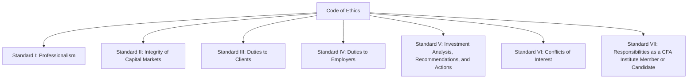

## Introduction

Have you ever caught yourself juggling multiple priorities at work—like, maybe you’re trying to manage client expectations, keep your employer happy, and still navigate your personal career ambitions, all while making sure you’re not stepping into an ethical minefield? Let’s face it: the investment profession can move at lightning speed, and it’s easy to get overwhelmed. That’s exactly why the Standards of Professional Conduct exist: they serve as a compass for all of us, ensuring that no matter how hectic things become, we adhere to principles that uphold trust, integrity, and fairness in the financial industry.

In this section, we’ll talk about how these Standards of Professional Conduct are organized, how they function as actionable rules derived from the broader Code of Ethics, and why they matter in daily professional life. After all, the Code of Ethics sets the ethical tone and big-picture mission, but the Standards break that down into practical, situation-specific guidelines—kind of like a “how-to” guide for ethical behavior.

## Broad Overview of the Standards

Seven key Standards form the foundation of professional conduct for CFA Institute members and candidates. Each Standard touches upon essential components of ethical behavior and good practice. Here’s a bird’s-eye view:

- Standard I: Professionalism  
- Standard II: Integrity of Capital Markets  
- Standard III: Duties to Clients  
- Standard IV: Duties to Employers  
- Standard V: Investment Analysis, Recommendations, and Actions  
- Standard VI: Conflicts of Interest  
- Standard VII: Responsibilities as a CFA Institute Member or CFA Candidate  

These Standards aren’t random. They logically flow from an overarching ethical ideal and break it down into specific obligations. Although each Standard has its own distinct focus, they often interrelate. A single scenario (e.g., you discover a piece of insider information from a client) can raise questions about your market conduct (Standard II), your loyalty to your employer (Standard IV), and even your duties to your client (Standard III).

Below is a simple diagrammatic representation of the relationship between the overarching Code of Ethics and the seven Standards of Professional Conduct:

## Breaking Down the Standards

### Standard I: Professionalism

Scope  
Professionalism (Standard I) underpins everything else and reminds financial professionals to behave with integrity and remain credible sources of advice. The key areas include:  
• Knowledge of the Law  
• Independence and Objectivity  
• Misrepresentation  
• Misconduct  

It means we should stay up-to-date on relevant regulations, avoid making false statements about our credentials, and refrain from any activity that could tarnish our professional image. For instance, imagine you’re at a conference, and a sponsor offers lavish gifts in return for recommending their products—maintaining strict independence and objectivity is crucial here. Even if it’s tempting, you don’t want to compromise your professional integrity.

Structure  
Each subsection within Standard I offers targeted best practices and examples. For instance, “Knowledge of the Law” provides guidance on what to do if local laws conflict with the Code and Standards. The recommended procedures might include seeking legal counsel and documenting your steps to ensure your actions remain transparent and lawful.

### Standard II: Integrity of Capital Markets

Scope  
Integrity of Capital Markets (Standard II) deals with transparency, fairness, and honesty in the securities markets. Two main areas are typically highlighted:  
• Material Nonpublic Information  
• Market Manipulation  

In essence, this Standard prohibits the use of inside information to gain a trading advantage and prohibits any action—like spreading rumors or executing trades—that distort market prices or trading volumes for personal benefit.

Structure  
Standard II is often subdivided into clarifications of what constitutes “material nonpublic information” and how to handle it if you come across it. Recommended procedures might include maintaining restricted lists, using compliance officers as points of contact, and adopting firewall policies within firms to limit the flow of sensitive information.

### Standard III: Duties to Clients

Scope  
Duties to Clients (Standard III) covers loyalty, prudence, and care for client interests. It involves:  
• Loyalty, Prudence, and Care  
• Fair Dealing  
• Suitability  
• Performance Presentation  
• Preservation of Confidentiality  

You can think of it like you’re a pilot, and your clients are passengers. It’s your job to navigate safely, avoid turbulence as much as possible, and ensure everyone arrives at the destination (financial goals) in good shape. If you put your own interests first, you risk not only your own reputation but the trust placed in you by others.

Structure  
Subsections within Standard III clarify how to approach client relationships ethically: from recommending investment products only when they’re suitable to presenting performance in an accurate and not misleading fashion. Detailed guidance helps with real-world dilemmas like showing partial historical data or “cherry-picking” only the best results. Best practices include establishing standard processes for suitability checks, employing GIPS-compliant performance data (see Chapter 4 and Chapter 9 for more on GIPS), and ensuring robust documentation to protect client confidentiality.

### Standard IV: Duties to Employers

Scope  
Duties to Employers (Standard IV) looks at how finance professionals can remain loyal to their firm without compromising ethical obligations to clients or regulatory requirements. Topics include:  
• Loyalty  
• Additional Compensation Arrangements  
• Responsibilities of Supervisors  

One of my personal experiences here: I once got a side job offer that tempted me to do overlapping tasks that might have sacrificed time owed to my primary employer. I quickly realized I needed to check my employment agreements and clarify any potential conflicts of interest—turns out, honoring your full-time job obligations comes first under this Standard.

Structure  
The subpoints give you the “nuts and bolts” of how to handle compensation structures, especially those that could influence your objectivity. Activities like “moonlighting” or referral fee arrangements must be forthcoming and consistent with employer policies. Supervisors also need to create a compliance-friendly environment, ensuring employees clearly understand (and follow!) the firm’s ethical guidelines.

### Standard V: Investment Analysis, Recommendations, and Actions

Scope  
Investment Analysis, Recommendations, and Actions (Standard V) concerns the foundation of the investment process: thorough research, diligence, and transparency. Particular areas include:  
• Diligence and Reasonable Basis  
• Communication with Clients and Prospective Clients  
• Record Retention  

If you’re managing a portfolio, you should have a solid rationale for each buy, sell, or hold decision—and you should be ready to communicate that rationale appropriately. Over the years, I’ve noticed that clients appreciate honesty about both bullish and bearish potential of any recommendation. In other words, if your team has only done five minutes of research on a complex derivative, that probably doesn’t meet the “reasonable basis” requirement.

Structure  
Within each subsection, the Standard stipulates best practices on the depth and scope of analysis, how to maintain and update research records, and how to communicate recommendations clearly. It encourages consistency: what you present to big clients should be equally transparent to smaller ones.

### Standard VI: Conflicts of Interest

Scope  
Conflicts of Interest (Standard VI) highlights the need to promptly disclose any potential or actual conflicts that could hinder objectivity. In practice, this might involve personal stock ownership in a firm you’re analyzing, or compensation models that might incentivize you to push certain products.  

Consider a scenario where you sit on the board of a technology company while advising clients on technology sector investments. That board position is definitely material to your objectivity—it needs to be disclosed to all relevant parties.

Structure  
The Standard details how to identify conflicts (Example: personal investments, referral fees) and the protocols (such as official disclosures, disclaimers) you can implement to ensure decisions remain unbiased and clear to all involved. Failure to properly disclose can harm both your professional standing and your firm’s reputation.

### Standard VII: Responsibilities as a CFA Institute Member or CFA Candidate

Scope  
Responsibilities as a CFA Institute Member or CFA Candidate (Standard VII) covers how to uphold the integrity of the CFA Program and the investment profession. It involves:  
• Conduct as Participants in CFA Institute Programs  
• Reference to CFA Institute, the CFA Designation, and the CFA Program  

The underlying message is: don’t misrepresent yourself as a Charterholder if you’re not, don’t share actual exam questions, and always maintain responsible behavior that protects the reputation of the CFA Institute and everyone who associates with it.

Structure  
Subsections give guidance on using the trademarked CFA designation, referencing your candidacy properly (e.g., “CFA Level I Candidate” vs. “CFA I”). It also spells out that cheating or revealing confidential exam content is clearly grounds for sanctions.

## Interlinkages and the Need for a Holistic Approach

One crucial point is that these Standards typically show up in tandem. A conflict of interest can easily implicate your duties to your client, your employer, and your obligation to maintain professional integrity. Treat ethical dilemmas like a puzzle—you may have to fit several pieces together before you see the full picture.  

In practice, it’s wise to ask yourself a short set of questions when facing an ethical dilemma:  
• Which Standards are potentially relevant?  
• What are the facts, and how do they line up with each Standard?  
• Could any recommendation or action breach more than one Standard simultaneously?  
• Are there processes in place at my firm to handle such situations (like a compliance department to consult)?  

This holistic approach doesn’t just fulfill formal requirements; it also cultivates a culture where we’re always mindful of how one action can ripple through multiple areas of professional conduct.

## Structure of the Standards: Statements, Sub-Sections, and Examples

Each Standard in the Code of Ethics and Standards of Professional Conduct has a consistent internal organization:

1. A clear statement of the Standard.  
2. Sub-sections or clarifications that interpret key themes (e.g., Material Nonpublic Information, Additional Compensation Arrangements).  
3. Recommended procedures, best practices, or guidelines that you can implement to maintain compliance.  
4. Hypothetical scenarios and examples to demonstrate whether a particular course of action is permissible or not, along with the ethical rationale.

This uniform structure is designed to help you identify quickly which Standard applies in a given situation and how to interpret that Standard properly.

## Real-World Scenarios

Let’s consider a scenario that might appear on an exam:

• You’re an analyst covering the consumer staples sector. A colleague in the New York office mentions hearing rumors of a major acquisition by one of your covered companies. The rumors come from an unconfirmed source. How do you handle this?  

Under Standard II (Integrity of Capital Markets), you need to assess:  
1. Is the information material and nonpublic?  
2. Has it been disseminated broadly to the market?  

If it’s truly a rumor with no credible source, it might not qualify as “material nonpublic information.” However, if your colleague actually got this from an insider at the target company, it could remain inside information. The recommended approach might include seeking verification through publicly available data or direct company announcements. Meanwhile, you should refrain from trading or issuing any recommendations until you clarify the rumor’s validity.

A single scenario often spans multiple Standards. For instance, recommending a trade based on insider info violates the Integrity of Capital Markets standard (Standard II) and potentially calls your professionalism into question (Standard I). If you gleaned that information from a client who expects confidentiality, you’re also risking violation of confidentiality obligations (Standard III).

## Global Relevance

No matter where you are in the world—New York, London, Dubai, Hong Kong—the same fundamental ethical principles apply. While local regulations vary, the CFA Institute’s Standards of Professional Conduct set a baseline code of behavior that transcends borders. In cases where local law conflicts with the Standards, the general guidance is to follow the stricter rule, so long as it doesn’t violate local law. If local rules are more lenient, you still adhere to the Code and Standards. If local rules are stricter, you follow the stricter regulation.

## Best Practices for Implementation

Many firms encourage a culture of compliance by:

• Formalizing compliance training: Periodic refresher training on the Code and Standards helps keep ethics top of mind.  
• Establishing escalation processes: If something seems off, employees have a clear path to compliance or legal experts.  
• Encouraging open dialogue: Creating an environment where it’s safe to report issues can prevent small problems from becoming big crises.  
• Documenting thoroughly: Maintaining records for research, trades, and communications ensures transparency and accountability.

Below is a quick table to summarize each Standard’s focus, relevant subtopics, and sample best practices:

| Standard                              | Key Focus Areas                             | Example Best Practices                                                         |
|---------------------------------------|---------------------------------------------|--------------------------------------------------------------------------------|
| I: Professionalism                    | Knowledge of the Law, Independence, etc.    | Stay updated on regulations; avoid lavish gifts from service providers         |
| II: Integrity of Capital Markets      | Insider Trading, Market Manipulation        | Restrict or block insider info; maintain watch lists and restricted lists       |
| III: Duties to Clients               | Loyalty, Fair Dealing, Confidentiality      | Conduct rigorous suitability checks; keep client info secure; fair fee pricing  |
| IV: Duties to Employers              | Loyalty, Compensation, Supervisors          | Disclose outside business interests; set clear compliance guidelines            |
| V: Investment Analysis, etc.          | Research, Diligence, Record Retention       | Maintain detailed records; share balanced research conclusions                  |
| VI: Conflicts of Interest             | Disclosure, Avoiding Biased Recommendations | Reveal board memberships or personal stakes; adopt robust disclaimers           |
| VII: Responsibilities to CFA Program  | Conduct in Programs, Use of CFA Designation | Don’t misrepresent your status or share exam content; uphold the CFA Institute  |

## Common Pitfalls and Challenges

• Rationalization: “Everyone else does it,” or “It’s just a small perk.” This complacency erodes ethical judgment.  
• Overconfidence in ambiguous situations: You might think you “know enough” to interpret complex rules solo. Consulting peers or a compliance officer is often safer.  
• Conflicts in tight deadlines: Under time pressure, corners can be cut. Sloppy research or “winging it” can violate the diligence requirements of Standard V.  
• Inadequate disclosure: Sometimes you might think a small personal stake isn’t a big deal. But even a tiny conflict can matter to a client.

## Exam Relevance

On the CFA exam—especially at Level I—ethical scenarios are a staple. You’ll often see multiple-choice questions detailing an analyst’s or firm’s dilemma, asking which Standard is violated (or not). Rote memorization isn’t enough; you must grasp the spirit of the Code and Standards to consistently get these right.  

For instance, you might face questions about material nonpublic info (“Is it material? Did they disclose it properly?”) or about a manager’s responsibilities when receiving gifts from a client. Practice questions will typically present borderline scenarios where you must carefully weigh the facts to see if they cross the line.

## Final Exam Tips

1. Read Each Scenario Carefully: Ethics questions hinge on detail. Look for keywords like “material,” “nonpublic,” “client’s best interest,” or “confidential.”  
2. Consider Multiple Standards: The correct answer might address violations of more than one Standard.  
3. Apply the Stricter Rule: If local law is less stringent than the CFA Institute’s Standards, the Standards still apply (and vice versa).  
4. Stay Calm Under Pressure: Sometimes test-day nerves lead to second-guessing. Have a systematic approach: pick the relevant Standard first, then interpret the sub-sections.  

## References and Further Reading

• CFA Program Curriculum, Levels I–III: Official guidance and numerous case studies illustrating each Standard’s scope and application.  
• Sarah Peck, “Investment Ethics”: A thorough exploration of real-life ethical scenarios in investment practices.  
• U.S. Securities and Exchange Commission (SEC), International Organization of Securities Commissions (IOSCO), European Securities and Markets Authority (ESMA): Regulatory guidelines on professional conduct.  
• GIPS Standards Handbook (for performance presentation aspects under Standard III).  

## Test Your Knowledge: Standards of Professional Conduct Quiz



### An analyst receives a gift from a client who is especially pleased with the analyst’s recent recommendation. The gift is extravagant and could influence the analyst’s objectivity. What should the analyst do according to the Standards?

- [ ] Decline the gift immediately to avoid any appearance of impropriety.  
- [x] Disclose the gift to her employer and follow the employer’s policies regarding gifts.  
- [ ] Quietly accept the gift; the client relationship is more important.  
- [ ] Accept the gift but do not disclose it because it is from a client, not a corporate sponsor.  

> **Explanation:** Standard IV (Duties to Employers) and Standard I (Professionalism) suggest that analysts must disclose lavish gifts that could influence objectivity. Following firm policy is critical.

### An investment manager learns of a takeover bid from a friend who works at the target firm. The manager uses this info to buy shares for her personal account before making recommendations to her clients. Which Standard is most directly violated?

- [x] Standard II(A): Material Nonpublic Information.  
- [ ] Standard III(B): Fair Dealing.  
- [ ] Standard IV(A): Loyalty.  
- [ ] Standard V(B): Communication with Clients.  

> **Explanation:** Trading on insider information clearly violates Standard II(A). Standard III(B) might also be relevant, but the direct violation is use of material nonpublic information.

### A candidate in the CFA Program uses past exam questions, which were not authorized or publicly released by the CFA Institute, as a study aid. What primary Standard is at issue?

- [x] Standard VII(A): Conduct as Participants in CFA Institute Programs.  
- [ ] Standard I(B): Independence and Objectivity.  
- [ ] Standard II(B): Market Manipulation.  
- [ ] Standard V(C): Record Retention.  

> **Explanation:** Using “secret” or illegally obtained exam questions breaches Standard VII(A).

### An analyst repeatedly recommends a product from which her spouse earns referral fees, failing to disclose these fees to clients. Which Standard is violated?

- [x] Standard VI(A): Disclosure of Conflicts.  
- [ ] Standard II(B): Market Manipulation.  
- [ ] Standard V(A): Diligence and Reasonable Basis.  
- [ ] Standard IV(B): Additional Compensation Arrangements.  

> **Explanation:** The failure to disclose personal or family financial interests in a recommended product violates the conflict of interest disclosure requirement.

### Under the Standards, if local law provides stricter requirements than the CFA Institute standards of conduct, which rule applies?

- [ ] None; local law never overrides CFA Institute standards.  
- [x] The stricter rule prevails, so follow local law in this case.  
- [ ] Firm policy automatically supersedes both local law and CFA standards.  
- [ ] The local law should be ignored because the Standards are globally applied.  

> **Explanation:** When local law is stricter, you must follow it but remain mindful of all relevant ethical directives.

### A portfolio manager wants to present only the best-performing client portfolios in a marketing brochure. Which Standard best addresses this situation?

- [x] Standard III(D): Performance Presentation.  
- [ ] Standard IV(B): Additional Compensation Arrangements.  
- [ ] Standard VI(B): Priority of Transactions.  
- [ ] Standard V(B): Communication with Clients and Prospective Clients.  

> **Explanation:** Presenting only top-performing portfolios can be misleading; Standard III(D) requires fair and accurate performance presentation.

### An analyst places personal trades ahead of executing the same trades for her clients, often benefiting from price movements. Which Standards are likely involved?

- [x] Standard VI(B): Priority of Transactions and Standard III(A): Loyalty, Prudence, and Care.  
- [ ] Standard II(A): Material Nonpublic Information and Standard VII(A): Conduct as Participants.  
- [x] Standard VI(A): Disclosure of Conflicts and Standard I(A): Knowledge of the Law.  
- [ ] Standard IV(A): Loyalty and Standard II(B): Market Manipulation.  

> **Explanation:** Front-running trades breaches the loyalty owed to clients (Standard III) and fails to prioritize client interests over personal ones (a conflict under Standard VI).

### A CFA Charterholder claims she’s “ranked #1 globally by the CFA Institute.” Which Standard is violated?

- [x] Standard VII(B): Reference to CFA Institute, the CFA Designation, and the CFA Program.  
- [ ] Standard IV(C): Responsibilities of Supervisors.  
- [ ] Standard II(B): Market Manipulation.  
- [ ] Standard I(D): Misconduct.  

> **Explanation:** Misrepresenting one’s standing within the CFA Program violates Standard VII(B).

### An associate invests in a publicly traded company without disclosing to her employer that she has close ties to the company’s executives. She later issues research on this company with a “Strong Buy” recommendation. Which Standard is most directly implicated?

- [x] Standard VI(A): Disclosure of Conflicts.  
- [ ] Standard III(C): Suitability.  
- [ ] Standard V(A): Diligence and Reasonable Basis.  
- [ ] Standard II(A): Material Nonpublic Information.  

> **Explanation:** Having close ties to a company is a conflict of interest that must be disclosed under VI(A).

### Under the Code and Standards, is it ever permissible to use proprietary client lists for personal gain without consent?

- [x] True  
- [ ] False  

> **Explanation:** It is false that such usage is permissible. (To clarify: using proprietary client lists for personal gain is never allowed without express permission.)



By consolidating the Standards of Professional Conduct into approachable categories, clarifying each Standard’s scope, structure, and recommended best practices, you’ll be more prepared not just for exam questions but for real-world ethical decisions. Ultimately, the goal of these Standards is to foster trust in the financial profession—a trust that pays dividends for clients, firms, and investment professionals alike.
