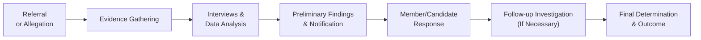

## Introduction and Context

Enforcement and investigation procedures anchor the integrity of the CFA Institute Code of Ethics and Standards of Professional Conduct. After all, it’s one thing to have these standards spelled out on paper, but another to ensure they’re enforced fairly and consistently. This section explains how the CFA Institute investigates allegations, protects confidentiality, and maintains the paramount objective: preserving the trust integral to the investment profession.

## Step-by-Step Outline of the Investigation Process

CFA Institute’s Professional Conduct Program (PCP) oversees the investigation process to determine if a candidate or member has violated the Code and Standards. The process seeks to be transparent and fair, and—believe it or not—most individuals do come away appreciating the rigor with which their case was addressed. Below is a broad outline:

### Triggers for an Investigation

• Referrals: Investigations often begin when a complaint or referral is submitted by a third party (e.g., a client, employer, fellow CFA charterholder) or through an internal mechanism.  
• Internal Monitoring: The CFA Institute may proactively monitor certain activities (e.g., suspicious exam conduct, widely publicized financial improprieties) to identify potential misconduct.  
• Public Allegations: Negative media coverage—say, a newspaper article describing unethical conduct—can entice the Institute to examine whether a Code or Standards breach occurred.

In my experience, folks sometimes underestimate how small the world of finance can be. A rumor can bounce around global markets faster than you can say “risk premium,” but the Institute’s official process relies on more tangible evidence than just hearsay. 

### Collecting Evidence

Evidence collection is methodical—think of it like detective work with a financial twist. It typically involves:

• Document Gathering: Reviewing financial statements, emails, marketing materials, and transaction records.  
• Witness Interviews: Speaking with individuals who may have relevant information. This is where your cooperation matters.  
• Member/Candidate Response: The individual under investigation is expected to provide requested documents and clarifications promptly. Not doing so might raise red flags.  
• Regulatory Coordination: In cases that cross into legal territory, the PCP may coordinate with government or self-regulatory bodies.  

#### Timeline for Fact-Finding

Though each inquiry differs, the initial fact-finding phase can last anywhere from a few weeks to several months, depending on complexity. If there’s a straightforward oversight (perhaps a date mismatch in a marketing brochure), resolution might be swift. On the other hand, analyzing a labyrinthine insider-trading ring? That’s a whole different story—it may span much longer.

Here is a simplified diagram showing how investigation steps feed into each other:

## Procedural Safeguards

The CFA Institute wants to ensure fairness—nobody wants baseless accusations to ruin a seasoned analyst’s career. So there are procedural safeguards along the way:

• Notification: The member or candidate is informed of the investigation, the general nature of the allegation, and any potential misconduct being examined.  
• Right to Respond: You can provide evidence, make clarifications, or even bring in legal counsel if you wish.  
• Representation: If you’re anxious—and let’s face it, who wouldn’t be—having a lawyer or advocate helps you present evidence systematically and calmly.  
• Confidentiality: There are confidentiality agreements to protect both the potential victim (the profession’s reputation) and the accused. Sensitive information generally doesn’t go beyond the investigation team and necessary offices, unless required for legal reasons.

## Potential Outcomes

After the fact-finding and due diligence, the investigation reaches an outcome. Here’s what can happen:

• No Violation (Case Closure): The PCP concludes that no breach occurred, or there isn’t sufficient evidence to proceed. You get a letter stating the investigation is concluded, and you can continue your merry way.  
• Cautionary Letter: Minor infractions that aren’t egregious might warrant a private reprimand. Think of it as a firm pat on the wrist: “Hey, watch your steps next time.”  
• Suspension: For more serious misconduct, membership or candidacy status (and the right to use the CFA designation) might be suspended.  
• Revocation of Membership/Charter: The nuclear option. In the most extreme cases, the Institute can revoke your CFA charter and membership altogether, essentially ending your ability to represent yourself as a CFA charterholder.

### Practical Perspective on Sanctions

It can be unsettling—but the severity of the sanction typically matches the violation’s gravity. Fabricating performance data, for instance, may lead to more severe penalties than a mere oversight in disclosing a minor conflict of interest. From what I’ve heard, though, proportionate discipline remains the guiding principle.

## Confidentiality and Information Protection

Confidentiality might be one of the most vital features in all these procedures. Once an investigation starts, the PCP ensures all documents, interviews, and personal information are safeguarded:

• Restricted Access: Only investigators and key decision-makers can see the relevant details.  
• Protected Records: Electronic files are often securely stored, with limited access rights.  
• Ongoing Confidentiality: Even after the investigation finishes, everyone on the inside is bound to keep sensitive details private.

Why the fuss over secrecy? Because it’s stressful enough for an innocent member to go through an inquiry without having rumors swirling in the broader community. Preserving the integrity and reputation of the individual—and the profession—matters.

## Appeals Process

All is not lost if you disagree with the final determination. An appeals mechanism ensures checks and balances:

• Notification of Decision: After the PCP decides on a sanction, you’ll be notified in writing.  
• Request a Review: You typically have a specified window (often 30 days) to file an appeal.  
• Review Body: The appeal gets escalated to a separate review panel or a specialized group, ensuring fresh eyes evaluate the evidence.  
• Alternative Sanction Proposal: Sometimes, you might propose a different sanction if you feel the recommended punishment doesn’t fit the violation’s severity.

This appeals stage offers a second chance to explain and provide additional information that might have been overlooked initially.

## Typical and Complex Disciplinary Cases

Nothing beats case examples to grasp how different behaviors are treated:

• Example 1: “Inadvertent Marketing Oversight” – Member forgot to update risk disclosure in a presentation. Investigation concluded it was an honest mistake, no client harm was found, and the issue was quickly rectified. Outcome: cautionary letter.  
• Example 2: “Unauthorized Trading Scheme” – A candidate was alleged to have executed trades in a personal account using privileged information. Fortunately (or unfortunately, depending on your viewpoint), emails and phone logs supported the allegations. Outcome: membership suspension.  
• Example 3: “Falsified Credentials” – A real story (disguised, of course) where an individual claimed to have official sign-off from an employer but turned out they didn’t. The PCP discovered contradictory official documents. Outcome: membership revocation.  

Even though the final example might sound dramatic, these anomalies do happen. And the PCP’s job is to ensure the profession’s best interests prevail—i.e., to keep unethical behavior out of the industry.

## Practical Tips: Staying on the Right Side of the Code

• Keep Thorough Records: Whether you’re analyzing a client’s portfolio or marketing a composite, carefully maintain documentation that supports your work.  
• Proactive Disclosure: If you think something might be a conflict of interest, be transparent with your clients and the Institute.  
• Continual Education: Regularly brush up on the Code and Standards. It’s easy to forget details after you pass your exams.  
• Seek Legal Counsel if in Doubt: If you find yourself in an investigation scenario, yes, cooperating with the PCP is crucial, but also understand your rights and responsibilities.

## Glossary

• Investigation: A formal process of gathering and examining facts relevant to a potential violation.  
• Referral: A complaint or report made to the CFA Institute by a third party or via an internal channel.  
• Evidence Collection: The methods and procedures for collecting documents, interviews, records, and other data.  
• Sanction Types: A range of possible disciplinary actions, from a cautionary letter to full revocation of the CFA charter.  
• Confidentiality Agreements: Legal instruments ensuring that sensitive information remains protected during and after the investigation.  
• Appeals: A formal process allowing the accused to challenge or request a modification of the final disciplinary decision.  
• Case Closure: The termination of an investigation without any further action or sanction.  
• Regulatory Coordination: Cooperative engagement with governmental bodies or self-regulatory authorities if legal matters arise.

## References and Further Reading

• CFA Institute Bylaws and “Rules of Procedure for Proceedings Related to Professional Conduct.”  
• American Bar Association resources on administrative law and due process to parallel procedural frameworks.  
• Prior PCP case summaries, found on the CFA Institute’s website (with personal details removed), to see real-world examples.

## Final Exam Tips

1. Practice Scenario Analysis: On the exam, you might see vignettes describing potential Code and Standards violations. Carefully dissect each scenario, focusing on the investigation steps.  
2. Know the Penalties: Familiarize yourself with the range of sanctions and tie them to the severity of misconduct.  
3. Understand Your Rights: A question might ask about the appeals process or the confidentiality provisions within the enforcement framework.  
4. Manage Time Wisely: Ethics questions can be detail-heavy. Budget your exam time accordingly and don’t get bogged down in extraneous details.

Remember, ethics and professional conduct underlie every question in the CFA Program—directly or indirectly. The best strategy is to make ethical decision-making second nature.  

## Test Your Knowledge: Enforcement and Investigation Procedures Quiz



### Under the CFA Institute's enforcement procedures, which of the following best describes a "Referral"?

- [ ] A formal statement only generated by regulating agencies, indicating potential misconduct.
- [ ] A notice sent to the highest-level disciplinary committee to start revocation immediately.
- [x] A complaint or report made to the CFA Institute by a third party or through an internal channel.
- [ ] An official press release indicating the conclusion of an investigation.

> **Explanation:** A referral is simply a complaint or tip, either from an external or internal source, triggering an investigation into possible misconduct.

### What is most commonly the first step after the CFA Institute initiates an investigation?

- [ ] Issuing a revocation of the CFA charter.  
- [x] Gathering evidence, such as documents and interviewing witnesses.  
- [ ] Sending a cautionary letter to the member or candidate.  
- [ ] Filing charges in a court of law.

> **Explanation:** The CFA Institute typically begins with evidence collection, analyzing documents and interviewing relevant parties well before determining any penalty.

### Which of the following is a primary safeguard ensuring fairness during an investigation?

- [x] The member or candidate’s right to respond to allegations.  
- [ ] Immediate public disclosure of allegations.  
- [ ] Automatic license suspension before any hearing.  
- [ ] Permanent disqualification from retaking any CFA exam.

> **Explanation:** A crucial safeguard includes giving the accused an opportunity to present their side. Public disclosure is controlled and used only when necessary, ensuring due process is followed.

### Which outcome might occur when the CFA Institute determines a minor violation did happen but there was no serious harm?

- [ ] Immediate revocation of all professional credentials.  
- [ ] A complete dismissal with no record.  
- [x] A cautionary or private reprimand letter.  
- [ ] Formal arrest by regulatory authorities.

> **Explanation:** Cautionary letters are often used for less severe or inadvertent infractions, allowing members or candidates to adjust their practices without facing major sanctions.

### Which of the following statements about confidentiality during investigations is correct?

- [x] Investigation details are restricted to essential parties, preserving privacy and integrity.  
- [ ] All investigation details are posted on public websites for transparency.  
- [ ] The accused has no right to a private hearing.  
- [ ] Confidentiality only applies if the accused signs a nondisclosure agreement.

> **Explanation:** The CFA Institute strives to protect sensitive information to maintain the reputations of both the individual under investigation and the broader profession.

### If a member is dissatisfied with the final decision of the disciplinary committee, what is their best course of action?

- [ ] Publicly denounce the CFA Institute on social media.  
- [ ] Attempt to bribe the investigators to overturn the decision.  
- [ ] File a separate civil lawsuit for damages.  
- [x] File an appeal with the designated review panel within the set timeframe.

> **Explanation:** An official appeal is the proper mechanism to challenge or request reconsideration. Resorting to social media or other channels is not endorsed and could worsen the situation.

### In what type of scenario could the CFA Institute coordinate with governmental or self-regulatory authorities?

- [x] When alleged misconduct may violate securities laws or implicate broader legal issues.  
- [ ] If a complaint is sent anonymously.  
- [x] When the misconduct is significant and verifiable.  
- [ ] Only in cases of personal disputes with colleagues.

> **Explanation:** Regulatory coordination typically occurs if potential legal or regulatory infractions are in play, ensuring compliance with all applicable laws.

### Which of the following is the “nuclear option” among disciplinary outcomes?

- [ ] A cautionary letter.  
- [ ] A private warning.  
- [ ] Suspension of the CFA charter.  
- [x] Revocation of CFA membership and the right to use the designation.

> **Explanation:** Revocation is the most severe penalty and likely to occur only under serious breaches of ethical or professional conduct.

### Why might the investigation process take months or even longer?

- [ ] The CFA Institute purposely delays to discourage appeals.  
- [ ] Document collection and witness interviews occur only on weekends.  
- [x] Complexity of obtaining comprehensive evidence, conducting interviews, and verifying facts.  
- [ ] All investigations have a mandatory one-year waiting period.

> **Explanation:** Longer investigations often involve complex fact patterns, multiple witnesses, or large amounts of data requiring thorough review.

### True or False?  
Sanctions may be influenced by the severity and impact of the violation, including factors such as client harm and prior disciplinary history.

- [x] True  
- [ ] False  

> **Explanation:** Sanctions are indeed proportional to the gravity and consequences of the misconduct, reflecting the Institute’s commitment to fairness and integrity.


