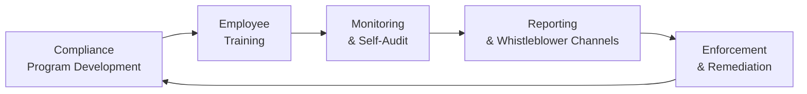

## Common Violations in the Investment Profession

It might sound surprising, but many ethical breaches in finance aren’t the result of meticulously planned schemes by infamous “bad actors.” Quite often, they begin as minor oversights, small rationalizations—stuff like, “Hey, everyone else is doing it,” or “This is just a shortcut.” These subtle lapses can balloon into severe violations of the CFA Institute Code of Ethics and Standards of Professional Conduct. So let’s take a closer look at some key violations that the Professional Conduct Program (PCP) frequently encounters.

### Plagiarism of Research
Plagiarism is basically borrowing someone else’s work—words, ideas, analyses—without giving proper credit. One time, I recall a junior analyst who had found this great piece of research on emerging market bonds. She was under a tight deadline, so she copied the entire summary of that article into our internal presentation. She changed the fonts, but guess what? The substance was identical. That’s plagiarism, plain and simple.

When an analyst or investment professional claims that work as their own—or neglects to state the source—it erodes client trust. It’s also a massive risk for the employing firm, which can face legal problems and reputational damage. 

### Misrepresentation of Credentials
Another common violation is misrepresentation: basically, presenting false or misleading information. It could be padded resumes claiming degrees that were never earned, or overstating professional accomplishments and skill sets. Sometimes people do it trying to impress colleagues or secure promotions. But once discovered, it can tank a career and damage a firm’s brand. 

Moreover, in a performance context, misrepresentation can occur when professionals tout returns they never actually achieved or imply a level of experience or success that is untrue. Even “small exaggerations” can create big quandaries when trust is so crucial in finance.

### Unauthorized Disclosure of Confidential Client Information
Well, this one is huge. Clients trust investment professionals with extremely personal data—everything from net worth and total indebtedness to upcoming deals and family financial details. Sharing or discussing this info in a way that violates confidentiality or professional obligations is a direct violation. 

Sometimes the disclosure is outright malicious, but often it happens by accident: discussing a client’s sensitive business in a public place, saving unencrypted files on a shared drive, or failing to follow guidelines for secure communication. Regardless of intention, unauthorized disclosure can have serious legal and regulatory consequences, not to mention reputational harm for the professional and the firm.

### Insider Trading
Insider trading is the buying or selling of a security while in possession of material nonpublic information (MNPI), which conflicts with fiduciary duties or other obligations. Maybe you overheard an executive mention an upcoming merger in the elevator. If you trade on that info before it goes public, that’s insider trading. 

Given how swiftly insider trading can undermine market fairness, regulators dole out steep penalties for such offenses. Even if you personally don’t trade on insider info but pass that info to a friend who does, you can be held liable. “Don’t do it” might be obvious, but the temptation can be real when stress and performance pressures creep in.

### Material Misstatements Regarding Investment Performance
Performance reporting is at the heart of the client-professional relationship—clients rely on accurate reporting to gauge how their portfolios are doing. Material misstatements happen when an investment firm or professional overstates returns or selectively includes data to make performance appear better. 

Sometimes it might feel like a “little tweak.” For instance, a small hedge fund might exclude a particularly bad month from the track record in marketing materials, rationalizing that it was an “outlier.” But all these “little tweaks” stand to violate the principle of fair and accurate representation. The entire integrity of financial markets depends on credible, transparent disclosures.

## Practical Strategies to Prevent Ethical Violations

So how do we stay on top of this? Everyone wants to do the right thing, but the daily grind can introduce ethical blind spots. Below are some tried-and-tested strategies to minimize lapses and ensure you’re always on the right side of the Code and Standards.

### Robust Compliance Policies
It starts with well-defined policies. Firms should document clear, straightforward instructions on:

• Proper attribution and citation guidelines (to avoid plagiarism).  
• Accepted channels for verifying credentials.  
• Protocols for safeguarding client information.  
• Policies for dealing with nonpublic information and handling conflicts of interest.  

When policies are well-crafted and easy to follow, employees are more likely to abide by them. Ambiguity often plants the seed for “accidental” violations.

### Regular Internal Ethics Training
I once attended an “Ethics Day” event that felt more like a second Monday—slides, coffee, polite applause. But guess what? The key to making training programs effective is interactivity. Case simulations, role-play scenarios, even quick online quizzes can bring these rules to life.  

Consistent training reminds folks of the consequences (both personal and professional) of unethical behavior. It also fosters a sense of community, putting everyone on notice that ethics can’t just be a one-off, single training session; it’s an ongoing discussion.

### Self-Auditing Protocols
This is about a proactive stance: Instead of waiting for external auditors or regulators to swoop in, do your own checks first. For any research-based content, for example, implement a “source check patrol” that ensures every chart, statistic, or quote is properly cited. For performance data, cross-verify final reports with raw data sets. 

If you’re in a firm with multiple advisors, consider rotating tasks like spot-checking each other’s client reports. Friendly peer reviews can detect oversights before they become official fiascos.

### Personal Accountability and Self-Regulation
Systems and procedures are essential, but none of that works if individuals shrug off responsibility. Personal accountability means you’re not just relying on your compliance folks but also on your own moral compass. 

If you sense something is off—like an overly optimistic performance figure or an email that reveals too much about a client—call it out. Or at least ask questions, because often publicized unethical behavior ends up surprising people internally who later admit, “I had a gut feeling something was wrong.”

### Whistleblower Channels
Firms should have confidential reporting lines or email portals where employees can raise concerns without fear of retaliation. Sometimes you suspect wrongdoing but worry about potential career damage or the reaction of your boss. A secure whistleblower channel can help you speak up.  

Legally and ethically, it’s best practice to investigate any reported misconduct carefully and fairly. Even if suspicions are unfounded, having a robust whistleblower protocol fosters a compliance culture in which no one feels that wrongdoing can be swept under the rug.

## Cultural and Organizational Factors That Lead to Violations

Ethical breaches rarely happen in a vacuum. Organizational culture and incentives—like “hit this sales target or else”—can create an environment where employees feel compelled to cut corners. 

• **Pressure to Perform:** Tight deadlines, extreme performance goals, or unrelenting competition can push employees to rationalize unethical shortcuts.  
• **Group Norms:** A client-facing team might develop its own “way of doing things,” ignoring the official compliance manual if leadership rarely enforces it.  
• **Lack of Tone at the Top:** If senior managers accommodate or even reward borderline behavior, employees will assume that ethics take a backseat to short-term wins.

Recognizing these influences can help you implement targeted solutions—such as adjusting compensation models and reinforcing that no performance target is worth compromising integrity.

## Best Practices for Reporting Suspected Misconduct

When in doubt, or if you see questionable activity, you should:

• **Document Everything:** Keep notes or copies of suspicious communications or data discrepancies.  
• **Consult the Handbook:** The CFA Institute’s Standards of Practice Handbook is a stellar resource for figuring out what’s potentially a violation.  
• **Use Secure Channels:** Don’t just blurt out your concerns in a hallway conversation or an all-company Slack channel. Follow your firm’s whistleblower policy or contact your compliance officer in a private setting.  
• **Stay Professional:** Avoid gossip or finger-pointing. Stick to the facts and let the investigative process unfold.

Remember, the goal isn’t to punish or shame individuals (except in egregious cases) but to uphold a fair and transparent market environment where clients and investors receive the accurate, honest service they deserve.

## Checklists and Verification Frameworks

Below are some concise frameworks to help:

• **Information Accuracy Checklist**  
  – Confirm your data source is reputable.  
  – Cite every chart, table, or statistic that you didn’t compile yourself.  
  – Date-stamp your data—always note the timeframe it covers.  
  – Peer-review if possible; we can’t always catch our own mistakes.  

• **Client Data Security Checklist**  
  – Only store client data on encrypted drives or secure cloud solutions.  
  – Use password protection for sensitive files.  
  – Restrict data access to relevant roles; not everyone needs full visibility.  
  – Keep any offline backups under lock and key.  

• **Transparent Collaboration Framework**  
  – Define “roles and responsibilities” at the start of projects.  
  – Identify any real or potential conflicts of interest early on.  
  – Conduct frequent check-ins. Even a short five-minute “Ethics Corner” chat at weekly meetings can offset drifting norms.  
  – Document decisions with timestamps.  

## Diagram: Compliance and Enforcement Process

Below is a simplified flow of how an effective compliance system can function within a firm, from developing policies to enforcing them. Notice how each step feeds into the next, creating a continuous loop of improvement.

In practice, each stage builds trust and transparency, creating an environment where potential issues can be addressed proactively rather than reactively.

## Final Exam Tips for CFA Candidates

• **Connect Theory to Scenarios:** CFA exam questions might present a scenario where, say, an analyst uses a peer’s design template. You must identify if this crosses the line into plagiarism.  
• **Focus on the Gray Areas:** The test loves those “borderline” cases where the rules are not so black and white—like partial performance reporting or overhearing inside info in a public place.  
• **Cite the Correct Standard:** Practice referencing the specific standard (e.g., Standard I(C), Standard III(E)) for each ethical violation.  
• **Demonstrate Preventative Solutions:** In constructed response questions, you may be asked, “What steps could the firm have taken to prevent this violation?” Outline specific measures: robust compliance policy, ongoing ethics training, and so forth.  
• **Keep the Big Picture in Mind:** Ethics is more than memorizing rules. It’s about internalizing a mindset that puts client and market interests first.  

## References and Further Reading

- CFA Institute, “Standards of Practice Handbook.”  
- G. Richard Shell, “Make the Rules or Your Rivals Will.”  
- Investment Adviser Association, Industry White Papers on Compliance Best Practices.  
- Journal of Business Ethics, various articles on root causes of unethical behavior in financial settings.

---

## Test Your Knowledge: Common Ethical Violations & Preventative Measures



### Which of the following best describes plagiarism in investment research?

- [ ] Properly citing someone else’s analysis in your own report.  
- [x] Presenting another analyst’s content without attribution or permission.  
- [ ] Using free data sets for personal analysis.  
- [ ] Paying for a research subscription and referencing it in a bibliography.  

> **Explanation:** Plagiarism specifically involves presenting someone else’s work as your own, without giving credit.  

### What is the primary danger of insider trading?

- [ ] Slightly misleading performance figures.  
- [ ] Damaging client relationships.  
- [x] Trading on material nonpublic information, undermining market fairness.  
- [ ] Conducting trades over the holiday season.  

> **Explanation:** Insider trading violates market integrity by using privileged material nonpublic information for personal or third-party gain.  

### Which measure can best address the organizational pressure that leads to unethical behavior?

- [x] Aligning performance incentives with compliance and ethical standards.  
- [ ] Eliminating all performance bonuses.  
- [ ] Reducing the size of the compliance department.  
- [ ] Removing whistleblower channels to discourage employee complaints.  

> **Explanation:** Tying incentives to ethical practices and a compliance mindset helps ensure that performance does not come at the expense of ethics.  

### How can a professional best avoid accusations of misrepresentation regarding their qualifications?

- [ ] Submitting only partial educational history in a resume.  
- [ ] Presenting ambiguous statements about credentials.  
- [x] Maintaining accurate records of degrees, certifications, and work experiences.  
- [ ] Using a personal website to list credentials without verification.  

> **Explanation:** Keeping records and verifying authenticity of claims ensures professionals report credentials accurately.  

### Which of the following best describes a self-auditing protocol?

- [x] Regular internal checks to identify potential compliance and ethics issues.  
- [ ] A final exam to complete a professional certification.  
- [x] Periodic peer review of reports and processes.  
- [ ] Retaining an external publicity firm.  

> **Explanation:** Self-auditing involves internal reviews, often including peer reviews, to ensure compliance with ethical and professional standards.  

### Why is a whistleblower channel considered essential?

- [x] It allows employees to report misconduct confidentially.  
- [ ] It discourages employees from voicing concerns.  
- [ ] It replaces formal disciplinary procedures.  
- [ ] It only applies to insider trading cases.  

> **Explanation:** A secure whistleblower channel encourages employees to raise concerns without fear of retaliation, thus helping the firm address violations.  

### Which of the following is most effective in preventing plagiarism within an investment team?

- [x] Clear citation policies and thorough training on proper attribution.  
- [ ] Restricting research to only external subscription services.  
- [x] Conducting peer reviews of all published materials.  
- [ ] Encouraging employees to copy relevant information for expedience.  

> **Explanation:** Proper policy, training, and peer review help root out and prevent plagiarism.  

### What is the key reason to avoid rationalizing minor infractions (“everyone else is doing it”)?

- [x] Small lapses have a tendency to escalate into serious violations.  
- [ ] It is acceptable as long as no one complains.  
- [ ] Rationalization is encouraged as a creative problem-solving method.  
- [ ] Minor infractions usually go unnoticed.  

> **Explanation:** Even seemingly minor infractions can morph into bigger ethical and legal violations over time.  

### Which organizational factor most often contributes to unethical behavior?

- [x] Extreme pressure to meet sales or performance targets.  
- [ ] A supportive mentoring program.  
- [ ] Collective brainstorming of best practices.  
- [ ] Transparent disclosure of fund performance.  

> **Explanation:** Excessive performance pressure can incentivize employees to cut corners or justify unethical actions.  

### A professional has discovered that material nonpublic information has been accidentally circulated by senior management. They decide not to trade on it personally but inform an acquaintance who does. Is this compliant?

- [x] True  
- [ ] False  

> **Explanation:** Facilitating insider trading for a third party is also a violation. Merely passing along MNPI can be illegal and violates the CFA Institute Code and Standards.  


