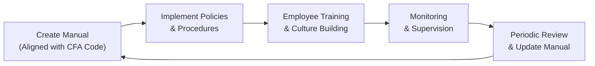
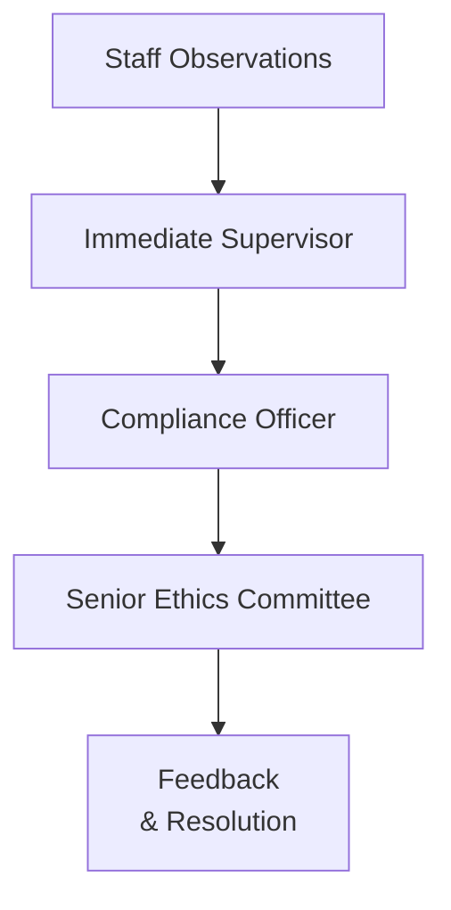

## Introduction

So, here we are at the part that can really make a difference in your daily life—taking broad ethical concepts and weaving them right into your routine. In earlier sections of this chapter (especially 2.1 through 2.5), we covered the CFA Institute Code of Ethics and Standards of Professional Conduct, looked at the Professional Conduct Program, and even examined typical violations. But how do you actually bring all that goodness into your day-to-day? Well, that’s exactly what we’ll dig into in this section.

We’ll talk about building an “ethical checklist” you can carry around—physically or mentally—to keep yourself on the right track. We’ll see how robust compliance manuals are born, how to train staff (and yourself, to be honest), why “tone at the top” isn’t just a buzzword, and how scenario-based learning helps future-proof your ethical decision-making. We’ll also sprinkle in some real-life examples and reflection prompts to get you thinking. Anyway, let’s roll up our sleeves.

## Translating High-Level Principles into Daily Work

Ever read something like Standard I–VII and thought, “Okay, I get it: transparency, fairness, integrity. But how do I make that happen at 3:00 p.m. on a Thursday when I’m responding to a client’s urgent call?” Trust me, you’re not alone. Many of us have that gap between what we should do and how we do it when the real-world pressure is on. Here are a few suggestions for bridging that gap:

• Start With an Ethical Checklist.  
  Think of it as a mini cheat sheet. Maybe it’s a few bullet points pinned by your desk or an actual typed page in your desk drawer. The idea is: each time you’re about to present a recommendation to a client, or each time you’re delving into a new area of business, you run through the checklist. Are we serving the client’s best interests first? Have we confirmed the reliability of the data? Do we have any conflict of interest we should disclose?

• Break Down Complex Tasks.  
  Suppose you’re creating an equity research report. Breaking it into smaller tasks allows you to integrate ethics at each stage: data gathering (Is the data source reliable? Do we need to attribute external research?), analysis (Are we letting biases sneak in?), recommendation (Are we fully transparent about risks?), final review (Is there any promotional language that’s unsubstantiated?).

• Document, Document, Document.  
  One surefire way to stay ethically consistent is to record your process. When you know you’re documenting decisions, you’ll be extra cautious about skipping steps or ignoring red flags. This aligns closely with the overarching principle of accountability in the CFA Institute Code and sets you up for easy review if a question arises later.

• Communication Is Key.  
  If you spot something that feels off, share your concerns quickly—even if it’s just an informal conversation with a colleague or supervisor. Don’t wait until a small oversight balloons into a major breach.  

### A Personal Anecdote (Well, Sort Of)

I remember (yes, personally) having to finalize a client’s trade recommendation under time pressure. My “checklist hat” was off because I was just so rushed. Long story short: I discovered afterward that there was missing data in the performance analysis. Not precisely a meltdown, but had I ticked through my mental list, that oversight would have popped right out. Trust me, after that incident, I never skipped the checklist again. Sometimes the biggest leaps forward come from little mistakes that keep us humble.

## Creating Robust Compliance Manuals

A compliance manual isn’t just a dusty binder that sits in your HR rep’s office. (Or at least, it shouldn’t be!) When done right, it becomes a living, breathing extension of your organization’s ethical DNA—basically turning the CFA Code and Standards into step-by-step guidance.

### Key Elements of an Effective Compliance Manual

1. Alignment with CFA Code and Standards  
   Tie each section of the manual back to the relevant portion of the Code or the Standards. For example, if you have a section on marketing communications, reference Standard I(C) (Misrepresentation) and consider including Standard VII(B) (Reference to CFA Institute, the CFA Designation, and the CFA Program) if your firm’s promotional materials feature Charterholder references.

2. Customized Procedures for Daily Activities  
   • Portfolio Construction: Outline how to handle unique circumstances like unusual client mandates, the use of derivatives, or rebalancing constraints.  
   • Client Onboarding: Ensure your manual addresses “Know Your Client” procedures, risk tolerance evaluations, and conflict-of-interest disclosures.  
   • Marketing and Social Media Use: Offer guidelines on how to remain truthful and fair in promotional content.  

3. Monitoring and Supervision  
   To keep everyone honest, the manual needs a chain of accountability. Who’s checking that trades conform to the investment policy statement (IPS)? Who monitors email communications for potential insider info or client confidentiality breaches?

4. Ongoing Updates  
   Rules and market structures evolve—sometimes faster than we’d like. Policies for new products (crypto, perhaps?), changes in local regulations, and staff transitions all prompt fresh updates to the manual.

Below is a simple conceptual diagram (in Mermaid) illustrating the life cycle of a compliance manual:

As your firm evolves, the manual morphs with it, hopefully capturing lessons learned from incidents (both near-misses and actual issues).

## Training Programs for Ethical Awareness

Sure, compliance manuals are great. But manuals alone can’t inoculate anyone against real-world dilemmas. That’s where training programs come in, bridging the gap between theory and practice. Let’s talk about both informal “lunch-and-learns” and formal annual workshops.

### Formal vs. Informal Training

• Formal Training:  
  - Typically structured sessions—maybe a quarterly “Ethics Refresher” featuring hypothetical scenario walk-throughs.  
  - Often includes quizzes or role-playing exercises, so you know if participants are retaining the knowledge.  
  - May invite external experts (lawyers, ethicists, or compliance pros) for a fresh perspective.  

• Informal Training and Mentorship:  
  - These can happen spontaneously: a senior manager might mention a real scenario from the past.  
  - Or a small group could gather to discuss a newly released regulatory guideline or an SEC enforcement action.  
  - Helps employees see ethics as a living discipline, not just a “check-the-box” compliance requirement.

### Scenario-Based Training

Why do we talk so much about scenario-based training? Because it’s a safe space to make mistakes. Instead of risking your firm’s reputation (or your own job), you can “practice” your ethical reflexes through hypothetical or historical references.

For instance, you might pose the following scenario:

“You work at a mid-size investment advisory firm. A new client expresses interest in a specialized private fund. You suspect the fund invests in volatile assets that may not align with the client’s risk tolerance. The commission structure is, however, quite lucrative for you. What issues do you need to consider, and which standard from the Code of Ethics might be at risk if you proceed without more thorough due diligence?”

In such exercises, participants learn to weigh realistic pressures—like the pull of compensation—against the ethical responsibilities. You see how employees react, and the group can then debrief: “Ah, so we need a better standard operating procedure for risk-profiling new products,” or “We should highlight the potential conflict of interest more clearly.”

## Tone at the Top and the Power of Corporate Culture

When you hear “tone at the top,” maybe you picture a CEO giving a rousing speech at a conference. But it’s more than that: it’s how leaders (and by extension, managers at every level) demonstrate daily that ethics are non-negotiable. Tone at the top aligns with Standard I(A) (Knowledge of the Law) and Standard I(D) (Misconduct) by showing that leadership’s stance is one of zero tolerance for unethical practices—even subtle ones.

### How Leaders Can Foster an Ethical Culture

• Walk the Walk:  
  If top leadership regularly “bends the rules,” everyone else figures they can too. In contrast, leaders who correct themselves or own up to small oversights set a precedent of accountability.

• Integrate Ethics Into Performance Evaluations:  
  If your bonus is purely linked to raw performance metrics, you risk overshadowing ethical considerations. So how about making compliance an explicit factor in performance reviews?

• Transparent Communications:  
  When you communicate key decisions (like adjusting fee structures or adopting new client protocols), be upfront about how ethics influenced the decision. That sets the example for how decisions should be made across the board.

## Reflection Prompts and Scenario-Based Questions

Let’s slow down for a moment. One of the best ways to internalize ethical habits is to reflect regularly on your own thought processes. Once or twice a week, ask yourself:

• “Have I encountered any conflict of interest situation recently?”  
• “Did I communicate all relevant facts to my client or colleague, even the uncomfortable ones?”  
• “Where might my personal biases have influenced an investment recommendation?”

These questions might seem trivial now—until you catch yourself in a real situation. And by building the routine of reflection, you’re practicing the muscle memory to handle bigger dilemmas more gracefully.

Below are some scenario-based questions you can use on your own or in small group discussions:

1. “You’re an associate at a brokerage firm, and your direct supervisor instructs you to recommend a specific IPO with an unusually high underwriting fee for your firm. You have concerns about the IPO’s fundamentals. How do you respond?”  
2. “A colleague casually mentions using insider information from a company’s CFO. He brushes it off as ‘no big deal.’ What, specifically, do you do now?”  
3. “Your marketing team suggests adding a client testimonial that exaggerates performance figures, believing it’s ‘harmless sales fluff.’ Do you push back? How?”

The point here is role-play. Proactively thinking through potential problems helps you see them more clearly when they appear for real.

## Integration of Ethics with Business Processes

Why does all this matter? Because weaving ethics into routine tasks fosters:

• Long-Term Client Relationships.  
  Clients appreciate consistency and honesty, even when it means delivering less-than-rosy news about a portfolio.

• Reduced Legal and Regulatory Risks.  
  Imagine avoiding an eye-popping legal penalty because you were operating with robust checks. Enough said.

• Stronger Individual and Firm Brand Value.  
  Your firm’s ethical reputation can work like a magnet for top-tier clients and partners. In a sense, it’s an intangible asset that can directly influence growth in assets under management.

### A Simple Table: Ethical Integration in Common Tasks

Below is a quick visual summary showing how you might integrate ethics in day-to-day tasks:

| Task                        | Ethical Focus           | Potential Pitfall            | Preventive Action                          |
|-----------------------------|-------------------------|------------------------------|--------------------------------------------|
| Selecting Investments       | Suitability            | Overlooking client risk needs| Document rationale, confirm investment objectives, cross-check with IPS |
| Drafting Client Reports     | Transparency           | Omitting key performance info| Use standardized reporting metrics and audit for accuracy              |
| Marketing New Services      | Fairness               | Misleading promotional content| Pre-approve content using compliance manual                |
| Handling Client Complaints  | Integrity              | Downplaying or hiding errors | Promptly disclose, investigate, and remedy the situation               |
| Annual Performance Review   | Accountability         | Rewarding only profit metrics| Incorporate ethical metrics into bonus structure                       |

## Accountability Mechanisms and Transparency

Even the best-intentioned employees can slip up without guardrails. That’s where accountability mechanisms—supervisory checks, internal audits, consistent data logs—come into play. It’s also where transparency measures like open-door policies, clear disclaimers, and structured whistleblowing channels can help. If you see something questionable, you should know exactly whom to tell and how to report it safely.

### A Quick Mermaid Diagram: Accountability Structure

In a robust setup, staff are encouraged to raise potential issues early to local supervisors, who—if needed—escalate to compliance officers or beyond.

## The Payoff: Strengthening Brand Value

At the end of the day, consistent ethical actions build trust. Prospective clients, regulators, and even your own employees see you as an organization (or an individual professional) that honors promises and stands by solid principles. Reputation, after all, can be more fragile than any short-term gain from cutting corners.

## Final Exam Tips

• Bring Ethical Themes Into Your Case Studies:  
  In Level I, you’ll see ethics-based questions in both item set and stand-alone multiple-choice formats. Make sure to connect theory (Code and Standards) with real scenarios.

• Practice With Time Constraints:  
  On the exam, you might be tempted to skim the ethical details. Don’t. Sometimes the difference between correct and incorrect answers is just a subtle phrase—like whether “misrepresentation” truly occurred.

• Think Like a Compliance Officer:  
  As you read a scenario, imagine your job is to protect clients and your firm from misconduct. This helps you focus on “red-flag” behaviors.

## References and Further Reading

• Ethical Decision-Making Frameworks (CFA Institute Resources): Provides a structured approach for analyzing ethical dilemmas.  
• James O’Toole & Don Mayer, “Good Business: Exercising Effective and Ethical Leadership”: Great resource on integrating ethical culture into leadership practices.  
• Big Four White Papers (Deloitte, PwC, etc.): For best practices in compliance training in the financial services realm.  
• Organizational Behavior and Human Decision Processes: Check out academic studies on Behavioral Ethics—they can shed light on real-life decision-making pitfalls.

## Sample Exam Questions on Implementing Ethical Standards

Below is a set of sample questions you can work through to test your knowledge of this section. Good luck!

## Test Your Knowledge: Practical Ethical Implementation Quiz



### Which of the following is most critical when building a personal “ethical checklist” for investment decisions?

- [ ] Ensuring it is at least five pages long.  
- [x] Including specific questions about conflicts of interest, data reliability, and client suitability.  
- [ ] Making the checklist purely hypothetical so it doesn’t interfere with daily workflow.  
- [ ] Drafting it solely to follow local laws, ignoring the CFA Code of Ethics.  

> **Explanation:** An effective ethical checklist directly addresses conflicts of interest, data verification, and suitability for the client, all of which are pivotal in adhering to the CFA Code and Standards.

### A robust compliance manual should primarily do which of the following?

- [ ] Provide theoretical guidance without practical procedures for implementation.  
- [x] Translate ethical principles into concrete policies, monitoring systems, and frequent updates.  
- [ ] Replace the CFA Institute Code and Standards entirely.  
- [ ] Be kept locked away at senior management level for confidentiality.  

> **Explanation:** A well-structured compliance manual makes the Code and Standards actionable and should be accessible to relevant staff, frequently updated, and thoroughly integrated into everyday processes.

### What is the principal advantage of scenario-based training for ethical decision making?

- [ ] It allows employees to test marketing strategies on colleagues first.  
- [x] It enables employees to practice ethical responses in a safe environment without real-world repercussions.  
- [ ] It replaces the need for any formal compliance directives.  
- [ ] It only proves useful for new hires in entry-level positions.  

> **Explanation:** Scenario-based training helps simulate real challenges and tests employees’ judgment and responses without risking actual ethical breaches.

### According to this section, how can “tone at the top” most effectively be reinforced?

- [ ] By using it as a slogan in promotional campaigns.  
- [ ] By delegating ethical oversight solely to mid-level managers.  
- [ ] By tying employees’ bonuses exclusively to revenue targets.  
- [x] By leadership modeling integrity in actions and communications, and integrating ethics into performance metrics.  

> **Explanation:** “Tone at the top” becomes more than words when leadership personally demonstrates ethical behavior and rewards compliance with the Code and Standards.

### In the context of “Reflection Prompts,” which prompts below would best encourage ethical awareness?

- [x] “Where might my biases have influenced my recommendations this week?”  
- [ ] “Is it easier to skip disclaimers when meeting tight deadlines?”  
- [x] “Have I fully disclosed all relevant facts to clients?”  
- [ ] “Who can I blame if something goes wrong?”  

> **Explanation:** Reflection questions should encourage self-assessment and deeper consideration of personal biases, obligations to clients, and thorough disclosures—central ethical components.

### Which of the following is an example of integrating ethics into performance reviews?

- [x] Measuring an employee’s commitment to compliance and transparency alongside their sales targets.  
- [ ] Rewarding profits only while ignoring breaches of the Code and Standards.  
- [ ] Eliminating all references to ethics to keep reviews strictly quantitative.  
- [ ] Awarding an automatic bonus if employees earn the CFA Charter.  

> **Explanation:** Incorporating ethical metrics into performance reviews ensures ethical conduct is valued and recognized, incentivizing employees to uphold standards.

### Which element is crucial for an effective accountability mechanism?

- [x] Clear procedures for escalating potential breaches to higher authorities.  
- [ ] Allowing employees to handle concerns entirely on their own.  
- [x] Keeping detailed logs of key decisions and trade activities.  
- [ ] Relying solely on external regulators to uncover all internal problems.  

> **Explanation:** Clear escalation protocols and documentation of decisions help identify, address, and prevent unethical behavior. Relying on regulators alone is inadequate.

### Why is transparent communication vital in maintaining an ethical culture?

- [ ] It creates an opportunity to conceal vital data.  
- [ ] It promotes confusion regarding roles and responsibilities.  
- [ ] It shifts accountability away from leadership.  
- [x] It ensures all stakeholders remain informed, fosters trust, and identifies issues early.  

> **Explanation:** Transparency builds trust and clarifies roles, reducing the likelihood of misunderstandings or hidden conflicts of interest.

### Long-term client relationships are often strengthened by which ethical practice?

- [x] Communicating honestly about both positive and negative portfolio performance.  
- [ ] Guaranteeing returns and promising zero risk.  
- [ ] Outsourcing all compliance tasks to third parties.  
- [ ] Encouraging staff to maximize commissions regardless of client suitability.  

> **Explanation:** Maintaining honesty—particularly when performance is suboptimal—bolsters trust and fosters a sense of reliability and credibility with clients.

### True or False: A firm's reputation (brand value) can significantly benefit from consistently exercising ethical behavior, even if some short-term profits are forgone.

- [x] True  
- [ ] False  

> **Explanation:** Over time, consistent ethical behavior builds a strong reputation, attracting clients, partners, and high-caliber employees. Short-term sacrifices often yield long-term gains.


