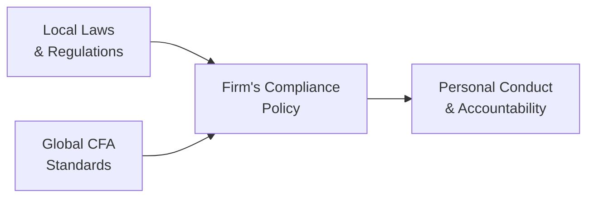
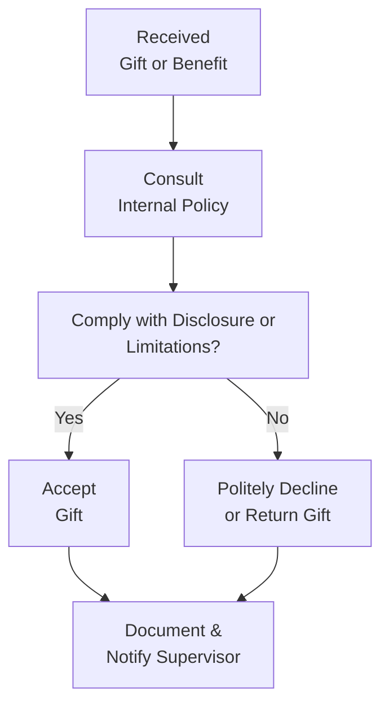

## Introduction
If you've ever been at a social gathering and overheard someone talk about “professional behavior,” you might have noticed just how subjective that concept can feel. But in finance—especially in the context of the CFA Institute Code of Ethics and Standards of Professional Conduct—professionalism isn’t just a buzzword. It’s a well-defined framework that guides everything from how we communicate with our clients to how we handle ourselves in tense regulatory environments.

Standard I – Professionalism is the bedrock of ethical conduct in finance. At its core, it emphasizes four big ideas:
• Knowledge of the Law  
• Independence and Objectivity  
• Misrepresentation  
• Misconduct  

These guidelines are meant to protect not just your reputation, but also the integrity of the entire financial industry. In this section, we’ll look at each of these elements in detail, explore real-world scenarios, and highlight best practices to keep you clear of ethical pitfalls.

## Knowledge of the Law
Ever catch yourself thinking, “Ugh, more regulations?” Trust me, I’ve been there. Early in my career, I assumed that regulations were all about stifling creativity and growth. Then one day, a colleague was disciplined by our firm for failing to disclose a minor compliance issue, and it dawned on me how crucial it is to stay on top of the rules of the game.

Under Standard I, members and candidates must:
• Understand the Laws: Local, regional, and global regulations can vary greatly. If there’s a difference between local regulations and the CFA Institute’s Code and Standards, you’re required to adhere to whichever imposes the highest ethical requirement.  
• Comply with the Laws: We’re talking about day-to-day compliance—ensuring marketing materials meet regulatory standards, making sure investment recommendations follow local rules, and so on.  
• Take Action: If you see a conflict or potential legal breach, you should raise the alarm and either disassociate from it or report it, depending on the severity and your firm’s policies.

It’s not enough to say, “Well, I didn’t know that was illegal.” Ignorance is no defense. If local laws conflict with higher, global standards, choose the highest standard. If a coworker is pressuring you to do something that conflicts with your ethical obligations, that’s a situation worth escalating to compliance.

### Visual Overview: Knowledge of the Law

In this simple diagram, local laws (A) and global standards (C) come together in your firm’s compliance policy (B), and ultimately shape your personal conduct and accountability (D).

## Independence and Objectivity
Have you ever gotten a gift from a business partner and wondered, “Is it okay to accept this?” Gifts, entertainment, or personal relationships can cloud your judgment, even if you don’t realize it. Standard I encourages members and candidates to avoid any real or perceived conflicts that threaten their objectivity.

Key elements include:
• Avoiding Conflicts of Interest: Always disclose anything, from small gifts to significant personal stakes, that could appear to sway your professional decision-making.  
• Managing External Influence: If an entity is trying to pay or reward you for favorable research, you need to either refuse or disclose it fully—even something as small as sports tickets can raise eyebrows.  
• Data-Driven Findings: Let facts, data, and robust analysis drive your recommendations, rather than pleasing a particular client or boss.  

Sometimes, folks wonder: “What if a client sends me a holiday basket? Do I reject it outright?” The standard approach is to have clear firmwide policies: for instance, you might accept items under a modest monetary value but must disclose larger gifts or politely decline them if they compromise your independence. 

## Misrepresentation
Picture this: you’re finishing up your team’s performance report, and there’s a little temptation to round those performance returns up by a fraction of a percent. Or maybe you’re tempted to cite an advanced credential you haven’t actually attained yet. Standard I says: Don’t do it.

Misrepresentation can pop up in:
• Performance Figures: Cherry-picking data, exaggerating returns, or omitting key information about risk.  
• Qualifications: Claiming titles or expertise you haven’t earned, or overstating your involvement in a big project.  
• Communications: Half-truths, misleading statements in social media posts, or investment newsletters that don’t paint the full picture.

I once heard of a manager who bragged about “doubling a client’s money in two years.” Sure, maybe the value of one investment doubled—but only because it started from a particularly low base. When you looked at the entire portfolio, the performance was nowhere near as rosy. That’s classic misrepresentation, and it chips away at trust the moment someone spots the inconsistency.

## Misconduct
Misconduct is sometimes tricky to pin down because it can involve your personal life. Standard I focuses on integrity in your professional role, but anything that undermines your honesty or trustworthiness could count—like committing a criminal act or breaching fiduciary duty on the weekend. The logic is simple: if you do something unethical in your private life, clients (and the industry) may worry you’ll do something unethical on the job too.

Examples of misconduct might include:
• Financial wrongdoing: Embezzlement, fraud, insider trading.  
• Criminal acts: Substance abuse offenses, forging documents, or other crimes that reflect poorly on your capacity to handle professional tasks responsibly.  
• Violations of workplace standards: Bullying, harassment, or other behaviors that show lack of respect for the ethical codes the industry promotes.

Engaging in misconduct erodes public confidence in the financial sector and can result in severe penalties such as revocation of CFA Institute membership, license suspensions, or even jail time. It’s serious business.

## Implementing Standard I in Practice
So, how do you make all this real on a day-to-day basis? Here are a few practical tips:

• Stay Informed: Subscribe to regulatory alerts and updates. For instance, you might set Google Alerts for major changes in the SEC’s regulations if you work in the U.S., or similar bodies in your own jurisdiction.  
• Create Checklists: Have a personal or team-based checklist for drafting client-facing materials. Confirm all data sources, disclaimers, and risk statements.  
• Develop a Gift Policy: Work with your compliance team to create thresholds for accepting or refusing gifts. Document everything to avoid awkward situations later.  
• Foster a Speak-Up Culture: Encourage colleagues to point out issues early. Small compliance mistakes rarely become big problems if people feel safe speaking up.  
• Ask When in Doubt: If you’re unsure, talk to your compliance officer or another knowledgeable resource. It might feel like a hassle, but it sure beats facing disciplinary action.

### Do’s and Don’ts Overview

| Do’s                                                         | Don’ts                                                                    |
|--------------------------------------------------------------|---------------------------------------------------------------------------|
| Disclose conflicts of interest promptly                      | Accept valuable gifts without disclosure                                  |
| Use factual and verified data for performance reports        | Exaggerate or selectively omit unfavorable data                           |
| Consult compliance or legal experts when unclear             | Assume local laws are always less strict than industry standards          |
| Maintain a thorough record of potential or actual conflicts  | Engage in any activity that reflects poorly on your honesty and integrity |
| Encourage open dialogue and early reporting of concerns      | Wait until a small issue becomes a major regulatory headache              |

## Real-World Case Study
Let’s consider a hypothetical scenario to see how Standard I might come into play:

• A junior analyst, Simi, is working on a research report about a technology startup.  
• The startup’s CEO offers Simi front-row tickets to a major sporting event, implying that favorable research coverage would be “greatly appreciated.”  
• Simi is conflicted: The gift is enticing, but it might compromise her independence. At the same time, she doesn’t want to offend the CEO or lose valuable research insights.  

Best Practice: Simi should consult her firm’s gift policy or compliance officer to see if accepting the tickets is permissible. If the gift exceeds the nominal value threshold, she should politely decline. Even if it’s permissible, full disclosure to her supervisor is crucial. The objective is to ensure there’s no question about whether her analysis is unbiased.  

By following these steps, Simi and the firm maintain credibility and demonstrate commitment to Standard I.

## Visualizing Ethical Decision Points

This flow highlights the typical steps you might follow when grappling with a gift or benefit that could threaten your independence and objectivity.

## Conclusion
Standard I – Professionalism is all about safeguarding the trust placed in financial professionals. Whether it’s abiding by complicated legal frameworks, maintaining an unbiased perspective in your work, being transparent in your qualifications and performance, or avoiding any conduct that undermines integrity—this standard is what helps us build a truly trustworthy financial industry.

So, the next time you get an offer that makes you hesitate, or you look at a performance chart that’s “just a bit off,” remember that your actions go beyond you. They represent the broader finance community. The measures you take today to maintain professionalism shape client confidence—and ultimately the stability and reputation of global markets.

## Study Tips for the CFA Exam
• Know the Hierarchy of Standards: Be crystal clear about which standards dominate if there’s a conflict between local law and CFA Institute standards.  
• Apply Scenario Thinking: On the exam, you may get item sets describing ethically ambiguous situations. Practice going through the process: identify the conflict, consider relevant laws, apply the highest standard.  
• Understand the Nuances: If a question focuses on independence, for instance, watch for disclaimers or gifts in the scenario. Consider whether it’s truly a conflict or simply a courtesy.  
• Practice Speed and Accuracy: In the real exam context, you need to read through ethical dilemmas quickly and choose the best course of action. Time management is key.

## References
- CFA Institute Code of Ethics and Standards of Professional Conduct (latest edition)  
- “Ethics in Finance” by John R. Boatright  
- Official CFA Institute Webinars on Standard I (accessible at cfainstitute.org)

## Ethics and Professionalism: Practice Questions



### An analyst discovers the governing law in her home country allows certain promotional material that conflicts with the stricter CFA Institute standards. What should she do according to Standard I – Professionalism?

- [ ] Follow home country laws, because local regulations have precedence.
- [x] Abide by the stricter CFA Institute standards.
- [ ] Use discretion to determine if local law or CFA standards should apply.
- [ ] Seek court approval to bypass the conflict entirely.

> **Explanation:** When local regulations are less strict than the Code and Standards, members must adhere to the more stringent requirement to maintain professional conduct.

### Which of the following is the best example of maintaining objectivity under Standard I?

- [x] Disclosing a large gift from a client before providing any recommendations.
- [ ] Accepting a small gift from a longtime friend who happens to lead the firm you are researching and not telling anyone.
- [ ] Relying on rumors to build research insights when under time pressure.
- [ ] Omitting risk factors in a presentation because the client demanded a favorable outlook.

> **Explanation:** Objectivity demands transparent disclosure of potentially bias-inducing gifts and relying on data-driven insights rather than partial or client-driven outcomes.

### A newly hired associate inflates the team’s past performance results by removing data on a losing trade. According to Standard I, what issue most clearly arises?

- [x] Misrepresentation.
- [ ] Improper independence.
- [ ] Knowledge of law violation.
- [ ] Analysis oversight.

> **Explanation:** Omitting losing trades to misrepresent performance is clearly a violation of the prohibition against misrepresentation under Standard I.

### A portfolio manager often attends lavish weekend events paid for by a vendor, though she claims it doesn’t affect her decisions. How is this most likely viewed under Standard I – Professionalism?

- [x] It’s a threat to independence and objectivity, requiring disclosure or refusal.
- [ ] It’s perfectly acceptable since everyone else on the team does it.
- [ ] It’s fine if the vendor isn’t openly demanding favorable terms.
- [ ] It’s prohibited only if the events are outside the firm’s city.

> **Explanation:** Regular acceptance of lavish perks compromises or appears to compromise independence, which is a direct violation of Standard I guidelines.

### Which of the following actions would be considered misconduct under Standard I?

- [ ] Analyzing private financial data with client consent.
- [x] Forging a supervisor’s signature to expedite a contract.
- [ ] Maintaining consistent communications with clients.
- [x] Having multiple parking tickets from the previous year.

> **Explanation:** Forging signatures is a clear ethical and legal violation. Repeated minor infractions, like many unpaid parking tickets, can also reflect negatively on trustworthiness, though severity may vary. However, forging signatures is more explicit as misconduct.

### In a scenario where local rules are stricter than CFA standards, which approach complies with Standard I?

- [x] Follow the stricter local rules.
- [ ] Follow only the CFA Institute standards for uniformity.
- [ ] Ignore local rules when they conflict with general practice.
- [ ] Seek to bypass the local rules by changing the terms of engagement.

> **Explanation:** If local regulations exceed the strictness of CFA Institute standards, you must follow the local laws; otherwise, you adhere to the highest applicable standard.

### An analyst is offered a significant monetary bonus by a company whose stock she is covering, contingent on a positive rating. According to Standard I, which action is most appropriate?

- [x] Decline the bonus and disclose the offer to her employer.
- [ ] Accept the bonus but note the conflict in a footnote.
- [x] Disclose it only if her rating is published.
- [ ] Negotiate a smaller bonus that you think wouldn’t affect your objectivity.

> **Explanation:** Accepting any bonus contingent on a favorable rating is a direct conflict of interest. The correct approach is to decline and inform relevant parties, ensuring independence is preserved.

### A research associate leads her firm’s marketing brochure design, using only partial data from third-party sources. She omits disclaimers about the data’s limitations. Which aspect of Standard I is most jeopardized?

- [x] Misrepresentation
- [ ] Misconduct
- [ ] Knowledge of the Law
- [ ] Independence and Objectivity

> **Explanation:** Providing incomplete information without proper disclaimers can mislead clients or prospects, violating the misrepresentation clause.

### Which situation likely breaches Standard I – Misconduct?

- [x] An employee at a brokerage firm gets arrested for tax evasion unrelated to work but impacting public trust.  
- [ ] A portfolio manager invests in her brother’s rival company.
- [ ] A candidate inadvertently references the CFA designation before officially passing Level I.
- [ ] An associate misses a deadline due to personal issues.

> **Explanation:** A criminal act such as tax evasion, even if unrelated to one’s current position, can impair public trust in the professional’s reliability and is considered misconduct.

### Under Standard I, if a member accidentally reports an incorrect performance figure but promptly corrects it, should it be considered misrepresentation?

- [x] True
- [ ] False

> **Explanation:** While mistakes can happen, the key is whether the inaccuracy was intentional. However, any misstatement that goes public (even if unintentional) must be corrected. Failing to swiftly rectify known misstatements could lead to misrepresentation violations.


