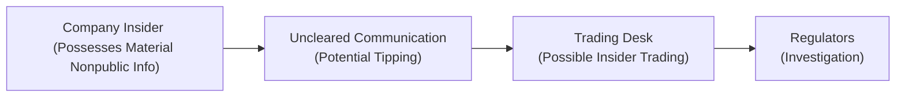

Integrity in any financial market often hinges on how participants use—or sometimes misuse—information. Standard II of the CFA Institute Code and Standards addresses this crucial issue of safeguarding capital markets from actions that undermine fairness, transparency, and confidence. I remember the first time I encountered insider trading rumors at a firm I was interning with; honestly, it was awkward. Everyone sort of danced around the topic, even though it was the elephant in the room. This is why Standard II remains so vital, because it helps us know exactly how to behave—while also giving us the courage to speak up when something feels off. In this section, we explore Standard II in depth, breaking it down into two main areas: the treatment of material nonpublic information and the prohibition against market manipulation. We’ll talk about best practices, pitfalls, and real-world scenarios, and we’ll pepper in a bit of personal perspective too. So let’s dive in.

Understanding the overarching objective is simple enough: to preserve the integrity of the market by disallowing improper use of information or any conduct that might distort prices. On the surface, it sounds straightforward, but in a world where data is flying about faster than ever—tweets, headlines, chat groups—missteps can happen when lines between legitimate research and insider info become blurred. The following discussion aims to shed light on these gray areas and offer clarity.

Protecting Nonpublic Information

Capital markets thrive when investors believe they operate on a level playing field. That’s why safeguarding material nonpublic information is so—well—critical. “Material” information is any piece of data that a reasonable investor would probably consider important in making a buy or sell decision. “Nonpublic” simply means it hasn’t been released or disseminated widely yet.

• The Mosaic Theory Versus Insider Knowledge  
  The CFA Institute permits analysts to engage in “mosaic theory,” which sounds fancy but basically means that you can piece together scattered bits of public information—like industry reports, corporate statements, or macroeconomic data—to form an investment thesis. The key is ensuring that any private detail you use is not actually “material nonpublic” information. For instance, if a CFO accidentally spills the beans about an upcoming merger over dinner, that’s not part of the mosaic. In other words, if it’s not out in the company’s public releases or commonly disseminated channels, treat it like radioactive waste—do not use it to trade and definitely do not tip anyone else.

• Insider Trading’s Far-Reaching Consequences  
  Engaging in insider trading does more than violate your professional conduct; it can result in crippling legal actions, fines, and even imprisonment. Civil suits and regulatory sanctions can destroy a career in no time. Maybe it’s tempting to glean info from a friend in corporate finance, but the butterfly effect is real. One piece of inside info can lead to trades that undermine market confidence. And once the cat is out of the bag, the fallout can be severe, for both individuals and entire institutions.  

Market Manipulation

If you’ve ever seen a financial thriller where a sketchy character spreads false rumors about a company to drive the stock price down, then quickly buys the dip, you’ve witnessed market manipulation in action—albeit dramatized for Hollywood. Regardless, the essence is the same: artificially affecting prices through deceptive practices.  

• Types of Market Manipulation  
  – Rumor-mongering: Spreading untrue statements or half-truths about a company’s health or prospects to influence trading activity.  
  – Pump-and-dump schemes: Buying shares at low prices, then stoking the hype with misleading claims (the “pump”) and finally selling those shares at an artificially inflated price (the “dump”).  
  – Spoofing or layering: Entering bogus orders to create illusions about supply or demand, then canceling them before execution—hoping other traders will misinterpret the signals.  

• Why Market Manipulation Erodes Trust  
  When participants in the market suspect that certain trades or rumors are contrived rather than organic, confidence in the entire system is at risk. It’s not just about the individuals who get duped on a particular stock; it’s about the stability of the financial ecosystem. Heck, in a globalized world, a localized manipulation scandal can even stir up systemic concerns across borders.  

Implementation Tips for Practitioners

Maintaining a squeaky-clean approach to material nonpublic information and steering clear of market manipulation may feel straightforward in principle. But sometimes real-life gets complicated, and lines can blur. Here are a few pointers:

• Build Firmwide Information Barriers  
  Firms set up “Chinese walls” to separate teams or departments with access to sensitive data from other folks who might inadvertently benefit from it. For instance, an investment banking division working on a confidential merger must be segregated—physically or digitally—from the research team. This isn’t just a box-checking exercise; it fosters a culture where employees know which pieces of data can flow across departments and which cannot.

• Maintain Thorough Documentation  
  Let’s say you’re an analyst building a valuation model: record all your data sources. Show how you arrived at your conclusions from publicly available statements. Keep notes on calls with management, making it clear that no private info was provided. If a question ever arises about how your recommendation aligned with a big stock move, you can demonstrate exactly how you used legitimate, public inputs.

• Ethics Trainings & Case Simulations  
  Regular ethics trainings are one of those things that can feel like a chore—like “Ugh, that time of the year again?”—but they really help. Real-world simulations of insider trading attempts or rumor-based manipulations teach us how to react in the heat of the moment. For example, you might role-play a scenario where a coworker tries to glean your thoughts on a pending deal. Practicing how to keep quiet or divert them to official disclosures might spare you from serious infractions.

• Keep a Speak-Up Culture Alive  
  Even if you have robust compliance processes, insider threats or manipulative schemes can materialize anywhere. By openly encouraging employees to spot and report suspicious behavior, you create an environment where wrongdoing has fewer places to hide. That means having easy whistleblower channels and re-assuring folks they’ll be protected if they voice legitimate concerns. People might be skittish about reporting inside info usage, especially if it’s coming from senior leadership, so it’s vital to nurture trust and transparency.

Practical Examples

1. Scenario: The Overheard Phone Call  
   Imagine you’re in an elevator and hear your boss mention a “game-changing partnership” that’s about to be announced. No one else at the company has publicly hinted at this. Well, that tidbit might be material, and it’s definitely nonpublic. In such a situation, you should (a) refrain from trading on it, (b) not recommend any trades based on it, and (c) possibly notify compliance, especially if there’s a risk that more sensitive details will leak out.

2. Scenario: The Rumor Tweet  
   A prominent social media influencer tweets that a biotech firm will receive expedited FDA approval. There’s zero official confirmation, but the stock soars. If you happen to know from your coverage that the FDA approval is highly unlikely (perhaps because the timeline you gleaned from public press releases suggests it’s too early for approval), you can use your publicly sourced analysis to inform your clients. However, if you heard from a friend at the FDA that the approval was quietly denied, that’s a different story—keep it confidential and do not trade or tip others.

3. Scenario: Painting the Tape  
   A small group of traders decides to buy and sell a thinly traded stock among themselves in rapid succession to create the illusion of volume and momentum. Unsuspecting retail investors notice the spike in trading and jump in, causing a legitimate rise in price. The original manipulators then sell their positions at a profit, leaving everyone else in the lurch. This is a classic manipulation technique known as “painting the tape” and is clearly prohibited.

Integrating Technological Advances

As we move into an era of advanced analytics and algorithmic trading, new challenges arise. Automated systems can inadvertently pick up and amplify false signals. Also, data-scraping bots might access restricted info if security is lax. However, technology can also help in the fight against manipulation by monitoring suspicious trading patterns and intelligent compliance alerts.

Let’s illustrate this with a simple flowchart. Imagine a scenario where potential insider info is leaked from a single source and travels through multiple channels:

This diagram helps show how quickly info can pass from one person to another, eventually triggering regulator interest and possible enforcement.

Common Pitfalls and How to Avoid Them

• Accidental “Slips”  
  An executive might casually mention upcoming news on an internal chat or open Zoom call. Employees who overhear could unknowingly share it further, leading to insider trading if trades occur. The best prevention is awareness and caution about company news.

• Overreliance on “Good Intent”  
  People sometimes think, “Well, I’m not maliciously using this info, so it’s okay.” That’s not how regulators see it. You have a fiduciary responsibility to maintain confidentiality—period.

• Gossip in Social Settings  
  At conferences, investor meetups, or even friendly lunches, folks might try to pry out little tidbits. It’s not always malicious—they might just be curious—but the effect is the same if material nonpublic data is shared. Keep your guard up.

• Failure to Document Research  
  An analyst might have the best intentions using mosaic theory. However, if they fail to document how they compiled data carefully, it becomes nearly impossible to prove in hindsight. That documentary evidence is your best friend if regulators come knocking.

Strategies for Harmonizing with Global Regulatory Regimes

While Standard II is embedded in the CFA Institute’s Code and Standards, local laws worldwide impose similar prohibitions. For example, the U.S. has SEC guidelines, the UK has the FCA’s Market Abuse Regulation (MAR), and many Asian markets have their own frameworks. If you operate globally, ignorance of local rules isn’t an excuse. The good news is that many of these regulations share fundamental commonalities: do not trade on insider information, and don’t manipulate the market. Firms should centralize compliance oversight, ensuring that no matter which jurisdiction you’re trading in (remote offices, overseas affiliates, cross-border transactions), the same robust protocols for preventing insider trading and manipulation exist everywhere.

Populating Ethics into Daily Activity

Just as with Standards I–VII overall, Standard II is more about the daily, sometimes mundane, routine of professional life than about landmark scandal cases. If anything, repetition is key:  
• Reexamine your information-sharing channels frequently.  
• Encourage knowledge-sharing on what actually is or isn’t permissible.  
• Run internal audits to see if any suspicious trading patterns arise around major announcements.  
• Conduct incremental “fire drills” to keep your team prepared for crises, such as an accidental leak.

Sometimes these steps might feel tedious, but they’re a big part of building investor trust—especially in times of market stress. And in my experience, once you see how these processes protect you and the clients, you usually become grateful they exist.

Glossary

Insider Trading:  
Trading a company’s securities by individuals privy to material nonpublic information. A major violation with severe legal and ethical consequences.

Mosaic Theory:  
Forming an investment recommendation by piecing together multiple sources of public (nonmaterial) information. As long as none of the components is inside info, it’s acceptable.

Market Manipulation:  
Any deliberate act—spreading lies, engaging in misleading trades—to distort the natural price discovery process.

Information Barriers:  
Sometimes referred to as “Chinese walls,” these are methods used within firms to keep sensitive info compartmentalized so it doesn’t leak to unauthorized individuals.

References & Further Reading

• CFA Institute Standards of Professional Conduct (Standard II)  
• “Insider Trading and Market Manipulation,” by Janet Austin  
• Relevant SEC guidance on insider trading and market manipulation (sec.gov)  
• Various global regulatory authorities (e.g., FCA’s Market Abuse Regulation, ESMA guidelines)  
• See also Chapter 1.6 on Ethical Decision-Making Frameworks for managing complex ethical dilemmas  

Final Exam Tips

• Focus on Real-World Scenarios: CFA exam questions might present an environment where you overhear, receive, or accidentally see material inside info. Be ready to identify violations and propose correct actions.  
• Clarify Mosaic Theory Boundaries: In item-set or essay questions, demonstrate your awareness that mosaic theory is legal only when the data is truly public or nonmaterial.  
• Document Everything: Constructed-response questions may ask you to show how you arrived at an investment decision. Emphasize thorough research logs, disclaimers, and source notes.  
• Watch Post-Trade Activity: Even if the info or rumor emerges after you place a trade, be careful about examples where you might have known facts earlier than everyone else.  
• Understand the Global Context: Sometimes the exam references cross-border applications of insider trading rules. Know that the fundamental principle is consistent across jurisdictions: do not exploit material nonpublic info, and do not manipulate markets.

Below is a quiz to help you solidify your command of Standard II. Good luck, and remember that protecting market integrity begins with each of us, every single day.

## Test Your Knowledge: Ensuring Integrity in Capital Markets



### In the context of Standard II, which of the following best defines material nonpublic information?

- [ ] Information that is only publicly available in certain countries but not in others.
- [x] Information that a reasonable investor would consider important to making an investment decision and has not been made public.
- [ ] Any information shared verbally by a company's insider, regardless of content.
- [ ] Data that is trivial to the company but not generally known to the public.

> **Explanation:** “Material” refers to info that could influence an investor’s decision, while “nonpublic” means the info is not widely disseminated yet.

### An equity analyst builds a forecast by combining recent public filings, industry reports, and publicly disclosed management comments. Which principle of Standard II applies?

- [x] The mosaic theory, which is permitted as long as no material nonpublic info is used.
- [ ] Insider trading, since some of the information might be from inside sources.
- [ ] Market manipulation, as the combination of such data is misleading.
- [ ] Noncompliance with Standard II, as research must only use a single data source.

> **Explanation:** The mosaic theory is permitted when using multiple pieces of nonmaterial, publicly available data to form an analysis.

### Which of the following is most likely an example of market manipulation?

- [ ] An analyst accurately reporting a company’s underperformance in research before a major announcement.
- [x] A trader placing large orders to create a false impression of demand, then canceling them.
- [ ] A portfolio manager constructing a security’s fair value using discounted cash flows.
- [ ] A CFO discreetly discussing financial results with the board prior to the earnings announcement.

> **Explanation:** Placing orders you never intend to execute for the purpose of misleading other market participants is a typical form of manipulation (“spoofing”).

### What should an investment professional do upon discovering material nonpublic information about a client’s upcoming merger?

- [ ] Share the information discreetly with colleagues in other departments.
- [ ] Encourage clients to act on the information to capitalize on potential market gains.
- [x] Notify the firm’s compliance officer and refrain from any trading that uses this information.
- [ ] Immediately alert the SEC or local regulator before discussing it internally.

> **Explanation:** The correct protocol is to inform compliance and ensure no trades occur based on that nonpublic information.

### Pump-and-dump manipulation involves:

- [x] Purchasing shares cheaply, inflating prices with misleading claims, and then selling at the higher price.
- [ ] A CFO announcing an earnings restatement with accurate data.
- [ ] Gathering nonpublic data from various sources in compliance with mosaic theory.
- [x] Placing large orders to create false trading signals, then canceling them.

> **Explanation:** Pump-and-dump typically involves artificially boosting a stock price with misleading info, then selling. Sometimes this can overlap conceptually with false trading signals, but the hallmark is the inflated price followed by quick offloading.

### Under Standard II, how should individuals handle accidental exposure to inside information?

- [x] Refrain from trading, inform compliance, and ensure the information doesn’t circulate further.
- [ ] Trade promptly to avoid losing a profitable opportunity.
- [ ] Publicly disclose the information on social media to make it “public.”
- [ ] Obtain permission from a colleague to use it for trades if the source was not direct.

> **Explanation:** Accidental or not, you must refrain from using the info to trade and should alert the appropriate compliance or legal team.

### Which of the following best describes a firm’s “information barrier”?

- [x] A segregated structure that prevents sensitive info from crossing between departments.
- [ ] A legal tactic for consolidating public data into a mosaic.
- [x] A way to spread rumors within a firm to drive internal consensus.
- [ ] A mandatory firewall required by the national regulator in all industries.

> **Explanation:** An “information barrier” (or “Chinese wall”) is a system that physically and procedurally separates teams with access to insider info from those who might misuse it.

### A portfolio manager and a research analyst sit next to each other. The manager unintentionally glimpses a confidential file about pending insider info on the analyst’s screen. What is the manager’s best recourse?

- [x] Immediately avert further exposure and notify compliance.
- [ ] Make trades solely based on that single piece of information.
- [ ] Tell the analyst to share more details for a thorough review.
- [ ] Mention it casually to a colleague for a second opinion.

> **Explanation:** Even accidental knowledge can trigger insider trading concerns. The manager must avoid any appearance of impropriety and notify compliance right away.

### If an executive scenario arises where you suspect a colleague is trying to “paint the tape” by making misleading trades, how should you respond under Standard II?

- [x] Report the behavior to your compliance department or appropriate supervisor.
- [ ] Avoid confrontation and wait to see if the market reacts.
- [ ] Share your suspicions with select clients to warn them.
- [ ] Participate as long as you don’t directly place the misleading trades.

> **Explanation:** Suspicious or overtly manipulative activities must be reported under Standard II, which prohibits market manipulation in any form.

### “Spreading false rumors about a company to impact its stock price” is:

- [x] True
- [ ] False

> **Explanation:** Spreading false rumors constitutes a form of market manipulation, which Standard II explicitly prohibits.


