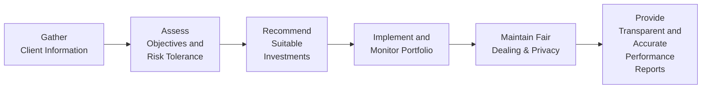

## Introduction

So, let’s talk about one of the most important concepts in practicing finance ethically: the duty we owe to our clients. Interestingly, I remember the first time I had an actual, real-paying client look me in the eye and say, “I’m trusting you to keep my interests first.” That moment was a mix of excitement and, well, a bit of nerves. Standard III – Duties to Clients addresses precisely that sense of responsibility. It sets strict guidelines to ensure that we, as investment professionals, place the client’s interests before anything else.

In this section, we’ll walk through the main components of Standard III:

• Loyalty, Prudence, and Care  
• Fair Dealing  
• Suitability  
• Performance Presentation  
• Preservation of Confidentiality  

We’ll also check out a few real-world applications, talk about best practices, and highlight some pitfalls. Finally, we’ll break down how these concepts might appear in CFA exam contexts (with a slight nod to advanced question styles). Let’s go step by step.

## Loyalty, Prudence, and Care

Loyalty, Prudence, and Care is the bedrock of Standard III. In everyday language, it means you should prioritize your client’s interests over your own personal interests (or your employer’s interests) when making recommendations or trades. Don’t get me wrong—this doesn’t mean you have to sacrifice everything on behalf of your client. But it does mean you must:

• Maintain awareness of conflicts of interest (and disclose them when necessary).  
• Exercise the level of care and diligence that a prudent person managing their own assets would.  
• Continuously monitor client portfolios and market conditions to ensure your recommendations remain relevant and appropriate.  

In my early years, I learned that the old “trust but verify” approach applies here. One day—true story—I got excited about a new emerging markets fund that had a stellar track record. But I realized quickly enough that my client was approaching retirement and might not handle that kind of volatility. So, while the idea was interesting, the best move (and in line with loyalty and prudence) was to avoid taking undue risk on my client’s behalf.

### Key Exam Tip

If you’re given a scenario where a client’s portfolio is invested in something that seems either too risky or too illiquid for their stated goals, remember that the standard of prudence means you should recommend adjusting the portfolio to fit the client’s original objectives. The exam loves to test your ability to spot a mismatch between client objectives and investment choices.

## Fair Dealing

Fair Dealing means all your clients—whether they’re massive institutional investors or your neighbor who popped in with a modest account—deserve equitable treatment. The essence of fair dealing is:

• Timely and uniform dissemination of information (i.e., you cannot tip off a favored client first).  
• Avoiding discriminatory practices that favor certain client accounts or relationships.  
• Being transparent and consistent in your recommendations.  

Let’s face it, sometimes it’s tempting to give a friend or family member an extra heads-up when you spot a market opportunity. But Standard III wants you to keep everything on the up and up. So you should adopt policies that distribute research and recommendations simultaneously. If you’re tested on fair dealing, watch out for any scenario describing the practice of funneling hot IPO allocations to bigger clients while ignoring smaller ones. That’s a classic violation.

### Quick Anecdote

I used to handle a couple of high-net-worth clients who traded in quite large volumes. They often asked for new stock picks as quickly as possible. Interestingly, so did a smaller retail client in the same sector. Fair dealing forced me to structure a standardized (and automated) email distribution list so that everyone got the recommendations and market updates at the same time—no sneaky prioritization.

## Suitability

Suitability is all about making sure recommendations match the client’s risk tolerance, time horizon, financial constraints, and emotional readiness. You might hear people talk about the “Know Your Client (KYC)” principle—yes, that’s basically it. Suitability means:

• Completing a thorough client profile (including risk tolerance questionnaires and interviews).  
• Documenting the client’s investment objectives clearly in an Investment Policy Statement (IPS).  
• Reviewing the IPS regularly (since life changes and so do market conditions).  

A thorough understanding of a client’s overall situation is key. Maybe your client has a short time horizon because they’re hitting retirement soon. Or perhaps they have a large capital project looming in a few years—like paying for tuition for three children—and can’t stomach a big loss in the interim. Suitability ensures that your recommendations reflect these, oh-so-important details.

### Suitability and the Exam

Exam questions often revolve around identifying “red flags” for wrongful recommendations. For instance, a question might say, “A young professional specifically states they can handle high volatility and has no pressing liquidity needs, but you recommend a portfolio of 70% low-volatility municipal bonds.” That mismatch is a breach of Suitability.

## Performance Presentation

Performance Presentation is straightforward: do not misrepresent investment performance, period. The idea is that you should show:

• Complete and accurate performance results, including any relevant negatives (shortfalls, losses).  
• Relevant time periods.  
• Comparable, standardized metrics (potentially adopting GIPS—Global Investment Performance Standards).  

Let’s say your portfolio had a great Q1 and a rough Q2, netting out to average performance for the half-year. Be sure your reporting doesn’t selectively highlight Q1 while ignoring Q2. Under the Code and Standards, leaving out critical facts that would inform the client’s understanding is just as unethical as blatantly fibbing.

### Implementation Example

I recall a small firm I traded with once displayed a “5-year rolling performance chart” that suspiciously excluded a large market downturn in year three. They mistakenly (or so they claimed) cropped the chart. Obviously, they had some explaining to do once the client cross-checked the timeline. Always ensure your performance numbers are consistent with recognized standards such as GIPS.

## Preservation of Confidentiality

Preservation of Confidentiality is the final piece of the Standard III puzzle. It basically says: keep your clients’ information private unless you have to disclose it by law or the client explicitly says it’s okay. This also includes:

• Knowing who on your team can access sensitive client data.  
• Maintaining strong cybersecurity measures to prevent data leakage.  
• Using secure forms of communication.  

For instance, if you’re discussing a client’s big trade plan over coffee in a crowded café, hush up or use a code name. It sounds like common sense, but you’d be surprised how many “compliance nightmares” have started from an overheard conversation or a lost USB drive.

### Anecdotal Slip-Up

Once, I had a colleague who inadvertently forwarded an internal performance analysis to the wrong client. It contained portfolio details of another client with a very different risk profile. The colleague was mortified—and you can imagine the compliance team’s reaction. While it was an honest mistake, it underscores the importance of having strict data-sharing protocols.

## Practical Implementation and Best Practices

Now that we’ve explored the sub-standards, how do you put them into practice daily?

1. Conduct Regular Portfolio Reviews  
   • If your client has a big life event—like a new child, inheritance, or job change—update their IPS and check whether the existing portfolio remains aligned with their risk tolerance and objectives.

2. Maintain Detailed Documentation  
   • Keep a record of phone calls, emails, and in-person consultations. If you remember to do this consistently, you’ll have a solid documentation trail if questions arise about your recommendations.

3. Transparent Fee Disclosures  
   • Let’s say your compensation structure includes performance-based fees or potential conflict-of-interest relationships. Disclosing these upfront can help maintain trust and, of course, keep you in line with Standard III.

4. GIPS-Compliant Reporting  
   • Even if you’re not fully GIPS verified, striving to present performance data consistently and thoroughly is an excellent practice. It helps you avoid cherry-picking good results and ignoring the bad.

5. Lock Down Client Data  
   • Use encryption for digital documents, keep paper records in secure storage, and adopt formal policies around who can access which accounts.  

Anyway, these tips help you create that sense of confidence for your clients and ensure you meet the ethical (and quite practical) requirements.

## Visualizing the Client Relationship Flow

Below is a simple flowchart showing how an advisor might approach client engagements while carefully adhering to Standard III:

From “Gather Client Information” to “Provide Transparent and Accurate Performance Reports,” each step is grounded in Standard III requirements—loyalty, prudence, fair dealing, suitability, performance fairness, and confidentiality.

## Real-World Scenarios

• Institutional vs. Retail Clients: A large pension fund might demand real-time data feeds vs. a smaller retail client who’s okay with a monthly statement. Fair dealing means you can accommodate different levels of service, but don’t front-run or disadvantage the smaller client.  
• High-Frequency Traders: Sometimes, you’ll see big institutional clients requiring special order-handling. You want to ensure all other clients still get best execution.  
• Suitability Under Stress: Suppose your client’s finances change drastically—maybe they lose their job. You might need to shift from a growth strategy to a more conservative approach quickly.  

## Common Pitfalls and How to Avoid Them

• Over-reliance on Outdated IPS: If you never revisit the client’s IPS, you might end up making recommendations for a “past” version of your client.  
• Conflicts of Interest: Personal or firm-level conflicts (like sales contests or incentives) can compromise client interests if not disclosed and handled properly.  
• Performance “Cherry-Picking”: Overemphasizing a stellar quarter while burying more substantial losses in an obscure footnote.  
• Sloppy Confidentiality Practices: Accidentally emailing performance reports to the wrong distribution list or chatting about proprietary info in public.  

## Conclusion and Exam Tips

Standard III – Duties to Clients is a central pillar of the CFA Institute Code of Ethics. Keep in mind these essential points:

• Behave as a fiduciary, placing the client’s interests at the forefront.  
• Double-check that your recommendations remain aligned with continually changing client objectives.  
• Deal fairly—no favoritism or discrimination based on account size.  
• Provide full and fair performance reports.  
• Preserve confidentiality at all times.  

When facing exam questions (particularly those scenario-based vignettes), practice evaluating each decision step for potential conflicts or misalignments with the client’s stated objectives. Often the question is testing whether you can detect a hidden mismatch or a subtle conflict of interest that goes unaddressed.

## References and Further Reading

• CFA Institute Standards of Practice Handbook – Standard III (Duties to Clients)  
• The Fiduciary Duty in Finance, EthicalFoundation.org (accessible at: https://www.ethicalfoundation.org)  
• Global Investment Performance Standards (GIPS), CFA Institute (https://www.gipsstandards.org/)  

## Test Your Knowledge of Standard III – Duties to Clients



### A client nearing retirement has significant exposure to a high-volatility sector. What should you do under Standard III?  
- [ ] Immediately sell all the investments at a loss.  
- [x] Discuss risk tolerance, reassess objectives, and possibly rebalance to more suitable holdings.  
- [ ] Keep investing in the sector to maximize returns.  
- [ ] Introduce the client to options trading for hedging.  

> **Explanation:** Reassessing risk tolerance once a client is nearing retirement is a clear application of Suitability. Selling everything at once might be too extreme; ensure the step is consistent with the client’s updated objectives.

### Which of the following best describes Fair Dealing under Standard III?  
- [ ] Providing more research updates to clients who pay higher fees.  
- [x] Distributing investment updates to all eligible clients simultaneously.  
- [ ] Hiding certain research findings from smaller accounts.  
- [ ] Offering preferential IPO allocations to long-standing clients only.  

> **Explanation:** Fair Dealing requires equitable treatment among clients, including distributing investment recommendations and research simultaneously to avoid favoritism.

### A firm’s marketing materials show only the last two years of stellar performance while omitting underperformance four years ago. This is a violation of:  
- [ ] Suitability.  
- [ ] Confidentiality.  
- [ ] Fair Dealing.  
- [x] Performance Presentation.  

> **Explanation:** Selectively highlighting favorable results violates the standard of accurate Performance Presentation. Investors should be given a complete picture.

### When is a CFA charterholder allowed to share confidential client information?  
- [ ] Whenever discussing it with potential new clients.  
- [x] With express written client consent or if required by law.  
- [ ] Over coffee with coworkers so they all can learn.  
- [ ] If the charterholder estimates that it might help a prospective deal.  

> **Explanation:** Preservation of Confidentiality demands explicit client permission or a legal/regulatory requirement. Otherwise, client info must be kept private.

### A client invests heavily in a sector recommended by their advisor. The sector declines, and the client’s portfolio drops 10%. Is this automatically a violation of the standard of Prudence?  
- [ ] Yes, because the advisor should never recommend securities that might fall in value.  
- [ ] Yes, if the advisor did not ensure disclaimers were signed.  
- [x] Not necessarily, if the recommendation was based on a thorough analysis consistent with the client’s risk profile.  
- [ ] Yes, because a prudent portfolio should never decline.  

> **Explanation:** A decline in portfolio value does not automatically imply a breach of Prudence. The key is whether the recommendation suited the client’s risk tolerance and was carefully researched.

### If a firm decides to adopt GIPS for performance reporting:  
- [x] They should present historical performance fairly, improving comparability and transparency.  
- [ ] They should omit weaker portfolio results to maintain GIPS compliance.  
- [ ] They can use GIPS as needed but cherry-pick only top portfolios.  
- [ ] They need to create multiple sets of performance records for different clients.  

> **Explanation:** GIPS adoption fosters consistent, comparable, and transparent performance reporting, which aligns well with Standard III on Performance Presentation.

### Disclosing your compensation that’s tied to product sales is necessary because:  
- [x] Clients should be aware of potential conflicts of interest.  
- [ ] It’s not required if the product is low-risk.  
- [ ] It remains optional for small accounts.  
- [ ] It must only be done at the end of the year.  

> **Explanation:** Conflict-of-interest disclosure is a crucial component of building and maintaining trust, ensuring clients understand any motive behind your recommendations.

### Which scenario best illustrates an appropriate approach to confidentiality?  
- [x] Using encrypted email and secure servers to store client information.  
- [ ] Sharing the client’s portfolio updates with your neighbor for “professional advice.”  
- [ ] Printing performance reports and leaving them on a public desk.  
- [ ] Posting about the client’s trades on social media.  

> **Explanation:** Ensuring sensitive data is stored and transmitted securely is key to preserving client confidentiality.

### Under Fair Dealing, if a hot IPO allocation is limited, the advisor should:  
- [x] Allocate it among eligible clients on a pro-rata or objective basis.  
- [ ] Give it all to the largest institutional client.  
- [ ] Offer it to personal friends first.  
- [ ] Withhold it from retail clients entirely.  

> **Explanation:** Fair Dealing requires that limited investment opportunities be allocated based on a fair and objective method, not purely on client size or personal preferences.

### True or False: A minor breach of confidentiality can be overlooked if it was accidental.  
- [x] True  
- [ ] False  

> **Explanation:** While the question statement is somewhat tricky, accidental breaches are still violations. However, in practice, a “minor” accidental breach might lead to lesser sanctions, depending on severity and corrective actions taken. On the exam, any breach of confidentiality is considered a violation, even if unintentional.


