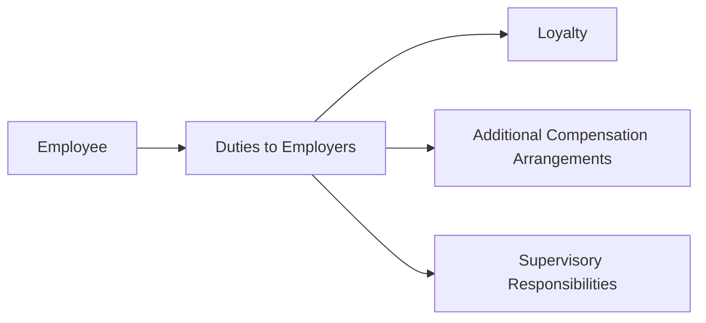

## Introduction

So, let's talk about Standard IV – Duties to Employers. People often focus on client relations and market integrity, and sure, those are critical. But there's a really important piece we sometimes overlook: our loyalty to the firm that hires us. In the investment world, that means you have obligations to your employer that go beyond just clocking in and clocking out each day. After all, your employer equips you with resources, brand reputation, and a network of clients. Fulfilling your duties in a loyal and ethical manner can seriously strengthen not only your career but also the entire profession’s reputation.

In my early career, I once had to clarify whether a side consulting gig I’d been offered might create a conflict. At first, I thought, “Oh man, I can handle both—what’s the issue?” But the more I considered the ethics code, the more I realized that I had to get explicit approval from my employer to ensure no hidden conflicts. That early experience shaped my respect for Standard IV’s guidelines. It’s not just about following the rules—it’s about showing integrity and good faith toward the people who trust you to represent their firm’s brand.

## Defining Loyalty and Employer Obligations

Loyalty to your employer manifests in many ways, from maintaining confidentiality to not undermining the firm’s reputation. Standard IV states that you must avoid any action that could cause harm to your employer—like divulging trade secrets, leveraging client data inappropriately, or starting a competing business on the side without approval.

But wait, you might think, “What if the employer’s interests conflict with clients’ best interests?” The Code is clear: your primary duty is always to act ethically, serve clients ethically, and obey the law. If your employer ever pressures you to engage in unethical or illegal acts, the standard suggests you should refuse and, if necessary, dissociate from that activity.

## Key Pillars of Standard IV

### Loyalty to Employers

Loyalty goes well beyond not stealing your firm’s proprietary algorithms or leaving with the entire client list. It means maintaining a respectful employer–employee relationship, upholding confidentiality, and putting your best foot forward for your firm. Let’s outline the major points:

• Confidential Information: Keep sensitive firm information under wraps.  
• Employer’s Reputation: Avoid tarnishing your firm’s credibility or brand.  
• Avoiding Competitive Behavior: Do not engage in direct competition with your firm unless you have explicit permission.  

Sometimes, employees encounter seemingly harmless activities—like blogging about the markets, giving unapproved stock tips to friends, or picking up side freelance projects. Each of these must be reviewed in the context of firm policies to ensure you’re not inadvertently harming your employer’s interests.

### Additional Compensation Arrangements

Next up is compensation—because, let’s be honest, who doesn’t perk up when we talk money? You might receive extra pay or perks outside your primary job. Maybe it’s a bonus from a private client for outstanding portfolio performance, or a referral fee from a friend’s startup. Well, guess what? All these additional compensations have to be disclosed and approved by your main employer. Any undisclosed arrangement could create a conflict of interest or undercut your employer’s rightful share in the arrangement.

It’s wise to have a formal process in place:  
• Clear policy: State what types of external compensation must be disclosed (usually everything).  
• Written approval: Secure written consent from your employer for any side compensation or benefit.  
• Ethical alignment: Confirm that the extra compensation doesn’t compromise loyalty or create a conflict with existing firm duties.

### Responsibilities of Supervisors

Now, if you supervise even one person—maybe a junior analyst or an intern—Standard IV really cranks up the expectations. The standard says that if you oversee others, you must ensure:

• Effective Internal Controls: Put in place systematic checks so that employees do not breach confidentiality, especially around personal or client data.  
• Comprehensive Policies: Develop or follow thorough compliance manuals to address typical ethical pitfalls (like insider trading and personal account dealing).  
• Accountability: Recognize that if your subordinate violates the Code through neglected supervision, you might be accountable too.  

Let’s be real: your team members look to you for guidance. If you aren’t diligent—like occasionally asking about their personal trading habits or verifying they’ve read compliance manuals—well, you share responsibility if something goes wrong.

## Practical Implementation and Best Practices

### Polices and Training

Encourage a workplace culture where employees freely discuss ethical dilemmas. In everyday reality, an open-door policy helps ensure potential problems come out early before they escalate:

• Implementation Tip: Hold quarterly training sessions (yes, those dreaded compliance sessions) but keep them interactive. Use real-life scenarios or case studies so employees actually engage.  
• Documentation: Have everyone sign a statement they have read and understood the firm’s policies. Keep these on file.

### Monitoring and Detecting Conflicts

A healthy compliance system should detect conflicts of interest and ensure employees remain loyal:

• Periodic Disclosures: Require employees to list side gigs, directorships, or significant personal investments.  
• Control Personal Trading: Maintain a strategy to monitor or pre-clear personal trades.  
• Data Security: Implement an IT system that flags unusual data downloads or suspicious client communications.

### Encouraging Disclosure

I remember chatting with a colleague about a time they hesitated to disclose a small consulting job because they thought, “Ah, it’s so minor—no big deal.” But guess what? Even “small” gigs can creep into potential conflict territory. If you want to create transparency, tell your employees that disclosing conflicts is not only safe but expected—and that failure to disclose is a bigger no-no than the conflict itself.

## Visual Overview of Duties to Employers

Below is a simple Mermaid diagram summarizing the main pillars of Standard IV:

## Case Studies and Examples

1. Taking Client Lists When Leaving  
   Suppose you’re a senior portfolio manager planning to leave your firm. You might think it’s harmless to copy the list of high-net-worth clients you cultivated over the years. But this violates your loyalty obligations. The client list is proprietary information. Rely on your own memory and relationships, not stolen data.

2. Accepting a Referral Fee  
   Imagine you’re a research analyst, and a friend wants to pay you a small “thank you” for introducing them to your firm’s private equity team. Even if well-intentioned, you must notify your employer in writing and receive explicit approval—especially if this referral might create biased recommendations in your role.

3. Supervisory Oversight Lapse  
   You manage a junior associate who just started. She consistently trades small-cap tech stocks in her personal account during work hours. If you, as her supervisor, overlook her personal trading logs and she engages in insider trading (accidentally or otherwise), you could be found at fault for inadequate supervision.

## Common Pitfalls

• Failing to get written approval for side compensation.  
• Overlooking personal relationships or external interests that create subtle (or not-so-subtle) conflicts.  
• Supervisors providing only superficial oversight of subordinates’ activities.  
• Assuming everyone knows the rules and not offering ongoing reminders or training.  

## Conclusion

Anyway, Standard IV might not sound as glamorous as global investment performance or the intricacies of capital markets, but believe me, it’s the backbone of professional trust. When you show loyalty to your firm, handle additional compensation ethically, and fulfill your supervisory responsibilities, you build a stable environment that benefits everyone—from your teammates to your clients and the broader public. Plus, you enhance your own professional reputation in a way that can pay dividends throughout your career.

## References

• CFA Institute Standards of Professional Conduct (Standard IV)  
• “Managing Conflicts of Interest: Governance and Financial Oversight” by OECD  
• Employer Best-Practice Guides from the CFA Institute’s Career Resources:  
  https://www.cfainstitute.org/en/career

## Exam Tips for Standard IV

• Cite the standard precisely in essay responses; the exam often asks about the difference between recommended vs. required procedures.  
• Show how you would promptly notify your employer in hypothetical scenarios related to outside compensation.  
• For supervisory responsibilities, be explicit about enforcement mechanisms—mention your roll-out of compliance manuals, periodic trainings, and documented protocols.

## Test Your Knowledge: Duties to Employers and Ethical Supervisory Practices



### Under Standard IV, which of the following actions primarily demonstrates loyalty to an employer?

- [ ] Taking proprietary data for personal use.
- [ ] Withholding important client communications.
- [x] Maintaining firm confidential information and not disclosing it to outside parties.
- [ ] Launching an unauthorized competing product line.

> **Explanation:** Loyalty requires safeguarding your employer’s confidential data and refraining from activities that undermine the firm’s interest or reputation.

### Which of the following is the best approach when receiving additional compensation or benefits?

- [ ] Decline all benefits to avoid ethical issues.
- [x] Disclose the arrangement in writing and obtain employer approval.
- [ ] Accept the benefit only if it’s less than 5% of your base salary.
- [ ] Transfer the benefit to a personal holding company.

> **Explanation:** Standard IV requires employees to get written consent from their employer for any external compensation that could create real or perceived conflicts of interest.

### A supervisor can be held responsible for an employee’s unethical behavior if:

- [x] The supervisor fails to implement reasonable compliance procedures to prevent or detect violations.
- [ ] The employee does not read the firm’s code of ethics.
- [ ] The employee commits a violation outside of work hours.
- [ ] The supervisor is new to the role.

> **Explanation:** Supervisors must take active steps to establish and enforce policies. If they neglect this duty, they share responsibility.

### In evaluating external directorships or consulting roles:

- [ ] Verbal consent is always sufficient.
- [ ] There is no need for gathering information about the nature of the role.
- [x] Written approval from the employer is recommended to prevent conflicts of interest.
- [ ] Supervisory responsibilities do not extend to external directorships.

> **Explanation:** External directorships or side engagements must be communicated and approved in writing to ensure transparency.

### Under Standard IV, which of the following is the strongest indicator of inadequate supervision?

- [x] A supervisor never reviews subordinate personal trading logs.
- [ ] The firm’s compliance manual is 50 pages long.
- [x] The supervisor fails to provide ongoing training after initial orientation.
- [ ] The subordinates attend at least one training session.

> **Explanation:** Supervisors should regularly monitor activities—like personal trading—and conduct routine, ongoing training. Failing in these duties can be evidence of inadequate supervision.

### Which scenario most evidently violates the loyalty principle under Standard IV?

- [x] Taking a proprietary client list to start your own venture.
- [ ] Working late nights with no additional compensation.
- [ ] Forwarding your résumé to a competing firm.
- [ ] Requesting flexible hours to attend a training program.

> **Explanation:** Taking a client list or similar proprietary information is a clear breach of loyalty, as it harms the employer’s interests.

### Why is it critical to establish a transparent conflict-of-interest disclosure process?

- [x] It mitigates the risk of employees unintentionally compromising firm integrity.
- [ ] It is only necessary when employees suspect wrongdoing.
- [x] It allows employees to withhold material details until annual reviews.
- [ ] It absolves the employer of any oversight responsibilities.

> **Explanation:** Openly disclosing all external relationships, personal trading, or side compensation helps prevent accidental harm to the firm and fosters compliance with Standard IV.

### Which action by a supervisor best demonstrates compliance with Standard IV?

- [x] Implementing internal trading reviews and documenting policy infractions.
- [ ] Allowing employees to self-regulate without auditing.
- [ ] Allowing undisclosed compensation if the amounts are small.
- [ ] Overlooking questionable behavior if it boosts revenue.

> **Explanation:** Supervisors show due diligence by establishing, maintaining, and documenting a robust system of controls and monitoring.

### When an employer demands an unethical or unlawful act:

- [x] The employee must refuse to engage and dissociate from the unethical conduct.
- [ ] The employee must comply, placing the employer’s interest first.
- [ ] The employee should do it but keep the details private.
- [ ] The employee must resign immediately with no other actions.

> **Explanation:** The Code always prioritizes law and ethics above any loyalty arrangement. Employees have a duty to refuse and distance themselves from unlawful or unethical conduct.

### True or False: Side projects unrelated to finance never require employer notification or approval under Standard IV.

- [x] True
- [ ] False

> **Explanation:** Actually, it depends. If there is any potential for conflicting interests—such as time commitments or brand association—notification or approval might be necessary. Always review your firm’s policies to determine whether it could create an implicit conflict. (In many firms, you still must disclose all outside activities to be safe.)


