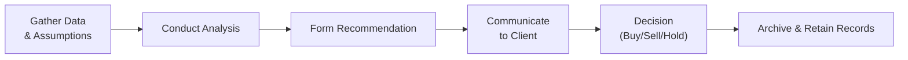

## Introduction

Have you ever prepared an investment recommendation and felt a bit uneasy, wondering if you’d done enough research or double-checked your assumptions thoroughly? I remember the first time I was asked—years ago—to analyze a small tech startup for a potential client portfolio. I was excited (who wouldn’t be, right?), but also slightly overwhelmed by all the data. Between reading the firm’s financial statements, the broader industry reports, and double-checking the technology dynamics, I had to ensure that my final recommendation was backed by what CFA Institute calls “diligence and a reasonable basis.” That’s precisely what Standard V is all about—going the extra mile in ensuring your research is robust, that you communicate transparently, and that you keep proper records to substantiate every decision.

Standard V – Investment Analysis, Recommendations, and Actions in the CFA Institute Code of Ethics and Standards of Professional Conduct sets out clear guidelines on how investment professionals are expected to conduct research, communicate their findings, and maintain evidence of their analyses. This Standard is divided into three primary sub-sections:

• V(A) Diligence and Reasonable Basis  
• V(B) Communication with Clients and Prospective Clients  
• V(C) Record Retention  

In this article, we’ll explore each sub-section in depth. Along the way, we’ll bring in relevant case studies, share a few personal anecdotes, and highlight best practices that can help you excel in both real-world applications and your CFA exams.

## V(A) Diligence and Reasonable Basis

Diligence means you do your homework—thoroughly. But we’re not talking about just scanning a few headlines or glancing at an income statement. Under Standard V(A), an investment professional is expected to:

• Investigate thoroughly and use robust methods.  
• Possess or seek the necessary expertise.  
• Rely on relevant, up-to-date, and genuine data.  
• Form conclusions using sound judgment (a “reasonable basis”).  

### Building a Research Framework

One of the best ways to ensure diligence—and maintain a reasonable basis for your recommendations—is to standardize your research process. This typically involves:

1. Gathering Macroeconomic Data  
   Understanding the broader environment in which your security operates. For instance, if you’re analyzing a bond in a rising-rate environment, that’s significant context.

2. Conducting Industry & Competitive Analysis  
   Looking at the competitive landscape can reveal crucial insights about market share, pricing power, and potential disruptors.

3. Performing Quantitative Valuation  
   Employing methods like discounted cash flow (DCF) analysis or relative valuation (P/E ratios, P/B multiples, etc.). The key is to pick valuation approaches aligned with the type of asset and the data reliably available.

4. Testing Assumptions  
   Evaluating the sensitivity of your models to changes in factors like growth rates, discount rates, or commodity prices. Stress testing can help ensure you’re not missing big risk exposures.

5. Reviewing External Research  
   Cross-referencing your findings with industry experts, reputable news sources, and professional research platforms to confirm or challenge your thesis.

Below is a small Python snippet illustrating a simplified DCF approach:

```python
import numpy as np

projected_cf = np.array([100, 120, 140, 160, 180])
discount_rate = 0.10  # 10% discount rate
terminal_growth = 0.03  # 3% terminal growth

years = np.arange(1, 6)
present_values = projected_cf / ((1 + discount_rate) ** years)

terminal_value = projected_cf[-1] * (1 + terminal_growth) / (discount_rate - terminal_growth)
terminal_value_pv = terminal_value / ((1 + discount_rate) ** 5)

enterprise_value = np.sum(present_values) + terminal_value_pv

print(f"Enterprise Value (rough estimate) = {enterprise_value:.2f}")
```

This snippet is, of course, heavily simplified. But it’s a neat demonstration of how you might quickly model the present value of a security’s future cash flows to get started—just remember that diligence also means scrutinizing every assumption you feed into the model.

### Ensuring Adequacy of Research Depth

It’s easy to forget that different asset classes require different levels of digging. A government bond might be more influenced by macro factors, while a small-cap growth stock might hinge primarily on the success of its niche product or new technology. The point is that a “reasonable basis” is dynamic and context-dependent—there’s no one-size-fits-all standard. 

What is consistent, though, is that an analyst must demonstrate professional skepticism, consult multiple sources of data, reject unverified claims, and maintain a rational, evidence-based perspective throughout the research process.

## V(B) Communication with Clients and Prospective Clients

So, you’ve concluded your research and formed an opinion—awesome! But it’s not enough to stop there. Standard V(B) instructs that you must explain your methods, key risks, possible limitations, and overall rationale in a way that is both comprehensive and easy to understand.

Have you ever read a recommendation from some super-technical analyst and ended up more confused than before? Communication should be about clarity—not showcasing how many big words you can use.

### Balancing Accuracy and Accessibility

When dealing with clients or prospective clients, aim for balanced communication. This means:

• Explaining the basics: For instance, clarifying why you believe a particular equity is undervalued or how a hedge strategy might mitigate certain portfolio risks.  
• Disclosing risks: If your forecast relies on stable commodity prices or continuous consumer demand, you should state those assumptions upfront.  
• Avoiding misinformation: Don’t cherry-pick data or hide details that could materially affect the client’s understanding of the investment.

### Best Practices in Client Communications

1. Executive Summaries: Start with a concise summary of your primary thesis and conclusions so that clients get the big picture right away.  
2. Appropriate Language Level: Tailor your message to the sophistication of your audience. A retail investor might need simpler language than an institutional client.  
3. Real-Time Updates: If something changes—say, the company you recommended just announced a major product recall—clients want to know ASAP.  
4. Emphasize Risk and Uncertainty: Make it crystal clear that all investments come with uncertainty. Overconfidence in your messaging can potentially mislead.  

Here’s a quick table that compares typical communication styles for different clients:

| Client Type           | Typical Approach                                 | Example Language                                         |
|-----------------------|-------------------------------------------------|----------------------------------------------------------|
| Institutional Client  | Technical, data-driven, advanced metrics        | “Our 2025 forecast uses a 10% discount rate and a 2% terminal growth assumption.” |
| Retail Investor       | Simplified, focusing on big-picture concepts    | “We expect the stock to grow steadily over the next few years due to strong product demand.” |
| Sophisticated Analyst | Mix of technical detail and broad perspective   | “We remain cautious because of potential macro headwinds, with an estimated 15% downside if rates rise above 4%.” |

## V(C) Record Retention

In the daily hustle of an investment practice, it’s all too easy to lose track of your old spreadsheets, valuations, or email threads with data sources. But Standard V(C) clarifies the necessity of properly retaining records that support your investment decisions and communications.

### The Importance of Thorough Documentation

Without a comprehensive and well-organized paper trail (or digital trail), it becomes difficult—if not impossible—to substantiate how a recommendation was formed. Imagine you’re audited by a regulator or asked about an old trade: if you lack the documents (financial statements, research notes, internal memos, disclaimers), your professional reputation could be at risk.

### Duration of Record Retention

While the Standard doesn’t specify a universal time frame, it does instruct you to comply with local laws and regulations. In many jurisdictions (like the United States), investment professionals often keep records for at least five years. In other regions, the requirement might be longer. The key is to maintain records for at least the mandated period and perhaps even longer if that’s prudent for your firm’s policies.

### Best Practices for Secure Record-Keeping

1. Digital Storage Solutions: Enhance data security by using encrypted cloud storage with backup systems in multiple locations.  
2. Access Controls: Limit who can view or modify records. This prevents accidental or malicious manipulation.  
3. Version Control: Keep track of changes to your models, especially if multiple analysts work on the same project.  
4. Periodic Audits: Conduct regular internal reviews (or external ones) to ensure that your firm’s retention procedures align with the regulatory requirements and ethical guidelines.

Below is a simple Mermaid diagram illustrating a typical lifecycle of investment analysis, from gathering data to retention:



## Practical Implementation Tips

Now that we’ve gone through the nitty-gritty of each sub-section, let’s talk about some practical tips you can use right away:

• Develop a standardized research template: Ensure every research report from your team starts with an industry overview, includes relevant valuation models, comparative analysis, and ends with a clear risk assessment.  
• Communicate promptly: If market conditions or your analysis assumptions change, issue notifications or updates quickly. It’s better to over-communicate than to leave a client out of the loop.  
• Leverage technology for secure retention: Don’t rely on scattered email threads or local hard drives. Use dedicated compliance databases or a recognized document repository system.  
• Regularly audit research quality: Bring in external experts—or conduct peer reviews—to confirm that your methodology remains objective, up-to-date, and thorough.  

## Real-World Example: Equity Analysis Gone Wrong

Let’s consider a hypothetical scenario: An analyst issues a “strong buy” recommendation for Company XYZ, predicting that their new gadget will dominate the consumer electronics market. The analyst’s work, however, was rushed. They overlooked supply chain vulnerabilities and relied on a single (and possibly biased) supplier interview.

• Diligence & Reasonable Basis Issue: The analyst did not fully investigate the chain of suppliers or the possibility of rising input costs.  
• Communication Issue: The recommendation stated high returns but ignored potential supply disruptions. Clients were blindsided when cost inflation hit profits.  
• Record Retention Problem: When a client demanded an explanation, the analyst had insufficient documentation to prove how they reached the recommendation.  

This fiasco underscores why Standard V is so crucial. Investors who rely on such poor research can face significant losses. Meanwhile, the analyst’s reputation can take a hard (and sometimes irreversible) hit.

## Common Pitfalls to Avoid

1. Over-reliance on a Single Data Source: Even credible sources can fail. Triangulate your data from multiple channels.  
2. Backward-Looking Bias: Using outdated models or ignoring new market realities can quickly render your recommendation invalid.  
3. Depth vs. Breadth Trade-Off: If you cover many sectors, be cautious about spreading yourself too thin. Sometimes a narrower but deeper approach yields better-quality insights.  
4. Neglecting Global or Cultural Nuances: Especially relevant if you have cross-border clients. Regulatory environments, accounting practices, and even communication styles can differ widely.

## Best Practices for Ensuring Compliance

• Update Your Knowledge Continuously: Regulations and best practices evolve. Having an ongoing learning culture helps you stay current.  
• Align with Local and Global Regulations: Besides the CFA Institute’s Standards, check the requirements of your local regulator, such as the SEC guidelines in the U.S.  
• Adopt a “Two-Person Rule”: In some firms, a second analyst or manager must sign off on a recommendation, reducing the risk of oversight.  
• Encourage a Culture of Scrutiny: In departmental meetings, encourage peers to challenge assumptions. Constructive debate often uncovers hidden risks or flawed logic.

## Final Exam Tips

1. Focus on Concepts Before Memorization: The CFA exam often tests your ability to apply these standards in scenarios rather than just recall definitions.  
2. Practice with Past Item Sets and Essays: Standard V questions can be subtle, often involving incomplete research or questionable communication.  
3. Use the “Reasonable Investor Perspective”: Put yourself in the client’s shoes. If the scenario’s communication seems incomplete or misleading, that’s a big hint it violates Standard V.  
4. Prepare for Calculation + Ethics Combos: An exam question might include a short calculation or assumption, then ask whether the analyst has violated Standard V.  
5. Track Potential Grey Areas: The exam loves to highlight borderline ethical cases where an analyst might have done “enough” but not “thorough” research.  

## Conclusion

Standard V reminds us that people trust their savings, ambitions, and dreams to our recommendations. So, ensuring we’ve done adequate investigation, communicated honestly, and documented everything thoroughly isn’t just lip service—it’s about upholding the integrity of the profession and protecting our clients’ welfare. Yes, it can be time-consuming. And yes, it sometimes feels like there are zillions of documents to keep track of. But believe me, the moment a client says, “Thank you, I feel really confident in your recommendation,” all that effort is worth it.

Whether you’re brand new to investment analysis or you’ve been at it for decades, these principles never get old. After all, the trust you build today will not only serve your clients but also sustain your career for years to come.

## References

• CFA Institute Standards of Professional Conduct (Standard V)  
• Pinto, Jerald E., et al. “Equity Asset Valuation.” CFA Institute Investment Series  
• U.S. Securities and Exchange Commission (SEC) Record-Keeping Guidelines (sec.gov)  

## Exam-Style Questions on Standard V: Investment Analysis, Recommendations, and Actions



### Which aspect of Standard V(A) "Diligence and Reasonable Basis" must analysts prioritize when developing forecasts?  
- [ ] Mitigating taxes while making recommendations  
- [x] Using appropriate valuation techniques and verifying assumptions  
- [ ] Adopting consensus views from major brokerage firms  
- [ ] Confirming minimal volatility in market conditions  

> **Explanation:** Under V(A), analysts must thoroughly investigate and verify their inputs. Merely copying consensus estimates or ignoring multiple valuation approaches can lead to inadequate due diligence.

### When communicating with clients under Standard V(B), which practice most effectively balances clarity and accuracy?  
- [ ] Relying only on technical jargon to showcase expertise  
- [x] Providing a clear summary of the recommendation, supported by key facts and risks  
- [ ] Omitting perceived negative information to encourage client confidence  
- [ ] Schedule communications only after quarterly reporting  

> **Explanation:** Clear summaries supported by key facts and risks strike the right balance. Omissions or overly technical language can mislead or confuse clients.

### Under Standard V(C), Record Retention, which method of storing investment research is most aligned with best practices?  
- [x] A secure, encrypted digital archive with proper backup and version controls  
- [ ] Private email servers with no backup  
- [ ] Physical binders placed on an open office bookshelf  
- [ ] Ad hoc local hard drives held by each analyst  

> **Explanation:** A secure digital archive that maintains backups and version control is essential for meeting professional and legal requirements.

### An analyst issues a strong buy recommendation but did not investigate the company’s full supply chain. Which substandard of Standard V have they likely violated?  
- [ ] V(B) Communication with Clients  
- [ ] V(C) Record Retention  
- [x] V(A) Diligence and Reasonable Basis  
- [ ] None, as supply chain factors are not always relevant  

> **Explanation:** Failing to research supply chain risks suggests inadequate diligence, violating V(A).  

### Which of the following is recommended for practical implementation of Standard V?  
- [x] Creating a standardized research template that includes macro and micro factors  
- [ ] Accepting any source of data at face value  
- [x] Utilizing secure technology solutions for record retention  
- [ ] Ignoring the need for timely updates to clients  

> **Explanation:** Standardized research templates and secure record-keeping systems directly address the thoroughness and documentation requirements. Timely updates are also crucial for compliance with V(B).

### A wealth manager for high-net-worth clients includes disclaimers about potential risks in a monthly newsletter. Which Standard V concept does this practice illustrate?  
- [x] Communication with Clients (V(B))  
- [ ] Diligence and Reasonable Basis (V(A))  
- [ ] Fair Dealing (Standard III(B))  
- [ ] Additional Compensation Arrangements (Standard IV(B))  

> **Explanation:** Providing disclaimers of risk and relevant disclaimers ensures clear communication with clients, a key aspect of Standard V(B).  

### An analyst uses a single discounted cash flow model from six months ago without updating market assumptions. Which pitfall are they most subject to?  
- [x] Backward-looking bias  
- [x] Insufficient diligence to maintain a reasonable basis  
- [ ] Overzealous risk disclosure  
- [ ] Transparent communications  

> **Explanation:** Failing to update the DCF model for new data or market shifts creates a backward-looking bias and violates the principle of maintaining a reasonable basis.

### Which statement best describes the “two-person rule” in investment recommendations?  
- [x] It requires a second qualified person to verify and sign off on major recommendations.  
- [ ] It stipulates that only two individuals in the firm can issue recommendations.  
- [ ] It mandates that the same person must handle research and record retention.  
- [ ] It is relevant only for equity research, not fixed-income.  

> **Explanation:** The two-person rule enhances due diligence and reduces biases by introducing a second review of the recommendation.

### If a firm does not have a formal record-retention policy, which action should analysts take to comply with Standard V(C)?  
- [x] Retain personal copies of all research and abide by the local regulatory minimums  
- [ ] Destroy documents once a recommendation is published  
- [ ] Store records only until the next performance review  
- [ ] Delegate record retention to clients  

> **Explanation:** Analysts must still ensure they comply with legal and regulatory retention periods, even if their firm has no formal policy.

### Under Standard V, it is acceptable to recommend an investment without further disclosure if it:  
- [x] Does not have a material impact on the portfolio and the recommendation is backed by a rigorous internal research process  
- [ ] Has a high return potential but lacks supporting data  
- [ ] Was simply recommended by a third-party influencer with a strong track record  
- [ ] Has positive feedback on social media  

> **Explanation:** Even smaller or seemingly trivial investments must be justifiable by reasonable basis. If the internal research meets the requirements and the impact is small, extensive additional disclosures might be limited—though diligence and proper documentation remain essential.


