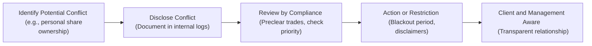

## Introduction

Conflicts of interest can sneak up on us in the most unexpected ways, and if you’re anything like me, you might even recall an uncomfortable moment when a friend asked for “a little favor” that put you in a tricky position. Well, in the investment profession, these sorts of dilemmas can be especially significant—potentially harming clients, markets, or even your own career if not handled properly.

Standard VI – Conflicts of Interest emphasizes how important it is to recognize, disclose, and otherwise deal with personal or external factors that could sway—or appear to sway—our professional judgment. The reason? Clients trust us with their wealth, and any hint that we might put our own interests first can erode that trust in a flash. In this section, we’ll cover everything from basic definitions and underlying theory to the nitty-gritty details of disclosure, priority of transactions, and referral fees. We’ll also dive into practical tips, real-world examples, and a few cautionary tales. By the end, you’ll be well-equipped to navigate these murky waters with integrity and confidence.

## Understanding Conflicts of Interest

A conflict of interest arises when an individual’s personal interest—financial or otherwise—could compromise their professional obligations to clients, employers, or other stakeholders. In finance, these conflicts can have serious consequences, especially because the entire investment profession runs on trust. Without trust in the integrity and objectivity of advisers and portfolio managers, financial markets can deteriorate, harming investors and society at large. Maybe we should all remember that time we were kids and wanted to “bend the rules” to our advantage during board games with friends: if you cheat or mislead, no one wants to play anymore.

### Why It Matters

A key aspect of Standard VI is preserving objectivity. If clients suspect you’re recommending a particular stock or mutual fund primarily because you have a personal incentive—like a referral fee or a sweet profit for your private portfolio—they’ll understandably doubt the validity of your recommendation. It’s not just about staying clear of actual conflicts; it’s also about addressing perceived conflicts. Perception can matter just as much as reality in finance.

### Two Primary Effects

1. Bias in Recommendations: Conflicts of interest can color your investment research and recommendations. Even if you think your objectivity remains pristine, the mere existence of a conflict might cause outsiders to raise eyebrows.  
2. Erosion of Trust: As soon as trust starts eroding, the relationship with clients goes downhill. Clients will wonder whether any advice is truly in their best interest.

## Key Requirements under Standard VI

Standard VI basically sets out the principle that you must identify conflicts early, disclose them promptly, and manage them effectively so they don’t hamper your professional responsibilities. Let’s break down the three pillars: Disclosure of Conflicts, Priority of Transactions, and Referral Fees.

## Disclosure of Conflicts

Imagine you own shares in a company you’ve been researching for months, and you’ve just published a glowing report. Did you mention your stake in the company to your client? If not, that’s a red flag. Disclosure is the bedrock principle that allows clients and employers to make fully informed decisions, understanding whether you have additional motivations beyond their interests.

### What to Disclose

• Any personal positions or ownership stakes in securities or other assets that are the subject of client recommendations.  
• Outside business interests that might influence your professional judgment—such as holding a role on a corporate board, or receiving consulting fees from financial issuers.  
• Family or close personal relationships that could bias your advice.  
• Any arrangement that grants you a direct or indirect financial benefit from the advice you give—for example, referral fees.

### Practical Strategies for Disclosure

• Maintain a “conflicts register” documenting each potential conflict. This is a living document that you should update frequently.  
• Create a system or checklist in research reports, ensuring disclaimers like “The analyst and/or the firm holds a position in the security.”  
• Encourage a firm-wide culture in which other employees are also transparent about potential conflicts. It’s a lot easier to keep your disclosures consistent if everyone’s following the same protocols.

## Priority of Transactions

Now, let’s talk about trade order. In plain language: If your client wants to purchase shares of a stock you believe is hot, you do not front-run that trade to buy shares for yourself first.

### Front-Running and Why It’s Prohibited

Front-running is a particularly insidious form of conflict of interest. You find out a large client is about to buy a massive chunk of shares, so you quickly buy them in your personal account before executing the client’s order. This means you get in at a lower price—then, after the client trade moves the market, your holdings skyrocket. That is a big no-no. It’s unethical, damages client interests, and undermines market integrity.

### Ensuring Priority for Clients

• Written Trade Allocation Policy: A formal policy that spells out how orders are allocated among client accounts and personal accounts.  
• Preclearance Procedures: Requiring personal trades to be authorized in advance so compliance teams can ensure trades aren’t conflicting with client interests.  
• “Blackout” Periods: Some firms enforce a waiting period after research analysts issue recommendations. During this time, analysts and other relevant employees can’t trade the recommended security.  
• Documentation: Keep records of every trade request and approval (or denial), which helps ensure transparency if anyone questions your trade sequencing.

## Referral Fees

Referral fees are a bit trickier. They aren’t inherently wrong—after all, it’s normal for businesses to reward professionals who bring in new clients. The difficulty is that referral fees can create a conflict by incentivizing you to recommend a particular product or service, possibly leading to biased advice.

### Common Referral Scenarios

• Financial Advisers referring clients to estate planners or lawyers—earning a finder’s fee for each referral.  
• Asset managers pointing clients to an external tax consultant or property management firm in exchange for some financial benefit.  
• Banks or brokerage firms paying out fees to wealth managers who refer high-net-worth clients for specialized financial products.

### Disclosure of Referral Fees

Always disclose to clients (and your employer) any arrangement or potential compensation that arises out of sending a client in one direction or another. This way, clients can assess if your recommendation is possibly influenced by personal gain.

## Implementation Tips

Before we jump into diagrams and examples, here are quick tips for putting Standard VI into action:

• Keep a Conflicts Register: List your personal holdings, external directorships, close family involvements, referral relationships, and relevant financial incentives. Be extremely meticulous here.  
• Implement a Trade Preclearance System: Let compliance or a designated officer approve personal trades. Sure, part of you might say, “Ugh, more paperwork,” but it’s also your best defense when someone wonders whether you front-ran a client.  
• Document All Outside Relationships: Board memberships, volunteer positions, or adviser roles for nonprofits can absolutely create perceived conflicts—so document them.  
• Use Prominent Disclaimers: For example, if you post an online article praising a stock in which you hold a position, state this upfront.  
• Foster an Ethical Culture: Create training programs or discussion forums so employees understand the importance of transparency and the procedures in place to preserve integrity.

## A Quick Visual Overview

Below is a simple Mermaid diagram illustrating how conflicts of interest might arise in the context of an investment firm and how formal policies help mitigate them:



This diagram sets out a simple step-by-step approach: Identify the conflict, disclose it, have compliance provide oversight, take any necessary actions (like a trading blackout), and keep clients and management informed. Ultimately, transparency is the name of the game.

## Real-World Case Studies

### Case 1: The Research Analyst with a Hidden Holding

An analyst at a mid-sized brokerage firm gushes about a certain tech stock in an official report. Clients buy in, pushing up the price. It later emerges that the analyst had privately accumulated a sizeable stake before the publication. Clients feel betrayed, the analyst’s reputation tanks, and regulators levy fines against the firm for failing to ensure adequate disclosures.

• Lesson: Always come clean. Even if you think it’s “no big deal,” your personal holdings can cast a huge shadow over your objectivity.

### Case 2: The Referral Fee Dilemma

A financial planner regularly referred clients to a particular law firm, receiving a modest but consistent monthly referral fee. Over time, the planner realized that the law firm was charging above-market rates and provided subpar service—but was reluctant to switch referrals because of the monthly “bonus.” When clients eventually discovered they could have gotten better deals elsewhere, trust was decimated. Now that’s painful.

• Lesson: Referral fees must be disclosed, and the client should be free to choose the best service. As soon as that freedom looks compromised, your credibility is at risk.

### Case 3: The Cozy Board Director

An asset manager sits on the board of a small biotech startup. Meanwhile, she manages a fund that invests heavily in pharma and biotech. In principle, there’s nothing illegal here, but the manager must meticulously disclose her dual role, recuse herself from certain fund decisions relating to her personal board seat, and ensure no insider information crosses the line.

• Lesson: Handling multiple roles requires extra vigilance, clear disclosures, and sometimes stepping away from decisions where conflicts might be perceived.

## Common Pitfalls and How to Avoid Them

1. Overlooking “Trivial” Interests  
   Sometimes professionals think small or “borderline” conflicts don’t matter. But even a small stake can undermine credibility. Document it.

2. Relying on Verbal Disclosures  
   Written disclosures, either on official reports or in client communications, are best. Verbal disclaimers can easily be forgotten or misinterpreted.

3. Lax Enforcement of Policies  
   Having a robust set of guidelines but ignoring them in practice can be more damaging than having no policy at all. Regulators—and clients—take note of that.

4. Neglecting the Perception Angle  
   Even if you believe a conflict doesn’t affect your judgment, the client (and the market) might see it differently. Always address appearance of conflicts.

## Behavioral Aspects

Conflicts of interest aren’t purely about rules and regulations. Behavioral finance shows us how incentives and personal biases can creep into decision-making. Loss aversion or overconfidence can exacerbate the problem. For instance, you might think, “I’m the best stock picker; me owning shares in this recommended stock is just proof of my confidence.” Meanwhile, you may fail to see how it looks to someone on the outside.

## Ethical Decision Framework

Much like we discussed in prior sections on ethical frameworks:

• Recognize the Conflict: Don’t dismiss it. Identify it early.  
• Evaluate the Situation: Impacts on clients, your employer, and other stakeholders.  
• Decide on Transparency: Full disclosure is typically non-negotiable.  
• Consider Alternatives: For instance, recusing yourself from certain decisions or letting someone else handle a transaction.  
• Reflect on the Outcome: Learn from each situation to refine your firm’s policies.

## KaTeX Illustration (Hypothetical Payoff)

We can even think about a simplified example of “gain” from a conflict of interest in financial terms. Maybe you get an extra payoff (P) from a referral fee arrangement in addition to your usual compensation:


P = \sum_{i=1}^{n} \alpha \times R_i


Where:  
• \\( \alpha \\) is the proportion of the referral fee you receive per client.  
• \\( R_i \\) is the revenue generated from each referred client \\( i \\).  
• \\( n \\) is the total number of referrals made.

The conflict emerges if \\( \alpha \\) is large enough to sway your recommendation. If your independent analysis says a different service would be better, but you feel compelled to direct clients toward the service paying you more, you’re compromising client interest.

## Additional Implementation Example in Python

Let’s say you want to automate detection of “red flags” in your personal trading activities relative to your firm’s client trades. You could create a small script that checks time stamps:

```python

firm_trades = [
    {"ticker": "XYZ", "trade_time": "2025-03-10 10:15:00", "action": "BUY"},
    {"ticker": "ABC", "trade_time": "2025-03-10 11:00:00", "action": "SELL"}
]

employee_trades = [
    {"ticker": "XYZ", "trade_time": "2025-03-10 10:10:00", "action": "BUY"},
    {"ticker": "ABC", "trade_time": "2025-03-11 09:30:00", "action": "SELL"}
]

def check_front_running(firm_trades, employee_trades):
    violations = []
    for ft in firm_trades:
        for et in employee_trades:
            if et["ticker"] == ft["ticker"] and et["action"] == ft["action"]:
                # Compare time stamps
                if et["trade_time"] < ft["trade_time"]:
                    violations.append(f"Potential front-running: {et}")
    return violations

result = check_front_running(firm_trades, employee_trades)
print("Violations:", result)
```

If the employee’s trade time is earlier than the firm’s large client trade, you can automatically flag it for compliance review. Of course, in real life, you’d have a far more sophisticated system.

## Exam Tips and Final Considerations

1. Understand the Full Scope of Standard VI  
   Get comfortable with examples, definitions, and even borderline cases. The exam might provide scenario-based questions requiring you to identify whether a conflict exists and how it should be handled.

2. Learn the Disclosure Requirements Cold  
   The difference between a subtle conflict and a major ethical breach can be how you choose to disclose the matter. Practice writing disclaimers or short statements that clarify your interest.

3. Stay Alert to Managerial and Supervisory Roles  
   If you’re in a position to supervise others, you must ensure the entire team adheres to conflict-of-interest standards. The exam may pose questions about managerial responsibility in these cases.

4. Practice with Hypothetical Scenarios  
   The exam thrives on “What would you do?” or “Which Standard applies?” style questions. Look for clues such as personal share ownership, potential referral fees, or outside business interests.

5. Avoid Over- or Under-Disclosing  
   Over-disclosing non-issues can clutter communications, while under-disclosing real issues is an obvious violation. Striking the right balance is key.

## References and Further Reading

- CFA Institute Standards of Practice Handbook (Standard VI)  
- “Managing and Mitigating Conflicts of Interest in the Financial Services Industry” by the International Monetary Fund (IMF)  
- FINRA Guidelines on Conflicts of Interest: https://www.finra.org  
- Additional cross-reference: See Chapter 1 (Ethics and Trust in the Investment Profession) for a primer on how ethics underpins professional responsibilities.

## Glossary

• Conflict of Interest: A situation where an individual’s personal or external interest can influence (or appear to influence) professional responsibilities and objectivity.  
• Front-Running: Trading on material nonpublic information ahead of a large client order to benefit from the expected price movement.  
• Referral Fees: Compensation gained by referring clients—disclosing this is crucial so that clients and employers can accurately evaluate the recommendation.

--------------------------------------------------------------------------------

## Conflicts of Interest: Mastering Standard VI for the CFA Exam



### Which of the following best describes a conflict of interest under Standard VI?

- [x] A situation where personal or external interests could compromise professional judgment.
- [ ] A scenario where two clients trade the same security on the same day.
- [ ] An employee's lack of investment research skills.
- [ ] The firm acquiring new client accounts rapidly.

> **Explanation:** A conflict of interest occurs when personal or external factors could sway a professional’s responsibilities to clients, employers, or other stakeholders.

### What is the primary reason for disclosing conflicts of interest?

- [x] To let clients and employers make informed decisions about potential biases.
- [ ] To comply with tax regulations.
- [ ] To allow investment professionals to trade ahead of the client.
- [ ] To increase the marketing of an investment product.

> **Explanation:** Disclosure ensures that stakeholders understand any potential bias in recommendations or actions so they can assess the credibility and fairness of services.

### Under Standard VI, which of the following represents a best practice for handling referral fees?

- [x] Disclose referral fees in writing before or at the time of the referral.
- [ ] Only disclose referral fees if the client specifically asks.
- [ ] Retain records of referral fees privately without informing the client.
- [ ] Avoid recommending any outside services to eliminate conflicts.

> **Explanation:** The standard requires full disclosure of any monetary or nonmonetary compensation for referrals to ensure transparency.

### Which policy most directly addresses the problem of front-running?

- [x] Preclearance procedures for employee trades.
- [ ] A marketing policy outlining the firm’s products.
- [ ] A compensation policy that uses only fixed salaries.
- [ ] An annual performance evaluation form.

> **Explanation:** Preclearance is the process by which employees must obtain approval for trades before executing them, helping to prevent front-running of client orders.

### Which of the following statements about Priority of Transactions is correct?

- [x] Client trades must take precedence over personal trades.
- [ ] Family members can trade with the same priority as clients.
- [ ] Personal trades can be executed before client orders if disclosed.
- [ ] Employers must always match personal account trades to client accounts.

> **Explanation:** Clients must come first. Any approach that places the professional’s personal account trades ahead of clients compromises the professional’s duty.

### A research analyst personally owns shares of a stock they have recommended to clients. What is the key requirement under Standard VI?

- [x] Clear disclosure of the personal holding to clients and the firm.
- [ ] Immediate liquidation of personal holdings.
- [ ] Limiting personal ownership to below 1% of shares outstanding.
- [ ] Avoiding any future coverage of this security.

> **Explanation:** The standard requires professionals to disclose conflicts so clients can evaluate the objectivity of the recommendation.

### Which scenario most clearly violates Standard VI’s requirements?

- [x] An adviser buys a stock in their personal account two hours before placing a large client buy order.
- [ ] A portfolio manager invests personally in a sector not related to their professional focus.
- [ ] An analyst invests in client portfolios while disclaiming personal interests each quarter.
- [ ] A manager who declines a referral fee arrangement.

> **Explanation:** Buying before client orders is a form of front-running, which violates the principle that clients’ interests must come first.

### What is a key benefit of having a code-of-ethics disclosure for outside activities?

- [x] It clarifies potential conflicts of interest from additional roles.
- [ ] It reduces tax liabilities.
- [ ] It guarantees an immediate increase in client base.
- [ ] It eliminates the need for disclaimers.

> **Explanation:** Disclosing outside board memberships, volunteer positions, or personal endeavors helps the employer and clients understand where conflicts might arise.

### Why might clients lose trust if professionals fail to disclose conflicts of interest?

- [x] They might perceive recommendations as biased for personal gain.
- [ ] They receive more accurate information from the investment professional.
- [ ] They are certain the adviser is acting solely on behalf of the employer.
- [ ] They see no difference in how recommendations are made.

> **Explanation:** Failing to disclose personal interests leads to doubts about the impartiality and quality of recommendations.

### True or False: Under Standard VI, disclosing a conflict of interest is generally sufficient to manage it.

- [x] True
- [ ] False

> **Explanation:** In most cases, full disclosure is considered sufficient because it allows clients and employers to make informed decisions. However, professionals should also take additional measures (like recusing themselves from decisions where the conflict is unmanageable) if disclosure alone is not enough.


