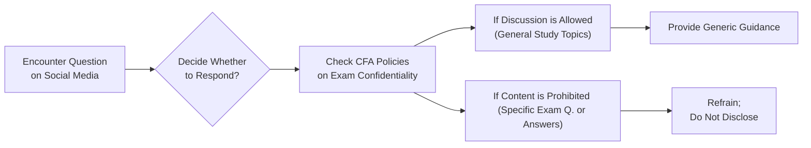

## Overview

Standard VII in the CFA Institute Code of Ethics and Standards of Professional Conduct sets the tone for how CFA Institute members and candidates should behave as representatives of the organization and the profession. By adhering to Standard VII, you demonstrate your commitment to the integrity of the CFA designation and the personal responsibility that comes with it. It’s not just about letters after your name—it's about living up to a global standard of professionalism, even when no one is watching.

Below, we’ll explore how this standard applies in practice. We’ll get into the nitty-gritty details around exam confidentiality, correct usage of the CFA marks, and the overarching duty to preserve the reputation of the investment profession. Along the way, you’ll see a few personal stories, some do’s and don’ts for daily practice, and a handful of real-life scenarios to help tie things together.

## Conduct as Participants in CFA Institute Programs

### Understanding the Core Requirements

Standard VII states that CFA Institute members and candidates must not engage in any conduct that compromises the integrity or validity of the CFA Program. In simpler terms: keep the exam content confidential, and follow all relevant policies and procedures set out by CFA Institute.

Let’s be real. The pressure to do well on the CFA exams can be intense. It can be tempting to share a few “hints” from your test experience. But remember, that step can have major consequences—not only for you, but also for the entire CFA community. Violations in this area not only result in disciplinary actions but also undermine trust in the designation.

Key obligations:
• Maintain strict confidentiality about the actual exam questions.  
• Avoid communicating with others about ongoing or future exam topics, whether in-person or on social media.  
• Represent your status truthfully (e.g., “Level II Candidate in the CFA Program” if you have passed Level I and registered for Level II).  
• Follow official candidate pledges and policies to ensure the program’s integrity.

### Avoiding Pitfalls

One of the most common pitfalls is failing to understand the boundaries of what can be discussed publicly or in a study group. Yes, it’s perfectly acceptable to study exam-relevant topics together, but it is not acceptable to cite actual exam items or to reconstruct them after the exam.

On social media in particular, a simple “I saw a question about X” post might not seem like a big deal. But, honestly, it’s a slippery slope. Short messages can be taken out of context, repeated, and amplified, eventually morphing into widespread unauthorized disclosures.

### A Quick Anecdote

I remember back when I was juggling preparing for the exam and also coaching a few friends who were new to the CFA journey. I nearly slipped up and said something like, “Oh, watch out for that question on currency triangles from last year’s morning session—” but I caught myself halfway through. The relief? Immense. Because that one fleeting comment could have snowballed into a major ethics violation. Always best to keep the exam details strictly to yourself.

## Reference to CFA Institute, the CFA Designation, and the CFA Program

### Proper Usage of the CFA Marks

According to Standard VII, the way you reference your CFA status and the Institute matters a lot. This is partly about avoiding confusion among clients, employers, or the general public about your qualifications.

• If you’ve completed the program and have been awarded the charter, you can say, “John Smith, CFA” or “I am a CFA charterholder.”  
• If you’re still in the exam process, clarify it accurately, such as “I am a Level III Candidate in the CFA Program.”  
• Avoid altering the marks by adding extra letters or punctuation.  

Always follow the CFA Institute Trademark Use Guide for the most current guidance. For instance, you cannot say “I’m a top CFA analyst.” That suggests that CFA is a job description or a measure of skill superior to others, rather than a professional credential.

### Avoiding Misrepresentation

Misrepresentation is a surefire way to breach Standard VII. Whether it’s inflated language in your LinkedIn profile (“I have the highest CFA distinction in the state!”) or a sneaky resume bullet point that obscures your candidate status (“Completed all exams” without clarifying you might still have other requirements to fulfill), dishonest statements can damage your credibility—and the prestige of the designation overall.

Here’s a small table showing correct versus incorrect references to your CFA status:

| Status                       | Correct Usage                                     | Incorrect Usage                                     |
|------------------------------|----------------------------------------------------|------------------------------------------------------|
| CFA Charterholder            | “Marie Lopez, CFA”                                | “Marie Lopez, Chartered Financial Analyst (CFA)”     |
| Level II Candidate           | “Level II Candidate in the CFA Program”           | “CFA Level II” (implies partial or near completion) |
| Non-member who passed Level I| “Passed Level I of the CFA Program”               | “CFA I” or “CFA Charter pending”                    |

Following these guidelines helps keep you on the right side of Standard VII and ensures respect for the designation.

## Practical Implementation Tips

• Double-check your professional profiles: On LinkedIn, your email signature, or any public business profile, confirm you’re representing your CFA status exactly as instructed by CFA Institute.  
• Think twice before discussing exam content: If a friend or colleague asks about exam specifics, pivot the discussion to general study advice. Trust me, the last thing you need is an ethics investigation.  
• Maintain professionalism in study groups: Let group participants know that reconstruction of actual exam questions is off-limits, and if the conversation shifts in that direction, be the voice of reason.  

Below is a simple Mermaid diagram illustrating the flow of ethical decision-making around Standard VII compliance:

This diagram might look obvious, but you’d be surprised how many times we just rush forward and type out a reply without pausing to remember our ethical responsibilities.

## Exam Confidentiality and Why It Matters

Exam confidentiality is a key component of Standard VII. By safeguarding the content of CFA exams, we help to ensure a level playing field and preserve the value of the designation. When candidates share even minor details about exam content, it undermines the credibility and fairness for everyone.

The CFA Institute invests heavily in creating robust, fair, and challenging exams. Compromising exam confidentiality damages not only your individual standing in the program but also the global reputation that thousands of professionals have worked hard to build.

## Maintaining the Reputation of the CFA Institute

### Upholding Professionalism

As a CFA Institute member or candidate, you stand for something larger than yourself—an ideal of trust, competence, and ethical conduct in finance. Whether you’re at a conference, networking event, or doing your day-to-day job, the way you conduct yourself reflects on the entire organization. Sound dramatic? Maybe. But it’s true. Clients, colleagues, and the broader public often look to CFA charterholders and candidates as models of integrity.

### Avoiding Detrimental Conduct

What if you see or suspect unethical behavior among your peers? Let’s say a coworker brags about “tips” they got from last year’s exam, or perhaps an acquaintance from your local CFA society claims to be a charterholder when they’re not. Standard VII effectively directs you to take action—whether it’s informing them of the rules, reporting the conduct to CFA Institute, or at least distancing yourself from that violation.

## Common Challenges and Strategies to Overcome Them

• Confusion Over Branding Rules: Keep a copy of the CFA Institute Trademark Use Guide handy so you can confirm the correct usage of the CFA marks.  
• Properly Disclosing Your Ongoing Candidacy: If you paused your participation in the program or are waiting for official results, do not imply that you hold the credential.  
• Monitoring Social Media Interactions: Group chats, LinkedIn posts, or even casual Slack messages can blur lines quickly. If in doubt, don’t post.  

## Case Study: The Social Media Overshare

Edgar is a Level III Candidate who just took the exam. He aced it, or so he thinks, and shares on social media: “Wow, I’m so glad I studied the intricacies of free cash flow valuations. They definitely tested that big time!” This post, while it might read as a harmless “I did it!” moment, unfortunately discloses exam content by referencing a specific topic tested. Edgar has violated Standard VII by revealing something that was on the exam. Even if the mention is vague, it still provides information about the exam’s content.

Potential consequences? A formal investigation, possible disqualification, or even a suspension from the program. That momentary excitement can have long-lasting repercussions. The safe approach? Keep your victory post generic: “Took the exam! Fingers crossed for results!”

## Glossary

• CFA Charterholder: An investment professional who has passed all three levels of the CFA Program, satisfied the work experience requirement, and earned the right to use the CFA designation.  
• Professional Misrepresentation: Any false or misleading claim about credentials, qualifications, or professional achievements that can lead to disciplinary actions.  
• Exam Confidentiality: The requirement to keep exam details private, including specific questions and tested topics.

## Final Exam Relevance

On your actual CFA exam, Standard VII can pop up in scenario-based ethics questions. You might face a hypothetical situation about posting exam details online or misrepresenting your qualification to a potential client. The question will test your understanding of how to properly handle these ethical dilemmas. The best way to prepare? Keep these guidelines in your daily routine so that your answers reflect real-life ethical practice—rather than just memorized bullet points.

## Tips for Constructed Response and Item Set Questions

• Read the scenario carefully: Look for clues about whether an individual misrepresented their status or disclosed confidential exam content.  
• Link back to the standard: Cite Standard VII and describe the correct course of action.  
• Be concise and precise: Clearly explain why an action violates the standard and how it should be rectified.  

## References and Further Reading

• CFA Institute Official Website: Candidate resources and member guidelines:  
  https://www.cfainstitute.org

• CFA Institute Trademark Use Guide:  
  https://www.cfainstitute.org/en/ethics-standards/trademark-use-guide

• Ethics-Focused Articles in the CFA Institute Financial Analysts Journal  
• Additional chapters in this volume:  
  – Standard I – Professionalism  
  – Standard II – Integrity of Capital Markets  
  – Standard III – Duties to Clients

---

## Test Your Knowledge: Responsibilities of CFA Members and Candidates



### Which of the following is the best example of adhering to Standard VII on exam confidentiality?

- [ ] Sharing detailed exam questions with your study group for collective analysis after the exam.
- [ ] Posting a short summary of possible topics that appeared on the exam in an online forum.
- [ ] Sharing your personal guess as to which item set was hardest and easiest on a public blog.
- [x] Discussing your general experience with the exam without referring to specific questions or content areas.

> **Explanation:** Standard VII forbids revealing confidential exam information. The correct approach is to keep any disclosures generic, avoiding exact questions and content details.

### A candidate who passed Level II claims on their resume that they are “on track to be a CFA charterholder by June.” Which best describes this situation?

- [ ] Proper usage of the CFA designation.
- [x] Misrepresentation of candidacy status and outcome.
- [ ] Correct phrasing of candidate status.
- [ ] No violation, since the candidate is still in the CFA Program.

> **Explanation:** Claiming “on track” implies an outcome that hasn’t yet occurred and inflates the candidate’s standing. This is misleading and violates Standard VII.

### Tom, a Level III Candidate, writes on his LinkedIn: “Tom Smith, CFA Level III.” Is this usage acceptable?

- [ ] Yes, because he has already passed Levels I and II.
- [ ] Yes, if he is currently registered for the Level III exam.
- [x] No, because it may imply that he holds the CFA charter already.
- [ ] No, because referencing the CFA Program on LinkedIn is never allowed.

> **Explanation:** The correct reference would be “Level III Candidate in the CFA Program.” Tom’s usage may be perceived as implying he is a charterholder, violating Standard VII.

### A co-worker tells you she had an “inside track” on the most likely essay questions for an upcoming CFA exam. What should you do first?

- [ ] Spread the tip around the office.
- [x] Remind her about the ethical obligations from Standard VII.
- [ ] Ask her for the specifics to confirm accuracy.
- [ ] Do nothing; it’s none of your concern.

> **Explanation:** The best step is to remind your colleague of the ethical guidelines so they can correct their behavior and avoid potential violations.

### Which of the following actions helps uphold the reputation of the CFA Institute?

- [x] Accurately stating your candidate status on all professional profiles
- [ ] Exaggerating your achievements to impress clients
- [x] Maintaining the confidentiality of any exam content you have seen
- [ ] Signing up to take multiple levels of the CFA exam simultaneously

> **Explanation:** Accurately stating your status and keeping exam details confidential adhere to Standard VII. Misrepresentation of achievements erodes trust.

### If you have paused your participation in the CFA Program, how should you represent your credential status?

- [x] State accurately that you passed specific levels or that you are not currently enrolled.
- [ ] List “CFA (Inactive).”
- [ ] Use “CFA Charter Loss” since you’re no longer active.
- [ ] Hide any mention of the CFA Program entirely.

> **Explanation:** You should never misrepresent your participation. Clearly explain your progress without implying ongoing candidacy or active charterholdership.

### What is the primary reason exam confidentiality is vital under Standard VII?

- [x] To ensure a fair and equal testing environment for all candidates
- [ ] To keep exam questions mysterious and attract more candidates
- [x] To protect the global reputation and integrity of the program
- [ ] Because CFA Institute does not want feedback on exam style or difficulty

> **Explanation:** Maintaining exam confidentiality helps preserve fairness and the global credibility of the CFA designation.

### Which is an example of proper reference to the CFA designation by a charterholder?

- [x] Sarah Williams, CFA
- [ ] Sarah Williams, CFAnalyst
- [ ] Sarah Williams, Chartered Financial Analyst® (CFA®)
- [ ] Sarah C. Williams, Certified Financial Analyst

> **Explanation:** Correct usage follows “Name, CFA.” Inserting “Chartered Financial Analyst” as a degree or job title is improper usage.

### After sitting for the exam, you mention to a friend that “an entire portion of the test seemed to focus on yield curve strategies.” Does this comply with Standard VII?

- [ ] Yes, because you didn’t reveal specific questions or formulas.
- [ ] Yes, because you are only confirming broad topic coverage.
- [ ] No, because yield curve strategies are not relevant to the CFA exam.
- [x] No, because you are disclosing actual exam content and focus areas.

> **Explanation:** Disclosing broad content focus is still revealing part of the exam’s specifics and violates exam confidentiality rules.

### True or False: It is acceptable to use the CFA designation as a noun (e.g., “I am a CFA”) since it is a recognized credential.

- [x] True
- [ ] False

> **Explanation:** This is actually a nuanced point. Historically, the CFA Institute discouraged using “CFA” as a noun (e.g., “I’m a CFA”), yet recognized that common usage evolves. Per the most recent guidance, “Charterholder” remains the preferred usage, but “I am a CFA” is less frequently cited as a strict violation if used informally. However, the best practice remains using “CFA charterholder.” If in doubt, adhere to the formal guidelines.


