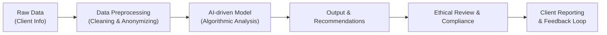

## Introduction
Technological innovations have always shaped and reshaped the investment profession. But lately—thanks to big data, rapid machine learning breakthroughs, and global connectivity—these tech-driven changes are hitting warp speed. It’s not just about equations and fancy algorithms anymore; it’s about integrating these advances ethically and responsibly. Whether you’re crunching billions of data points daily or guiding a small group of clients with a new AI-based tool, you should be mindful of how Standards I–VII still serve as your ethical compass. 

At times, I’ve found myself marveling at how quickly these transformations happen. One day you’re performing fundamental analysis in spreadsheets; the next, you’re reading machine-generated insights that comb through thousands of quarterly filings at once. And while that’s undeniably exciting, it also poses brand-new challenges regarding data privacy, algorithmic bias, and overall transparency. The ultimate question is: How do we stick to the timeless ethical principles from our CFA Code and Standards, even when everything around us is changing?

## Embracing the Evolving Tech Landscape
Investors, clients, and even regulators are all riding the wave of digital transformation. In finance, that could mean real-time portfolio updates on blockchain-based platforms, or advanced analytics that instantly sift through social media sentiment to predict price movements. It’s no wonder we need to adapt and refine our ethical standards.

But let’s be real: Just because something is new and glitzy doesn’t mean the fundamentals of integrity and trust are any less important. In fact, the speed and scale of data-driven decisions can multiply the consequences of a single ethical slip. So, if you find yourself implementing advanced data pipelines or adopting a new algorithmic model, you’ll want to ensure each step aligns with core best practices under Standards I–VII. 

## Data Security and Privacy
One of the biggest concerns in our high-tech world is, “Where is all my data going?” Because let’s face it, in modern finance we generate—and store—vast amounts of personal and financial information. Cloud-based analytics, client portals, and AI-driven recommendations rely heavily on data flows that are vulnerable to leaks or misuse.

### Protecting Confidential Information
Under Standard III (Duties to Clients: Preservation of Confidentiality), you must secure client data at every point in its lifecycle. But now, that’s easier said than done. Clients share documents digitally, staff members collaborate remotely, and AI models might store or process sensitive data in offsite servers. Whenever you roll out new tech solutions, it’s crucial to:

• Use strong encryption for data at rest and in transit.  
• Restrict access to sensitive information via robust user permissions.  
• Train your team to recognize phishing or social engineering attempts.  

In my early days implementing a cloud platform for portfolio analytics, I learned the hard way that not everyone on the project team needed full administrator rights. Turns out, safeguarding data is about limiting needless access as much as it’s about fancy cybersecurity tools.

### Compliance with Data Privacy Regulations
Depending on your region, regulations like Europe’s GDPR or the California Consumer Privacy Act (CCPA) might define how your firm can collect, store, and handle personal data. Even if you’re not based in these jurisdictions, cross-border regulations could apply if you have clients there. Standard I (Professionalism) demands knowledge of and compliance with relevant laws. This includes:

• Using only ethically and legally sourced client data.  
• Having clear data retention and deletion policies.  
• Providing transparent disclosures on how data is used.  

And remember, disclaimers or disclosures are not a free pass. If your data collection practices stray from local regulations, you can’t just fix that by putting up a webpage banner.

## Algorithmic Bias and Transparency
With the multitude of AI-driven tools in finance—ranging from algorithmic trading bots to risk-scoring models—there’s an increasing risk of hidden biases creeping into the decision-making process. Nobody wants an algorithm that inadvertently discriminates against certain categories of clients, or yields systematically skewed investment recommendations.

### Understanding Where Bias Emerges
Bias can stem from how the data sets are created, how the model is trained, or how it’s validated. If the underlying data leaves out entire segments of the market, your AI might make false assumptions or produce misleading signals. The same goes for automatically generated research: if the algorithm prioritizes short-term volatility over fundamental value, you could end up ignoring stable long-term holdings.

Under Standard V (Investment Analysis, Recommendations, and Actions), the guidance requires reasonable basis and thoroughness in investment recommendations. That means testing your models for accuracy, representativeness, and fairness. Don’t just trust the black box because it’s sophisticated. Ask your IT team or third-party vendor questions like:

• How is this model trained and validated?  
• Which biases might exist in the dataset?  
• What data cleaning or transformations are applied?  

### Documenting the Technology
Think of Standard I (Professionalism): it’s not just about abiding by the law; it’s about setting a tone of integrity. If you’re using technology that significantly influences client outcomes, whether it’s an algorithmic trading system or a risk-scoring AI, be transparent. Document model limitations and assumptions in plain language. Make the methodology available—within reason—to clients or stakeholders who request more details. 

## AI-Powered Research
AI-driven research can be a game-changer. You can analyze reams of data—10-Ks, press releases, market sentiment—faster than any human could. But with great power comes great responsibility (forgive the cliché, but it’s so relevant here).

### Verifying Sources and Information
Standards II and III revolve around integrity, especially concerning material nonpublic information. If your AI is scraping unusual data sources, you’d better ensure they aren’t inadvertently collecting insider info or violating someone’s IP rights. You may need to verify your data feed to confirm it’s publicly available and free of confidentiality breaches. 

I once saw a small investment shop ingest rumored M&A data from a questionable forum. The AI flagged a “sure-thing buy,” but the source was potentially confidential information leaked. That’s a huge no-no under the Code. Always consider how your data was obtained, and double-check your technology vendors’ compliance with regulations.

### Cross-Referencing AI Outputs
Even if your model is top-notch, Standard V still applies: you must conduct due diligence. AI outputs are means, not ends. Always cross-reference your model’s signals with fundamental analysis or external validation. If the machine learning model says a security is undervalued, can you confirm it by checking, say, recent financial statements or consistent underwriting metrics?

## Virtual Communication and Remote Work
After significant global shifts—including the move to remote work—virtual communication has become integral. Meetings with clients, research discussions, and even compliance check-ins often happen via video conferences. 

### Ensuring Confidentiality in Remote Settings
While remote setups are convenient, they can increase confidentiality risks. Maybe your employee is working from a shared space. Or you’re on a video call without a secure connection. Under Standard III (Duties to Clients), protect client interactions by:

• Using encrypted communication tools.  
• Setting guidelines for remote participation (e.g., use of headsets, private areas).  
• Avoiding display or discussion of confidential information in public spaces.  

### Professional Conduct in Online Interactions
We sometimes forget that Standard I also covers social media and digital communication. In a remote environment, the lines between personal and professional can blur. Resist the urge to casually share investment opinions in group chats that might be accessible to non-authorized persons. Keep your professional tone, even if you’re in gym clothes on a Zoom call.

## Integrating Standards I–VII with Technology
Let’s briefly link these emerging tech issues to the existing Standards:

- Standard I (Professionalism): Stresses legal and regulatory compliance. If you’re implementing AI or big data tools, ensures your approach doesn’t violate any securities laws or data privacy regulations.  
- Standard II (Integrity of Capital Markets): Prohibits the use of nonpublic material information. AI can be a magnet for data that might slip through the cracks or come from questionable sources.  
- Standard III (Duties to Clients): Reminds you to preserve confidentiality, maintain loyalty and fair treatment. Does your fancy fintech platform handle all clients with the same level of care and security?  
- Standard IV (Duties to Employers): With remote work, your employer might have new policies about data usage and intellectual property. Clarify your responsibilities.  
- Standard V (Investment Analysis, Recommendations, and Actions): Focuses on thoroughness, reasonable basis. That’s a direct fit for ensuring AI-driven insights are robust, combining multiple perspectives rather than blindly trusting an algorithm.  
- Standard VI (Conflicts of Interest): Automated strategies might privilege certain clients or products. Evaluate fee structures or reimbursements if your technology inadvertently benefits some investors over others.  
- Standard VII (Responsibilities as a CFA Institute Member or CFA Candidate): Ties everything together. Whether you’re building next-gen models or simply using them, your professional standing requires that you continually update your knowledge to meet ethical obligations.

## Practical Implementation Strategies
Implementation can be daunting, but here are a few tips to keep your processes aligned with best practices:

### Regular Audits and Assessments
• Conduct technology audits at least once a year (or more often if you can) to evaluate data flows, security protocols, and model performance.  
• Engage external experts to test your systems for vulnerabilities.  

### Targeted Training and Collaboration
• Offer ongoing training sessions to staff on identifying algorithmic biases and data privacy red flags.  
• Encourage collaboration between compliance personnel, IT professionals, and portfolio managers—everyone needs to be on the same page.  

### Documentation and Policies
• Maintain written guidelines on how AI-based recommendations are generated, how data is cleansed, and who has final approval authority.  
• Spell out roles and responsibilities in your compliance manuals so it’s clear who reviews data sources, who monitors performance, and who decides if a system is still valid.  

## Common Pitfalls and How to Avoid Them
1. Relying Too Heavily on Automation  
   • Some folks trust black-box models blindly. Always keep a human “sanity check” in the loop.  

2. Underestimating Data Security Risks  
   • Storing large volumes of sensitive data in the cloud is great for accessibility—until a breach occurs. Ensure encryption, restricted access, and secure backups.  

3. Lack of Transparency in Model Decisions  
   • If clients or regulators ask, you must be able to articulate your model’s logic. Black boxes that no one understands are a recipe for compliance nightmares.  

4. Ignoring Geographic Regulatory Differences  
   • A single technology solution might be used across multiple offices worldwide. Data privacy requirements differ by region; ignoring local rules can lead to major fines or even losing your license to operate.  

## Short Case Study: Biased Robo-Advisory
Imagine a mid-sized bank implements a robo-advisory platform that uses machine learning to guide clients’ retirement planning. Over time, the bank notices that clients in certain regions are recommended lower-risk portfolios than those in more affluent areas—even though their financial situations are similar. A deeper investigation reveals that the training data was skewed toward certain demographics and failed to represent the broader client base adequately.

Conclusion? The bank had to retrain the algorithm with more diverse data. It also adjusted its research process, ensuring a group of data scientists and compliance officers spot-checked for biased recommendations. This process, while costly, shows the importance of periodic reviews and realigning tech solutions with Standards III and V (fair treatment and robust investment analysis).

## Visualizing Ethical AI Implementation
Below is a simplified flowchart illustrating how an AI-based investment model can integrate ethical checks throughout the development and deployment process:

1. Gather raw data, ensuring it’s lawfully obtained and does not contain nonpublic info.  
2. Clean and anonymize data to preserve confidentiality.  
3. Feed data into the AI model for analysis.  
4. Generate recommendations, but always subject them to an ethical review.  
5. Provide transparent reporting to clients, and capture feedback to refine the model.

## Final Exam Tips
1. Use Case-Based Reasoning in Essay Questions: Expect scenario-based prompts where you must assess the ethics of adopting AI or big data analytics. Cite relevant Standards (I–VII) and highlight how you’d ensure compliance.  
2. Don’t Overlook Cross-Border Examples: You might see questions involving international data privacy laws or references to GDPR. Show your understanding of local versus global frameworks.  
3. Emphasize Risk Management: In item sets, you could be asked about risk oversight for algorithmic trading or data security. Discuss all potential angles—bias, data leaks, compliance.  
4. Time Management in Multi-Part Items: If the question has multiple sub-questions about technology usage, break them down quickly and allocate time proportionately.  
5. Support Your Statements: Always back up claims with references to the Standards or real compliance principles.  

## Glossary
• Artificial Intelligence (AI): Computer systems that can perform tasks necessitating human-like intelligence, such as learning from data or pattern recognition.  
• Algorithmic Trading: Automated trade execution based on set rules or models, often used to reduce human error and exploit speed advantages.  
• Data Privacy Regulations: Legal frameworks (e.g., GDPR) specifying how personal and sensitive data must be collected, processed, and stored.  
• Digital Transformation: Broad shift toward integrating new technologies into business processes, including finance and investment management.  

## References
• “Fintech and Ethics” section on the CFA Institute’s website  
• Kearns, M. & Roth, A. (2019). “The Ethical Algorithm: The Science of Socially Aware Algorithm Design.” Oxford University Press.  
• IEEE Computer Society. (computer.org) Articles on best practices in data security and AI governance  

## Test Your Knowledge: Ethical Integration of Tech in Finance



### Which Standard primarily addresses the obligation to protect the confidentiality of client data in a tech-driven environment?

- [ ] Standard I (Professionalism)
- [ ] Standard II (Integrity of Capital Markets)
- [x] Standard III (Duties to Clients)
- [ ] Standard VII (Responsibilities as a CFA Institute Member or CFA Candidate)

> **Explanation:** Standard III requires financial professionals to preserve the confidentiality of client data. This extends to the digital sphere, where data protection and secure handling of information are crucial.

### In algorithmic trading, one potential pitfall is that the model could inadvertently use sensitive data. Which Standard is most relevant to ensuring no nonpublic material information is used?

- [ ] Standard III (Duties to Clients)
- [x] Standard II (Integrity of Capital Markets)
- [ ] Standard IV (Duties to Employers)
- [ ] Standard VII (Responsibilities as a CFA Institute Member)

> **Explanation:** Standard II focuses on avoiding material nonpublic information. Automated trading systems must be designed and monitored so that no insider data is improperly accessed or traded upon.

### When implementing AI-driven models for investment analysis, which of the following steps is MOST aligned with ensuring a “reasonable basis” for recommendations under Standard V?

- [ ] Blindly trusting the model’s output to save time
- [ ] Keeping the model’s parameters secret, even within the firm
- [x] Performing due diligence on data quality and model assumptions
- [ ] Delegating all oversight to a technology vendor

> **Explanation:** Standard V requires investment professionals to have a reasonable basis for their recommendations. Conducting thorough checks on data integrity and vetting model assumptions remain essential.

### A firm’s AI-based tool inadvertently discriminates against certain client demographics due to skewed training data. Which best practice can help prevent such biases?

- [x] Regularly retraining the AI with more diverse datasets
- [ ] Limiting system updates to once a year
- [ ] Completely removing human input from the AI
- [ ] Using only short-term performance data

> **Explanation:** Training the AI on balanced, diverse data helps reduce bias. Frequent audits and updates are necessary to mitigate unintended discriminatory effects.

### Which Standard helps ensure that an investment professional complies with applicable local and international data privacy regulations?

- [x] Standard I (Professionalism)
- [ ] Standard III (Duties to Clients)
- [ ] Standard VI (Conflicts of Interest)
- [ ] Standard VII (Responsibilities as a CFA Institute Member)

> **Explanation:** Standard I (Professionalism) requires members to comply with legal and regulatory requirements in all circumstances, including data privacy laws such as GDPR.

### Under Standard III, which practical measure can you take to protect client confidentiality during remote work?

- [ ] Share confidential info on an open Wi-Fi network
- [x] Use encrypted video conferencing tools and private workspaces
- [ ] Outsource client communications to an unvetted third party
- [ ] Encourage employees to store client data on personal devices

> **Explanation:** Standard III means preserving confidentiality in all environments, including home offices or remote settings. Using secure, encrypted channels is critical.

### Suppose your AI-driven research tool flags a potential insider tip from a random online forum. According to Standard II, what is the best immediate course of action?

- [x] Pause or investigate the data source to ensure it’s not material nonpublic info
- [ ] Immediately place trades to capture alpha
- [x] Notify compliance only if the tip leads to outsized gains
- [ ] Ignore it entirely

> **Explanation:** Members must investigate suspicious or potentially nonpublic data sources before trading. Rushing into trades without verifying the legitimacy and legality of information could violate Standard II.

### A new robo-advisor systematically recommends lower-risk portfolios to all clients, ignoring individual preferences. This could violate Standard V because:

- [ ] It uses advanced technology.
- [ ] It outperforms traditional advisors.
- [x] It lacks a reasonable basis and does not consider client-specific circumstances.
- [ ] It does not store client data in the cloud.

> **Explanation:** Standard V requires a reasonable basis for recommendations and client-specific consideration. Blanket allocations without regard for individual needs fall short of that requirement.

### Which collaboration is essential to ensure AI-based systems meet ethical and regulatory standards?

- [ ] Marketing and Public Relations teams only
- [ ] Traders and external hedge fund managers only
- [ ] HR and external auditors only
- [x] Compliance, IT, and investment managers working together

> **Explanation:** Effective oversight requires technical professionals (IT), compliance staff, and investment managers to communicate, ensuring that technology deployments align with regulatory and ethical standards.

### True or False: The CFA Standards become less relevant as we adopt cutting-edge AI and automation in investment processes.

- [x] True
- [ ] False

> **Explanation:** Tricky question! Actually, the statement is FALSE. The CFA Standards do not become less relevant; they become more critical. Ensuring ethical and professional conduct is paramount as technology advances, because mistakes can have amplified impacts.


