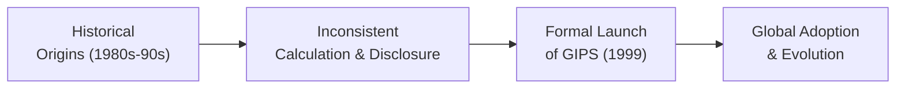

## Introduction and Background

It’s funny—when I first heard about the Global Investment Performance Standards (GIPS), I thought: “This might be another set of guidelines that’ll come and go.” But I sure was wrong. GIPS has become a linchpin in how investment managers around the world present their performance results. Why has it become so central? Because, quite frankly, we need a globally accepted framework to ensure performance data is both accurate and comparable. Before GIPS, we had a hodgepodge of methods for calculating returns, leaving everyone guessing who was really doing the right thing.

GIPS is maintained by the CFA Institute and is all about fairness, consistency, and full disclosure when presenting investment performance. This fosters trust—something absolutely crucial in the investment profession, especially when we’re talking cross-border or multi-asset investments. After all, investors don’t just want to see good numbers; they want to know those numbers are legit.

## Origins in the 1980s and 1990s

Let’s travel back to the 1980s and 1990s. Picture it: the investment industry was growing rapidly, more people were investing overseas, and technologies supporting performance reporting were evolving at high speed. Yet there was no universal standard. Asset managers used different formulas and ways of including (or excluding) fees, taxes, and currency conversions. If you asked for “annualized performance” in one corner of the globe, you got one formula; in another region, it was a different formula. It was kind of like letting everyone make up the rules of a game as they went along. Confusion was bound to happen.

A big wake-up call came from global conferences in the investment management world, where participants realized that if performance presentations weren’t credible or consistent, trust would erode. Different approaches to time-weighted returns, internal rates of return, or handling of cash flows meant results could vary widely—even though you might be looking at essentially the same portfolio performance.

The Association for Investment Management and Research (AIMR), which later became part of the CFA Institute, recognized the problem. They introduced the Performance Presentation Standards (AIMR-PPS) in the early to mid-1990s, laying the local foundation for what would soon become a global solution. By 1999, the first versions of the Global Investment Performance Standards were published, aiming to unify these concepts worldwide.

## Why Standardization Was Needed

Imagine you’re an investor comparing two managers. Manager A claims a 12% annual return, and Manager B claims 13%. Which is better? Well, maybe Manager B includes additional risk or doesn’t account for particular fees or uses a different compounding convention. For an apples-to-apples comparison, we need the same calculation rules. GIPS set out to fix this:

• Inconsistent Calculation Methods: Before GIPS, one manager might have computed time-weighted returns differently—some used monthly, some used daily, some used a mixture of approaches.  
• Varying Levels of Disclosure: Managers might mention front-end fees in bury-the-details footnotes, or skip them entirely, or incorporate them in some non-standard way.  
• Lack of Comparability: Without standardized returns, you didn’t really know if Manager A was truly outperforming Manager B.

GIPS tackled these issues by building a framework for transparency and consistency. Compliance with GIPS forces managers to present returns and other key metrics in a standardized manner, so you know precisely how they got their numbers.

## Purpose and Scope

At its heart, GIPS is about fairness, transparency, and ethical practices. In more formal terms, GIPS provides:

• Fair Representation: This ensures the performance data is not overstated or understated. It’s about presenting historical returns in a way that’s consistent with the real risk-reward profile of the portfolio.  
• Full Disclosure: Firms must reveal all the relevant assumptions or methods they use (e.g., how they treat fees, taxes, or currency conversions). Nothing is tucked away in a suspicious footnote.  
• Standardization: By mandating consistent calculation methods (time-weighted vs. money-weighted returns, for instance), GIPS fosters uniformity in how performance is reported.  
• Comparability: Because the standards are global, an investor in Italy can compare a fund in Japan to one in Canada, confident that both are abiding by the same core rules.

Who must comply? Generally, investment management firms that want the GIPS “seal of approval” on their performance track records. Many institutional investors and wealth management clients even require that prospective asset managers be GIPS compliant before awarding mandates. Over time, large asset owners (pension funds, sovereign wealth funds, etc.) have also found GIPS useful for standardized performance measurement.

## Key Principles: Fair Representation and Full Disclosure

When we talk about “fair representation” in the context of GIPS, we’re addressing the principle that performance data shouldn’t be manipulated to exaggerate the performance story. For instance, some managers might have been tempted to “cherry-pick” their best portfolios to showcase success. GIPS, however, stipulates that all discretionary, fee-paying portfolios (with certain exceptions) must be included in appropriate composites. A composite is essentially a grouping of portfolios that have similar investment objectives or strategies.

“Full disclosure” is just as critical. Managers must present details on fee structures, the type of benchmarks they compare against, and how they treat currency translation. If they use a particular method to model transaction costs, that, too, should be disclosed. In other words, if anything might affect how an investor interprets the performance track record, it needs to be out in the open.  

## Historical Importance and Investor Confidence

You might ask: “Why did performance disclosure matter so much in cross-border investing contexts?” Well, imagine you’re a UK-based investor wanting to put money into a fund in Brazil. If that fund manager uses a performance calculation that lumps in or omits certain taxes, you might interpret returns incorrectly. With GIPS, both the UK investor and the Brazilian fund manager follow a shared set of rules. The result: more confidence, less friction, and hopefully fewer unfortunate surprises.

In times of market upheaval—say, during the 2008 financial crisis—transparency was even more valuable. When trust was at a premium, GIPS-based reporting helped address one of the biggest client concerns: “How do I know these returns reflect the actual risk you took and the methodology you used?” By reducing the risk of misrepresentation, GIPS built crucial bridges of trust during those tumultuous periods and beyond.

## Evolution and Global Reach

Since the original release in 1999, GIPS has evolved several times to address emerging asset classes (like hedge funds, private equity, real estate, and more recently, digital assets). In addition, the standards have recognized that technology plays a big role in data collection, performance calculations, and reporting automation. The GIPS Executive Committee at the CFA Institute periodically revises and updates these standards to reflect real-world challenges.

Today, thousands of firms around the world claim compliance. Some markets have been faster to embrace GIPS than others, but the general trend is towards broad acceptance, especially among the largest or most reputable institutions. Being GIPS-compliant is a signal that “we’re serious about presenting the numbers fairly.” It’s a global passport of credibility in many ways.

## Diagram: The GIPS Journey

Below is a simple Mermaid diagram illustrating the journey from fragmented performance methods to global trust under GIPS:

## Practical Examples and Case Studies

1. Comparing Two Global Equity Managers  
   Let’s say Global Equity Manager X (based in New York) reports annual returns of 11%, and Global Equity Manager Y (based in Singapore) reports 11.5%. Both track a global equity index. Pre-GIPS, you might be caught in the weeds: Is Manager Y’s result after fees? Are taxes included? Do these returns reflect daily time-weighted or monthly time-weighted returns? Under GIPS, that confusion is minimized, as both must follow standardized guidelines. As an investor, you can more confidently evaluate (11% vs. 11.5%) and consider other factors like risk tolerance or client service suitability.

2. Expanding into Emerging Markets  
   A US-based pension fund wants to invest in local Indonesian equities but has concerns about consistent reporting. An Indonesia-based investment manager that claims GIPS compliance can show standardized track records, including complete disclosures of fees and local tax implications. The pension fund sees that the manager’s performance track record is aligned with GIPS, easing cross-border trust and accelerating the due diligence process.

## Relevance for CFA Candidates and Finance Professionals

For anyone pursuing the CFA designation (and especially those preparing for the Level III exam), being well-versed in GIPS is a must. Not only are you tested on the main components of GIPS compliance, but in practical life, you’ll see clients or employers demand that you produce or evaluate GIPS-compliant reports.

From a broader career perspective, understanding the GIPS guidelines helps you:

• Evaluate investment managers more accurately, whether for personal investing or in a professional research capacity.  
• Provide guidance on whether your firm (or your client’s firm) is following best practices in performance reporting.  
• Guard against ethical violations—like misrepresenting past performance.  

Ultimately, GIPS knowledge aligns with the ethical foundation of the CFA Program, where trust and integrity in the capital markets are paramount.

## Best Practices, Common Pitfalls, and Strategies

• Keep Data Organized: GIPS requires robust record-keeping. If your systems are scattered, you’ll have a tough time generating GIPS-compliant reports. Investing in a centralized performance measurement system is a must.  
• Beware of Survivorship Bias: If a firm folds or merges with another, it can be tempting to drop that track record from composites. GIPS is explicit: you can’t just pretend those portfolios never existed.  
• Understand Composite Construction: Building composites properly is where many firms slip up. Portfolios must be grouped according to similar mandates, and new portfolios must be added in a timely manner.  
• Timely Updates: GIPS requires firms to show at least five years of GIPS-compliant performance (or since inception if shorter) and then additional annual performance up to a minimum of 10 years. That data has to be updated annually.  
• Evolving Guidance for Alternative Assets: Hedge funds, private equity, real estate, and more recently digital assets have specific GIPS provisions. Make sure you’re familiar with how to handle illiquidity, valuations, and fees for these instruments.

## Potential Challenges in Adoption

While GIPS is globally recognized, it’s not always easy to implement. If a firm has never kept detailed records, or if it operates across multiple regulatory jurisdictions, unifying and revising data to meet GIPS requirements can be time-consuming and costly. Moreover, staff need to be trained on the nuances—like categorizing portfolios accurately and calculating returns using daily or monthly valuations.

Yet the payoff is significant. Once GIPS-compliant, a firm can market itself on the global stage with a valuable seal of credibility. Institutions often make compliance a “must-have” item in their manager due diligence list.

## Future Outlook

As the investment landscape continues to evolve—hello, decentralized finance (DeFi) and digital assets—GIPS is expected to adapt. We’ll likely see more guidance on how to incorporate emerging asset classes and alternative trading environments into standardized performance reporting. Technology will also keep shaping the field. Automated systems that handle daily valuations, transaction-level data capture, and real-time analytics make compliance more feasible than ever, even for smaller firms.

## Exam Tips for CFA Level III Candidates

1. Read the Standards Thoroughly: GIPS has its own intricacies. Don’t rely only on summaries or hearsay.  
2. Understand Composite Rules: The exam often tests your ability to group portfolios or determine if a portfolio belongs in a given composite. Master that logic.  
3. Watch Out for Time-Weighted vs. Money-Weighted Return Distinctions: GIPS emphasizes time-weighted returns for most mainstream portfolios, but private equity might use IRR.  
4. Identify Common Violations: For instance, incomplete disclosures about fees or mislabeling composites.  
5. Practice Constructed-Response Questions: GIPS scenarios often appear in the essay portion. Show your work clearly—demonstrate not only knowledge of the standards but also how to apply them to real-life data sets.  
6. Refresh Ethics Principles: GIPS is closely tied to the CFA Code of Ethics and Standards of Professional Conduct. Linking both sets of guidelines often appears in item set questions.  
7. Budget Time for GIPS: Don’t leave it until the last minute. While it might be smaller relative to the entire exam content, it’s a distinct area you can master for a solid scoring edge.

## References

• CFA Institute. (2020). “Global Investment Performance Standards (GIPS).” Retrieved from  
  https://www.cfainstitute.org/en/ethics-standards/gips  

• Maginn, Tuttle, Pinto, & McLeavey. (2021). Managing Investment Portfolios: A Dynamic Process. CFA Institute Investment Series.  

• Bader, L. (2006). “The Bumpy Road to Performance Presentation Standards.” Journal of Performance Measurement.  

-------------------------

## Test Your Knowledge: GIPS Purpose, Scope, and Historical Context



### Which primary issue did the introduction of GIPS aim to address in the investment industry?
- [ ] Overly strict regulatory oversight by governments
- [ ] Excessive outsourcing of reporting to third parties
- [x] Inconsistent performance calculation and disclosure methodologies
- [ ] Lack of advanced portfolio optimization techniques

> **Explanation:** GIPS emerged to standardize performance calculation and disclosure, solving the confusion caused by multiple, non-uniform reporting practices across different firms and regions.

### According to GIPS, what is the main reason for grouping portfolios into composites?
- [ ] To conceal underperforming portfolios
- [ ] To increase the reported returns artificially
- [ ] To reduce disclosure requirements
- [x] To ensure performance is presented according to similar investment objectives and strategies

> **Explanation:** Composites ensure that portfolios with similar strategies or mandates are grouped together, enhancing consistency and comparability under the GIPS framework.

### Historically, how did GIPS impact cross-border investment relationships?
- [ ] It reduced investor confidence due to excessive complexities
- [x] It helped investors compare global managers more transparently
- [ ] It mandated lower management fees for international clients
- [ ] It prohibited non-compliant firms from managing foreign assets

> **Explanation:** GIPS brought uniformity in performance reporting, enabling investors from different regions to compare managers more effectively and build trust across borders.

### Which statement best describes the notion of "fair representation" in GIPS?
- [ ] Only highlighting performance of selected outperforming portfolios
- [x] Accurately representing returns without understating or overstating results
- [ ] Excluding fees from performance calculations to show a fair baseline
- [ ] Providing minimal disclosure to avoid overwhelming the investor

> **Explanation:** Fair representation means presenting accurate returns—neither inflated nor deflated—and ensuring that the performance data is complete and honest.

### What was the primary impetus for the creation of GIPS in the 1980s–1990s?
- [x] Widespread inconsistencies in performance calculations and reporting
- [ ] Global regulation forcing one universal method of calculation
- [ ] Significant technological barriers to accurate reporting
- [ ] Declining stock market volumes worldwide

> **Explanation:** The glaring differences in how returns were calculated, showing results that weren’t comparable across firms and regions, drove the creation of GIPS.

### How does GIPS promote the principle of "full disclosure"?
- [ ] By limiting required disclosures to benchmark comparisons
- [ ] By imposing secrecy requirements for certain investments
- [x] By requiring all relevant material facts, methods, and assumptions to be clearly provided
- [ ] By mandating minimal text in performance reports for brevity

> **Explanation:** Full disclosure in GIPS ensures that all the assumptions, fees, currency conversions, and other vital factors that influence performance are laid out for investors to see.

### Under GIPS, why is survivorship bias a concern?
- [x] It can inflate historical returns if only successful portfolios are included
- [ ] It underestimates the performance of defunct portfolios
- [ ] It leads to double counting of performance data
- [ ] It protects investors from unsuccessful fund managers

> **Explanation:** Firms must include portfolios that have closed or merged to avoid inaccurately boosting returns by only showing surviving, successful portfolios.

### Which asset classes have prompted GIPS to expand and refine its guidelines over time?
- [ ] Only equities and bonds
- [x] Hedge funds, private equity, real estate, and more recently digital assets
- [ ] Commodities alone
- [ ] Non-financial instruments like art and collectibles

> **Explanation:** GIPS continues to adapt to accommodate alternative and emerging asset classes, ensuring standardized approaches for each.

### Which of the following is a common implementation challenge for firms adopting GIPS?
- [ ] A global standard that is too simple to be practical
- [x] The need for extensive historical data collection and proper record-keeping
- [ ] Exclusive use of a single currency for all performance calculations
- [ ] Lack of composite construction guidelines

> **Explanation:** One of the biggest barriers is gathering consistent historical data, organizing it properly, and training staff to maintain GIPS compliance.

### True or False: GIPS compliance is mandated by international law, and firms have no choice but to comply.
- [ ] True
- [x] False

> **Explanation:** GIPS compliance is voluntary, but it is strongly encouraged and often required by sophisticated investors. While not enforced by law, many firms adopt it to enhance credibility and attract institutional clients.


