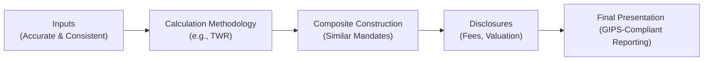

## Introduction

Have you ever walked into a meeting, excited to showcase your firm’s investment performance, and then realized there were a million different ways to slice and dice the same data? I’ve been there—believe me, it can get overwhelming. But that’s exactly where the Global Investment Performance Standards (GIPS) come to the rescue. GIPS was developed to ensure consistent, transparent, and comparable reporting of investment results around the world. 

In this section, we’ll explore the fundamentals of GIPS—highlighting the “why” and the “how” behind these globally recognized standards. We’ll talk about the nuts and bolts of GIPS—like time-weighted rates of return, composite construction, and disclosure requirements—and show how these concepts fit into an ethical and professional framework that promotes investor trust. So let’s roll up our sleeves and dive in.

## Core Principles of GIPS

Before we get into the weeds, let’s remember GIPS is primarily about enhancing trust. If you can’t trust an investment manager’s performance numbers—well, that’s going to be a problem. By adhering to GIPS, firms commit to calculating and presenting their historical performance in a way that’s both fair and consistent. Let’s break down the five main pillars of GIPS:

• Accurate Input Data  
• Calculation Methodology  
• Composite Construction  
• Disclosures  
• Risk and Performance Presentation

These pillars guide the entire performance-reporting process, from gathering price data to showing potential clients your final, polished track record. 

Below is a quick visual flowchart illustrating how these pillars connect:

### Accurate Input Data

Performance reporting is only as good as the data that goes into it. This is where maintaining proper accounting records becomes crucial. GIPS outlines requirements regarding:

• Valuation frequency  
• Trade-date accounting  
• Fair value measurement  

For instance, you can’t just wait until the end of the quarter (or year) to do a single valuation. GIPS generally requires monthly—and in some cases, daily—valuation frequencies to ensure a more accurate representation of a portfolio’s value over time.

#### Personal Anecdote

I remember early in my career, I used to joke, “If you throw bad data into a performance system, don’t be surprised when you end up with, well, nonsense.” And it was true. One small glitch in reconciling trades promptly (like forgetting that a trade dated December 31 was actually settled on January 2) could throw off an entire quarter’s performance. Thankfully, GIPS is crystal-clear about using trade-date accounting and fair value principles to reduce these headaches.

### Calculation Methodology (Time-Weighted Rate of Return)

Let’s talk about the bread and butter of GIPS: the time-weighted rate of return (TWR). Why does GIPS emphasize time-weighted returns? Because TWR effectively neutralizes the impact of cash flows (i.e., contributions or withdrawals from clients) so you can focus on the manager’s skill. External cash flows can easily distort performance calculations if not handled properly.

#### The TWR in Action

Time-weighted rate of return breaks a performance period into sub-periods that each start and end when there’s a cash flow. It calculates the return in each sub-period and then links these returns together. This method gives us a fair measurement of the portfolio manager’s investment performance without penalizing or benefiting them for timing or amount of client contributions and withdrawals.

From a formula perspective, a simplified version of the TWR for a portfolio with N sub-periods can be shown as:


\text{TWR} = \left(\prod_{i=1}^{N} (1 + r_i)\right)^{\frac{1}{N}} - 1


Where rᵢ is the return for sub-period i. This ensures the performance measure is focusing on investment decisions rather than cash flow timing.

### Composite Construction

After you’ve nailed down the calculation methodology, GIPS says you must group portfolios with similar strategies or investment mandates into composites. If a firm manages a variety of strategies—say large-cap growth, small-cap value, fixed income, etc.—they’ll create separate composites for each. 

Let’s say your firm manages 15 different global equity portfolios in the same style. Under GIPS, each of those portfolios belongs in the “Global Equity Composite.” The performance presented for that composite represents a weighted average of all those eligible portfolios, so it provides a fair and consistent snapshot of how that strategy is doing.

#### Ethical Underpinnings

If a manager conveniently excludes portfolios with poor performance from a composite—sometimes called “cherry-picking”—it distorts the composite level results. GIPS sets rules to prevent that. By including all relevant portfolios, you’re giving prospective clients a genuine representation of your track record, living up to the ethical ideals that GIPS embodies.

### Disclosures

Now, even the best performance calculations can be misleading if folks reading them don’t understand the context. That’s why disclosure is such a big deal in GIPS. Managers have to tell you:

• The fees they’ve deducted (gross vs. net performance)  
• Benchmark selection and changes  
• Currency and exchange rates used  
• Any material changes to a composite or significant events that might have affected performance  

The goal? Enable investors to properly interpret and compare investments. After all, you wouldn’t want to read a great performance number without realizing it’s net of some unusual rebates or gross of a high advisory fee.

### Presentations and Marketing

Let’s face it: great performance numbers aren’t merely for recordkeeping; they’re also super important for attracting prospective clients. Under GIPS, you must provide GIPS-compliant presentations to anyone who’s interested in your track record. GIPS compliance communicates: “Hey, you can trust these numbers. We followed a globally recognized standard, and we’re not hiding anything under the rug.” 

For prospective clients, GIPS compliance is like a seal of approval that your firm’s performance claims are legitimate. It bridges that trust gap and can definitely help you stand out from competitors who might show performance in less standardized ways.

## The Ethical Foundations of GIPS

GIPS isn’t just about math and methodology. It’s also about taking an ethical stand. Why? Because it boils down to giving investors performance data that’s complete, fair, and transparent. If your data is cherry-picked or if you’re using non-compliant shortcuts, that breaks trust with clients. 

We’ve all seen examples of firms using “hypothetical” track records or “backtested” data to make results look better. GIPS is designed to fight exactly that kind of misleading practice. By insisting on robust standards—like time-weighted returns, periodic updates, and comprehensive disclosures—GIPS helps ensure that performance figures truly reflect reality.

## Integrating GIPS With Other Standards

So how does GIPS fit in with existing accounting standards like IFRS (International Financial Reporting Standards) or local GAAP? Well, GIPS is primarily about calculating and reporting what your portfolio’s done, while IFRS or GAAP focus more on how you should measure and record assets and liabilities in your financial statements. In practice, GIPS uses the concept of “fair value” for portfolio valuation, aligning well with IFRS’s principle of marking assets to a realistic, market-derived value. 

A synergy arises when your firm is already comfortable with IFRS or GAAP principles—like regularly marking assets to fair value. Those same processes can feed into your GIPS-compliant performance reports. However, GIPS might require additional nuance like daily or monthly valuations, so the standard frequency set by IFRS or local GAAP might need adjusting.

## The Role of the GIPS Executive Committee

The GIPS Executive Committee is the group that stays on top of all these evolving market practices, from new asset classes (cryptocurrencies, anyone?) to changes in technology and global regulations. They periodically publish updates and guidance statements to ensure GIPS remains practical and relevant. 

For instance, if new regulations require heightened disclosure of transaction costs, the GIPS Executive Committee will incorporate these changes into the next edition of the standards. This is crucial in a fast-evolving industry—just think of the shift from monthly valuations to daily valuations that’s happening thanks to real-time technology.

## Putting It All Together: A Quick Case Study

Let’s say your firm, “ABC Asset Management,” manages a global equity strategy and a domestic fixed-income strategy. You want prospective clients to see how you’ve fared over the last five years:

1. You gather pricing data daily to ensure more accurate valuations.  
2. You calculate TWR to strip out the impact of clients adding or removing money.  
3. Each portfolio is automatically assigned to the proper composite (Global Equity Composite or Domestic Fixed-Income Composite).  
4. At the end of the quarter, you prepare a GIPS-compliant report that discloses net-of-fees performance, the benchmark index used, any significant events (like manager changes), and a compliance statement (“ABC Asset Management claims compliance with the Global Investment Performance Standards (GIPS)”).  
5. You share these reports with current clients and prospective clients who request them, ensuring consistent information across the board.

Implementing GIPS can take time—sometimes, a firm will spend months refining their data collection and performance measurement systems. But once it’s in place, the firm’s marketing and ethics credibility can get a nice boost. Plus, it fosters a sense of pride among the team. Everyone knows they’re telling the whole story, not just the flattering bits.

## Glossary

Time-Weighted Rate of Return (TWR):  
A calculation method that removes the impact of external cash flows and focuses on the manager’s investment decisions.

Fair Value:  
An asset’s value based on current market conditions, used to ensure that all valuations reflect realistic, arm’s-length prices.

Net-of-Fees vs. Gross-of-Fees Returns:  
• Net-of-Fees Returns: Performance after deducting management and other relevant fees.  
• Gross-of-Fees Returns: Performance before subtracting certain fees, but often net of transaction costs.

Compliance Plan:  
A structured approach to implementing (and often auditing) the policies and procedures required to meet GIPS. This might include specifying how to handle data errors, how often to update policies, etc.

Prospective Clients:  
Potential investors or clients who receive a GIPS-compliant performance presentation. They’re part of the audience you’re aiming to impress with consistent and accurate numbers.

Ethical Foundations:  
Moral and professional responsibilities that underscore GIPS, ensuring that performance reporting is honest, transparent, and beneficial to both clients and the marketplace.

## Best Practices, Common Pitfalls, and Final Thoughts

• Best Practices:  
  – Adopt trade-date accounting and fair value measurements across the board.  
  – Set up strict internal controls and regular audits to ensure your data stays accurate.  
  – Keep a thorough documentation of all calculation methodologies, assumptions, and disclosures.

• Common Pitfalls:  
  – Incorrect or incomplete inclusion of portfolios in their rightful composites (a prime cause of inflated or misleading results).  
  – Failing to properly handle large external cash flows in TWR calculations.  
  – Not disclosing vital details like significant fee structures or important changes in firm organization.

• Strategies to Overcome Issues:  
  – Develop robust compliance checklists to ensure you meet each GIPS requirement.  
  – Provide frequent training to everyone in the performance reporting chain—from portfolio managers to operations staff.  
  – Periodically undergo an external GIPS verification to further cement trust and credibility.

At the end of the day, measuring and reporting performance can be both a technical art and an ethical responsibility. My advice? Embrace GIPS. Once you have the right systems in place, you’ll likely find that the credibility you gain far outweighs the effort you’ve put in. 

## References for Further Exploration

• CFA Institute (2020). Global Investment Performance Standards (GIPS) Handbook.  
• Phillips, J. (2017). “Understanding Time-Weighted & Money-Weighted Returns.” CFA Institute Journal Review.  
• CFA Institute. “Ethics and Standards.” https://www.cfainstitute.org/en/ethics-standards  

Feel free to digest these resources for a deeper dive into GIPS guidance statements, case studies, and best practices. They’re rich materials that can help turn abstract concepts into practical applications.  

And with that, we’ve covered the basics of GIPS fundamentals. Good luck applying this knowledge—trust me, your future self (and your clients) will thank you for the clarity and credibility you’ll gain.

---

## Test Your Knowledge on GIPS Fundamentals



### Performance Calculations per GIPS
- [x] Must be based on time-weighted rates of return to remove the effects of external cash flows.
- [ ] Should always include any type of hypothetical or backtested data for demonstration.
- [ ] Can be restated arbitrarily if market conditions change.
- [ ] Rarely require daily or monthly valuation intervals.

> **Explanation:** GIPS emphasizes time-weighted rates of return so that performance reflects the manager’s investment decisions, unaffected by client cash flows.

### Composite Construction
- [x] Requires including all portfolios of a specific strategy in the respective composite.
- [ ] Allows the manager to exclude portfolios with subpar performance.
- [x] Must categorize portfolios based on similar investment mandates or objectives.
- [ ] Requires only annual performance reporting.

> **Explanation:** GIPS demands consistent composite construction by grouping all portfolios that share similar strategies; cherry-picking only the best portfolios would undermine GIPS standards.

### Net-of-Fees vs. Gross-of-Fees Returns
- [x] Net-of-fees performance shows returns after management fees, whereas gross-of-fees excludes at least some fees.
- [ ] Gross-of-fees performance always includes performance-based bonuses for the portfolio manager.
- [ ] Net-of-fees removes transaction costs but includes compliance costs.
- [ ] They are calculated identically, just labeled differently for marketing.

> **Explanation:** Net-of-fees returns subtract management fees, while gross-of-fees returns exclude certain fees so that prospective clients can see both the raw performance and what they might actually receive after fees.

### GIPS and IFRS Integration
- [x] GIPS leverages fair value concepts that align well with IFRS valuation requirements.
- [ ] GIPS is incompatible with IFRS standards, requiring separate records.
- [ ] IFRS never uses fair value for asset valuation.
- [ ] GIPS specifically prohibits the use of trade-date accounting.

> **Explanation:** Both GIPS and IFRS emphasize fair value, enabling consistent portfolio valuation. GIPS may require more frequent valuations but is not incompatible with IFRS.

### Benefits of GIPS Compliance
- [x] Enhances credibility and trust among prospective clients.
- [ ] Restricts firms from using any form of professional judgment in calculations.
- [x] Provides a standardized framework for performance measurement.
- [ ] Eliminates the possibility of disclosure errors.

> **Explanation:** GIPS fosters trust via standardized methods and transparent disclosures. It does not eliminate all judgment calls, but it sets essential guidelines to ensure consistency and fairness.

### The Role of the GIPS Executive Committee
- [x] Updates GIPS to reflect evolving market practices and new asset classes.
- [ ] Creates individual marketing presentations for asset management firms.
- [ ] Oversees every trade performed by GIPS-compliant firms.
- [ ] Eliminates the need for external audits of performance data.

> **Explanation:** The GIPS Executive Committee periodically revises and refines standards in response to changing industry conditions; it does not handle individual firm marketing or oversight directly.

### Ethical Underpinnings of GIPS
- [x] To ensure transparent, fair, and consistent performance reporting.
- [ ] To prohibit all forms of performance-based compensation.
- [x] To uphold client trust by avoiding cherry-picking or misrepresentations.
- [ ] To encourage only high-frequency trading strategies.

> **Explanation:** GIPS is fundamentally rooted in ethical disclosure and transparency, ensuring clients receive a fair view of a firm’s performance history.

### Valuation Frequency Requirements
- [x] GIPS typically expects at least monthly valuations, and more frequent if possible.
- [ ] Annual valuations are almost always sufficient for GIPS compliance.
- [ ] Fair value has been removed from GIPS standards.
- [ ] GIPS only applies to publicly traded securities portfolios.

> **Explanation:** Frequent valuations (daily, monthly, or as appropriate) align performance reporting with actual market conditions, promoting accuracy and consistency.

### Prospect Use of GIPS-Compliant Presentations
- [x] Prospective clients can request GIPS-compliant presentations to evaluate a firm’s track record.
- [ ] Presentations are only for current clients and cannot be shared externally.
- [ ] Managers may redact poor performance before showing results to prospective clients.
- [ ] GIPS compliance indicates no disclaimers of any kind are needed.

> **Explanation:** A GIPS-compliant presentation is a valuable marketing tool, enhancing transparency and credibility with prospective clients.

### True or False: GIPS Eliminates All Possibility of Manipulation
- [x] True
- [ ] False

> **Explanation:** This is a bit of a trick question. GIPS greatly reduces the likelihood of performance manipulation by enforcing strict standards and disclosures. While it doesn’t make manipulation impossible, it significantly raises the barriers, hence increasing transparency and trust.


