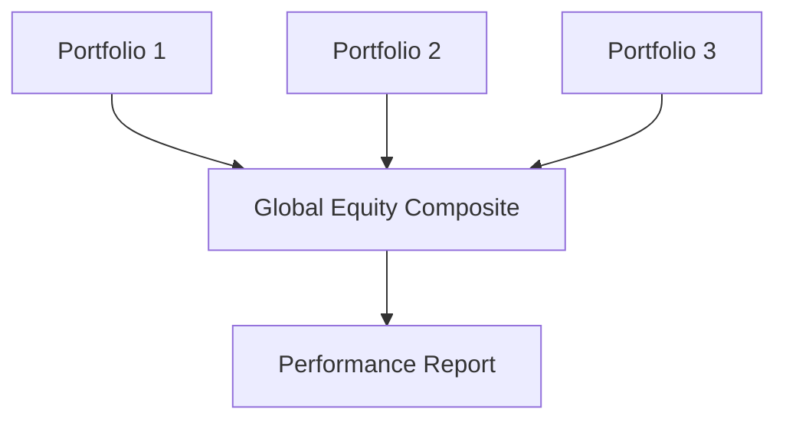

## Introduction

When you think about showcasing your investment performance to potential clients, how do you do it in a way that best reflects your underlying strategy and skill, without cherry-picking only your biggest successes? Well, that’s where the concept of composites swoops in to save the day. Composites are basically groupings of portfolios that share a similar investment strategy or mandate. By gathering these portfolios together under one umbrella, you can present a track record that is more robust, more reliable—more real.

This section explores how composites work under the Global Investment Performance Standards (GIPS). We’ll see how they’re built, how you’re supposed to maintain them, and, importantly, how they bolster transparency by ensuring you don’t selectively choose “good” portfolios to show off. I remember the first time I had to compile composites—boy, it felt like juggling puzzle pieces in midair. But once you get it, everything sort of clicks, and you can see how it all fits together to build trust and credibility.

## What Are Composites?

Generally speaking, a composite includes all the actual, fee-paying, discretionary portfolios managed under the same strategy (sometimes we call that the same "mandate" or objective). For example, if you run a global equity strategy, all your global equity portfolios that are discretionary and that pay fees (unless there’s a valid reason to exclude them) must end up in that “global equity composite.” This practice ensures the performance you report is, in fact, representative of the entire set of portfolios for that strategy.

1) They reduce the temptation to cherry-pick only top-performing or “favorite” portfolios.  
2) They highlight the firm’s approach and style consistency over time.  
3) They allow prospective clients to evaluate your skill and consistency in a straightforward way.  

By grouping portfolios, you’re forcing yourself—perhaps a little painfully at first—to be consistent and fair in your performance reporting. GIPS helps set these guidelines to protect the industry’s credibility and your clients’ trust.

## Key Elements in Composite Construction

### Defining Mandates, Objectives, or Strategies

When you start building composites, you need to define your strategies in a crystal-clear fashion. Are we talking about a small-cap growth equity strategy? A fixed-income liability-driven approach? This is the foundation: a composite can only be credible if its mandate is well-defined.

- Think about your investment approach.  
- Clearly document the process, risk parameters, and asset allocation guidelines.  
- Identify objective criteria for inclusion.

### Inclusion of All Actual, Fee-Paying, Discretionary Portfolios

Now, one of the cornerstones of GIPS is that you must include every actual, fee-paying, discretionary portfolio in at least one composite. That’s right—no convenient “Oops, let’s leave that laggard out.” This universal inclusion staves off the temptation to only show the best performers and ditch the rest. As you might guess, a big reason behind this rule is to make sure you’re not creating composites that mislead prospective clients.

### Written Composite Policies

Firms are required to document exactly how they create, maintain, and reclassify portfolios within each composite. Such a written policy ensures clarity and consistency over time. This "Composite Policy" should answer these kinds of questions:

- How do you group portfolios by mandate or strategy?  
- When do new portfolios become part of a composite?  
- How do you treat portfolios that are closed or transitioned out?  
- What about significant cash flows that might distort returns?

Keeping these policies on paper also helps your staff and any potential auditors verify that your composites align with the GIPS foundation.

## Timely and Consistent Assignment of Portfolios

Alright, so you have a strategy labeled “global equities” and maybe 15 different portfolios all following that approach. The GIPS standards require that you assign portfolios to composites in a timely manner—don’t just wait until they perform well. If a new portfolio comes in on June 1, it should be included in the composite from that date forward, assuming it meets the discretionary criteria. 

Timely assignment prevents “performance chasing.” Similarly, consistent assignment means if a portfolio’s circumstances don’t change, you don’t pop it out of the composite simply because it had a bad month. Think of it like sports: each team has to submit their official roster at the start of the season, and they can’t keep swapping players in and out to rig the score.

## GIPS Requirements and Composite-Level Returns

### Transparent Aggregations

According to GIPS, your final return number for a composite should reflect the performance of all the portfolios in that group. Typically, it’s an asset-weighted return, so larger portfolios have a proportionally greater impact on the composite result than smaller ones. Here’s a generic formula:

```
$$
R_{composite} = \sum_{i=1}^{n} \left(w_i \times R_i\right)
$$
```

Where:  
- \\( R_{composite} \\) is the composite return.  
- \\( w_i \\) is the weight of portfolio \\( i \\) (based on assets under management relative to total composite assets).  
- \\( R_i \\) is the return of portfolio \\( i \\).  

### Why Composite-Level Returns Matter

Composite-level returns are essential because clients want to see how well you can manage a particular strategy, not just how well you managed a single star portfolio. By providing these aggregate numbers, it gives prospective investors (or existing clients) confidence they’re seeing the “real deal,” warts and all. If you end up pitching yourself as an incredible manager of, say, emerging market equities, prospective clients can look at your emerging market equity composite data—and that data should theoretically capture everything you manage in that space.

## Handling Special Situations

### Significant Cash Flows

Large inflows or outflows can skew a portfolio's results for a short period. GIPS allows for certain carve-outs and treatment approaches to ensure that your performance information remains fair. Some firms temporarily remove a portfolio from a composite if it experiences a significant cash flow that disrupts the strategy’s normal process. The key is to follow your documented policy consistently. If you do it once, you have to do it for all similarly affected portfolios.

### Portfolio Transitions and Closures

When a portfolio’s mandate changes or if a client terminates a relationship, you can’t just quietly bury that portfolio’s performance. Under GIPS, you must properly reflect that portfolio’s partial period performance in the composite before its transition or closure. This ensures continuity and helps track the real, historical performance track record for that composite.

### Example of a Transition

Imagine you have a bond portfolio you manage under a strict duration target. The client decides to broaden the mandate to include convertible bonds, effectively changing the strategy’s entire scope. Under your composite policy, that might trigger a reclassification: the portfolio leaves the old composite on the date of the strategy change and (if it meets eligibility) joins the new convertible-bond composite.

## Practical Example: The Power of Composite Analysis

Let’s consider “Sunrise Asset Management,” a hypothetical mid-sized firm that manages three main strategies:

1) Large-Cap Core Equities  
2) Balanced Growth and Income  
3) Municipal Bond Accounts  

Each time they accept a new client mandate, they place that client’s portfolio into the appropriate composite based on the investment strategy. Over time, the firm can measure how each composite has evolved in terms of size, risk profile, and returns. Suppose the Large-Cap Core Equities composite has 45 portfolios. Some are performing quite well; others are merely average. But collectively, the composite’s track record provides a thorough view of the firm’s skill at consistently picking or managing large-cap stocks.  

Now, if Sunrise Asset Management tried to show a “Large-Cap All-Star Composite” by only including the five top portfolios, they'd be in direct violation of GIPS. Moreover, prospective investors would see a skewed picture. This is exactly what GIPS aims to prevent.

## Diagrams and Visualization

Below is a quick visual of how portfolios might flow into a single composite and how that composite then serves as the backbone for client reporting. You can see how multiple portfolios converge into one aggregated performance figure:



## Simple Python Snippet for Composite Return Calculation

If you’re curious about computing an asset-weighted composite return, here’s a tiny Python code example:

```python
portfolios = {
    'portfolio1': {'weight': 0.4, 'return': 0.02},   # 2% return
    'portfolio2': {'weight': 0.3, 'return': 0.01},   # 1% return
    'portfolio3': {'weight': 0.3, 'return': 0.03},   # 3% return
}

composite_return = sum([p['weight'] * p['return'] for p in portfolios.values()])
print(f"Composite Return: {composite_return:.2%}")
```

In this example, the composite’s overall return factors in both the returns and the relative sizes of the portfolios in the composite.

## Best Practices and Common Pitfalls

• Be sure you have formal, written composite policies. Being sloppy with those will lead to inconsistencies, confusion, and possible compliance breaches.  
• Watch out for “performance outliers.” If a portfolio has a huge inflow or outflow, handle it carefully. Document your approach within your policies.  
• Refrain from making frequent reassignments. If a portfolio’s strategy truly changes, that’s one thing, but bouncing portfolios around to massage performance is a big no-no.  
• Always track partial period performance when a portfolio joins or leaves a composite mid-period.  

## Exam Tips for CFA Candidates

From an exam perspective, big points often revolve around demonstrating that you understand the spirit of GIPS—full disclosure and consistency. Here are a few practical tips:

• In essay or item-set questions, make sure to identify whether a portfolio is discretionary and fee-paying, which triggers its inclusion in a composite.  
• Look out for trick questions where a portfolio might be subjected to a major inflow or outflow and see if the correct approach is to remove or keep it (based on the firm’s policy).  
• Explain the rationale behind requiring written composite policies and timely assignment—it’s about avoiding performance manipulation.  
• If asked to calculate a composite return, remember it’s typically asset-weighted—not just a simple average.  
• Keep an eye on partial-period returns if a portfolio joins or exits in the middle of a reporting period.

## Glossary

Composite  
: An aggregation of individual discretionary portfolios that share a common investment strategy, objective, or mandate.

Mandate  
: A set of guidelines or objectives specifying how an investment manager should allocate and manage a portfolio.

Discretionary Portfolio  
: A portfolio where the investment manager has full authority to make investment decisions within agreed constraints.

Cherry-Picking  
: Selectively including favorable portfolios or excluding underperforming ones to misrepresent performance results.

Significant Cash Flow  
: A cash movement into or out of a portfolio that could materially affect its performance.

Composite Policies  
: Documented rules regarding how a firm assigns, reclassifies, and terminates portfolios within composites.

## References and Further Reading

• CFA Institute (2020). “Creating and Maintaining GIPS Composites.”  
• Le Sourd, V. (2012). “Performance Measurement for Traditional Investment.” EDHEC Publications.  
• Journal of Performance Measurement – Special Issues on Composite Construction Practices.  

These resources provide deeper dives and more technical details on composite construction, maintenance, and performance measurement techniques.

## Test Your Knowledge: GIPS Composite Construction and Reporting



### Which of the following portfolios must be included in a composite in accordance with GIPS?

- [ ] Non-fee-paying, nondiscretionary portfolios.
- [x] Fee-paying, discretionary portfolios.
- [ ] All portfolios managed by any junior associate.
- [ ] Only top-performing portfolios to showcase firm expertise.

> **Explanation:** GIPS dictates that all actual, fee-paying, discretionary portfolios must be included in at least one composite to avoid cherry-picking.

### In GIPS, a “composite” primarily serves what purpose?

- [ ] Consolidates all portfolios, regardless of strategy, to produce a single average return. 
- [ ] Discloses only the best-performing strategies for external benchmarking. 
- [x] Groups portfolios of similar strategy or objective to transparently report performance. 
- [ ] Demonstrates compliance with government tax requirements for performance data. 

> **Explanation:** Composites are meant to aggregate portfolios with similar mandates to provide transparent representation of a strategy’s performance.

### Why is it improper to exclude underperforming portfolios from a GIPS composite?

- [ ] It’s legal but reduces marketing potential. 
- [ ] It’s allowed if the account is small. 
- [ ] It’s allowed if the client consents in writing. 
- [x] It violates fair representation obligations and misleads prospective clients. 

> **Explanation:** Selectively excluding weaker portfolios skews performance results and violates the basic premise of fairness and transparency under GIPS.

### One of the key requirements for composites under GIPS is:

- [ ] Assigning portfolios to composites only after a 12-month performance history is established. 
- [x] Having a clear, written policy for including and excluding portfolios. 
- [ ] Ensuring that composite returns are always equally weighted. 
- [ ] Recalculating portfolios' returns daily. 

> **Explanation:** GIPS requires that firms document their policies for composite creation and maintenance, ensuring consistent application.

### If a portfolio under a GIPS-compliant firm experiences a significant cash inflow:

- [x] The firm should follow its documented composite policy for handling significant cash flows. 
- [ ] The portfolio must be removed from the composite permanently. 
- [x] The firm may temporarily remove the portfolio if that is stated in the composite policy. 
- [ ] The portfolio does not need to be reported for that period. 

> **Explanation:** GIPS allows firms to define their own policy for dealing with significant cash flows, as long as it’s clearly documented and applied consistently.

### Which of the following best describes a discretionary portfolio?

- [x] The manager has authority to make investment decisions within agreed constraints. 
- [ ] Clients dictate each investment decision. 
- [ ] It has no fees and requires minimal oversight. 
- [ ] It's reserved for short-term speculation only. 

> **Explanation:** A discretionary portfolio is one in which the investment manager is free to decide on trades within the portfolio’s guidelines.

### Under GIPS, how is a composite’s return typically calculated?

- [x] By taking an asset-weighted average of each portfolio’s returns. 
- [ ] By taking a simple average of each portfolio’s returns. 
- [x] By adjusting weights to reflect the size of the portfolios. 
- [ ] By ignoring underperforming portfolios. 

> **Explanation:** GIPS generally requires performance to be asset-weighted, reflecting each portfolio’s size in the composite performance measure.

### When a client changes a portfolio’s mandate partway through the performance period:

- [x] The portfolio may need to be moved to a different composite on the date of the mandate change. 
- [ ] Its performance history should be erased. 
- [ ] The portfolio remains in both composites simultaneously. 
- [ ] The portfolio must stay in the original composite until the end of the year. 

> **Explanation:** A portfolio's composite assignment should reflect its current investment mandate. If the mandate changes, the portfolio is typically reassigned accordingly.

### A firm wants to create a composite for marketing only its “Top 10% performing equity portfolios.” Under GIPS:

- [ ] This is allowed if the firm discloses the selection bias. 
- [x] This would violate the requirements to include all fee-paying discretionary portfolios with that strategy. 
- [ ] This is acceptable if the composite is labeled “Top 10%.” 
- [ ] This is acceptable if the firm also creates a separate composite for underperformers. 

> **Explanation:** “Top 10% performing equity accounts” is a classic example of cherry-picking, which contradicts GIPS principles of fair representation.

### GIPS is designed primarily to:

- [x] Promote fair representation and full disclosure of investment performance. 
- [ ] Establish legal requirements for all investment managers worldwide. 
- [ ] Facilitate frequent reclassification of portfolios for marketing. 
- [ ] Penalize firms that close underperforming portfolios. 

> **Explanation:** The primary objective of GIPS is to ensure consistency, transparency, and comparability in presented performance data.




