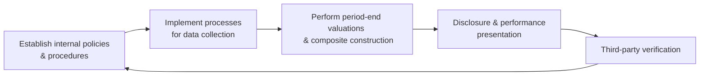

## Overview

Global Investment Performance Standards (GIPS) exist to ensure a fair and widely accepted methodology for calculating and presenting investment performance around the world. Compliance speaks volumes about a firm’s transparency and commitment to ethical reporting. We’ll dig into what it takes for a firm to claim compliance, how third-party verification fits in, and why robust recordkeeping is absolutely critical. As we go along, I’ll share a few personal observations—most revolve around how easy it is to slip up if proper internal controls aren’t in place.

## Defining GIPS Compliance

At its core, GIPS compliance is an all-or-nothing proposition for any investment management firm. That means a firm can’t simply pick and choose specific composites (or select groups of portfolios) to follow GIPS while ignoring everything else. Instead, the firm’s claim of compliance must cover all discretionary portfolios under the entity’s management. If your firm says it’s GIPS-compliant, it implies:

• All applicable requirements of the standards are followed.  
• Performance presentations are consistent, transparent, and comparable with industry norms.  
• All historical data needed to support the claim (often going back at least five years or more) is retained and verifiable.  

Firms are also required to disclose whether they actually claim compliance or do not. Put plainly, if you’re not 100% there, you shouldn’t say you are. This is part of building trust in performance data across the global investment community.

## Why Internal Controls Matter

I remember chatting with a newly appointed performance manager who said, “Um, I didn’t realize how many steps were in place just to confirm one set of numbers.” Well, GIPS compliance hinges on robust internal checks to ensure consistent, quality data feeding into all performance calculations. Internal controls typically include:

• Documented policies and procedures for defining composites, calculating returns, and applying performance-based fees (if relevant).  
• Frequent checks to confirm the accuracy of portfolio-level transactions, valuations, and classification into the correct composites.  
• Defined oversight responsibilities so everyone knows who verifies which data point (and how often).  

Without these controls, you’re essentially guessing—particularly with the valuations used to calculate monthly or quarterly returns, let alone annual returns. In a professional environment, guesswork is never a good look.  

### Common Internal Control Elements

1. Segregation of Duties: Performance measurement, trade execution, and compliance oversight are often separated among different teams.  
2. Periodic Audits: Even if you don’t have an external verifier yet, an internal audit or compliance function can conduct routine checks.  
3. Approval Workflows: Changes to any performance calculation method or procedure are documented, reviewed, and authorized by appropriate personnel.

## Third-Party Verification

While compliance itself is technically “self-regulated,” an external verifier provides an extra layer of reassurance. You can’t just rely on your internal folks to say, “Yes, we’re all good,” because there’s always the risk of unintentional bias or oversight. Instead, a third-party verification involves hiring a qualified, independent reviewer—someone who checks:

1. Your firm’s written policies and procedures to ensure they align with GIPS requirements.  
2. Your composite construction and performance calculations.  
3. The consistency of historical records and data integrity.  

If the verifier finds issues, you’ll typically get a chance to fix them before making a formal claim. Once you’ve addressed their concerns, they’ll issue a report attesting to whether your firm has adhered to GIPS for the periods under review.  

### Benefits of Verification

• Enhanced Credibility: An independent verification report often instills greater trust among existing and prospective clients.  
• Better Controls: The verification process itself can highlight weaknesses or inefficiencies in your data-gathering and calculation processes.  
• Regulatory Assurance: While GIPS isn’t exactly mandated by regulators in every jurisdiction, a verified claim can help you stand out in a crowded marketplace.  

I recall a friend who worked in a boutique asset management firm: They pursued verification mainly to convey transparency to prospective institutional investors. As soon as their GIPS-verified track record was published, they saw renewed interest from consultants, who appreciated the firm’s willingness to adhere to global best practices in performance reporting.

## Differences: Firm-Wide Verification vs. Performance Examinations

When it comes to outside reviews, there are two main categories:

• Firm-Wide Verification: This broad approach looks at every composite across the firm, evaluating whether your overall approach to GIPS compliance is correct. This is typically what we refer to when we say “GIPS verification.”  
• Performance Examination: Sometimes you’ll see a narrower scope, focusing on a specific composite or set of composites. This deeper-dive approach checks if performance results for those composites are accurately computed and presented in compliance with the standards.  

A firm might start with a firm-wide verification and then later request performance examinations for higher-profile composites (for instance, those that attract premium fees or hold flagship institutional strategies).  

## Common Challenges in Verification

Verification can be fairly intense. Here are a few pitfalls you may encounter:

1. Incomplete Records: Missing transaction data or old valuation statements that have never been digitized make your verification process complicated.  
2. Inconsistent Valuations: If different teams or offices use varied valuation methods or reporting times, your aggregated performance calculations may not line up.  
3. Misapplied Fee Structures: GIPS requires returns to be presented both gross and net of fees, under the correct assumptions. Misapplication of these fees is a frequent error.  
4. Differing Composite Definitions: Perhaps you redefined a composite a year ago but never updated the official composite documentation. Even small discrepancies can cause big headaches.  

Working through these challenges demands a thorough records review and a robust chain of communication between performance teams, compliance officers, and external verifiers.

## Best Practices for Engaging Verifiers

• Define Scope Early: Before you engage a verifier, ensure you know whether you want a full firm-wide verification or a performance examination on certain composites.  
• Request a Document List: Many verifiers will provide a checklist of items they need to see—gather them in advance to streamline the process.  
• Maintain Continuous Communication: If something unusual appears (e.g., a missing data patch from three years ago), let the verifier know promptly. Surprises at the eleventh hour can be more stressful than they need to be.  
• Update Policies Regularly: Ensure that any changes in your investment processes, composite definitions, or fee schedules are reflected in your documentation.

## Example Workflow Diagram

Below is a simple flow to visualize how a firm might run through compliance and verification on an ongoing cycle:

The cycle continues as updates to procedures feed back into regular data collection, composite creation, and external reviews over time.

## Recordkeeping and Documentation

If I can emphasize one practical takeaway, it’s this: never underestimate how meticulous recordkeeping needs to be. In the heat of a busy quarter, you might be rushing to finalize client reports—yet GIPS demands consistent, robust documentation. At a minimum, your firm should hold onto:

• Portfolio transaction histories (trade confirmations, statements)  
• Valuation backups (pricing sources, vendor feeds, relevant manuals)  
• Composite definitions (and any changes with date stamps)  
• Calculation formulas, adjustments, and notes on assumptions  

Not only does this create a solid audit trail for verification, but it also helps internal teams quickly resolve disputes or confusion about past performance results.

## Putting It All Together

GIPS compliance involves much more than stamping “We’re GIPS Compliant” on your performance report. It’s a comprehensive commitment to ethical and standardized performance reporting. By weaving in diligent internal controls, rigorous recordkeeping, and periodic independent verification, you create credibility, instill confidence, and align with best practices recognized around the globe.

As a candidate (or a budding professional) in this field, you’ll likely see questions on both the conceptual and practical sides of GIPS compliance. Whether you’re briefing your team on why to get a verification or walking your firm’s new compliance officer through the necessary steps, you can rely on these core principles.  

## Exam Tips and Key Takeaways

• Know precisely what GIPS covers: All discretionary portfolios under the firm’s management.  
• Understand definitions: Distinguish between firm-wide verification and performance examination.  
• Expect scenario-based questions: Many exam questions revolve around highlighting an error (e.g., incomplete data, wrong fee application) and asking how GIPS would address it.  
• Don’t forget about disclaimers: GIPS compliance must be clearly stated or denied, with appropriate disclosures.  
• Maintain strong documentation: This is both for exam success and real-world performance verification.  

## References

• CFA Institute. (2020). “GIPS Standards Handbook – Verification & Examination Guidance.”  
• GIPS Executive Committee. “FAQs on Verification.” CFA Institute Website: https://www.cfainstitute.org  
• Spaulding, D. (2011). The Handbook of Investment Performance.  

## GIPS Compliance Quiz



### Which statement best describes GIPS compliance?

- [x] A firm-wide adherence to all requirements of the Global Investment Performance Standards.
- [ ] Compliance limited to a single product or strategy the firm offers.
- [ ] A partially implemented set of guidelines that firms may adopt in phases.
- [ ] Only an internal policy that does not require disclosure to clients.

> **Explanation:** GIPS compliance must apply to the entire firm and cover all discretionary portfolios. It’s not restricted to a single product.

### What is the primary benefit of having a third-party verifier review a firm's GIPS compliance?

- [x] It enhances credibility and assurance by providing an independent review of performance calculation and policies.
- [ ] It categorically replaces the need for internal audits and controls.
- [ ] It guarantees absolute accuracy for regulatory reporting.
- [ ] It allows selective retroactive application of GIPS standards.

> **Explanation:** Independent verification boosts trust and helps identify inconsistencies or errors in performance calculations, but it supplements—rather than replaces—internal controls.

### A performance examination differs from a full firm-wide verification in that:

- [x] It focuses on a specific composite or set of composites rather than all the firm’s composites.
- [ ] It offers a broader scope covering all aspects of GIPS compliance.
- [ ] It negates the requirement for recordkeeping.
- [ ] It ensures firm-wide compliance automatically.

> **Explanation:** A performance examination provides a detailed review of selected composites, while firm-wide verification covers the entire firm.

### Which of the following is a key internal control for ensuring GIPS compliance?

- [x] Segregation of duties among performance measurement, compliance, and portfolio management teams.
- [ ] Having a single person responsible for all valuation and reporting decisions.
- [ ] Restricting documentation access to only the CFO.
- [ ] Limiting data backups to final quarter reports only.

> **Explanation:** Proper segregation of duties and robust recordkeeping are essential. Concentrating all responsibilities with one individual undermines internal controls.

### Common challenges in GIPS verification include:

- [x] Incomplete records and inconsistent valuation methods.
- [x] Misapplied fee structures and conflicting composite definitions.
- [ ] Simplified, standardized processes across the entire firm.
- [ ] Routine acceptance of inconsistent data sources.

> **Explanation:** Issues arise from missing data, different methodologies, and confusion around composites or fee calculations.

### Why must records be meticulously maintained for GIPS compliance?

- [x] They provide an audit trail and support all calculations and disclosures made in performance reports.
- [ ] They only matter if a client specifically requests them.
- [ ] They are optional if the firm undergoes third-party verification.
- [ ] They can be kept informally without formal policies or procedures.

> **Explanation:** Detailed recordkeeping is fundamental to accurate performance measurement and is subject to review by verifiers.

### What typically underscores the need for revisiting internal controls during a verification process?

- [x] Discovery of incomplete documentation or inconsistent fee applications.
- [ ] Mandatory regulatory penalties for non-compliance.
- [x] Feedback from external verifiers requiring stronger oversight.
- [ ] Locking a firm’s valuation policy to an outdated approach.

> **Explanation:** A significant benefit of verification is that it identifies operational or procedural weaknesses, prompting improvements.

### When might a firm choose a narrower performance examination over firm-wide verification?

- [x] When they need in-depth assurance on a flagship or high-profile composite.
- [ ] When they are uncertain about the GIPS standards themselves.
- [ ] When they only manage a single portfolio.
- [ ] When the firm wants to exclude data from the last five years.

> **Explanation:** A performance examination gives a closer look at a particular strategy or composite, which may be vital for investors or marketing considerations.

### One major difference between presenting gross-of-fees and net-of-fees returns under GIPS is:

- [x] Net-of-fees returns must deduct investment management fees, while gross-of-fees returns do not.
- [ ] Net-of-fees presentations are prohibited for GIPS compliance.
- [ ] Gross-of-fees returns require all transaction costs to be excluded.
- [ ] Net-of-fees returns generally exclude any operational expenses and taxes.

> **Explanation:** GIPS requires clarity on fees deducted for net-of-fees returns. Gross-of-fees returns do not include these fees but should account for trading expenses.

### True or False: GIPS verification is mandatory for all firms that claim compliance.

- [x] True
- [ ] False

> **Explanation:** While GIPS does not require a third-party verification for compliance claims, most firms pursuing a compliance statement now consider an external verification as essential. In practice, verification is widely recognized as best practice, though not an absolute requirement for the claim itself.


