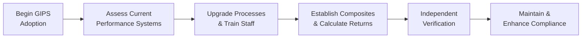

## Introduction

Global Investment Performance Standards (GIPS) compliance may sound a bit intimidating at first—like you’re jumping into a super high-stakes game. But trust me, even if you’re relatively new to the topic, there’s significant value in understanding these standards. GIPS exist to create a standardized way of presenting investment performance so that current and prospective clients can make fair comparisons across firms. In many ways, GIPS are about building a shared language and ensuring that no one’s fudging the numbers.

In this section, we’ll explore why organizations go through the effort (and expense!) to comply with GIPS, along with the common roadblocks firms might face as they embark on this journey. We’ll also look at ways GIPS compliance can strengthen a company’s credibility. After all, who doesn’t want to gain that extra edge in a competitive marketplace?

## Key Benefits of GIPS Compliance

### Differentiation in a Competitive Market

One of the major carrot-and-stick motivations for GIPS compliance is differentiation. In a competitive landscape—especially for investment managers seeking institutional clients—demonstrating compliance can rapidly set a firm apart. GIPS compliance signals a commitment to industry best practices. It also showcases thoroughness and honesty. When prospective clients flip through marketing materials, they often look for that little line stating “GIPS-compliant.” That label acts like a stamp of approval. 

I recall a former colleague of mine who used to say, “Without GIPS, you’re basically showing up to a global conference without your name badge.” Clients want to see that name badge—your official proof that you speak the recognized language of performance reporting and transparency.

### Building Trust with Clients

Let’s say you have an investor who is deciding between two managers with similar track records. If one is GIPS-compliant and the other isn’t, the perceived trust level often skews in favor of the first. 

• Institutional & International Credibility: Large pension funds, insurance companies, and endowments frequently require or strongly prefer GIPS compliance because it makes their due diligence process easier. Similarly, global investors—like sovereign wealth funds—feel more comfortable investing with a manager that plays by universally recognized rules.  
• Transparency: GIPS ensures that performance is measured consistently and disclosed fully. This openness goes a long way in setting investor minds at ease.  

Clients appreciate that they’re able to compare apples to apples. And, in their eyes, if you value full disclosure, you’re presumably less likely to take shortcuts in any aspect of managing their money.

### Operational Improvements

Implementing GIPS can prompt valuable operational and technological enhancements. Aligning systems to calculate performance consistently forces the firm to do a comprehensive checkup:

• Data Management: GIPS requires precise return calculations, frequent valuations, and well-documented processes. Firms often invest in better back-office systems—more automated, less error-prone.  
• Reporting Consistency: Standardized composite definitions and uniform reporting templates streamline communication. Everyone in the firm, from portfolio managers to junior analysts, starts referring to the same metrics.  
• Internal Controls: GIPS compliance can serve as a catalyst for better internal governance. A firm often ends up with a more robust internal audit trail, improved segregation of duties, and clearer lines of responsibility.

Suddenly, your operations desk is speaking more fluidly with your finance department. These cross-department discussions help improve the overall efficiency (and the morale) of the entire organization.

## Potential Challenges in GIPS Adoption

Of course, with every silver lining, there is a cloud or two. GIPS adoption is by no means easy or cheap. Let’s explore some of the key hurdles.

### Implementation Costs and Resource Allocation

When someone in a leadership meeting announces, “We’re adopting GIPS,” you can practically hear the entire operations team gulp in unison. It involves:

• Systems Updates: Software upgrades or new portfolio accounting platforms may be necessary to capture relevant data.  
• Personnel Training: Staff must understand GIPS rules thoroughly. Sometimes, specialized consultants are hired, which only adds to the tab.  
• Ongoing Verification Expenses: Many firms choose an independent verifier to ensure their processes comply with GIPS. That’s another recurring cost.

There’s nothing more frustrating than committing a large chunk of your budget to a project that drags on because each department’s priorities conflict with the enterprise-wide GIPS initiative. It’s not impossible, but it sure requires determined leadership to keep everything on track.

### Complexities of Reconciling Global Operations

If your firm deals with multiple asset classes, invests internationally, or inherits multiple accounting systems from mergers and acquisitions, you’ll face additional complexity:

• Multi-Asset Classes: GIPS has specific rules for how to value each asset and how often they need to be priced. For a firm trading illiquid securities, daily or quarterly valuations could be quite challenging.  
• Local Institutions & Cultural Variations: In some regions, performance reporting might have historically adhered to less rigorous standards. Reconciling older local practices with GIPS can require extensive historical data adjustments.  
• Reconciliation with Sub-Advisors: Multi-manager structures complicate consistent performance calculations. If you partner with external managers or sub-advisors, you need to ensure that they adhere to your GIPS processes, too.

### Partial Compliance and Reputation Risk

One pitfall that can severely damage a firm’s credibility is “partial compliance.” GIPS does not allow a firm to claim partial compliance. It’s a pass-or-fail scenario—like trying to be “kind of pregnant.” If a firm tries to indicate compliance while failing to meet every relevant provision, it risks:

• Regulatory Scrutiny: Inaccurate or misleading statements about compliance can result in penalties from local regulators or lawsuits from disgruntled clients.  
• Investor Distrust: Once word gets out that your firm has overstated or misrepresented its compliance, any other claims or performance figures will suffer from severe credibility issues.  

It’s better to be honest about the current state of your compliance efforts than to exaggerate them for marketing purposes. If you’re in the transitional phase, precisely detail the steps involved and the target deadlines for successful verification.

## Common Pitfalls

Below are some frequent stumbling blocks that can derail a GIPS compliance initiative:

• Misclassifying Portfolios into Composites: If your portfolio definitions are too broad or too narrow, you risk muddying performance data.  
• Outdated Composite Definitions: GIPS-compliant firms must keep their composite definitions updated as strategies evolve or portfolios change. Overlooking small changes can invalidate your reported returns.  
• Irregular Valuations: For GIPS purposes, valuations must be performed uniformly across accounts. Inconsistent or infrequent pricing can distort returns.  
• Neglecting Timely Revaluations: You have to revalue portfolios for all large cash flows and on any date required by GIPS frequency guidelines. Missing these deadlines can cause a snowball effect of inaccurate calculations.  

Addressing these points early makes everything else smoother. Document your processes thoroughly, assign accountability to specific teams, and ensure robust audits at each step.

## Balancing Costs and Benefits

### Cost-Benefit Analysis

It’s natural for senior management to ask, “Is this really worth the price tag?” The answer depends on your firm’s strategic goals. If you hope to compete for large institutional mandates or expand into global markets, then GIPS compliance might be almost mandatory:

• Expanded Client Base: Many potential clients consider GIPS compliance a prerequisite for awarding mandates. Neglecting it could limit your firm to smaller or less-sophisticated investors.  
• Reduced Legal Exposure: By following GIPS procedures, you’re mitigating the risk of regulatory breaches in performance reporting. Defensive compliance, while not exactly glamorous, is a significant benefit in itself.  
• Enhanced Operational Insights: The operational improvements and data quality enhancements often yield long-term savings and better decision-making.  

On the flip side, if your firm is a boutique operation focusing on a niche area with a handful of well-informed, relationship-based clients, GIPS adoption may be less of a priority.

### Real-World Perspective

Perhaps you’re at a small- or medium-sized firm that just started exploring GIPS compliance. Maybe you cringe at the thought of the big checks for systems upgrades and verification fees. But in some cases, you discover that adopting GIPS is akin to paying for a seal of credibility that can open new doors. 

We’ve had anecdotal accounts of asset managers saying, “Ever since we went GIPS-compliant, we were able to pitch for large institutional mandates—it was the best decision we ever made.” The intangible payoff in trustworthiness and brand reputation can be tremendous.

## Practical Diagram: GIPS Implementation Flow

Below is a simplified illustration of a GIPS adoption process, from initial commitment to ongoing verification.

You might start with a thorough assessment of existing data and processes (B), then move on to staff training (C). Next, you define composites and ensure you’re calculating investment returns in compliance (D). An independent verifier reviews your workflows and performance (E). Finally, you continue to maintain and enhance your compliance regimen (F), revisiting each step periodically.

## Best Practices for Mitigating Challenges

• Appoint a Dedicated Team: Make sure you have a cross-departmental task force—IT, operations, investment management, compliance—working together.  
• Run Pilot Projects: Before fully rolling out GIPS compliance, try it on a subset of strategies or portfolios.  
• Partner with Reputable Verifiers: Skilled external verifiers can spot issues early and provide guidance. Don’t skimp here—quality expertise saves money in the long run.  
• Continuous Education: GIPS standards evolve over time, so keep staff training up to date.  
• Document Everything: Written procedures help new employees learn the ropes and avoid repeated mistakes.

## Key Terms and Glossary

• Competitive Edge: The advantage gained by demonstrating verified performance and dedication to industry best practices.  
• Transparency: Openness and clarity about investment styles, returns, fees, and other critical data.  
• Implementation Costs: Allocation of financial and time resources to align systems, personnel, and processes with GIPS.  
• Reconciliation: Ensuring that performance calculations match accounting records and meet GIPS valuation requirements.  
• Partial Compliance: An invalid claim of compliance where a firm meets only selected requirements but presents itself as fully compliant.  
• Cost-Benefit Analysis: Evaluating whether the strategic and reputational gains from adopting GIPS justify the resources expended.

## Conclusion and Exam Tips

Getting GIPS-compliant involves more than a single stroke of the pen. You’ll need to adjust your processes, retrain staff, reconcile complicated valuation methodologies, and maintain your compliance posture over time. It’s not for the faint of heart. Yet, those who invest the time often see enhanced credibility, stronger controls, and improved client relationships.

From an exam standpoint, remember these focal points:

• Understand the core objective of GIPS: standardizing performance reporting and ensuring ethical conduct.  
• Know how to calculate returns under GIPS, use composites, and identify when valuations are required.  
• Avoid partial compliance. The standards demand an all-or-nothing approach.  
• In scenario-based exam questions, watch out for misclassified portfolios or missing revaluation guidelines.  
• Consider cost-benefit analysis from different firm perspectives (small vs. global, institutional vs. retail).  

Stay mindful of how GIPS intersects with other CFA Institute Standards. Typically, ethics questions could zero in on GIPS compliance as an illustration of the importance of consistent and honest performance reporting.

## References

- Spaulding, D. (2009). Guide to GIPS: Global Investment Performance Standards.  
- CFA Institute. (2019). “GIPS 2020 Standards: Principles and Approaches.” Available at:  
  https://www.cfainstitute.org  
- Investment Performance Council White Papers on GIPS Implementation.  

---

## Test Your Knowledge of GIPS Adoption



### Which of the following best describes a key benefit of GIPS compliance?

- [ ] Reduced need for third-party verification.  
- [ ] Lower operational costs due to minimal ongoing requirements.  
- [x] Enhanced credibility in international and institutional markets.  
- [ ] Guaranteed higher returns on client portfolios.  

> **Explanation:** GIPS compliance does not guarantee performance, nor does it eliminate the need for verification. The top benefit is the credibility that GIPS brings in institutional or global contexts.

### Which of the following scenarios most likely represents partial compliance?

- [ ] A firm that includes all its discretionary portfolios in at least one composite.  
- [x] A firm that follows certain GIPS rules but omits performance data for its private equity funds.  
- [ ] A firm that openly states it is still “working toward compliance” and reports its progress.  
- [ ] A firm that engages an independent verifier and meets all relevant provisions of GIPS reports.  

> **Explanation:** GIPS does not allow a firm to claim compliance if portions of its investments or asset classes are excluded from the standards. Firms that omit entire asset classes while claiming compliance are engaging in partial compliance, which is not permitted.

### What is one significant operational improvement that often accompanies GIPS compliance?

- [ ] Less frequent performance reporting.  
- [ ] The elimination of all manual processes in portfolio valuation.  
- [x] More thorough and consistent data management systems.  
- [ ] Reduced staff training on compliance issues.  

> **Explanation:** Pursuing GIPS compliance typically elevates data management practices and leads to more precise, consistent, and automated handling of performance data.

### Why is “claiming partial compliance” considered a risk?

- [ ] Because partial compliance focuses more on marketing materials than on actual performance.  
- [x] Because GIPS requires complete compliance, and partial compliance claims can mislead investors.  
- [ ] Because partial compliance is acceptable only for equities, not for bonds.  
- [ ] Because partial compliance is valid but requires excessive documentation.  

> **Explanation:** GIPS is all-or-nothing. Claiming partial compliance can misrepresent the firm’s performance reporting integrity and undermine investors’ trust.

### How may a firm best mitigate the challenges of implementing GIPS?

- [x] Set up a cross-departmental project team and run pilot compliance projects.  
- [ ] Only train client-facing teams in performance standards.  
- [ ] Invest exclusively in marketing tools rather than operational systems.  
- [x] Hire an external verifier to review procedures and spot issues early.  

> **Explanation:** Having a dedicated internal team and leveraging an external expert are key strategies to smooth the complex transition toward GIPS adoption.

### Which of the following is an example of a common pitfall in GIPS compliance?

- [x] Failing to consistently classify portfolios into the correct composites.  
- [ ] Conducting formal performance appraisals of staff every quarter.  
- [ ] Using daily valuations for all portfolio types.  
- [ ] Providing more detailed disclosures than GIPS requires.  

> **Explanation:** Misclassifying portfolios into composites is a classic mistake that can undermine the consistency required by GIPS.

### A firm that trades illiquid securities across multiple regions might struggle with GIPS compliance primarily due to:

- [x] Inconsistent valuation methodologies and data sources.  
- [ ] Decreased investor interest in its products.  
- [x] Different time zones causing staff fatigue.  
- [ ] A lack of marketing specificity in promotional materials.  

> **Explanation:** Handling multi-asset, global portfolios often means reconciling different valuation procedures and data sets. This complexity is a common hurdle on the path to GIPS compliance.

### Which of the following statements is true about GIPS and cost-benefit analysis?

- [ ] GIPS compliance always leads to lower costs than benefits, regardless of the firm’s size.  
- [x] Firms seeking large institutional clients often find that the reputational benefits outweigh the costs.  
- [ ] Smaller firms receive more benefits from GIPS than larger, global institutions.  
- [ ] GIPS compliance has no operational costs because it is purely documentation-based.  

> **Explanation:** For firms aiming to attract institutional or international clients, convincing them of trustworthy performance reporting is often worth the cost of GIPS compliance.

### Which initiative could help a firm avoid incomplete or outdated composite definitions?

- [x] Regularly reviewing and adjusting composite membership based on strategy changes.  
- [ ] Holding staff workshops only once every three years.  
- [ ] Limiting the number of portfolio composites to one for simplicity.  
- [ ] Avoiding contact with external verifiers due to confidentiality concerns.  

> **Explanation:** Frequent reviews and updates of composite definitions ensure that each composite accurately reflects the relevant portfolios and their respective strategies.

### Is GIPS primarily intended to guarantee higher returns?

- [x] True  
- [ ] False  

> **Explanation:** This is false. GIPS is not about delivering higher returns but about standardizing performance reporting and enhancing transparency.


