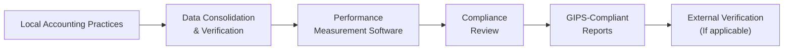

## Overview of GIPS in Emerging Markets

Emerging markets often present vibrant opportunities for growth—there’s something exciting about rapidly developing economies, you know? But at the same time, these markets pose unique challenges when it comes to performance measurement. While the Global Investment Performance Standards (GIPS) are designed to standardize how investment results are calculated and presented, the path to full compliance can be pretty thorny in regions where regulatory environments are evolving, accounting practices vary greatly, and data reliability isn’t always top-notch.

In this section, we’ll explore how emerging market firms incorporate GIPS, showcasing some of the real hurdles and triumphs they encounter along the way. We’ll walk through several illustrative case studies, focusing on currency volatility, data integrity, cultural nuances, and the important role of technology in bridging gaps. We’ll also take a quick look at how local customs and reporting standards can be harmonized with global best practices. After all, aligning an emerging market’s local flair with GIPS is about adapting without losing that unique local edge. 

## Key Challenges for GIPS Compliance in Emerging Markets

### Regulatory Landscape and Data Reliability
I remember chatting with a friend working at an asset management startup in Southeast Asia who said, “We’re basically building the plane while flying it!”—and that’s sometimes how it feels in emerging markets. Regulatory frameworks can shift abruptly, especially in countries with newly formed financial authorities. Firms that adopt GIPS often find themselves adjusting to continuous changes in reporting guidelines or grappling with incomplete or inconsistent historical data.

Data reliability is another big headache. Some local companies might keep paper records or rely on antiquated databases that don’t integrate smoothly with modern performance measurement software. Without robust data, verifying investment performance according to GIPS standards becomes way more difficult.

### Local Reporting Standards vs. Global Best Practices
GIPS calls for consistent valuation policies and performance calculation methods, but emerging markets may have local accounting rules that conflict with global norms. For instance, a country might require monthly valuations using specific depreciation schedules for fixed-income instruments, while GIPS recommends daily or at least more frequent valuations with certain market-based adjustments.

Moreover, local auditors may not be familiar with GIPS at all. They might provide opinions that align with their local Generally Accepted Accounting Principles (GAAP), which may or may not converge fully with the spirit of GIPS. The result? Firms must find ways to reconcile these differences to produce GIPS-compliant presentations while still satisfying local financial reporting obligations.

### Currency Fluctuations
One major stumbling block is foreign exchange volatility, which can be intense in emerging markets. Performance returns must be measured using consistent currency conversion methods. If you’re in a high-inflation environment, the currency might weaken so quickly that performance in local terms looks drastically different from performance in U.S. dollar terms—even within the same quarter. That means GIPS-compliant presentations have to incorporate robust processes for managing currency translations, hedging strategies, and possibly hyperinflation adjustments.

### Illiquid Securities
Many emerging markets feature unique asset classes or hold thinly traded equities and bonds. In some places, you might encounter microfinance instruments or farmland deals that don’t trade daily. GIPS typically requires fair valuation for securities, including illiquid ones. Yet obtaining credible third-party valuations can feel like searching for a needle in a haystack. Firms often invest in specialized data providers or valuation experts who understand these asset classes. They may adopt discounted cash flow approaches or external appraisals to justify their performance numbers.

## Harmonizing Local Practices with GIPS Requirements

### Adaptation and Cultural Nuances
Emerging market asset managers typically begin by performing a gap analysis, identifying where current accounting and performance practices diverge from GIPS. Culturally, some regions prefer conservative reporting, underestimating returns to remain on the safe side. GIPS compliance challenges that mindset by requiring uniform rules—for instance, performance must be stated net of all fees that would have impacted the results (even if local tradition is to exclude certain minor fees). 

Teams also need to communicate in more than one language if a global investor base is being reached. That’s often an underappreciated hurdle: translating disclaimers, footnotes, and performance highlights accurately into both English (for GIPS) and the local language to meet native regulatory requirements. The smallest language slip can confuse prospective investors and hamper trust.

### Technology’s Role in GIPS Implementation
Automation is huge. From my experience working with a medium-sized brokerage in Eastern Europe, hooking up automated performance computation software that integrated with local accounting systems was a lifesaver. Before that, folks were manually calculating portfolio weights in spreadsheets—very prone to error. By installing real-time data feeds and robust performance measurement software, the firm managed to streamline the entire reporting process. 

Let’s illustrate the GIPS compliance process flow with a simple diagram:

Technology can unify multiple data sources, handle currency conversions more accurately, and apply standardized returns calculation methods. In many cases, it becomes the backbone enabling smaller or newer firms to meet GIPS requirements without building an entire internal reporting army.

## Case Studies from Emerging Markets

### Case Study 1: Latin American Boutique Asset Manager
A boutique asset manager based in Latin America decided to pursue GIPS compliance to attract institutional capital from abroad. During their compliance journey, they realized their local practice was to value portfolios monthly, whereas GIPS requires valuation each time there’s an external cash flow and at calendar month-ends. They had to:

• Shift to daily or event-based valuations.  
• Implement consistent risk measures for fair value estimates.  
• Train staff on GIPS fundamentals—especially how to treat performance-based fees that were typical in certain local mandates.  

Result? It took them about a year to fully align their processes, but once verified, they saw an uptick in global investor interest. Institutional clients felt more comfortable because GIPS compliance acted like a stamp of standardized performance credibility.

### Case Study 2: Southeast Asian Mutual Fund During a Currency Crisis
Another real example involved a mutual fund in Southeast Asia that was operating amid a rapidly depreciating local currency. The volatility created huge swings in returns between local currency and U.S. dollar terms. The firm tackled this by:

• Creating two composites: one in local currency, another in USD, each following GIPS valuation rules.  
• Documenting a thorough methodology for handling exchange rate conversions, which included using official exchange rates published by the central bank at each valuation date.  
• Engaging a third-party verification firm familiar with GIPS to validate their approach to currency translation and ensure accuracy of returns.  

Despite the chaos of a currency crisis, the firm’s GIPS compliance offered clarity to investors—they could see performance unaffected by the confusion of inconsistent conversions. This clarity proved vital for maintaining investor confidence.

### Case Study 3: African Private Equity Fund with Illiquid Securities
In sub-Saharan Africa, a private equity fund invested heavily in local infrastructure projects and microfinance. Many holdings lacked daily prices. To meet GIPS standards, the fund:

• Established a rigorous internal valuation committee that met quarterly.  
• Used third-party appraisals, including external real estate experts, to verify the fair value of physical assets.  
• Created internal guidelines for projecting future cash flows in microfinance portfolios, complete with discount rate assumptions that aligned with GIPS recommendations and IFRS frameworks.  

Of course, these processes took time and money. However, the result was an easily digestible, globally recognized performance report that caught the attention of institutional investors seeking frontier market diversification.

## Unique Asset Classes in Emerging Markets

Certain emerging or frontier markets offer exotic investments—like farmland, local municipal bonds, or microfinance instruments. GIPS compliance demands consistent and rational approaches for pricing. Valuation typically involves external specialists using discounted cash flow or market-based approaches where comparables are available. In extremely illiquid scenarios, GIPS does allow for prudently adjusted valuations if you follow documented, consistent procedures and provide appropriate disclosures.

## The Reputational Gains of GIPS

Firms that can genuinely state, “We follow GIPS,” rarely regret it. Especially in emerging markets, where disclosures can be inconsistent, having a globally recognized seal of approval is a major advantage. Foreign pension funds, sovereign wealth funds, and other institutional investors often require GIPS-compliant track records. The stories of local firms that successfully attract big foreign capital typically start with them delivering a performance history that lives up to international standards.

## Cultural Nuances, Language Barriers, and Regulatory Alignment

Emerging market firms need to keep in mind that local regulators might not be entirely aware of or aligned with GIPS. It’s a good idea to maintain an ongoing dialogue with regulatory bodies, or even invite them to GIPS training sessions. Also, if English isn’t the primary language of the country, ensuring that GIPS composites and presentations are translated accurately helps avoid misunderstandings.

Additionally, in certain cultures, there might be a reluctance to “show off” or “overstate” results. But GIPS is about transparency and uniform comparability, not boasting. It’s crucial to explain the “why” behind the standard—promoting trust, establishing credibility, and simplifying investment decisions for outsiders.

## Practical Tips for CFA Exam Relevance

On the CFA exam—especially at the advanced levels—you might encounter scenario-based questions where you’re asked how an emerging market manager should handle a certain performance measurement issue. Some typical angles:

• Identifying the correct exchange rate or return translation for cross-border portfolios.  
• Applying valuation practices for illiquid securities in line with GIPS.  
• Reconciling local reporting rules with GIPS disclosure requirements.  

When constructing an essay or item-set response, be sure to reference the relevant GIPS sections, highlight the compliance steps, and consider how to properly disclose the effect of currency translations or unusual asset classes.

## Conclusion

Emerging market firms on the road to GIPS compliance face a balancing act: they must preserve local reporting integrity while wholeheartedly adopting global best practices. Yes, it can be tricky—like trying to merge two puzzle sets that look similar but aren’t exactly the same. Yet, if done properly, the rewards are significant: global credibility, enhanced investor trust, and the ability to stand on par with developed-market peers. 

So, if you’re working with or investing in an emerging market firm uncertain about GIPS, remind them that while the path may be winding, there’s a pretty game-changing payoff at the end. With robust data systems, careful currency strategies, and an appreciation for local customs, firms can deliver performance reports that meet international standards—and that’s a huge step in putting themselves on the global map.

## References and Further Reading

• CFA Institute (2021). “Implementing GIPS in Emerging Markets” – White Paper Series.  
• Local Regulatory Bodies: Check national regulators or associations for region-specific rules.  
• Emerging Markets Review, Special Issues on International Investment and Performance.  
• CFA Institute GIPS Standards: https://www.cfainstitute.org/en/ethics-standards/gips  

## Test Your Knowledge: GIPS and Emerging Markets Quiz



### Which of the following represents a key challenge of adopting GIPS in an emerging market setting?

- [ ] Strict local regulatory frameworks that fully mirror GIPS requirements.
- [x] Unstable regulatory environments and inconsistent data availability.
- [ ] Uniform currency stability across all markets.
- [ ] Transparent audit processes recognized globally.

> **Explanation:** Emerging markets can undergo frequent regulatory changes, with data often stored in inconsistent or unreliable ways, making GIPS adoption complex.

### How might currency fluctuations primarily affect a firm’s GIPS-compliant performance presentation?

- [x] By requiring careful selection of exchange rates and documentation of currency conversion methods.
- [ ] By rendering GIPS entirely irrelevant for local investors.
- [ ] By eliminating the need for external verification.
- [ ] By simplifying performance reporting, since foreign exchange gains are excluded from returns.

> **Explanation:** Firms must document consistent and transparent exchange rate methodologies to ensure returns are presented accurately and fairly, especially during high volatility.

### In the context of emerging markets, which of these is a best practice for valuing illiquid securities under GIPS?

- [ ] Relying solely on local auctions, regardless of frequency.
- [ ] Using unverified internal models without disclosures.
- [x] Employing consistent valuation policies, potentially with external appraisals or fair value adjustments.
- [ ] Basing valuations only on management’s judgment of what the security “should” be worth.

> **Explanation:** GIPS emphasizes fair value methodology. Employing consistent, well-documented policies—often backed up by external specialists—is essential to accurate reporting.

### What is one reason an emerging market firm might choose to produce GIPS-compliant reports despite extra effort?

- [x] To attract foreign institutional investors who trust standardized performance measurements.
- [ ] To avoid disclosing the impact of performance-based fees.
- [ ] To circumvent local legal restrictions on asset reporting.
- [ ] To inflate returns by excluding certain holdings.

> **Explanation:** GIPS-compliant reports are more trusted in global investment communities, enhancing credibility and facilitating the attraction of capital from abroad.

### Which of the following describes a common shift an emerging market firm makes when striving for GIPS compliance?

- [x] Moving from monthly to daily or event-based valuations.
- [ ] Eliminating disclosure of administrative fees.
- [x] Adopting English-only disclosures and eliminating local language reports.
- [ ] Using an unregulated exchange rate source to streamline currency conversions.

> **Explanation:** GIPS often requires valuations at each large external cash flow and at month-end, which can be more frequent than certain local norms. Firms also often employ bilingual reporting.

### When local regulators in an emerging market are unfamiliar with GIPS, an effective approach would be:

- [x] Engaging them via formal presentations or workshops about GIPS.
- [ ] Ignoring local regulations since GIPS supersedes all local authority.
- [ ] Presenting GIPS performance in the native language only.
- [ ] Calculating performance only on an annual basis.

> **Explanation:** Introducing regulators to GIPS can smooth the path for alignment with broader global standards and help them see the benefits of standardization.

### What solution might an emerging market firm adopt to address poor data infrastructure when implementing GIPS?

- [x] Investing in automated performance measurement software.
- [ ] Continuing to rely on manual spreadsheets without verification.
- [x] Preferring partial compliance over comprehensive solutions.
- [ ] Eliminating daily portfolio updates.

> **Explanation:** Robust, automated software can gather, clean, and analyze data more reliably. This reduces manual errors and makes GIPS compliance more feasible.

### How can an emerging market firm handle dual-language reporting for GIPS compliance?

- [x] Provide disclosures and presentations in both English and the local language, ensuring consistency.
- [ ] Issue local language reports first and an English summary at year-end only.
- [ ] Provide disclaimers only in the local language for cost efficiency.
- [ ] Omit local language documents to push investors toward international standards.

> **Explanation:** Firms must maintain consistency in all languages. GIPS calls for accurate and transparent disclosure; having multiple languages is often necessary for local regulators and global investors.

### Why are third-party valuations particularly important for certain emerging market assets?

- [x] To provide unbiased, market-aligned valuations when local liquidity is limited.  
- [ ] To reduce compliance costs, since internal valuations are always disallowed.  
- [ ] To eliminate all subjective judgments in performance reporting.  
- [ ] To meet IFRS immediately, even though GIPS does not require it.  

> **Explanation:** Illiquid assets in emerging markets can be challenging to price. Third-party valuations help ensure credibility and consistency with global standards.

### True or False: GIPS allows for hyperinflationary adjustments when presenting returns in high-inflation emerging markets.

- [x] True
- [ ] False

> **Explanation:** GIPS does permit standard methods to normalize returns in inflationary contexts, but firms must disclose the chosen methodologies and assumptions clearly.


