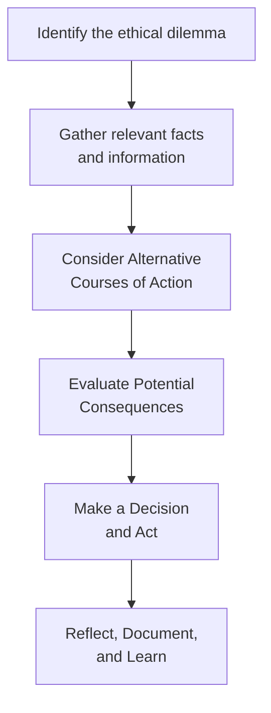

## Introduction and Context

Ethics are the bedrock of the investment profession. You can have all the technical skills in the world—like the ability to discount cash flows or build advanced investment models—but if you lose trust, well, you’ve essentially lost everything. In this section, we’ll explore several common ethical dilemmas you might face in finance, from conflicts of interest to potential insider trading. We’ll also walk step by step through an ethical decision-making framework that helps you map out possible courses of action, weigh the interests of all stakeholders, and select the best path forward. Whether you’re a seasoned pro or just starting out, these case studies give you a realistic taste of the ethical crossroads you might encounter.

## Case Study Method and Key Definitions

Before we dive into the scenarios, let’s get on the same page about a few definitions:

• Case Study Method: An educational approach using real or simulated scenarios to develop critical thinking and problem-solving skills.  
• Ethical Dilemma: A situation in which multiple viable courses of action conflict with moral values, leading to a tough decision.  
• Stakeholders: The individuals, organizations, or groups impacted by decisions—like clients, shareholders, colleagues, regulators, or even the broader public.  
• Organizational Culture: Shared values and norms within a firm that can seriously shape how you make decisions (for better or for worse).  
• Bias Awareness: Recognizing cognitive and emotional biases—like confirmation bias or overconfidence—that might prompt unethical or suboptimal decisions.  

## Common Ethical Pitfalls in Finance

Some pitfalls surface repeatedly in the financial industry. Knowing them and preparing yourself in advance will help reduce that “Uh-oh, how did I get here?” feeling when a tough situation arises. Key pitfalls often include:

• Insider Trading Temptations: Gaining or using material nonpublic information (MNPI) for personal gain or to benefit select clients.  
• Conflicts of Interest: Juggling personal, client, and employer interests—especially if you’re incentivized by commissions or bonuses that might color your advice.  
• Performance Misrepresentation: Overstating returns, cherry-picking results, or omitting unfavorable data to look more successful than reality.  
• Disclosure Lapses: Withholding relevant risk factors or disclaimers, or simply forgetting key details that clients expect you to share in good faith.  
• Client Confidentiality Breaches: Accidentally or intentionally sharing sensitive client information without proper authorization.  

## The Ethical Decision-Making Framework

Here’s a straightforward yet effective model you can use. It’s basically a series of steps you’d expect from the CFA Institute Code of Ethics and Standards of Professional Conduct, plus a sprinkle of everyday practicality:

```

```

1. Identify the Ethical Dilemma: Pinpoint what exactly is causing your suspicion or confusion. Are client interests being compromised? Are you being nudged to fudge an important detail?  
2. Gather Relevant Facts and Information: Look for guidance from professional standards, firm policies, regulatory requirements, or even speak to your compliance department.  
3. Consider Alternative Courses of Action: Examine various decisions logically and ethically.  
4. Evaluate Potential Consequences: Think about how your choice impacts the client, the firm, and your credibility.  
5. Make a Decision and Act: Decide on a course of action in line with the CFA Institute’s Code of Ethics and Standards of Professional Conduct (if you are bound by them), or other robust ethical frameworks.  
6. Reflect, Document, and Learn: Afterward, reflect on how the decision panned out. Did you do the right thing, or might you improve your process in the future?

## Case Study 1: Conflict of Interest in Client Recommendations

### Scenario
Imagine you’re an investment advisor at a medium-sized asset management company. One morning, your boss hands you a new “house fund” product and says, “Let’s move as many clients as possible into this. It’s great for everyone—plus there’s a higher bonus for you.” The fund’s performance is decent, but its fees are significantly greater than alternatives offering similar or even better results.

### Applying the Framework

1. Identify the Dilemma  
   You suspect a conflict of interest: you stand to personally benefit from recommending the house fund, but it may not be the best option for all of your clients.

2. Gather Relevant Facts  
   • Review the performance record and fee structure of the house fund vs. other client-appropriate funds.  
   • Check your firm’s policy on compensation and disclosures.  
   • Consult CFA Standard III (Duties to Clients) and Standard VI (Conflicts of Interest).  

3. Consider Alternatives  
   a. Recommend the house fund to everyone (maximum personal bonus).  
   b. Recommend the house fund selectively, where it legitimately fits the client’s objectives.  
   c. Decline to invest clients in the fund until the fees/performance structure is adjusted.  
   d. Disclose thoroughly, explaining the incentives and allowing the client to decide.  

4. Evaluate Potential Consequences  
   • If you push the fund aggressively, you might breach your fiduciary duty to clients. You also risk damaging client relationships if they learn about the steep fees and could question your integrity.  
   • If you refrain from recommending it altogether without explaining, your supervisor might accuse you of insubordination.  

5. Make a Decision and Act  
   A balanced approach might be: thoroughly disclose the compensation arrangement, highlight the fund’s attributes and its costs relative to the market, and suggest it only where it legitimately meets a client’s risk/return profile.

6. Reflect and Learn  
   After implementing your decision, monitor client satisfaction, performance data, and your relationship with your employer. Was your approach both ethical and transparent?  

### Reflection Question
How would you feel if you were on the client’s side of this transaction? Would full consideration of the client’s viewpoint change your decision-making process?

## Case Study 2: Temptation Toward Insider Trading

### Scenario
Let’s say you befriend a former classmate who now works in the finance department of a large tech company. Over dinner, they casually mention some hush-hush details about new product lines. They reveal the company’s upcoming marketing strategy—details definitely not public yet. You realize these details might have a huge impact on the company’s future stock price.

### Applying the Framework

1. Identify the Dilemma  
   You have access to undisclosed material information, courtesy of your friend’s slip.

2. Gather Relevant Facts  
   • Is the information truly material? Yes, new product lines can be extremely significant.  
   • Is it nonpublic? Absolutely—this is inside info.  
   • Double-check regulations (e.g., SEC in the U.S.). Familiarize yourself with Standard II (Integrity of Capital Markets), which firmly forbids insider trading.  

3. Consider Alternatives  
   a. Buy shares of the tech company immediately (illegal and unethical).  
   b. Share the info with select clients, or even family (again, illegal).  
   c. Abstain from trading or recommending trades based on the tip. Possibly put the stock on a restricted list if you’re in an advisory role.  

4. Evaluate Potential Consequences  
   • Trading on inside information is a violation of securities law and of virtually every code of professional conduct in finance. It can lead to fines, loss of license, prison time, and moral shame—plus your entire reputation is gone.  

5. Make a Decision and Act  
   Clearly, you neither trade on the info yourself nor share it further. Disclosure to compliance is often recommended.  

6. Reflect and Learn  
   Insider trading allegations can ruin careers. By refraining from using inside info, you reinforce trust in capital markets and uphold the highest ethical standards.

### Reflection Question
Have you considered that “everyone else” might be doing it? If so, how might that cultural rationalization default you into violating ethical standards?

## Case Study 3: Performance Misrepresentation

### Scenario
Your firm’s marketing team is eager to highlight your team’s success in an upcoming pitch to a major institutional investor. You genuinely have some strong performance data over the past quarter. However, a significant portion of that success is due to a single, extremely volatile stock that soared. Meanwhile, another portion of the portfolio underperformed. The marketing pitch deck wants to show only the top performers, ignoring the underperformers, giving the impression that these returns are normal and consistent across your strategies.

### Applying the Framework

1. Identify the Dilemma  
   Misrepresentation might occur if you endorse partial or misleading returns data.

2. Gather Relevant Facts  
   • Evaluate the complete set of performance numbers.  
   • Review GIPS (Global Investment Performance Standards) guidelines, or at least your local compliance rules.  
   • Check Standard V (Investment Analysis, Recommendations, and Actions) and Standard I(C) (Misrepresentation).

3. Consider Alternatives  
   a. Only present top-performing segments in the pitch.  
   b. Present the full picture, with disclaimers about volatility and time periods.  
   c. Include underperformers to reflect a balanced portrayal.  

4. Evaluate Potential Consequences  
   • Selective reporting could mislead investors and damage your firm’s credibility if discovered.  
   • Full disclosure might make your pitch less appealing initially, but fosters long-term trust and helps meet compliance obligations.  

5. Make a Decision and Act  
   Provide a transparent and balanced performance summary, clarifying single-stock impacts and overall volatility.  

6. Reflect and Learn  
   Was the investor satisfied with the honesty? How did your ethical choice shape your long-term relationship?

### Reflection Question
How would concealing underperformance affect your credibility if uncovered later? Is the short-term gain worth the long-term risk?

## Comparing and Contrasting Approaches

Sometimes you’ll see colleagues adopt drastically different approaches to the same ethical crossroads. One might say, “We can’t risk losing this investor, so we’ll show them only the best!” while another insists, “We must remain transparent and balanced, no matter what.” These contrasting attitudes highlight the significance of having a consistent set of principles—like the CFA Institute Code and Standards—to guide you. When employees or managers handle ethical issues erratically, it sends confusing messages that erode trust within teams and with clients.

## Implications for Client Trust, Firm Reputation, and Personal Integrity

• Client Trust: Your ability to retain business and attract new clients is directly tied to whether people trust you. Even a small slip—like failing to properly disclose a conflict of interest—can destroy that trust.  
• Firm Reputation: Firms known for high ethical standards typically flourish over the long run, enjoying more stable client relationships and fewer regulatory headaches.  
• Personal Integrity: Being able to face yourself—and your colleagues—honestly at the end of the day is priceless. Once you tarnish your integrity, living with that shadow can be pretty tough.

## Role of the CFA Institute Code of Ethics and Standards of Professional Conduct

The CFA Institute’s Code of Ethics and Standards of Professional Conduct isn’t just a box you check for exam day. It provides you with an invaluable, globally recognized philosophy and set of benchmarks for professional behavior. The Code addresses:  
• Duties to Clients (Standard III).  
• Conflicts of Interest (Standard VI).  
• Integrity of Capital Markets (Standard II).  

These guidelines help you navigate awkward, gray areas by pointing you toward transparency, loyalty, diligence, and objectivity. They also encourage you to consult supervisors or legal counsel when you’re truly stuck.

## Structured Feedback and Reflection Protocol

In many ethical dilemmas, biases or organizational pressures pull you in different directions. It’s important to build in a personal or team-based reflection mechanism:

• Pause and reflect: “Wait, am I more worried about losing my bonus than serving the client’s best interest?”  
• Seek external viewpoints: “Let me check with a mentor, or read the relevant standard again. Maybe my emotional response is overshadowing logic.”  
• Be mindful of cultural or organizational norms: “Does my firm encourage us to hustle for higher commissions at the expense of professional duties?”  

Regularly journaling your decisions or “ethical triggers” can help you spot patterns of pressure—like a boss who repeatedly pushes you to act in questionable ways, or your own inclination to cut corners when deadlines loom.

## Exam Relevance

Ethical decision-making remains a vital component not just in professional life but also across all levels of the CFA exam. Expect scenario-based questions that test your application of the CFA Institute Code and Standards. In constructed-response or item-set formats, you might be asked to:

• Identify which Standard is violated by hypothetical behaviors (e.g., insider trading or misrepresenting performance).  
• Evaluate recommended actions.  
• Suggest the most appropriate, ethically sound course of action.  

Always anchor your responses to the underlying principles: loyalty to clients, fair dealing, confidentiality, maintaining market integrity, and independent judgment. The exam is designed to ensure you can apply these standards in real-world contexts—and that’s exactly why this topic matters so much.

## Final Thoughts on Continuous Ethical Awareness

From everything we’ve covered, it’s hopefully clear that ethical practice is not a one-and-done exercise. Being honest and transparent gets easier when it’s part of your day-to-day culture—both personal and organizational. Keeping an eye on your own biases, having open conversations about moral principles, and consistently applying well-established guidelines will serve your clients, your firm, and your own conscience. And yes, these same principles can provide a competitive advantage in the long run, as stakeholders often prefer to work with those they know they can trust over the long haul.

## References, Suggested Readings & Resources

• CFA Institute Code of Ethics and Standards of Professional Conduct.  
• Harvard Business Review: Case Study Guides on Ethical Leadership.  
• Journal of Business Ethics: Peer-reviewed articles on real-world ethical challenges.  
• “Giving Voice to Values” by Mary C. Gentile (methodology for ethical dilemmas).  
• GIPS Standards (for performance presentation integrity).

-------------------------------------------

## Test Your Knowledge: Ethical Dilemmas in Finance



### Which of the following is a key step in an ethical decision-making framework?

- [ ] Ignoring alternative courses of action
- [ ] Seeking quick compliance approvals only
- [ ] Focusing on short-term personal gain
- [x] Evaluating potential consequences for stakeholders

> **Explanation:** A robust framework encourages you to consider various perspectives, especially the consequences for key stakeholders like clients, colleagues, and your firm’s reputation.

### If you learn about a company’s undisclosed product launch from a friend at the company, what is the most ethical option?

- [ ] Trade on it cautiously so you don't raise suspicion
- [ ] Post about it on social media before acting
- [ ] Recommend your clients buy shares discreetly
- [x] Refrain from trading or recommending trades on that information

> **Explanation:** Trading on insider (material nonpublic) information is a serious violation of Standard II (Integrity of Capital Markets) and securities law.

### In the context of Case Study 1, if you push the firm’s “house fund” to every client without analyzing their needs, which CFA Standard are you most likely violating?

- [x] Standard III (Duties to Clients)
- [ ] Standard I(A) (Knowledge of the Law)
- [ ] Standard VI(B) (Priority of Transactions)
- [ ] Standard II(A) (Material Nonpublic Information)

> **Explanation:** By not considering the individual objectives and constraints of each client, you fail your duty of loyalty, prudence, and care.

### Misrepresenting performance data to attract new investors primarily violates which principle?

- [ ] Standard VII(A) (Conduct as Member)
- [x] Standard I(C) (Misrepresentation)
- [ ] Standard IV(A) (Loyalty)
- [ ] Standard V(C) (Record Retention)

> **Explanation:** Misrepresentation includes any untrue statement or omission that can mislead investors or stakeholders about your performance.

### According to the CFA Institute Code of Ethics and Standards, which practice best fosters trust between a firm and its clients?

- [x] Providing full disclosure of fees and conflicts of interest
- [ ] Emphasizing house funds for commissions
- [x] Presenting both positive and negative performance data
- [ ] Relying solely on marketing spin to influence decisions

> **Explanation:** Comprehensive disclosure, transparent fee structures, and balanced performance reporting reinforce client trust and adhere to ethical standards.

### When confronted with insider information but uncertain if it is material and nonpublic, what is the best first step?

- [x] Consult your compliance department or legal counsel
- [ ] Trade immediately before the opportunity disappears
- [ ] Ask your friend for more details to confirm
- [ ] Wait for the media to break the story, then trade

> **Explanation:** Clarifying the status of the information with the right departments helps ensure you remain compliant with the law and professional standards.

### Which behavior might suggest an organizational culture that undermines ethics?

- [x] High-pressure bonus structures focusing on short-term sales
- [ ] Reinforced training on the Code of Ethics
- [x] Colleagues who say, “Everyone does it, don’t worry!”
- [ ] Encouraging open discussions on ethical dilemmas

> **Explanation:** When a firm environment emphasizes sales at all costs and dismisses accountability, ethical standards are likely to erode.

### What is the best reason to document your decisions in an ethical dilemma?

- [x] To create a record of your rationale and compliance with standards
- [ ] To shift blame to someone else if the decision goes wrong
- [ ] To impress clients with your attention to detail
- [ ] To avoid using a formal ethical decision-making framework

> **Explanation:** Documenting your decision-making ensures transparency, consistency with the Code and Standards, and provides evidence of due diligence if questions arise later.

### In preparing performance materials under GIPS, what is a key ethical consideration?

- [x] Presenting composite-wide performance rather than selective results
- [ ] Reporting only your best-performing composite
- [ ] Avoiding mention of fees and constraints
- [ ] Aggregating data from unrelated strategies

> **Explanation:** GIPS requires accurate, consistent, and complete performance presentation. Cherry-picking top performers induces misleading performance claims.

### True or False: Ethical considerations in finance are only about following the law.

- [x] True
- [ ] False

> **Explanation:** Adhering to the law is crucial, but ethical practice goes beyond mere legal compliance. It involves maintaining fairness, honesty, and integrity to uphold trust and professional standards.


