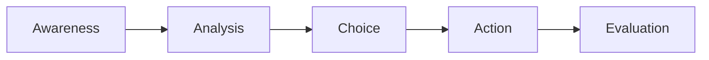

## Introduction
Ethical decision making is at the heart of professional excellence in finance—and honestly, it's also one of those things that can keep you up at night if you’re unsure whether you made the right call. Sometimes, you hear a colleague say, “Well, everyone else does it, so it must be okay,” and a little red flag goes off in your head that something feels off. That’s exactly the moment when an effective ethical framework can truly save the day. By methodically walking through each step of an ethical decision-making process—starting with heightened awareness, moving through analysis, and continuing all the way to evaluation—you set yourself up to remain consistent, professional, and aligned with the highest standards of the industry.

In this article, we’ll explore a clear five-phase process for making sound ethical decisions, highlight the role of professional skepticism, and examine how organizational controls and leadership—like mentorship programs and ethics committees—further reinforce ethical integrity. We'll also dive into the challenges that can blow us off course, such as tight deadlines or misaligned incentives, and talk about frameworks (utility-based, rights-based, and virtue-based) that help shape your moral reasoning. Let’s jump right in.

## The Role of Professional Skepticism
Professional Skepticism is a critical element in ensuring you’re not simply accepting data or assurances at face value. It’s essentially that healthy dose of doubt that makes you say, “Wait a minute—could there be more to this?” Particularly in fast-moving sectors like portfolio management, private equity, or capital markets, data might arrive from sources with uneven credibility. A questioning mindset helps you spot red flags or inconsistencies before they balloon into catastrophes.

From personal experience, I once worked on a project where transaction data seemed consistent—but some metrics were almost too stable. It felt suspiciously “perfect.” That triggered deeper inquiries, and we discovered that some revenue figures were being recognized on questionable timeframes. Without that initial spark of skepticism, the discrepancy might have slipped through. In practice, you often see folks lowering their guard when someone’s “nice” or when you’re under time constraints. Professional skepticism is your built-in safeguard against such vulnerabilities.

## The Five-Phase Ethical Decision-Making Process
One widely recognized model for systematic ethical decisions involves five core phases: Awareness, Analysis, Choice, Action, and Evaluation. Each phase builds on the previous one, helping you navigate ethically ambiguous or high-stakes situations.



### Phase 1: Awareness
Awareness is about identifying that you’re in a position where ethics actually matter. This might be triggered by an uncomfortable gut feeling, something a client said that conflicts with your sense of fairness, or a conversation where colleagues pressure you to cut compliance corners. Recognizing these signals—and acknowledging them rather than brushing them aside—is the crucial first step.

In the investment world, the concept of “fiduciary duty” frequently triggers an ethical awareness. When you feel friction between the client’s best interest and the firm’s short-term gain, that’s a glaring sign you need to engage your ethical compass.

### Phase 2: Analysis
In analysis, you collect, study, and interpret information relevant to the potential ethical dilemma. It’s very much like building an investment thesis—except this time, you’re not just analyzing stock fundamentals or macroeconomic variables, but the moral, legal, and professional aspects of a decision. Professional conduct guidelines, such as the CFA Institute Code and Standards, are excellent reference points here, as they can clarify your responsibilities regarding client confidentiality, fair dealing, and more.

For instance, if your firm’s incentive structure seems to encourage you to promote a particular product that may not be suitable for all clients, analyze the potential impact on different stakeholders. Are certain clients at risk of unexpected losses? Who benefits from this structure? You might also want to review relevant regulations or consult with your firm’s Ethics Committee—a group specifically tasked with overseeing ethical matters and guiding organizational policies.

### Phase 3: Choice
Choice is about deciding on a specific course of action. At this point, you have weighed the stakeholder interests, possible outcomes, and compliance implications. You’re aware of the professional norms and legal requirements in your jurisdiction. Now you must pick the path that best aligns with your ethical obligations.

In practice, you might decide to recommend a different product that aligns more closely with your client’s risk profile—even if it might mean a smaller commission. Or, if you suspect inaccuracies in performance reporting, you could choose to escalate these concerns to a compliance officer. The key is to remain transparent while staying true to your moral and professional duties, even under pressure.

### Phase 4: Action
Action means implementing the decision you’ve chosen. Sometimes it’s simple, like updating a client’s portfolio. But other times, it requires more courage—maybe you have to speak up in a meeting where higher-ups are convinced that an ethically questionable approach will yield bigger profits. Implementation is where ethical behavior truly manifests. It’s one thing to “know” the right thing to do; it’s another to actually do it when it counts, especially under time pressure or potential career implications.

### Phase 5: Evaluation
Finally, reflect on the outcome of your decision. Did it unfold as you expected? Did you mitigate unintended consequences? Did the process reveal any organizational weaknesses, such as misaligned incentives that might lead others to questionable behavior in the future? Evaluation is an ongoing cycle: the insights you gain here feed into your awareness for the next ethical challenge.

Evaluation can be especially helpful when you involve peers or mentors in a retrospective discussion. Documenting your rationale helps create a paper trail for accountability and can serve as a learning resource for your team. This fosters an environment where ethical clarity is prized, and mistakes become opportunities to improve.

## Strengthening Ethical Behavior Through Organizational Support

### Importance of Internal Controls
Robust internal controls are like those guardrails on a winding mountain road: they keep you from tumbling off the cliff when the path gets treacherous. In finance, strong controls might include formal policies on how and when to recognize revenue, limits on discretionary trading authority, or mandatory compliance checklists. By clarifying the “rules of the road,” these controls guide employees to remain on track.

For example, an investment firm might implement a requirement that any new product must pass an appropriateness review with the risk and compliance teams. This structure encourages employees to align with client interests rather than just pushing for a quick sale.

### Mentorship, Ethics Committees, and Open-Door Policies
To sustain an ethical culture, organizations often rely on:

• Mentorship Programs: Pairing junior analysts with seasoned professionals who can demonstrate real-life application of ethical standards.  
• Ethics Committees: A formal body (sometimes including board members and senior management) that investigates violations, clarifies policies, and offers channels for confidential reporting.  
• Open-Door Policies: Encouraging employees to speak freely with managers or compliance officers without fear of retribution.

Let’s say you discover a data integrity issue in performance reporting. Instead of feeling trapped and wondering if blowing the whistle will cost you your job, you can approach your Ethics Committee or compliance officer. These support structures reduce the fear that often prevents people from raising their voices about potential misconduct.

## Ethical Frameworks in Finance
When you’re trying to figure out what “the right thing” actually means in a complex scenario, it helps to consult structured frameworks. Although each framework has its own nuance, all three below can shed light on ethical dilemmas:

| Framework          | Focus                                             | Potential Strength                                         | Potential Weakness                                        | Finance Example                                                                    |
|--------------------|--------------------------------------------------|------------------------------------------------------------|-----------------------------------------------------------|------------------------------------------------------------------------------------|
| Utility-Based Ethics | Greatest good for the greatest number            | Prioritizes total well-being, can guide cost-benefit trade-offs | May overlook minority rights, could condone short-term pain for long-term gain | Evaluating a new investment product’s net benefit to various stakeholders         |
| Rights-Based Ethics | Protection of fundamental rights and liberties    | Clearly defines “bright line” rules that preserve individual freedoms | Can be inflexible, might ignore overall benefits if they clash with certain rights | Avoiding data misuse. If client privacy is a right, you must never violate it.    |
| Virtue Ethics      | Focus on moral character and integrity            | Encourages consistent ethical standards in all decisions   | May be subjective in determining what is “virtuous”       | Ensuring that honesty is always maintained, even under intense competitive pressure |

These frameworks aren’t mutually exclusive. In fact, many finance professionals integrate aspects of each. For example, you might first consider whether a decision upholds a client’s fundamental rights (rights-based), then weigh the broader impact on markets and society (utility-based), and finally check if the decision aligns with your personal and professional virtues, like honesty and fairness (virtue ethics).

## Overcoming Common Obstacles
If you’ve worked in finance for any length of time, you know that obstacles to ethical behavior pop up more than we’d like to admit. Some of the biggest culprits include:

• Time Pressure: Deadlines for trades, product rollouts, or quarterly reporting can push people to make hasty decisions.  
• Hierarchical Constraints: When your boss says, “We’re all on board; don’t rock the boat,” it can be intimidating.  
• Misaligned Incentives: A commission-based structure that rewards short-term results might undermine an adviser’s duty to recommend the best product for the client’s long-term interests.  

Addressing these challenges involves a combination of personal commitment (e.g., building your own moral courage), structural adjustments by the organization (e.g., rethinking incentive structures), and clear, open communication. In many cases, managers must model the right behavior to break the cycle of “it’s-always-been-done-this-way.”

### Mini Python Example: Checking Alignment of Incentives
Below is an overly simplified Python snippet that demonstrates a quick check to see if incentive structures might foster ethical conflicts. It’s obviously a toy example, but it shows how you might quickly do a “sanity check” on data:

```python
# Key = Employee Name, Value = Commission Rate
incentives = {
    'Alice': {'commission_rate': 0.07, 'ethical_check': True},
    'Bob': {'commission_rate': 0.10, 'ethical_check': False},
    'Carol': {'commission_rate': 0.05, 'ethical_check': True}
}

for employee, data in incentives.items():
    if data['commission_rate'] >= 0.08 and not data['ethical_check']:
        print(f"Warning: {employee}'s commission rate may be too high and misaligned with policy.")
    else:
        print(f"{employee} appears fine.")
```

While this snippet is rudimentary, the takeaway is that you might use simple checks to flag potential misalignments—like extremely high commissions that push staff to recommend products that might not always be in clients’ best interests.

## The Value of Transparency and Documentation
Transparency is your secret weapon in creating accountability and building trust. Maintaining a clear record of decisions ensures that you can explain—and, if needed, defend—your rationale to relevant stakeholders. Whether it’s based on a utility-based argument (showing total benefits outweigh costs) or a rights-based approach (demonstrating fairness to all clients), ensuring solid documentation is key.

Documentation might involve:

• Writing a memo on why a particular strategy or product is suitable for a client.  
• Keeping a voluntary “decision journal” that notes relevant factors, alternatives considered, and the final choice.  
• Updating compliance records to reflect your decision process.  

In the unfortunate event of an investigation or dispute, these records help show that you acted in good faith and with due diligence.

## Mentorship and Cultural Reinforcement
Ethics isn’t a box-checking exercise; it’s a habit that grows within an organizational culture. Mentorship programs link junior professionals to more experienced mentors who can illustrate how to handle ethically charged situations. Working side by side, you observe how senior colleagues live out the Code of Ethics or handle tough calls.

Additionally, an “ethics buddy” system can be beneficial: pairing individuals to discuss tricky scenarios, offer feedback, and reinforce the habit of thinking things through. The more comfortable people feel discussing ethical dilemmas in a nonpunitive, encouraging environment, the stronger the entire firm’s ethical culture becomes.

## Putting It All Together with the CFA Institute Code and Standards
Professional conduct guidelines, such as the CFA Institute Code of Ethics and Standards of Professional Conduct, serve as sturdy signposts. Standard I, dealing with professionalism, underscores the duty to always act with integrity. Standards concerning responsibilities to clients, employers, and the broader financial market give you a reference for day-to-day practice. When in doubt, you can look at these Standards to clarify where ethical obligations lie in everything from trading practices to conflicts of interest.

Moreover, the Code and Standards encourage you to balance client interests with public trust in capital markets. They require ongoing reflection—did you handle a trade properly, or is there a potential conflict you should disclose? By checking actions against these established principles, you reduce the guesswork in uncertain situations.

## Exam Relevance
At Level I of the CFA Program, ethical decision making is foundational. You’ll encounter item-set questions styled around hypothetical scenarios, testing whether you can identify violations of the Code and Standards. Some questions may present real-life predicaments like:

• A portfolio manager receiving gifts from a client—does this compromise objectivity?  
• A research analyst pressured to change a rating—are they breaching the duty of independence?  
• An adviser deciding between two products—one with a higher commission but lower expected return for the client, or another with a lower commission but better alignment for the client’s risk tolerance.

Learning to apply an ethical framework swiftly, while referencing the Standards, is crucial for answering these scenario-based questions correctly. In the real world, these same frameworks and standards guide your daily decisions, so you’re effectively preparing for both the exam and your professional life at the same time.

## Final Exam Tips
• Practice Scenario Analysis: Get comfortable reading mini-case examples and walking through the awareness-analysis-choice-action-evaluation framework in your head.  
• Link to the Code and Standards: Cross-check each major action with the relevant Standard. This is a go-to exam strategy, as it’s exactly what the exam expects of you.  
• Beware of Tricky Distractors: It’s easy to be lured by answer choices that sound legal or “technically correct” but are still unethical. Always circle back to the question: “Does this uphold integrity and fairness?”  
• Document the Steps in Your Mind: Even if it’s just mental notes, enumerating your reasoning helps you articulate your answer more coherently. On the real exam, well-organized thinking often leads to well-structured responses.  
• Pay Attention to Hierarchy and Incentives: Many exam scenarios revolve around how misaligned incentives lead to questionable actions. If you spot that in a question, it’s probably a significant clue.

## References and Suggested Readings
• The CFA Institute’s Ethical Decision-Making Framework (online modules).  
• Velasquez, Manuel G. “Business Ethics: Concepts and Cases.”  
• O’Reilly, James T. “Compliance Management: A How-to Guide for Executives, Lawyers, and Other Compliance Professionals.”  
• Ethics resource websites, such as the Ethics & Compliance Initiative (www.ethics.org).  

---

### Glossary
• Professional Skepticism: Exercising caution, critical assessment, and inquiry in professional activities.  
• Ethics Committee: A group charged with overseeing ethical standards, investigating violations, and guiding organizational policies.  
• Utility-Based Ethics: Decision-making focused on maximizing overall benefits (“the greatest good for the greatest number”).  
• Rights-Based Ethics: Emphasizes the protection of fundamental rights (e.g., confidentiality, fairness, autonomy).  
• Virtue Ethics: Emphasizes moral character and integrity over purely consequential outcomes.  
• Incentive Alignment: Structuring rewards so that ethical, client-focused decisions are encouraged and rewarded.  

## Test Your Knowledge: Ethical Decision-Making Essentials



### Which of the following practices best demonstrates “Professional Skepticism” in evaluating potential investment opportunities?

- [x] Critically questioning overly consistent metrics in a firm's financial statements.
- [ ] Automatically trusting data presented by a CEO because of her strong reputation.
- [ ] Using the same market assumptions as the rest of the industry.
- [ ] Ignoring small discrepancies if time is tight.

> **Explanation:** Critically questioning unusually consistent metrics reflects a healthy dose of skepticism. Simply accepting information or ignoring inconsistencies can expose you to major risks.

### Which of the following is the best first step in an Ethical Decision-Making Process?

- [ ] Collecting all relevant documentation.
- [ ] Escalating the situation to the supervisor.
- [x] Recognizing that an ethical dilemma exists.
- [ ] Choosing the action that maximizes overall profit.

> **Explanation:** The most essential first step—“Awareness”—ensures you realize a potential ethical conflict exists before you take action.

### A firm’s Ethics Committee is generally responsible for all of the following EXCEPT:

- [ ] Clarifying ethical policies within the organization.
- [x] Designing new financial products to maximize client returns.
- [ ] Investigating suspected violations of the Code of Ethics.
- [ ] Offering a confidential channel for reporting misconduct.

> **Explanation:** While an Ethics Committee provides guidance and investigates violations, it does not design financial products. That’s typically a function of product development or portfolio management teams.

### Under a Rights-Based Ethics framework, which principle becomes paramount in decision making?

- [ ] Maximizing overall shareholder returns.
- [ ] Following senior management directives.
- [x] Preserving fundamental liberties and entitlements.
- [ ] Seeking the highest short-term yield.

> **Explanation:** Rights-Based Ethics puts the protection of rights and liberties first, sometimes above considerations like maximizing returns.

### In the context of ethical decision making, which of the following is a common symptom of misaligned incentives?

- [x] Employees receiving high commissions for unsuitable product sales.
- [ ] A simplified review process for product approvals.
- [x] An environment that rewards short-term gains over client-centric strategies.
- [ ] Explicit focus on risk management in portfolio construction.

> **Explanation:** Incentive Alignment means encouraging decisions that are aligned with client interests. If employees gain significantly from pushing certain products, or if emphasis is on short-term over client well-being, it indicates misaligned incentives.

### Which element of an investment firm’s structure is most likely to encourage open-minded discussions about ethical dilemmas, even if they involve potentially uncomfortable topics?

- [x] An open-door policy.
- [ ] Strict hierarchical reporting lines.
- [ ] Only performance-based compensation.
- [ ] Rigid product sales quotas.

> **Explanation:** An open-door policy fosters an environment where employees can raise ethical concerns without fear of retaliation, unlike rigid hierarchies or purely performance-based rewards.

### Which phase of the Ethical Decision-Making Process involves reflecting on whether the intended outcomes were achieved and identifying areas for improvement?

- [x] Evaluation
- [ ] Analysis
- [x] Choice
- [ ] Awareness

> **Explanation:** The final stage is Evaluation, where you analyze the effectiveness of your decision, learn from the result, and document recommendations.

### How might “Virtue Ethics” be applied in evaluating a sudden opportunity to recommend high-commission, high-risk products?

- [x] Ask whether selling these products aligns with your integrity and moral character.
- [ ] Compare expected returns and ignore the minority who might be harmed.
- [ ] Follow the standard practice in your industry without question.
- [ ] Prioritize only total profit potential for the firm.

> **Explanation:** Virtue Ethics stresses moral character and consistent integrity in one’s professional conduct. A purely profit-driven approach can conflict with virtue-based reasoning.

### What is a key benefit of maintaining thorough documentation when making an ethical decision?

- [x] It provides a clear rationale that can be reviewed, audited, or defended if necessary.
- [ ] It reduces time spent on due diligence.
- [ ] It immediately resolves any ethical conflicts.
- [ ] It guarantees high returns for all stakeholders.

> **Explanation:** Documentation helps create transparency and accountability, offering evidence of your decision rationale. It doesn’t automatically resolve conflicts or guarantee returns.

### In the CFA Institute context, why are individuals encouraged to cross-check decisions with the Standards of Professional Conduct?

- [x] To ensure daily actions align with globally recognized guidelines.
- [ ] To eliminate the need for personal insight or moral reasoning.
- [ ] To prioritize immediate profit goals above all else.
- [ ] To remove any potential oversight from colleagues or supervisors.

> **Explanation:** The CFA Institute Standards provide a well-respected, globally applicable framework. Checking decisions against these Standards helps you maintain consistency and integrity in professional activities.


