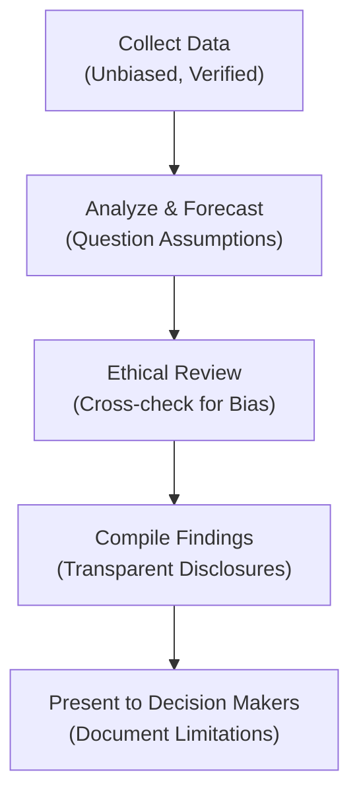

It’s easy to think of ethics as an abstract set of rules that only come out of the closet when something goes wrong. But in reality, ethics should influence every aspect of our day-to-day investment decisions—just like little guardrails that keep us from drifting off the path. You’d be surprised how often unconsciously biased forecasts or hurried analyses lead to poor outcomes for both investors and clients.

Below, we’ll explore practical ways to embed ethical considerations into your daily routine as an analyst or portfolio manager. We’ll also walk through red flags that signal integrity issues, show how to keep your data (and your assumptions) transparent, and highlight a few real-life stories that prove just how important it is to keep ethics at the forefront.  

## Embedding Ethics in the Research Process

An ethical approach to investment research starts long before you run your first data query or pick a valuation model. It includes:
• Being aware of potential biases (both personal and industry-wide).  
• Continuously questioning your assumptions.  
• Staying transparent when you're uncertain about forecasts or the validity of inputs.

In my early days as a junior analyst, I remember a colleague frantically asking me to “tweak” an assumption in our discounted cash flow (DCF) model because it was “just a bit too conservative.” Maybe you’ve been there: the team is under pressure from a manager or a client to show more favorable numbers. You feel the subtle nudge to adjust the discount rate or inflate the growth forecast. It might look harmless to shave a few basis points off the cost of capital, but that sliver can ultimately distort reality.

Below is a simple outline of the research process when done ethically. Notice how built-in checks and reviews help safeguard integrity:



Each step aims to reduce “Valuation Bias,” or the systematic error that skews assets’ fair values when subjective judgments take over. By scheduling an “Ethical Review” as its own checkpoint, researchers and supervisors can formally check if each assumption is reasonable, consistent with industry benchmarks, and aligns with the client mandate.

## Spotting Red Flags

Sometimes, you’ll notice signals that suggest compromised integrity:

• Pressure to produce favorable results.  
• Downplaying or ignoring conflicting data.  
• Skimming over disclaimers or disclaimers that seem buried and inaccessible.  
• Minimal scrutiny of outliers or strange modeling outputs.  
• Reviewers who never question the assumptions.  

Let’s say you’re building an equity research report for a major client. All data except one piece points to strong earnings growth. The outlier data suggests something different—maybe a potential decline in a key market. Fully ethical practice requires that you openly address that conflicting data. You’ll want to say: “Although our main scenario suggests a 10% earnings growth next year, there is a conflicting data set from Region X that shows stagnating consumer demand.” Sure, it might dampen the overall result, but omitting it is a huge ethical misstep.

## The Importance of Due Diligence

As much fun as modeling can be (and I use “fun” loosely here), doing your homework—also known as “Due Diligence”—isn’t optional. Due diligence means verifying data sources, confirming assumptions, cross-checking with industry benchmarks, and questioning any extraordinary findings that come across your desk.

• Double-check the credibility of each data point.  
• Compare your assumptions with historical norms and peer group projections.  
• Evaluate the full quotient of risk factors that might alter your forecasts.  
• Keep thorough records of data sources so you can defend them later if called upon.

This might feel like an extra layer of drudgery, but skipping it is a sure path to trouble—both legal and reputational. Let’s imagine you rely on a vendor that frequently revises their data without telling you. If you fail to confirm that your numbers are the most up-to-date, your analysis might misrepresent the investment’s fundamentals. A single oversight could lead to losses for clients and a ding on your professional record.

## Client Mandates and Putting Client Interests First

Whether your role is in asset management or private wealth, your highest priority is to align your work with the client’s instructions, known as the “Client Mandate.” These mandates define the client’s risk tolerance, investment objectives, and constraints. Ethically, you’re obligated to ensure that your daily activities—your stock picks, portfolio allocations, or strategy proposals—remain consistent with this mandate.

For example, if a client wants to avoid investing in tobacco or firearms producers, it’s your job to steer clear of those industries, no matter how profitable they appear on your Excel spreadsheet. Or if you see a “hot tip” that might conflict with your client’s mandate for stable, long-term growth, you need to check that the risk profile matches what they’ve expressed. Sometimes temptation or short-term gains cloud your judgment, and that’s where robust ethical grounding can steer you back on track.

## Real-Life Examples of Misreporting

We all recall high-profile cases where inflated valuations or outright fraudulent numbers toppled entire companies. Perhaps the most famous example, Enron, showcased how complex business structures, hidden debt, and questionable partnerships can create illusions of profitability. Analysts who didn’t dig deep enough overlooked red flags and disclaimers. The result? A major scandal, lawsuits, and a wave of regulatory changes.

An even simpler real-life example might be a local hedge fund manager overstating returns for a new real estate product to attract investors. Over time, these small misrepresentations snowball. When the real performance eventually comes to light, trust is shattered, and the manager might face civil or criminal penalties—along with losing the ability to ever work in finance again.

The lesson here? Short-term gains from bending the truth or ignoring anomalies can quickly turn into long-term disaster. Thorough due diligence, transparent disclosures, and respect for legal frameworks are not only the ethical path but also the sustainable one.

## Technology’s Role and the Need for Human Oversight

Let’s face it: new technologies like AI-driven analytics, automated modeling software, and advanced portfolio optimization tools have taken center stage. They help you parse large volumes of data, run thousands of forecast scenarios, and identify opportunities at lightning speed. However, these tools also come with “Model Risk”—the potential for misuse or misunderstanding of financial models leading to inaccuracies or unethical outcomes.

Picture a scenario where an AI system is trained on historical market data that is biased—maybe it underrepresents certain industries or economic cycles. The AI might produce systematically flawed recommendations. If you blindly trust its outputs, you could be making unethical or simply terrible decisions. While it’s tempting to let the machine decide everything quickly, keep in mind that you, the human analyst, are the final line of defense. You should question the results, compare them to fundamental principles, and watch for anomalies or conflicts with the client’s best interests.

## Using Disclaimers and Disclosures

“Disclosure” means providing clear, accurate information to all relevant parties—in line with both legal and ethical standards. And let’s be honest, disclaimers can sometimes feel like tedious boilerplate at the end of a presentation or email. But skipping them, cutting them short, or burying them in 10-point font with half the text missing is a big no-no. Transparent disclaimers protect you, your client, and your firm. They communicate:

• Potential conflicts of interest.  
• Underlying data limitations.  
• The inherent uncertainty of financial forecasts.  
• Any relevant relationships with the company or sector being analyzed.

When disclaimers are robust and openly discussed, your clients understand the context better. They see that you’re not promising guaranteed returns or ignoring the possibility of negative outcomes. That clarity builds trust, which is the foundation of ethical professionalism.

## Recordkeeping Protocol

Having a solid recordkeeping protocol might sound about as exciting as watching paint dry. However, reliable documentation not only fulfills legal obligations but also serves as a best friend when you need to back up your reasoning. Imagine that six months from now, your recommended equity pick starts underperforming. The client or your supervisor asks, “Hey, what happened? You told us we’d see stable returns.” With well-kept records, you can show the initial research, the disclaimers you provided, the scenario analysis you did, and any risk factors you highlighted. That can be invaluable in explaining performance and defending your due diligence.  

## Integrating Ethics into Forecasting Models

Since we’ve been talking about modeling, let’s consider a brief formulaic representation of a Discounted Cash Flow (DCF) approach common in equity analysis, shown in KaTeX for clarity:


\text{Equity Value} = \sum_{t=1}^{T} \frac{FCFE_t}{(1 + r)^t}


Where:  
• \\( FCFE_t \\) is the forecasted free cash flow to equity in period \\( t \\).  
• \\( r \\) is the cost of equity (or required rate of return).  

In an ethically grounded approach, you:  
1. Disclose your assumptions for \\(FCFE_t\\) (growth rates, margins, etc.).  
2. Justify the choice of the discount rate \\(r\\).  
3. Include disclaimers around forecasting limitations.  
4. Run sensitivity analyses to show best and worst-case outcomes.  
5. Document it all in a manner that’s transparent and reviewable.

Similarly, if you use Python or another programming language for automation, consider embedding ethics checks into your code. For instance, you might add a snippet that ensures consistent discount rate ranges or flags if the final valuation diverges beyond a certain threshold from the industry average:

```python
import numpy as np

def check_ethical_range(value, min_val, max_val):
    if value < min_val or value > max_val:
        print("Ethical Warning: Value out of standard bounds.")
    else:
        print("Valuation within a normal range.")

discount_rate = 0.05
check_ethical_range(discount_rate, 0.03, 0.12)
```

This simple function obviously won’t fix your ethics for you, but at least it might provide an extra nudge to verify that your assumptions aren’t drifting into fantasy territory.  

## Practical Steps for Maintaining Objectivity

• Conduct Peer Reviews: Encourage colleagues to question your assumptions.  
• Maintain a “What Could Go Wrong?” Journal: Jot down the worst-case scenarios you can imagine and highlight how you are preparing for them.  
• Use External Benchmarks: Compare your forecasts with consensus estimates or historical norms—then explain big divergences.  
• Revisit Your Model Regularly: Evaluate your line items over time to ensure they still make sense given new market data.  
• Stay Educated: Keep up on the CFA Institute’s periodic updates, GIPS standards, and best practices in your industry.  

## Additional Case Scenarios

1. The Overly Optimistic Team Leader  
   A portfolio manager urges the team to present only the most bullish scenario to a new client. The manager believes emphasizing potential downsides will scare the client away. Proper ethics says you must lay out all relevant scenarios—positive and negative—for an accurate decision-making process.

2. Data Source Mix-Up  
   An analyst inadvertently uses last year’s data for a sector analysis without noticing the vendor had revised the series. Post-analysis, the new results drastically differ, and the analyst is tempted to hide the revision discrepancy. Ethically, the right move is to correct the record, update the analysis, notify key stakeholders, and explain the source mix-up.

## Conclusion and Exam Relevance

Integrating ethics into daily investment analysis isn’t just a “nice to have”—it’s arguably the cornerstone of trust in the financial industry. As a CFA Level III candidate, you’re expected to demonstrate not just your knowledge of financial theories and models but also your commitment to thorough, transparent, and client-centered methods.

On the exam, you might see scenario-based essays or item sets testing your ability to spot ethical pitfalls in a research report or a client proposal. You could be asked how to handle conflicting data or what steps to take if your supervisor insists on a biased outcome. The best approach is to stand by the CFA Institute Code and Standards: keep your analysis objective, disclose conflicts, maintain thorough documentation, and place client interests first.

When ethics guide you at each stage—from data collection to communication of results—you minimize risk, preserve reputation, and uphold the professional standards fundamental to the CFA community.

## References, Suggested Readings & Resources

• CFA Institute Investment Analysis Tools and Resources  
• Global Investment Performance Standards (GIPS®) Handbook  
• Security Analysis by Benjamin Graham & David Dodd  
• Professional ethics and compliance training modules in financial modeling software platforms  

---
## Test Your Knowledge: Ethical Investment Analysis Quiz



### Which of the following best describes "due diligence" in daily investment analysis?

- [ ] The push to generate a high target price regardless of underlying assumptions  
- [x] A comprehensive appraisal of an investment to establish its viability  
- [ ] A quick check of only readily available data  
- [ ] A one-time regulatory requirement that does not apply to ongoing research  

> **Explanation:** Due diligence involves verifying data sources, confirming assumptions, and comprehensively examining an investment’s viability and risks.  

### When an analyst ignores data that conflicts with a favorable investment thesis, this typically indicates:

- [ ] Enhanced client satisfaction  
- [ ] A standard industry practice in bullish markets  
- [x] A red flag suggesting possible compromised integrity  
- [ ] Incremental risk neutrality in reporting  

> **Explanation:** Deliberately ignoring data that might detract from a favorable outcome is an ethical red flag and can compromise the integrity of the analysis.  

### A robust recordkeeping protocol in ethical investment practice is crucial because:

- [x] It provides documented evidence of assumptions and decisions  
- [ ] It replaces the need for disclaimers  
- [ ] Regulators rarely check investment documentation nowadays  
- [ ] It eliminates the possibility of errors in forecasts  

> **Explanation:** Good recordkeeping ensures both transparency and accountability. It serves as a reference point for defending or explaining an analyst’s research decisions if questioned.  

### Using AI-driven analytics without human oversight can lead to:

- [x] Model risk and unintended biases  
- [ ] Perfectly unbiased forecasts  
- [ ] Full compliance with CFA Institute standards  
- [ ] Universal acceptance of the results by all stakeholders  

> **Explanation:** Automated tools can be incredibly helpful, but they also carry model risk if there is no human oversight to question biased or flawed assumptions.  

### What is the primary purpose of disclosing conflicts of interest in investment reports?

- [x] To maintain transparency and uphold ethical standards  
- [x] To ensure clients are aware of potential biases  
- [ ] To only satisfy legal disclaimers without further relevance  
- [ ] To shift liability to other team members  

> **Explanation:** Disclosing conflicts of interest supports both transparency and ethical standards, allowing clients or stakeholders to factor in any potential biases when they evaluate recommendations.  

### Which statement about disclaimers is most accurate?

- [x] Disclaimers clarify the uncertainties and limitations within forecasts  
- [ ] Disclaimers are optional if the report is positive  
- [ ] Disclaimers should be minimized if they contradict client expectations  
- [ ] Disclaimers usually replace the need for any further compliance measures  

> **Explanation:** Effective disclaimers highlight uncertainties and limitations, ensuring that all parties understand the scope and context of the findings.  

### A client mandate is best described as:

- [x] A formal agreement outlining client-specific goals and risk preferences  
- [ ] A set of regulations lobbyists imposed on financial institutions  
- [x] The broad instruction to place the client’s interest first  
- [ ] An informal handshake to guide portfolio construction  

> **Explanation:** The client mandate clarifies how investments should be managed, aligning intentions, risk profiles, and constraints with sound decision-making.  

### In an investment firm, pressure from superiors to present only a bullish scenario without addressing risks typically leads to:

- [x] An ethical dilemma compromising transparency  
- [ ] An acceptable practice to attract new investors swiftly  
- [ ] A method to ensure investor confidence remains unshaken  
- [ ] A minor oversight with minimal consequences  

> **Explanation:** Omitting negative or less favorable information under management pressure is an ethical red flag that can mislead clients and violate professional conduct standards.  

### When verifying the output of a financial model, analysts should:

- [x] Double-check data sources and reasonableness of assumptions  
- [ ] Provide results that only confirm prior forecasts  
- [ ] Immediately adjust findings if they do not match peer estimates  
- [ ] Blindly trust the software’s outputs without questioning  

> **Explanation:** Verification involves scrutinizing the validity of data, checking assumptions, and ensuring the final model output aligns with known parameters, benchmarks, and the client mandate.  

### True or False: Thorough disclosure of assumptions and potential conflicts of interest can help safeguard analysts against allegations of misrepresentation.

- [x] True  
- [ ] False  

> **Explanation:** Transparent documentation and disclosure form the ethical backbone of investment research, building trust and potentially protecting analysts from misrepresentation claims.  


