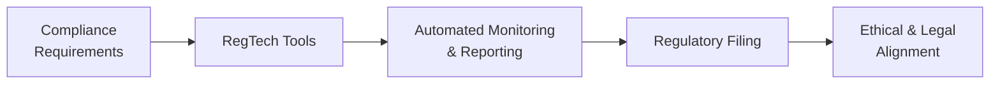

## Introduction

Regulatory changes are sprouting up all over the globe—almost as quickly as new financial products, you might say. And, well, that makes sense: whenever the financial markets evolve, governments and oversight bodies tend to scramble to keep pace. From stricter data privacy requirements to new anti-corruption rules, the modern investment professional faces a rapidly shifting regulatory environment that can leave you feeling like you’re perpetually running to catch the next train.

Nevertheless, it’s important—scratch that, essential—to stay up to speed with these developments, especially when you’re sitting for the CFA® exam and working toward building a solid career in finance. In this section, we’ll explore some of the most influential regulatory trends worldwide and highlight several emerging ethical issues that have turned the financial industry upside down (or at least sideways). We’ll also talk about the dynamic growth of new financial instruments—like cryptocurrencies and non-fungible tokens (NFTs)—and their ethical dimensions under evolving legal frameworks. Finally, we’ll look at frequently overlooked areas such as cross-border compliance, the ever-increasing role of technology, and the big buzz around ESG disclosures. Let’s dive in.

## Recent Global Regulatory Developments

Most folks in finance are well-versed in some form of compliance—whether it’s abiding by local rules or reconciling conflicting regulations across continents. Recent years have seen intensifying calls for transparency and accountability, manifesting in areas such as enhanced disclosures and more robust anti-money laundering (AML) directives.

### Data Privacy Laws

In Chapter 3, we reviewed how client confidentiality is a vital component of Duties to Clients (Standard III). But globally, the concept of data privacy has exploded beyond simply telling your client you’ll “keep it hush-hush.” Laws like the General Data Protection Regulation (GDPR) in the European Union and various consumer privacy acts in the United States have expanded the definition of personal data and raised the bar for what ethical data protection really looks like.

| Region     | Major Legislation            | Key Focus             |
|------------|------------------------------|-----------------------|
| European Union | GDPR                         | Data Protection       |
| United States  | CCPA (California) & Others   | Consumer Privacy      |
| APAC       | PDPA (Singapore), etc.        | Data Control          |

Failure to comply can lead to hefty fines (and, trust me, nobody wants to be slapped with a multimillion-dollar penalty). From an ethical standpoint, it’s not just about regulatory compliance: it’s also about safeguarding clients’ rights and upholding the trust our industry thrives on.

### Anti-Corruption Regulations and Transparency Initiatives

We’ve all heard about those high-profile corruption scandals. They do more than tarnish reputations; they undermine global confidence in financial markets. In response, many countries have bolstered anti-bribery and anti-corruption laws—think of the U.S. Foreign Corrupt Practices Act (FCPA), the UK Bribery Act, and new frameworks popping up across Asia-Pacific. Regulatory agencies leverage these laws to enforce better corporate governance, transparency in reporting, and, ideally, a reduced incidence of unethical practices.

On top of these laws, there’s a growing push for corporate clarity. Initiatives from the International Organization of Securities Commissions (IOSCO) and the Financial Stability Board encourage shorter settlement cycles, improved financial disclosure, and more consistent reporting across borders. These transparency initiatives help prevent market manipulations—such as front-running and insider trading—while enhancing market integrity, a key principle under Standard II: Integrity of Capital Markets.

## New Product Categories and Evolving Ethical Considerations

One reason regulators are busier than ever is the breakneck speed at which new product categories are emerging. Cryptocurrencies, NFTs, and other decentralized financial vehicles often race ahead in popularity before the regulatory frameworks know how to handle them. Let’s face it: it’s hard to enforce old rules for brand-new instruments.

### Cryptocurrencies and Digital Assets

Cryptocurrencies turned from a geeky experiment into a mainstream financial conversation in just a few short years. Bitcoin and Ethereum might be the headliners, but new tokens launch almost daily—some with real innovation behind them, others little more than questionable “meme” coins. Ethical concerns often revolve around:

• Investor protection: Lack of clear oversight can open the door to fraud or price manipulation.  
• Transparency: It’s not always easy to figure out who is behind a certain token.  
• Conflicts of interest: Professionals promoting cryptos they also hold.  

Different jurisdictions treat cryptocurrencies in wildly different ways, with some banning them altogether and others embracing them as legitimate forms of payment. For those practicing worldwide, cross-border compliance can be tricky—one country’s law might stand in direct opposition to another’s. That’s a recipe for confusion if you’re not scrupulous about staying informed.

### Non-Fungible Tokens (NFTs)

NFTs may represent anything from digital art to real estate ownership, but the legal classification of these assets remains in flux. You might recall from earlier chapters that a central tenet of ethics is fairness and full disclosure. Yet in the NFT space, repeated “rug pulls” (where projects vanish after collecting funds) show the consequences of unregulated hype. While some NFT projects aim to provide genuine value, the relative absence of regulations poses significant risks to investors and professionals advising on them.

## Growing Emphasis on ESG Reporting and Ethical Implications

In Chapter 8, we examined how ESG (Environmental, Social, and Governance) criteria are playing an ever-larger role in investment decisions. Regulatory agencies globally are pushing firms to produce more detailed ESG disclosures. The European Commission’s Sustainable Finance Disclosure Regulation (SFDR) stands out as a prime example. In some U.S. jurisdictions, comparable moves have led to mandatory climate-risk reporting.

But let’s not forget the phenomenon of greenwashing: firms overstate or outright fabricate their environmental or social achievements to attract ESG-focused investors. This practice can put investors at an ethical crossroads—especially if they rely on the sincerity of ESG claims for their investment decisions. As a finance professional, it’s crucial to maintain the highest standards of due diligence, aligning with Standard V: Investment Analysis, Recommendations, and Actions, to verify that any claimed ESG benefits are fact-based.

## Cross-Border Transactions and Multi-Jurisdictional Compliance

Cross-border deals can be exhilarating—like orchestrating a global symphony of capital flows—but they can also become ethically and legally precarious. Each country has its own set of rules. Some demand higher levels of disclosure; others have stricter limitations on foreign ownership. If your firm operates in multiple jurisdictions, reconciling conflicting policies (or at least deciphering a consistent approach) is critical. Overlooking an obscure local regulation can be as damaging as ignoring a major international rule.

Navigating these differences aligns with duties to both clients (who expect compliance) and employers (requiring risk-mitigated expansion). The potential for confusion underscores why many firms maintain dedicated compliance teams that coordinate with local counsel. Still, as an individual professional—particularly one committed to the CFA Institute Codes and Standards—your personal vigilance is essential.

## The Role of Technology in Compliance (RegTech)

Let’s face it: compliance can be tedious. That’s why the growing field of RegTech (short for “Regulatory Technology”) has been a game-changer. RegTech solutions often involve software that automates portions of compliance—like real-time monitoring of transactions, automated suspicious activity flagging, and streamlined reporting to regulatory bodies.

Below is a brief mermaid diagram illustrating a simplified flow of how RegTech tools fit into the broader compliance landscape:

By harnessing technologies like natural language processing (NLP) and machine learning, these systems reduce human error and help compliance officers zero in on areas of true concern. When used responsibly, RegTech fosters a more ethical environment by minimizing “blind spots” where misconduct might be missed.

## Potential Areas of Ethical Risk from Financial Innovation

• Decentralized Finance (DeFi): Peer-to-peer protocols can bypass traditional checks and balances. This might offer creative ways to democratize finance, but can also open the floodgates to scams and unregistered securities.  
• AI-Driven Trading Systems: Automated algorithms execute trades in milliseconds. That’s great for efficiency, but who’s responsible if the AI engages in manipulative behaviors or inadvertently violates market rules?  
• Personal Data Usage: Gathering data on investors can enhance personalization, but it also raises concerns about privacy, consent, and potential misuse—especially when combined with AI.  

Professionals must weigh the benefits of new technology carefully against the moral and reputational risks.

## Proactive Learning and Adaptation

In this swirling regulatory environment, the best defense against ethical missteps is curiosity coupled with proactive engagement:

• Keep reading regulatory updates. (I used to keep a bookmarked folder of key regulators’ sites; it saved me endless headaches whenever a new rule was announced.)  
• Join professional associations; many of them share updates, host webinars, and publish white papers to keep you ahead of the curve.  
• Attend industry conferences. Nothing beats real-time Q&A with experts who’ve navigated the nuances of the latest regulation.  

Above all, remember that knowledge is pointless without action. Regularly review firm procedures, revisit your own ethical decision-making framework (see Section 1.6), and encourage a culture of learning within your team.

## Exam Strategy and Tips for Level III

Given the dynamic nature of regulatory topics, expect exam questions that combine theoretical understanding (e.g., the ethical underpinnings of new product oversight) with practical application (e.g., how you’d handle a cross-border transaction). You could see item set vignettes involving data privacy violations, ESG greenwashing scenarios, or questionable cryptocurrency promotions.

• Pay attention to reading comprehension. Many legal or regulatory changes can hinge on subtle wording.  
• Practice scenario-based questions. For instance, imagine you’re an investment advisor who discovers your firm might be misleading investors about the environmental footprint of its flagship fund—how do you apply Standard V in that scenario?  
• Remember the big picture. Link regulatory compliance to overarching ethics: trust, transparency, and fairness.  

By bridging legal obligations with genuine ethical integrity, you’ll be better positioned to ace your exam and excel in professional practice.

## References, Suggested Readings & Resources

• Regulatory Websites: Keep tabs on the U.S. Securities and Exchange Commission (SEC), European Securities and Markets Authority (ESMA), and the UK’s Financial Conduct Authority (FCA).  
• “The Future of Finance: The Impact of FinTech, AI, and Crypto on Financial Regulation” – Various industry white papers.  
• Tapscott, Don & Tapscott, Alex. “Blockchain Revolution.” Insights into how decentralized technologies shape ethical decisions and regulatory frameworks.  
• News Outlets & Journals: Financial Times, The Economist, and Bloomberg regularly cover new legal developments and ethical complexities.

---

## Test Your Knowledge: Regulatory Developments & Emerging Ethical Issues Quiz



### A financial firm operating in multiple jurisdictions struggles with different reporting requirements. Which concept best describes the need to navigate these conflicting regulations?

- [ ] Greenwashing  
- [ ] RegTech  
- [ ] AI-driven Trading  
- [x] Cross-border Compliance  

> **Explanation:** Cross-border compliance involves adhering to various local and international regulations simultaneously.  

### Which of the following practices describes exaggerating or fabricating sustainability credentials to attract ESG-focused investors?

- [ ] Front-running  
- [x] Greenwashing  
- [ ] Insider trading  
- [ ] Diversification  

> **Explanation:** Greenwashing refers specifically to falsely marketing something (like a product or company practice) as environmentally friendly or sustainable.  

### Under new data privacy laws such as GDPR, investment professionals should:

- [ ] Collect as much private data as possible for future analysis.  
- [ ] Directly share client data with any external influencer promoting the fund.  
- [x] Obtain explicit permission for data usage and ensure strict data protection.  
- [ ] Disclose private client data to regulators without regard for confidentiality.  

> **Explanation:** GDPR and similar laws require explicit consent and secure handling of personal data, reinforcing the ethical duty to protect client confidentiality.  

### In the evolving cryptocurrency space, regulators are primarily concerned with:

- [x] Protecting investors from fraudulent offerings.  
- [ ] Providing direct investment capital to new crypto start-ups.  
- [ ] Encouraging all transactions on decentralized platforms.  
- [ ] Eliminating capital controls in all jurisdictions.  

> **Explanation:** A major regulatory focus is ensuring investor protection against fraud, manipulation, and misinformation.  

### Which regulatory tool automates compliance monitoring and reporting?

- [ ] Greenwashing software  
- [x] RegTech solutions  
- [ ] Cross-border templates  
- [ ] Investment filters  

> **Explanation:** RegTech solutions employ advanced technology to support real-time monitoring, detection of anomalies, and easier reporting to regulators.  

### Which of the following is an example of a potential conflict when advising on cryptocurrencies?

- [x] Holding a large personal stake and recommending the same asset to clients without disclosure.  
- [ ] The volatility of the crypto market.  
- [ ] The lack of a user-friendly wallet.  
- [ ] The digital nature of the currency.  

> **Explanation:** Recommending an asset you personally own can create a conflict of interest if not properly disclosed, violating ethical standards.  

### Why are cross-border transactions a focal point for ethical compliance?

- [ ] They are never profitable.  
- [x] They may involve conflicting regulatory requirements that can lead to ethical pitfalls.  
- [ ] They only exist in emerging markets.  
- [ ] They typically bypass all local regulations.  

> **Explanation:** When multiple jurisdictions are involved, reconciling different standards becomes more complex, increasing ethical risk.  

### What is a key ethical concern with AI-driven trading systems?

- [ ] They reduce market linkage.  
- [x] The possibility of unintended manipulation or bias in algorithms.  
- [ ] They eliminate all transaction fees.  
- [ ] They require no risk oversight.  

> **Explanation:** If AI models aren’t carefully supervised, they could inadvertently engage in unethical or manipulative trading behavior.  

### In the context of emerging ethical issues, why is ESG reporting gaining traction?

- [ ] It focuses solely on financial metrics.  
- [ ] It has been globally abandoned.  
- [x] Stakeholders demand more transparency on environmental and social impact.  
- [ ] It offers guaranteed profit to investors.  

> **Explanation:** ESG reporting responds to growing investor and societal demands for data on how companies handle environmental sustainability, social responsibility, and governance.  

### Are RegTech solutions a form of technology primarily aimed at improving compliance and reducing unethical or illegal activity?

- [x] True  
- [ ] False  

> **Explanation:** RegTech stands for Regulatory Technology, designed to streamline and automate processes for better compliance and oversight, thus helping prevent unethical activity.  


