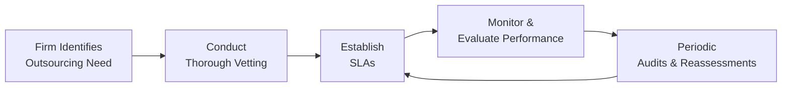

## Introduction

In today’s fast-paced financial world, outsourcing has become a powerful way for firms to focus on their core competencies while offloading specialized tasks or heavy administrative work to external providers. It’s not uncommon to see brokerage operations, portfolio analytics, or even parts of compliance delegated to outside organizations—especially as technology continues to reshape the investment landscape. But, let’s be honest: while that approach can help cut costs and scale services more effectively, it also brings a host of ethical concerns. If you’ve seen the headlines about data breaches or third-party misconduct bringing down entire companies, you already know how risky it can be.

This section zeroes in on the ethical challenges that emerge when collaborating or outsourcing, offering practical tactics to stay aligned with high professional standards. We’ll explore vetting processes, ironclad service-level agreements (SLAs), ongoing oversight, and the thorny reality of cross-border partnerships. Whether you’re a senior analyst or a compliance officer, understanding these ethical considerations is critical—especially in a profession that prides itself on integrity and stewardship of clients’ best interests.

## The Growing Trend of Outsourcing in Finance

Financial services have embraced outsourcing for everything from quantitative research to client relationship management platforms. Why? Generally, these are the main drivers:

• Cost-effectiveness and scalability: Firms can tap into specialized expertise without incurring steep overhead.  
• Rapid technological innovation: Outsourcing technology tasks often provides access to cutting-edge analytics and tools.  
• Focus on core activities: By delegating time-consuming support functions to third parties, firms can concentrate on main revenue-generating or fiduciary functions.

But the convenience doesn’t come free of complications. Outsourcing inevitably expands the number of parties handling sensitive data or confidential information. And once external vendors enter the picture, compliance with regulatory and ethical standards might become more complex. In Standard III(E) – Preservation of Confidentiality, for example, the focus remains on protecting client information. That obligation doesn’t vanish just because another firm or offshore entity is doing some of the heavy lifting.

## Potential Ethical Complications

It’s easy to assume your external partners will perfectly mirror your ethics and compliance culture—but that doesn’t always happen. Here are common pitfalls:

• Data Privacy & Confidentiality: When sharing information with a research provider or a data analytics firm, you might compromise sensitive client or firm data. Violations can occur if the vendor’s data protection measures are subpar or incompatible with your jurisdiction’s data protection laws (e.g., the EU’s GDPR or state-specific regulations).  
• Unauthorized Usage of Intellectual Property: Investment research or custom trading algorithms may be misused or sold to competitors if intellectual property rights (IPR) aren’t ironclad.  
• Conflicts of Interest & Market Integrity: A brokerage firm that also handles portions of your back-office tasks might discover valuable inside information. Without controls, this can lead to front-running or insider trading—clear violations of CFA Institute’s Standards of Professional Conduct, especially Standard II – Integrity of Capital Markets.  
• Regulatory Non-Compliance: If the vendor is unfamiliar with or uncommitted to the relevant rules, your firm could be on the hook for their missteps.  
• Cultural Norms & Ethical Gaps: In some jurisdictions, practices that are considered unethical in your home market may be commonplace. Considering Standard I(A) – Knowledge of the Law, failing to remain mindful of local norms and global ethical principles can result in cross-border compliance breakdowns.

One personal anecdote: a small asset manager I interacted with years ago outsourced its equities research to a low-cost firm abroad. The cost savings looked great on paper, but the arrangement fell apart when the overseas analysts misrepresented their professional qualifications—a direct violation of Standard I(C) – Misrepresentation. The asset manager had to spend months rebuilding its reputation and verifying the reliability of the outsourced research. It was a stressful lesson that cost them dearly, both in time and client trust.

## Vetting Third-Party Providers

Before signing an agreement with an external provider, a thorough vetting process can save you from serious ethical or reputational fallout. A robust due diligence framework might include:

• Compliance and Regulatory Track Record: Examine the vendor’s history with regulators, any past infractions, or ongoing investigations.  
• Industry Certifications and Standards: Check if the vendor follows established frameworks like ISO/IEC 27001 (information security) or adheres to relevant jurisdictional guidelines such as Federal Financial Institutions Examination Council’s (FFIEC) recommendations in the U.S.  
• Cultural and Ethical Fit: Cultural misalignment is a classic cause of friction. Ask: Do they have a formal code of conduct? How do they train employees in ethics?  
• Financial Stability: A vendor in a precarious financial position may be more likely to cut corners on compliance or data security.  
• Contractual Clarity: Even pre-SLA, you want clarity over data ownership, intellectual property rights, and the firm’s ongoing right to audit operations.

For a quick, informal check, you might find yourself searching public databases, reading press releases, or evaluating industry references. But for major outsourcing relationships, consider a deeper collaborative approach with your legal, compliance, and IT teams—even your HR department if there’s a significant “human capital” aspect abroad.

## Drafting Strong Service-Level Agreements (SLAs)

An SLA sets the tone for your entire working relationship with a third-party provider. Think of it as an ethical “insurance policy.” Let’s highlight crucial components to include:

• Scope of Services: Define the exact tasks and deliverables, setting performance indicators (KPIs) where possible.  
• Confidentiality and Data Usage: Specify the types of data involved, access levels, storage protocols, and encryption standards. Clarify that client information is strictly off-limits for any purpose other than what’s contractually agreed upon.  
• Intellectual Property Rights: Indicate who owns deliverables and how they can be used or shared, especially if the provider generates new research or software tools during the project.  
• Regulatory Compliance Clauses: Affirm that the vendor will comply with all applicable laws, relevant ethical standards, and professional codes.  
• Liability and Indemnification: Spell out the provider’s indemnities in case of breach, misuse of data, or misconduct.  
• Termination Provisions: Outline conditions under which either party can end the contract, including unethical behavior.  
• Recordkeeping and Audit Rights: Mandate the frequency and depth of audits. This is critical for verifying adherence to both internal policies and regulatory standards.

## Oversight, Monitoring, and Accountability

Once you’ve chosen your outsourcing partner and nailed down the SLA, ongoing oversight is crucial. This isn’t set-it-and-forget-it territory. Some best practices:

• Schedule Periodic Performance Reviews: Evaluate both qualitative and quantitative metrics. For instance, is the vendor consistently meeting SLA timelines? Are data-handling processes robust?  
• Conduct Compliance Audits: If a vendor is handling sensitive client data, you might require a dedicated compliance audit annually.  
• Shared Compliance or Ethics Training: Encourage or even require vendors to participate in your firm’s ethics training programs. That way, they’re familiar with the same professional and legal standards you uphold.  
• Joint Incident Management: Build a response protocol for data breaches or compliance incidents that involves both your firm and the outsourced entity.  
• Clear Ownership of Breach Response: Identify who is answerable if something goes wrong. Under the CFA Institute Code of Ethics and Standards of Professional Conduct, your firm cannot merely offload ethical responsibility to a third party. Ultimately, accountability for client interests rests with your investment firm.

Below is a simple flowchart that illustrates a typical outsourcing oversight model:



## Cross-Border Considerations

Sometimes outsourcing crosses national boundaries. That means dealing with diverse regulations, cultural norms, and data protection laws. A few watchpoints:

• Differing Regulatory Landscapes: The foreign vendor’s market may not have the same level of consumer protection or oversight as yours. Additional clauses in your SLA might be necessary to align them with your home-region rules.  
• Data Transfer Rules: Certain jurisdictions restrict how customer data can flow across borders. Be mindful of frameworks like the EU-US Data Privacy Framework or other local policies.  
• Cultural Norms and Ethical Standards: “Acceptable” business practices in one region may violate strict anti-bribery laws in another. Understanding local norms while maintaining universal ethical standards can be a balancing act.  
• Geopolitical Risks: Political instability or sudden regulatory changes can disrupt services or even make it difficult to enforce contractual obligations. Keep a risk contingency plan in your overall vendor risk management approach.

## Accountability Structures

It’s critical to ask upfront: Who takes the blame if something goes off the rails? If your vendor violates confidentiality or gets caught in questionable market behavior, your clients won’t just hold the vendor responsible—they’ll blame you, too.

To clarify accountability:

• Establish a chain of command for decisions involving the outsourced function.  
• Define escalation protocols if a compliance or ethical violation is suspected.  
• Document both parties’ responsibilities in a way that stands up to regulatory scrutiny.  
• Communicate your firm’s zero-tolerance stance on unethical behavior to all relevant employees and outsourced teams.

Remember, while you can delegate tasks, you can’t delegate ethical accountability.

## Real-World Cases of Inadequate Oversight

Financial history offers plenty of cautionary tales. One high-profile case involved a brokerage firm that outsourced its call center operations to a third party with spotty data security standards. When hackers exploited the external call center’s weak systems, thousands of client records (including Social Security numbers and bank details) were stolen. The ensuing class-action lawsuits and an enforcement action by regulators left the brokerage reeling both financially and reputationally.

In another instance, an asset manager outsourced performance measurement to an analytics company that then “double-counted” certain returns in client statements. The error persisted for months, leading to misrepresentation claims under Standard I(C). By the time the asset manager caught the error, investor trust had plummeted.

The moral: robust oversight can’t be left to chance. Systematic checks, audits, and alignment with ethical codes are essential to avoid fiascos like these.

## Best Practices and Strategies

While there’s no one-size-fits-all playbook, several strategies can shore up your firm’s approach:

• Formalize Vendor Risk Management: Maintain a risk register for each vendor, reviewing it quarterly (or more often if needed).  
• Integrate Ethics Early: Before drafting any SLA, bring in your legal, compliance, and ethics teams to identify potential pitfalls.  
• Build Strong Communication Channels: Regularly share new regulations, policy updates, or relevant best practices with your outsourced partners.  
• Adopt Technological Solutions: Use secure cloud-based platforms with permission controls, and ensure data is encrypted at rest and in transit.  
• Test Scenarios and Drills: Conduct “ethical stress tests,” simulating scenarios like a data leak or a client complaint to see how quickly issues are escalated and resolved.

Below is a short Python snippet that showcases a rudimentary approach to vendor risk scoring—just to illustrate how some firms might quantify certain factors:

```python
vendor_data = [
    {"name": "Vendor A", "compliance_record": 8, "financial_stability": 9, "geopolitical_risk": 5},
    {"name": "Vendor B", "compliance_record": 6, "financial_stability": 7, "geopolitical_risk": 8},
    {"name": "Vendor C", "compliance_record": 9, "financial_stability": 6, "geopolitical_risk": 3}
]

def calculate_risk_score(vendor):
    # Weighted scoring for demonstration
    return (vendor["compliance_record"] * 0.4 
            + vendor["financial_stability"] * 0.4 
            + (10 - vendor["geopolitical_risk"]) * 0.2)

for v in vendor_data:
    print(v["name"], calculate_risk_score(v))
```

Such a model doesn’t replace robust qualitative evaluation but can help highlight red flags.

## Exam Tips and Strategies

• Expect scenario-based questions testing your knowledge of outsourcing ethics. The CFA Level III exam might present a vignette in which a firm hands off part of its research to an offshore partner lacking rigorous compliance controls.  
• Link your answers to specific Standards—especially confidentiality, professionalism, and obligations to clients—demonstrating a command of how they apply to outsourcing.  
• Consider potential short-answer items that ask how you’d handle a data breach or coordinate with a third party to uphold client interests.  
• Be ready to articulate the risk/return trade-offs of outsourcing from an ethical perspective. It’s not just about cost savings; it’s about protecting trust.

## References, Suggested Readings & Resources

• “Ethical Outsourcing for Financial Services” – Industry best practices guides from leading consulting firms.  
• Regulatory guidelines on third-party risk management from the OCC, FCA, and other global regulators.  
• “Data Privacy and Outsourcing in Finance” – Various white papers focusing on confidentiality and compliance measures.  
• CFA Institute’s Ethics in Practice Cases – Real-world scenarios involving outsourced resources and collaboration topics.

## Glossary

• Outsourcing: Delegating certain tasks or functions to external entities or service providers.  
• Service-Level Agreement (SLA): A contract that outlines the scope, quality, and responsibilities of a service provision.  
• Intellectual Property Rights: Legal rights protecting creations, such as research and analysis, from unauthorized use.  
• Data Protection Laws: Regulations controlling the collection, storage, and sharing of personal or proprietary information.  
• Vendor Risk Management: The process of monitoring and controlling the risks associated with third-party service providers.

---

## Test Your Knowledge: Ethical Outsourcing and Collaboration Quiz



### An asset management firm decides to outsource vital trading analytics to a specialized technology provider. Which ethical consideration is most critical under Standard III(E) – Preservation of Confidentiality?

- [ ] Ensuring the firm obtains the lowest outsourcing cost.  
- [ ] Maximizing provider autonomy in executing trades.  
- [x] Protecting client data from unauthorized disclosure.  
- [ ] Transferring accountability to the vendor in case of conflict.  

> **Explanation:** Standard III(E) focuses on preserving confidentiality. Outsourcing must not jeopardize client data or lead to unauthorized disclosure.

### A key advantage of formalizing vendor risk management is:

- [x] Systematically identifying red flags and potential non-compliance before they escalate.  
- [ ] Eliminating the need for service-level agreements.  
- [ ] Guaranteeing a vendor’s compliance with all laws.  
- [ ] Offloading the firm’s ethical duties to the third party.  

> **Explanation:** Vendor risk management frameworks systematically scan for potential issues, but they do not replace or ensure vendor compliance. The outsourcing firm ultimately retains ethical responsibility.

### When drafting an SLA, which clause is most essential for preventing misuse of proprietary research?

- [ ] A clause about location-based pricing structures.  
- [ ] Detailed holiday schedules and working hours.  
- [ ] A severability clause covering business continuity.  
- [x] Clear stipulations on intellectual property ownership and usage.  

> **Explanation:** Intellectual property rights must be explicitly protected in the SLA to prevent unauthorized distribution or misuse of proprietary research.

### Which oversight practice is often recommended to ensure ongoing adherence to ethical standards?

- [ ] Minimizing communication and trusting vendor autonomy.  
- [x] Regular performance audits and periodic on-site inspections.  
- [ ] Relying solely on vendor-supplied performance reports.  
- [ ] Ensuring absolute anonymity between vendor teams and the firm.  

> **Explanation:** Proactive audits, onsite inspections, and regular communication track compliance and head off potential ethical breaches.

### If a financial services firm outsources services to a vendor in another country, which factor becomes particularly significant?

- [x] Cross-border data protection regulations.  
- [x] Differences in ethical norms and cultural expectations.  
- [ ] Similarities in religious beliefs.  
- [ ] Time-zone alignment and client entertainment budgets.  

> **Explanation:** Cross-border outsourcing inherently raises the complexity of data protection laws, regulatory compliance, and cultural alignments.

### When discussing accountability in an outsourced relationship, the most accurate interpretation is:

- [x] The outsourcing firm remains ultimately responsible for compliance and ethical conduct.  
- [ ] The outsourced vendor assumes all responsibility post-SLA signing.  
- [ ] Both parties can disclaim liability if a breach occurs.  
- [ ] The client is at fault if the vendor misuses data.  

> **Explanation:** According to the Code of Ethics and Standards, a firm cannot contract away its responsibility for ethical conduct and regulatory compliance.

### Which scenario could lead to a breach under Standard I(C) – Misrepresentation?

- [x] An external research firm inflating their analyst credentials in marketing materials.  
- [ ] Reporting timely market data from credible third parties.  
- [x] A vendor misreporting historical performance inadvertently.  
- [ ] Disclosing that part of your research is outsourced.  

> **Explanation:** Misrepresentation deals with false or misleading statements regarding credentials, performance, or qualifications. Any inflated or incorrect presentation of information is a potential breach.

### During a routine audit, a firm discovers that its outsourced partner is using client data to form proprietary market trend reports sold elsewhere. Which SLA provision would be most relevant?

- [x] Confidentiality and data usage clauses.  
- [ ] Force majeure clauses on natural disaster events.  
- [ ] Termination clauses for investor redemption requests.  
- [ ] Non-compete provision with other financial firms.  

> **Explanation:** Breaches involving unauthorized data usage primarily concern strict confidentiality and data usage clauses specified in the SLA.

### What is a strategic benefit of integrating ethics training between a firm and its outsourced vendor?

- [x] Aligning both parties on the same professional standards and cultural values.  
- [ ] Ensuring the vendor outsources your tasks to a cheaper location.  
- [ ] Eliminating legal disclaimers required in client agreements.  
- [ ] Encouraging the vendor’s workforce to avoid union laws.  

> **Explanation:** Joint ethics training helps align the vendor’s staff with the firm’s standards, reducing the risk of ethical or compliance infractions.

### In determining whether to outsource, a firm should primarily focus on:

- [x] Balancing cost-saving opportunities with potential ethical and compliance risks.  
- [ ] Ensuring the vendor is in the same time zone.  
- [ ] Delegating all compliance functions to reduce in-house burdens.  
- [ ] Relying on vendor references alone for quick approval.  

> **Explanation:** Effective outsourcing decisions hinge on thoughtful consideration of both financial benefits and the ethical, regulatory, and reputational risks involved.


