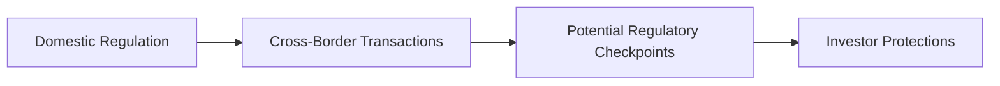

## Introduction

Have you ever traveled to a new country and discovered that certain rules or customs you took for granted back home simply don’t apply in your new environment? The same idea resonates in finance, where operating across borders means engaging with a slew of new regulations, enforcement practices, and cultural expectations. Cross‑border ethical standards and investor protection aim to create a uniform code of conduct, allowing investors to feel safe no matter which market they choose to enter.

In my early days working with multinational clients, I found myself constantly double-checking local regulations. It was like stepping on eggshells—one wrong move, and we risked a major compliance breach. Those experiences taught me that robust ethical frameworks, applied consistently around the globe, aren’t just “nice to have”; they’re fundamental to investor confidence and well-functioning capital markets.

## The Global Nature of Financial Markets

Financial markets span continents, with capital flowing freely across borders. Equity investments, debt instruments, and even derivatives can shift from one country to another at the click of a button. As a result, it’s critical for financial professionals to acknowledge that what works in one jurisdiction won’t necessarily work in another. Different nations have:

• Varying disclosure rules  
• Disparate investor protection policies  
• Contrasting criminal and civil enforcement mechanisms

For instance, a firm domiciled in Country A might raise capital in Country B under rules that conflict with those of Country A. So, which set of rules reigns supreme? Well, it often depends on the complexity of the cross‑border arrangement, and it can be downright confusing. The best bet is to adhere to the most stringent standards wherever possible, preventing the exploitation of regulatory gaps—often known as regulatory arbitrage.

## Importance of Standardized Ethical Conduct

Keeping markets fair and transparent across borders is hard enough. But it’s even harder if each player follows different ethical standards. That’s why standardized codes of conduct, such as the CFA Institute Code of Ethics and the IOSCO principles, exist to point us all in the same direction. And trust me—this direction is essential when you’ve got investors in Singapore, an investment manager in New York, and a fund domicile in Luxembourg.

• Consistent Governance: Uniform ethical guidelines across multiple jurisdictions help ensure that all market participants operate with similar governance principles.  
• Transparency: Promoting openness in reporting and disclosures mitigates the risk of hidden liabilities or off-balance-sheet shenanigans.  
• Accountability: Establishing clear lines of responsibility prevents ethical lapses, especially in cross‑border business structures.

It might feel a bit bureaucratic at times—like you’re wading through a never-ending list of “to-dos.” But standardized ethical conduct helps reduce confusion, prevent misconduct, and fortify a firm’s reputation in global markets.

## Major International Frameworks and Agreements

### IOSCO Principles

The International Organization of Securities Commissions (IOSCO) sets broad principles for securities regulation worldwide. These principles touch on everything from the responsibilities of regulators to the enforcement of rules and cooperation with local authorities. Their primary aim? To ensure fairness and transparency across varying markets so that cross‑border activities don’t slip through the cracks.

### Basel Accords

You’re probably familiar with the Basel Accords if you’ve studied banking regulation or capital adequacy. The Basel Committee on Banking Supervision issues guidelines on how banks should manage risk and maintain sufficient capital buffers. Though they’re not specifically about investor protection in the strict sense, the Basel Accords promote market integrity by encouraging prudent risk management, which indirectly bolsters investor trust.

### Other Global Initiatives

• Financial Action Task Force (FATF): Focuses on anti‑money laundering (AML) and combating the financing of terrorism (CFT).  
• Group of Twenty (G20): While not a regulatory body, G20 recommendations often catalyze the creation of new regulations, especially after major financial crises.  
• European Securities and Markets Authority (ESMA) and other supranational bodies: Each region or bloc may have its own overarching regulatory structure that enforces minimum standards applicable to member states.

## Potential Risks in Foreign Markets

### Regulatory Arbitrage

Regulatory arbitrage involves exploiting differences in rules between jurisdictions. For example, a bank might shift certain types of derivative trading to a country with more relaxed rules to avoid higher capital requirements. While it might seem “smart” from a profit standpoint, it can lead to systemic risks. Indeed, if you remember the 2008 financial crisis, the patchwork of inconsistent global regulations made it easy for institutions to park risk in less monitored corners of the globe. Over time, these aggregated risks shook the entire financial system.

### Weak Enforcement Mechanisms

Not all countries have the same resources to enforce compliance. In some markets, enforcement might appear toothless due to underfunded regulators or lax penalties. So, how do you ensure that your cross‑border partner abides by high ethical standards when their local enforcement is virtually nonexistent? The solution typically calls for robust internal controls, which we’ll discuss more in a moment.

### Cultural and Language Barriers

Some cultures might view certain financial maneuvers or relationships differently than others. Gift-giving, for instance, is normal in certain cultures but can be considered a conflict of interest in others. Being sensitive to these nuances—while still respecting the global code of ethics—helps ward off inadvertent violations.

### Varying Disclosure Requirements

Imagine you’re investing in a foreign-based company that’s not required to disclose the same data as in your home country. You might miss out on key information, such as the true extent of their debts or exposure to certain risky assets. This mismatch in disclosure requirements can put investors at a disadvantage, leading to misinformed decisions.

## Role of Local Regulators and Global Institutions

Local regulators protect domestic investor interests but may not always prioritize (or have jurisdiction over) foreign investors. Global institutions like IOSCO and the Basel Committee fill in the gaps by pushing for broad global standards. Sometimes, local regulators sign Memorandums of Understanding (MoUs) with counterpart agencies in other countries, facilitating cross‑border cooperation for investigations and enforcement actions.

If a firm in Country A suspects that a client in Country B is involved in money laundering, local regulators in Country A can coordinate with regulators in Country B to freeze transactions, investigate the wrongdoing, and impose sanctions if necessary. This synergy is essential to tamp down financial crimes that frequently hop from one jurisdiction to another.

## Maintaining Robust Internal Controls and Compliance

No matter where a firm operates, it needs robust internal controls. Picture a strong firewall that catches unethical or illegal activity early. Good compliance systems should:

1. Align with the highest standards even if local requirements are milder.  
2. Include thorough Know Your Client (KYC) and AML checks.  
3. Ensure all employees receive ongoing training about relevant cross‑border constraints.  
4. Integrate technology—like automated transaction monitoring—to spot irregularities in real time.

### A Visual Overview of Cross-Border Compliance Flow

In this simple flow, domestic regulation shapes how initial standards are set. Once financial institutions engage in cross-border transactions, they must pass through various checkpoints—such as host-country rules, international guidelines, or additional baselines set by organizations like IOSCO—before ultimately upholding investor protections.

## The Need for Ongoing Training

You might think compliance is just about checking boxes, but it’s a continually evolving field. For instance, new laws around data privacy (such as the EU’s General Data Protection Regulation, or GDPR) can have major ripple effects on how financial institutions across the globe handle investor data. Without regular training and updates, employees might fall behind on new cross‑border mandates or inadvertently violate local data protection provisions.

Moreover, training that acknowledges cultural context is incredibly valuable. One of my colleagues was transferring from a U.S. branch to a branch in Tokyo and was amazed at how certain customs around gift-giving needed to be reconciled with standard conflict-of-interest policies. Frequent knowledge-sharing sessions, scenario planning, and explicit guidance keep teams aligned with global best practices.

## Common Ethical Pitfalls and Strategies for Avoiding Them

• Cutting Corners: Operating in jurisdictions with lax enforcement might tempt managers to cut corners. Consistent global standards and strong internal policies help curb such temptations.  
• Inadequate Due Diligence: Rushing into deals in unfamiliar markets without thorough background checks can be disastrous. Always investigate local partner integrity and the track record of local regulators.  
• Pressure to Adapt Locally: While respecting cultural differences is important, never compromise on essential ethical standards, such as honesty in disclosures and fairness in transactions.

## Interplay with Other Ethical and Professional Standards

Cross-border ethics are not siloed from other ethical rules or from the everyday tasks of investment professionals. For example, the CFA Institute Code of Ethics urges professionals to put client interests first. In a global context, that means evaluating how differences in local rules might compromise clients’ best interests—especially if local standards are weaker.

Additionally, Standards of Professional Conduct (like those in Chapter 2 and Chapter 3 of this volume) remain crucial in cross-border dealings. A conflict of interest in your home country remains a conflict of interest abroad.

## Conclusion

Cross-border ethical standards and investor protection exist to give you, me, and every other market participant the confidence we need to invest globally without constantly looking over our shoulders. Yes, it can be tricky and more than a bit tedious to juggle multiple jurisdictions’ rules. But by aligning our practices with leading global frameworks such as IOSCO’s principles and the Basel Accords, and by maintaining strong internal compliance mechanisms, we can reduce unethical conduct, attract more foreign investment, and ultimately strengthen global capital markets.

Remember, consistent transparency and accountability build long-term trust. And trust—well, that’s the backbone of the investment profession, especially when crossing borders.

## Glossary

• Cross-Border Regulation: The oversight and rules applying to financial activities conducted across different jurisdictions.  
• Investor Protection: Policies and laws designed to safeguard investors’ rights and interests.  
• Regulatory Arbitrage: The practice of exploiting differences in regulatory rules among jurisdictions for advantage.  
• IOSCO (International Organization of Securities Commissions): A global organization of securities regulators that sets international standards.  
• Market Integrity: The fairness and transparency of market activities and transactions.  
• Basel Accords: International banking regulations developed by the Basel Committee on Banking Supervision.  
• Enforcement Mechanisms: Legal and administrative procedures to ensure compliance with regulations.  
• Compliance Mechanisms: Internal controls and policies institutions use to meet ethical and legal obligations.

## References

• Basel Committee on Banking Supervision: https://www.bis.org/bcbs/  
• IOSCO Principles for Securities Regulations: https://www.iosco.org/library/pubdocs/pdf/IOSCOPD323.pdf  
• CFA Institute Standards of Practice Handbook  
• Richard Herring & Robert E. Litan (1995). Financial Regulation in the Global Economy  

---

## Test Your Knowledge: Cross-Border Ethical Standards and Investor Protection



### Which of the following best describes why cross-border ethical standards are important?

- [ ] They eliminate the need for local regulatory bodies.  
- [x] They create consistency in governance, transparency, and accountability for international market participants.  
- [ ] They are optional guidelines that primarily benefit large investment banks.  
- [ ] They focus only on cultural differences and not on legal frameworks.  

> **Explanation:** Cross-border standards ensure consistent governance, transparency, and accountability, which helps protect investors in international markets.

### What is regulatory arbitrage?

- [ ] A form of judicial cooperation between two countries.  
- [ ] A requirement for capital allocation.  
- [x] The practice of exploiting differences in regulatory rules among jurisdictions for advantage.  
- [ ] A standardized approach to cross-border ethical policies.  

> **Explanation:** Regulatory arbitrage is when firms shift operations to jurisdictions with more favorable or lax regulations to gain a compliance or cost advantage.

### Which global organization focuses specifically on principles for securities regulation?

- [x] IOSCO (International Organization of Securities Commissions)  
- [ ] Financial Action Task Force (FATF)  
- [ ] Basel Committee  
- [ ] G20  

> **Explanation:** IOSCO is a global organization of securities regulators that aims to establish international standards and best practices in securities regulation and market integrity.

### Why are robust internal controls important for cross-border finances?

- [ ] They are only useful for large financial institutions.  
- [ ] They focus solely on maximizing profits.  
- [x] They help financial institutions comply with diverse jurisdictions, identify unethical behavior early, and maintain transparency.  
- [ ] They primarily function as marketing tools.  

> **Explanation:** Strong internal controls serve as the first line of defense against ethical violations, ensuring compliance with international and local regulations.

### Which of the following can be a major risk when investing internationally?

- [x] Varying disclosure requirements leading to incomplete information.  
- [ ] Universally harmonized accounting standards.  
- [x] Weak enforcement mechanisms in certain jurisdictions.  
- [ ] Simplified cross-border investigations.  

> **Explanation:** In foreign markets, disclosure and enforcement rules can differ significantly. This can lead to gaps in available information and inconsistent regulation of unethical activities.

### Which activity exemplifies a cross-border compliance checkpoint?

- [x] Evaluating updated anti-money laundering laws of a foreign country.  
- [ ] Operating purely under home-country regulations.  
- [ ] Restricting employee training to local practices only.  
- [ ] Bypassing foreign oversight for domestic transactions.  

> **Explanation:** A cross-border compliance checkpoint typically involves checking foreign AML regulations, local licensing requirements, or host-country disclosure mandates.

### What is one advantage of international frameworks such as the Basel Accords?

- [ ] They completely replace local regulations.  
- [x] They provide guidelines for capital requirements and risk management that enhance global market integrity.  
- [x] They prevent all market failures without additional enforcement.  
- [ ] They ensure that cultural differences have no effect on ethical practices.  

> **Explanation:** The Basel Accords strengthen banking safety and soundness by setting minimum capital ratios and risk management frameworks. While helpful, local enforcement is still essential.

### When local regulations are weaker than global standards, what is a recommended approach?

- [ ] Automatically adopt the local standard to simplify operations.  
- [ ] Ignore whichever standard is more rigorous.  
- [ ] Merge both standards and legislate new guidelines.  
- [x] Adhere to the higher global standard for stronger investor protection.  

> **Explanation:** Financial institutions are encouraged to follow the stricter guidelines to minimize ethical risks and foster greater market confidence.

### Which factor is often overlooked but critical to cross-border ethical behavior?

- [x] Cultural nuances in gift-giving or conflict-of-interest practices.  
- [ ] Uniform labor laws.  
- [ ] Consistent daily exchange rates.  
- [ ] Standard dividend payout timelines.  

> **Explanation:** Cultural nuances can impact perceptions of conflict of interest or bribery, making it essential for professionals to remain aware of such cultural contexts while adhering to global ethical norms.

### True or False: A primary benefit of cross-border cooperation among regulators is the ability to address fraudulent activities that span multiple jurisdictions.

- [x] True  
- [ ] False  

> **Explanation:** Cross-border cooperation allows regulators to share information, conduct joint investigations, and enforce necessary actions against unethical or fraudulent activities that move seamlessly across national borders.


